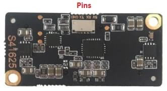

# Lanbao PSK-CM8JL65-CC5 ToF Infrared Distance Measuring Sensor (Discontinued)

<Badge type="info" text="Discontinued" />

:::warning
This product has been discontinued and is no longer commercially available.
:::

The [Lanbao PSK-CM8JL65-CC5](https://www.seeedstudio.com/PSK-CM8JL65-CC5-Infrared-Distance-Measuring-Sensor-p-4028.html) is a very small IR distance sensor with a 0.17m-8m range and millimeter resolution.
Це повинно бути підключено до шини UART/серійного порту.

- Розміри: 38 мм х 18 мм х 7 мм
- Вага: ≤10g


## Налаштування програмного забезпечення

PSK-CM8JL65-CC5 can be connected to any unused _serial port_, e.g.: `TELEM2`, `TELEM3`, `GPS2` etc.

Виводи позначені знизу сенсора:



## Налаштування параметрів

[Configure the serial port](../peripherals/serial_configuration.md) on which the lidar will run using [SENS_CM8JL65_CFG](../advanced_config/parameter_reference.md#SENS_CM8JL65_CFG).

:::info
If the configuration parameter is not available in _QGroundControl_ then you may need to [add the driver to the firmware](../peripherals/serial_configuration.md#parameter_not_in_firmware):

```plain
distance_sensor/cm8jl65
```

:::

In order to use the sensor for _collision prevention_ you will further need to set the parameters [SENS_CM8JL65_R_0](../advanced_config/parameter_reference.md#SENS_CM8JL65_R_0) and [CP_DIST](../advanced_config/parameter_reference.md#CP_DIST).
For more information see: [Collision Prevention](../computer_vision/collision_prevention.md#rangefinder).
