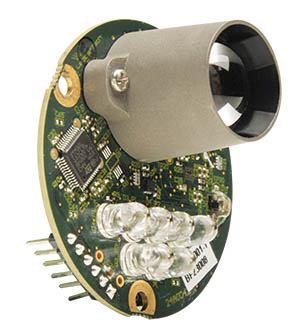

# LeddarOne Lidar

[LeddarOne](https://leddartech.com/solutions/leddarone/) is small Lidar module with a narrow, yet diffuse beam that offers excellent overall detection range and performance, in a robust, reliable, cost-effective package.
Він має діапазон сенсора від (5см - 40м) і може бути підключений до портів PWM або I2C.



## Налаштування програмного забезпечення

LeddarOne can be connected to any unused _serial port_ (UART), e.g.: TELEM2, TELEM3, GPS2 etc.

Побудуйте кабель, використовуючи плату та роз'єм, а також роз'єм LeddarOne (показаний нижче). Вам лише потрібно буде підключити контакти 5V, TX, RX та GND.

| Pin | LeddarOne |
| --- | --------- |
| 1   | GND       |
| 2   | -         |
| 3   | VCC       |
| 4   | RX        |
| 5   | TX        |
| 6   | -         |

## Налаштування параметрів

[Configure the serial port](../peripherals/serial_configuration.md) on which the lidar will run using [SENS_LEDDAR1_CFG](../advanced_config/parameter_reference.md#SENS_LEDDAR1_CFG).
Немає потреби встановлювати швидкість передачі для порту, оскільки це налаштовано драйвером.

:::info
If the configuration parameter is not available in _QGroundControl_ then you may need to [add the driver to the firmware](../peripherals/serial_configuration.md#parameter_not_in_firmware):

```plain
CONFIG_DRIVERS_DISTANCE_SENSOR_LEDDAR_ONE=y
```

:::

## Подальша інформація

- [LeddarOne Spec sheet](https://leddartech.com/app/uploads/dlm_uploads/2021/04/Spec-Sheet_LeddarOne_V10.0_EN-1.pdf)
