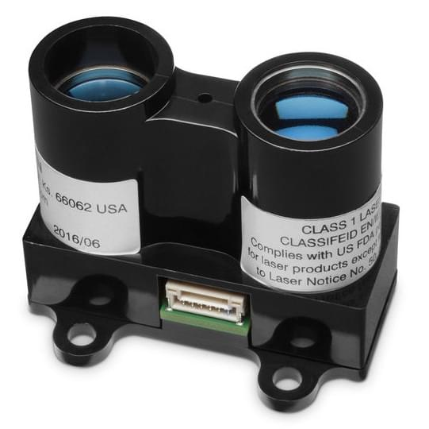
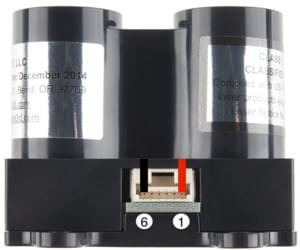
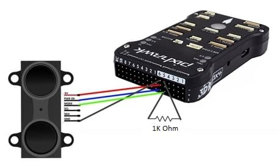
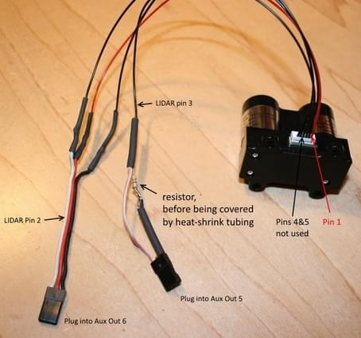

# Lidar-Lite

LIDAR-Lite це компактний, високопродуктивний оптичний сенсор віддаленого вимірювання для застосувань дронів, роботів або безпілотних транспортних засобів. Можна підключити до I2C або PWM.

## Де купити

- [LIDAR-Lite v3](https://buy.garmin.com/en-AU/AU/p/557294) (5cm - 40m)

## Схема розташування виводів

Схема підключення Lidar-Lite (v2, v3) показана нижче.

| Pin | Назва                         | Опис                                                                                                                                                                                                             |
| --- | ----------------------------- | ---------------------------------------------------------------------------------------------------------------------------------------------------------------------------------------------------------------- |
| 1   | POWER_IN | Джерело живлення 4,75-5,5 В постійного струму Номінально, Максимально 6 В постійного струму.                                                                                                     |
| 2   | POWER_EN | Активний високий, дозволяє роботу регулятора мікроконтролера 3,3 В. Low puts board to sleep, draws <40 μA. (Внутрішній 100K імпульс) |
| 3   | Керування вибором режиму      | Надає тригер (високий-низький край) PWM вихід (високий)                                                                                                                    |
| 4   | SCL                           | I2C Clock                                                                                                                                                                                                        |
| 5   | SDA                           | Дані I2C                                                                                                                                                                                                         |
| 6   | GND                           | Сигнальна / заземлювальна земля.                                                                                                                                                                 |

## Підключення

The _Lidar-Lite v3_ can be used with either PWM or I2C.
PWM рекомендується при використанні застарілої моделі.
Дальномер повинен бути окремо живлений через деякий ESC/BEC (чи підключений через PWM або I2C).

:::info
The I2C interface of non-blue-label Lidar-Lite (v1) devices has stability limitations and all silver-label generations of Lidar-Lite sensors are therefore excluded from the I2C interface.
Використання інтерфейсу ШІМ (як детально описано нижче) рекомендується для цих сенсорів.
Пристрої з синім маркуванням (v2) можуть мати постійне зміщення, якщо їх увімкнути з напругою менше 5 В за певних умов.
Це наразі (Q4/2015) перебуває на розгляді виробником і, можливо, може бути вирішено дотриманням конкретних робочих умов.
Рекомендоване міцне налаштування - це пристрій v1, який взаємодіє через PWM.
:::

The standard wiring instructions for Lidar-Lite 3 (from the [Operation Manual](http://static.garmin.com/pumac/LIDAR_Lite_v3_Operation_Manual_and_Technical_Specifications.pdf)) are shown below.
Lidar-Lite v2 та v3 є однаковими, за винятком того, що порядок контактів у роз'ємі обернений (тобто це, ніби роз'єм був перевернутий).

### Проводка інтерфейсу ШІМ

The pin connections for wiring LidarLite to the _Pixhawk 1_ AUX ports (PWM interface) are shown below.

| Pin | Lidar-Lite (v2, v3) | Pixhawk AUX Servo                | Коментар                                                                                                                                       |
| --- | -------------------------------------- | -------------------------------- | ---------------------------------------------------------------------------------------------------------------------------------------------- |
| 1   | VCC                                    | AUX 6 (центр) | Джерело живлення 4,75-5,5 В постійного струму Номінально, Максимально 6 В постійного струму.                                   |
| 2   | RESET                                  | AUX 6 (знизу) | Скинути лінію датчика                                                                                                                          |
| 3   | PWM                                    | AUX 5 (знизу) | PWM вихід Lidar Lite. **Needs a 470 Ohm pull-down (to GND), Do not use a 1 K0hm resistor.** |
| 4   | SCL                                    | -                                | Не підключено                                                                                                                                  |
| 5   | SDA                                    | -                                | Не підключено                                                                                                                                  |
| 6   | GND                                    | AUX 6 (top)   | Ground                                                                                                                                         |

:::info
On a flight controller that has no AUX port the equivalent MAIN pins are used (e.g. the PWM output on the lidar instead maps to MAIN 5).
Номери пінів зафіксовані жорстко.
:::

Проводка для LidarLite v2 показана нижче.
Lidar-Lite v3 підключений аналогічно, за винятком того, що нумерація контактів на роз'ємі є зворотною.

### Проводка інтерфейсу I2C

Проводка I2C однакова для будь-якого іншого датчика відстані.
Просто підключіть SLA, SLC, GND та VCC до відповідних (таких же) контактів на контролері польоту та сенсорі.

## Конфігурація програмного забезпечення

The rangefinder/port is enabled using [SENS_EN_LL40LS](../advanced_config/parameter_reference.md#SENS_EN_LL40LS) - set to `1` for PWM, or `2` for I2C.

:::info
The driver for this rangefinder is usually present in firmware.
If missing, you would also need to add the driver (`drivers/ll40ls`) to the board configuration.
:::

## Подальша інформація

- [LIDAR_Lite_v3_Operation_Manual_and_Technical_Specifications.pdf](http://static.garmin.com/pumac/LIDAR_Lite_v3_Operation_Manual_and_Technical_Specifications.pdf) (Garmin)
