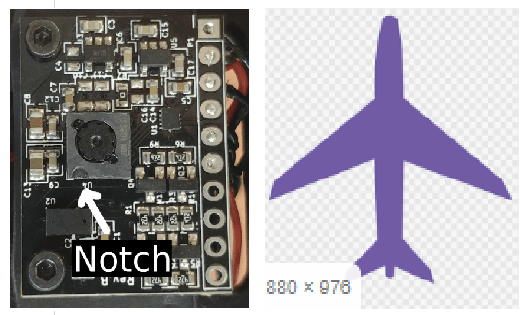
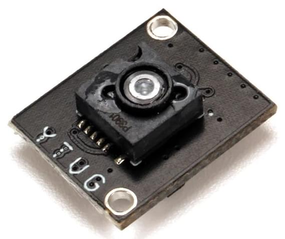
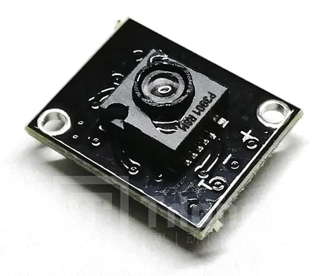

# Датчики на основі PMW3901 для вимірювання потоку

PMW3901 is an [optical flow](../sensor/optical_flow.md) ASIC that computes the flow internally and provides a difference in pixels between each frame.
Він використовує сенсор відстеження, який схожий на те, що ви знайдете в комп'ютерній мишці, але адаптований для роботи від 80 мм і безмежжя.
PMW3901 використовується в декількох продуктах, включаючи деякі від Bitcraze, Tindie, Hex, Thone та Alientek

Ця тема містить посилання на датчики, які були протестовані, разом з інформацією про кріплення та конфігурацію PX4 (це загальне для всіх датчиків цього типу).

## Плати, які використовують PMW3901

Наступна таблиця показує деякі плати, які використовують цей датчик, зазначаючи кількість інтерфейсів, кількість датчиків, вхідну напругу та розмір.
Назва дошки посилається на розділи, що містять інформацію про підключення та інформацію про покупку.

| Виробництво | Материнська плата                                                                 | Інтерфейс | Потік | Далекомір | Гіроскоп | Напруга (V)            | Розмір (мм)            | Максимальна висота (м) |
| ----------- | --------------------------------------------------------------------------------- | --------- | ----- | --------- | -------- | ----------------------------------------- | ----------------------------------------- | ----------------------------------------- |
| Bitcraze    | [Flow breakout](#bitcraze-flow-breakout)                                          | SPI       | Y     | Y         | -        | 3 - 5                                     | 21x20                                     | 1                                         |
| Tindie      | [PMW3901 Optical Flow Sensor](#tindie-pmw3901-optical-flow-sensor)                | SPI       | Y     | -         | -        | 3 - 5                                     | AxB                                       | -                                         |
| Hex         | [HereFlow PMW3901 Optical Flow Sensor](#hex-hereflow-pmw3901-optical-flow-sensor) | CAN       | Y     | Y         | Y        | 3 - 5                                     | AxB                                       | 4                                         |
| Holybro     | [Holybro PMW3901 Optical Flow Sensor](#holybro-pmw3901-optical-flow-sensor)       | UART      | Y     | -         | -        | 3 - 5                                     | AxB                                       | -                                         |
| Thone       | [ThoneFlow-3901U](#thone-thoneflow-3901u)                                         | UART      | Y     | -         | -        | 3 - 5                                     | AxB                                       | -                                         |
| Alientek    | [ATK-PMW3901](#alientek-atk-pmw3901)                                              | SPI       | Y     | -         | -        | 3.3 - 4.2 | 27.5x16.5 | 1                                         |

## Підтримувані дальномери

An external rangefinder/distance sensor is _required_ for the sensors that don't have a rangefinder (e.g. _Tindie_ or _Thone_) and _recommended_ for the other boards (as their range is quite limited).

Діапазон, необхідний для застосування, залежить від програми:

- Польот у приміщенні: ≈4 метри
- Польот на відкритому повітрі: ≥10 метрів (наприклад, для підтримки контролю за позицією в середовищах, де можуть виникнути проблеми з GPS)

Any [rangefinder/distance sensor](../sensor/rangefinders.md) supported by PX4 may be used.
Датчик може бути встановлений будь-де, але повинен бути спрямований вниз і повинен бути підключений/налаштований як зазвичай.

:::tip
The PX4 team mainly tested using the [Lidar Lite V3](../sensor/lidar_lite.md) on larger vehicles and the [Lanbao CM8JL65](../sensor/cm8jl65_ir_distance_sensor.md) (Discontinued) on smaller vehicles.
:::

## Монтаж/Орієнтація

Модулі потоку зазвичай встановлюються близько до центру транспортного засобу.
If mounted off-centre you will need to set offsets: [Optical Flow > EKF2](../sensor/optical_flow.md#ekf2).

The flow modules may be mounted with any yaw orientation relative to the vehicle body frame, but you must set the value used in [SENS_FLOW_ROT](../advanced_config/parameter_reference.md#SENS_FLOW_ROT).

The "zero" rotation is when the sensor board and [vehicle](../getting_started/px4_basic_concepts.md#heading-and-directions) X-axes are aligned (i.e. the "front" of the vehicle and the board are in the same direction), with rotations increasing in a clockwise direction.

PMW3901 modules have a small notch indicating the direction of the **back** of the board.
The diagram shows the relative board and vehicle orientations that correspond to `SENS_FLOW_ROT=0` (note the notch at the back).

Діаграма вище показує дошку Bitcraze.
Ви можете використовувати виступ, щоб знайти орієнтацію інших плат у тому ж самому способі:

| &amp;nbsp;                       | &amp;nbsp;                                                                  |
| ---------------------------------------------------- | ----------------------------------------------------------------------------------------------- |
| Tindie ![PMW3901 Tindie Notch][tindie_notch]      | Hex Hereflow ![PMW3901 Hereflow Notch][hereflow_notch]                                       |
| Thone ![PMW3901 Thoneflow Notch][thoneflow_notch] | Alientek (also has an arrow indicating the front!) ![PMW3901 Alientek Notch][alientek_notch] |

[tindie_notch]: ../../assets/hardware/sensors/pmw3901/tindie_notch.jpg
[thoneflow_notch]: ../../assets/hardware/sensors/pmw3901/thoneflow_3901u_notch.jpg
[alientek_notch]: ../../assets/hardware/sensors/pmw3901/alientek_pmw3901_notch.jpg
[hereflow_notch]: ../../assets/hardware/sensors/pmw3901/hex_hereflow_notch.jpg

## Конфігурація PX4

Конфігурація PX4, яка є загальною для всіх плат на основі PMW3901:

- [Optical Flow > EKF2](../sensor/optical_flow.md#ekf2) explains how to fuse optical flow data in the EKF2 estimator and set position offsets for the mounting position of the flow sensor.
- [SENS_FLOW_ROT](../advanced_config/parameter_reference.md#SENS_FLOW_ROT) sets the orientation of the flow sensor relative to vehicle heading.

Окрім того для:

- SPI-connected sensors you must set [SENS_EN_PMW3901](../advanced_config/parameter_reference.md#SENS_EN_PMW3901) to `1` in order to enable the sensor driver.
- UART-connected sensors (e.g. ThoneFlow-3901UY) you must [configure the associated serial port](../peripherals/serial_configuration.md) by setting the parameter [SENS_TFLOW_CFG](../advanced_config/parameter_reference.md#SENS_TFLOW_CFG) to the value of the connected UART port (for example, if you connected this sensor to `TELEM 2`, you need to set `SENS_TFLOW_CFG` to `102`).
- DroneCAN sensors you must set `UAVCAN_ENABLE` appropriately.
  For more information see [DroneCAN Peripherals](../dronecan/index.md) (and the [HereFlow PMW3901 docs below](#dronecan_wiring)).

Індивідуальні датчики потоку додатково налаштовуються/конфігуруються, як описано в розділах нижче.

## Розгалуження Bitcraze Flow

The [Bitcraze Flow breakout](https://www.bitcraze.io/products/flow-breakout/) directly exposes the [SPI interface](#spi-wiring) from the PMW3901 module.

The board also incorporates a distance sensor [wired to the Pixhawk I2C port](#i2c-wiring).
Цей датчик відстані - це датчик ToF VL53L0x від STMicroelectronics.
Діапазон сенсора мінімальний (2 метри) і буде зменшуватися під час польоту на сонці.
We therefore highly recommend that you use an [external distance sensor](#external-rangefinders).

[PX4 configuration](#px4-configuration) and [mounting/orientation](#mounting-orientation) instructions are provided above.

### Підключення SPI

PMW3901, якщо підключений до порту SPI на Pixhawk 4, автоматично виявить модуль потоку Bitcraze.
Драйвер цього пристрою був явно написаний для підключення до порту SPI за допомогою вибору чіпа 1.
No parameters will have to be configured other than the [orientation and position of the sensor](#mounting-orientation).

Схема виводів для порту SPI Pixhawk до плати Bitcraze Flow показана нижче (схема виводів однакова для всіх версій Pixhawk FMU).

| Порт SPI Pixhawk (зліва направо) | Плата потоку Bitcraze |
| --------------------------------------------------- | --------------------- |
| 1 (VCC)                          | VCC                   |
| 2 (SCK)                          | CLK                   |
| 3 (MISO)                         | MISO                  |
| 4 (MOSI)                         | MOSI                  |
| 5 (CS1)                          | CS                    |
| 6 (CS2)                          | Не підключайте        |
| 7 (GND)                          | GND                   |

Щоб підключити плату bitcraze flow до Pixhawk, вам потрібно злити дроти кабелю SPI Pixhawk на плату flow.
Кабель SPI має 7 провідів, з яких потрібно підключити 6 до плати потоку.

Наступна діаграма показує, як підключити датчик до Pixhawk 4.

### Підключення I2C

Проводка I2C однакова для будь-якого іншого датчика відстані.
Просто підключіть SLA, SLC, GND та VCC до відповідних (таких же) контактів на Pixhawk та сенсорі.

## Оптичний датчик потоку Tindie PMW3901

The Tindie [PMW3901 Optical Flow Sensor](https://www.tindie.com/products/onehorse/pmw3901-optical-flow-sensor/) exposes the SPI interface from the PMW3901 module exactly as on the Bitcraze module (see [SPI Wiring](#spi-wiring)).

The sensor doesn't have a distance sensor onboard, so you will need to use an [external distance sensor](#external-rangefinders).

[PX4 configuration](#px4-configuration) and [mounting/orientation](#mounting-orientation) instructions are provided above.

## AlienTek ATK-PMW3901

The AlienTek [ATK-PMW3901](https://www.aliexpress.com/i/32979605707.html) exposes the SPI interface from the PMW3901 module in the same way as the Bitcraze module (see [SPI Wiring](#spi-wiring)).

The board also incorporates a distance sensor (we recommend that you use an [external distance sensor](#external-rangefinders)).
You can wire the internal sensor to the Pixhawk I2C port [in the same way as any other I2C peripheral.](#i2c-wiring)
A screenshot showing the I2C pins (SLA, SLC, GND, and VCC) is provided below.

[PX4 configuration](#px4-configuration) and [mounting/orientation](#mounting-orientation) instructions are provided above.

## Hex HereFlow Оптичний датчик потоку PMW3901

The Hex [HereFlow PMW3901 Optical Flow Sensor](http://www.proficnc.com/all-products/185-pixhawk2-suite.html) is a tiny board containing the PMW3901 flow module, VL53L1X distance sensor, and an IMU (used to synchronize the flow data with the gyro data).

Вбудований мікроконтролер зразки три датчики та публікує дві повідомлення DroneCAN, що містять всю інформацію, необхідну для розрахунків датчика потоку та відстані.

The board can be connected to any CAN port on any Pixhawk board (see [DroneCAN wiring](#dronecan_wiring)).

As for the other optical flow boards, we recommend that you use an [external distance sensor](#external-rangefinders).

[PX4 configuration](#px4-configuration) and [mounting/orientation](#mounting-orientation) instructions are provided above.

### Проводка/Налаштування DroneCAN

Схема нижче показує, як підключити датчик до шини CAN Pixhawk 4.

In addition to any other configuration, you will need to set the parameter [UAVCAN_ENABLE](../advanced_config/parameter_reference.md#UAVCAN_ENABLE) to either 2 or 3, depending on your system:

- `UAVCAN_ENABLE=2`: DroneCAN sensors but no motor controllers.
- `UAVCAN_ENABLE=3`: DroneCAN sensors and motor controllers.

For general information about DroneCAN wiring and configuration see: [DroneCAN Peripherals](../dronecan/index.md).

## Holybro PMW3901 Оптичний датчик потоку

The [Holybro PMW3901 Optical Flow Sensor](https://holybro.com/products/pmw3901-optical-flow-sensor) exposes a PMW3901 optical flow module via a UART interface.

The board doesn't include a distance sensor onboard, so you will need to use an [external distance sensor](#external-rangefinders).

Це поставляється з корпусом, надрукованим у 3D, та передпаяним TX, напругою та GND 4-контактним роз'ємом, який можна підключити до порту телеметрії вашого контролера польоту, як показано нижче (для Pixhawk 6C).

## Thone ThoneFlow-3901U

The Thone [ThoneFlow-3901U](https://www.seeedstudio.com/ThoneFlow-3901U-UART-Serial-Version-PMW3901-Optical-Flow-Sensor-p-4040.html) exposes a PMW3901 optical flow module via a UART interface.

The board doesn't include a distance sensor onboard, so you will need to use an [external distance sensor](#external-rangefinders).

<!-- note, this will be set using SENS_TFLOW_CFG
Wiring is also required.
-->

[PX4 configuration](#px4-configuration) and [mounting/orientation](#mounting-orientation) instructions are provided above.

In addition, you must also set the parameter [SENS_TFLOW_CFG](../advanced_config/parameter_reference.md#SENS_TFLOW_CFG) to the value of the UART port you connected (e.g. if the sensor is connected to `TELEM 2` then set `SENS_TFLOW_CFG=102`.
For more information see [Serial Port Configuration](../peripherals/serial_configuration.md).
