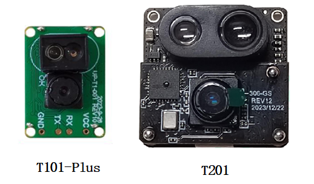
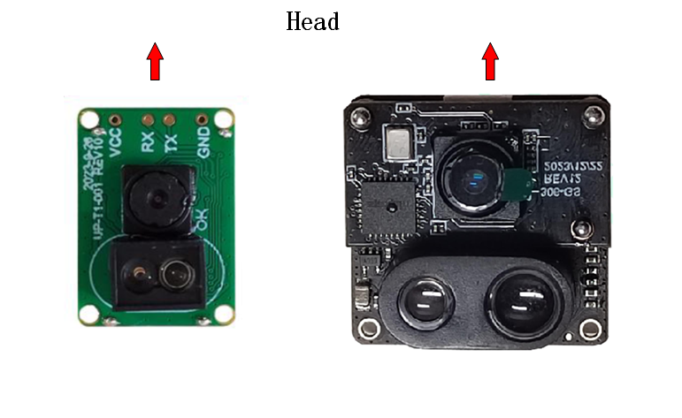
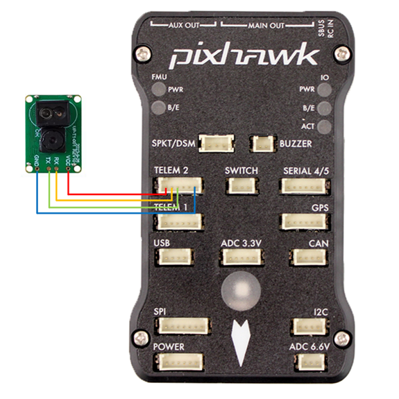
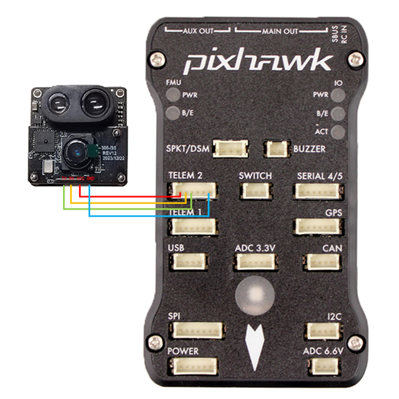

# UPixels Optical Flow(T101-Plus/T201)

UP-T101-Plus and UP-T201 are an optical flow + laser 2-in-1 module, mainly used in drones to achieve both horizontal and vertical positioning functions, more suitable for indoor use.

## Purchase link

The sensor is available from various retailers. Here are some links:

- [UPixels UP-T101-Plus Optical Flow Module](https://www.aliexpress.com/item/1005008598363229.html)
- [UPixels UP-T201 Optical Flow Module](https://www.aliexpress.com/item/1005008600450663.html)

For those in China:

- [UPixels UP-T101-Plus](https://e.tb.cn/h.65IG904vvu98A5h?tk=pKeVeBljdeJ)
- [UPixels UP-T201](https://e.tb.cn/h.6gnDI2K1M8vUMJ9?tk=wT2Kez7Ldox)

## Module parameters

The following table shows the basic information of the module

| Module | Interface | Flow | Rangefinder | Voltage (V) | Size (mm) | Max Height (m) |
| :-------: | :---------: | :----: | :-----------: | :-------------: | :---------: | :-----------: |
| T101-Puls | Uart | Y | Y | 3.3 - 5.0 | 20 x 14 x 9.55 | 15 |
| T201 | Uart | Y | Y | 3.3 - 5.0 | 25 x 25 x 14.25 | 15 |

## Installation

The installation directions of T101-Plus and T201 are shown in the following figure. The direction indicated by the red arrow is the nose

- The diagram shows the relative board and vehicle orientations that correspond to `SENS_FLOW_ROT=0`

- The flow modules may be mounted with any yaw orientation relative to the vehicle body frame, but you must set the value used in [SENS_FLOW_ROT](../advanced_config/parameter_reference.md#SENS_FLOW_ROT).

## Connect

The following figure shows the electrical connection diagram of T101-Plus:

The following figure shows the electrical connection diagram of T201:

- The flow sensor should be mounted on the underside of the copter with the camera lens pointing downwards.

- Connect the sensor¡¯s GND and TX pin to one of the autopilot¡¯s serial ports. Note that the TX pin of the sensor should be connected to the RX pin of the autopilot. In the image above the sensor is connected to the Telem2 port.

- Connect the sensor¡¯s VCC to a 3.3V or 5V power source.

## PX4 Configuration

Set the following parameters in QGroundControl:

- Set [MAV_1_CONFIG](../advanced_config/parameter_reference.md#MAV_1_CONFIG) to `102`. (If the sensor is connected to the Telem2 port.)
- Set [SER_TEL2_BAUD](../advanced_config/parameter_reference.md#SER_TEL2_BAUD) to `115200`.
- Set [EKF2_OF_CTRL ](../advanced_config/parameter_reference.md#EKF2_OF_CTRL ) to `Enabled`.
- Set [EKF2_RNG_CTRL](../advanced_config/parameter_reference.md#EKF2_RNG_CTRL) to `Enabled`.
- Set [EKF2_RNG_A_HMAX](../advanced_config/parameter_reference.md#EKF2_RNG_A_HMAX) to `15`. (The UP-T101-Plus is set to 4 and the UP-T201 is set to 15)
- Set [EKF2_RNG_NOISE](../advanced_config/parameter_reference.md#EKF2_RNG_NOISE) to `0.05`. (The UP-T101-Plus is set to 0.02 and the UP-T201 is set to 0.05)
- Set [EKF2_HGT_REF](../advanced_config/parameter_reference.md#EKF2_HGT_REF) to `Range sensor`.

## See Also

- [UPixels Github](https://github.com/Upixels-China/Upixels_Optical_flow) (Upixels Docs)
