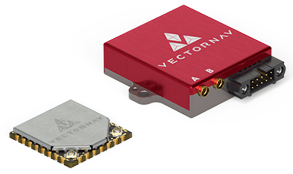

# VectorNav

Компанія VectorNav Technologies розробляє та створює високопродуктивні, малих розмірів та маси [IMU/AHRS](https://www.vectornav.com/resources/inertial-navigation-primer/theory-of-operation/theory-ahrs), [GNSS/INS](https://www.vectornav.com/resources/inertial-navigation-primer/theory-of-operation/theory-gpsins) та [Dual GNSS/INS](https://www.vectornav.com/resources/inertial-navigation-primer/theory-of-operation/theory-gnsscompass) рішення, які забезпечують безпечну та надійну автономію в масштабі.

Продукція VectorNav надає ряд переваг користувачам PX4 і може бути інтегрована для:

- Вища точність оцінки напрямку, крену та кочення
- Більш надійна геоприв'язка GNSS
- Покращена точність позиціонування та установки під час конфлікту супутникового зв'язку
- Продуктивність при динамічних умовах (наприклад, запуски катапультою, операції VTOL, високі g або високі операції з великою кутовою швидкістю)

VectorNav PX4 Driver спрощений для забезпечення простої архітектури plug-and-play, видаляючи інженерні перешкоди і дозволяючи прискорити проєктування, розробку та запуск платформ, щоб відповідати швидкому темпу інновацій.

PX4 може використовувати це як [зовнішній INS] (../sensor/inertial_navigation_systems.md), обходячи/замінюючи оцінювач EKF2 або як джерело сирої сенсорної інформації, наданої оцінювачеві.

Драйвер підтримує [всі сенсори VectorNav](https://www.vectornav.com/store/products).
Зокрема, рекомендуємо наступні системи:

- **VN-200 ГЛОНАСС/ІНС:** Рекомендується для фіксованих крилових систем без постійного зависання, де статичний курс не є необхідним.
- **VN-300 DUAL GNSS/INS:** Рекомендований для багатокоптерних систем, де для утримання на місці та низької динаміки потрібно використання статичного напрямку.

## Де купити

Рішення VectorNav IMU/AHRS, GNSS/INS та подвійні GNSS/INS доступні безпосередньо від [VectorNav Technologies](https://www.vectornav.com/store/products) (США) або через їх Глобальних Представників з Продажу. Для отримання додаткової інформації про їх рішення або для міжнародних замовлень, будь ласка, звертайтеся sales@vectornav.com.

[Придбати Набір Розробника VN-200](https://www.vectornav.com/store/products/gnss-ins/p/vn-200-rugged-development-kit) (ГНСС/ІНС)
[Придбати Набір Розробника VN-300](https://www.vectornav.com/store/products/dual-gnss-ins/p/vn-300-rugged-development-kit) (Подвійний ГНСС/ІНС)

## Налаштування програмного забезпечення

### Підключення

Підключіть будь-який не використанний інтерфейс серійного керування контролера польоту, такий як запасний порт `GPS` або `TELEM`, до порту UART2 VectorNav (необхідно для PX4).

### Встановлення

Датчик VectorNav може бути встановлений в будь-якому положенні, в будь-якому положенні на транспортному засобі, без врахування центру важіння.
Всі сенсори VectorNav за замовчуванням використовують систему координат x-вперед, y-справа та z-вниз, що робить замовчуванням монтаж як з'єднувач-ззаду, основа внизу.
Це можна змінити на будь-який жорсткий оберт використовуючи реєстр обертання в опорній системі VectorNav.

Якщо використовується продукт з підтримкою GNSS, антена GNSS повинна бути жорстко монтуватися щодо інерційного датчика та мати необмежений вид на небо. Якщо використовується продукт з підтримкою двоканальної ГНСС (VN-3X0), друга антена повинна бути жорстко змонтована щодо первинної антени та інерціального датчика з неперешкодженим видом на небо.

Для отримання додаткових вимог і рекомендацій щодо монтажу, див. відповідний [Керівний початок роботи](https://www.vectornav.com/resources/quick-start-guides).

## Конфігурація прошивки

### Конфігурація PX4

Для використання драйвера VectorNav:

1. Включіть модуль в прошивку в [конфігурації плати kconfig](../hardware/porting_guide_config.md#px4-board-configuration-kconfig), встановивши змінні конфігурації kconfig: `CONFIG_DRIVERS_INS_VECTORNAV` або `CONFIG_COMMON_INS`.

2. [Встановіть параметр](../advanced_config/parameters.md) [SENS_VN_CFG](../advanced_config/parameter_reference.md#SENS_VN_CFG) на апаратний порт, що підключений до VectorNav (докладнішу інформацію див. у розділі [Конфігурація послідовного порту](../peripherals/serial_configuration.md)).

3. Вимкніть попередні перевірки магнітометра, встановивши [SYS_HAS_MAG](../advanced_config/parameter_reference.md#SYS_HAS_MAG) на `0`.

4. Дозвольте драйвер VectorNav ініціалізуватися, перезапустивши PX4.

5. Налаштуйте водія як зовнішній INS або надайте сирові дані:

   - Якщо використовувати VectorNav як зовнішній INS, встановіть [VN_MODE](../advanced_config/parameter_reference.md#VN_MODE) на `INS`.
      Це вимикає EKF2.
   - Якщо використовувати VectorNav як зовнішні інерційні сенсори:

      1. Встановіть [VN_MODE](../advanced_config/parameter_reference.md#VN_MODE) на `Sensors Only`
      2. Якщо внутрішні датчики увімкнені, пріоритетом є датчики VectorNav за допомогою [CAL_GYROn_PRIO](../advanced_config/parameter_reference.md#CAL_GYRO0_PRIO), [CAL_ACCn_PRIO](../advanced_config/parameter_reference.md#CAL_ACC0_PRIO), [CAL_BAROn_PRIO](../advanced_config/parameter_reference.md#CAL_BARO0_PRIO), [CAL_MAGn_PRIO](../advanced_config/parameter_reference.md#CAL_MAG0_PRIO), де _n_ - це номер екземпляра компонента ІМП (0, 1 і т.д.).

      :::tip
      У більшості випадків зовнішній IMU (VN) має найвищий номер.
      Ви можете отримати список доступних компонентів IMU, використовуючи [`uorb top -1`](../middleware/uorb.md#uorb-top-command), ви можете відрізняти їх за допомогою команди [`listener`](../modules/modules_command.md#listener) та розглядаючи дані чи просто швидкості.

      За потреби ви можете перевірити [CAL_GYROn_ID](../advanced_config/parameter_reference.md#CAL_GYRO0_ID), щоб побачити ідентифікатор пристрою.
      Пріоритет становить 0-255, де 0 абсолютно вимкнено, а 255 - найвищий пріоритет.

:::

6. Перезавантажте PX4.

Після активації модуль буде виявлено при завантаженні.
Дані ІМП мають бути опубліковані з частотою 800 Гц (400 Гц, якщо використовується VN-300).

## Конфігурація VectorNav

Визначення для всіх команд та реєстрів, на які посилаються в цьому розділі, можна знайти в відповідному [VectorNav ICD](https://www.vectornav.com/resources/interface-control-documents).

Під час ініціалізації PX4 налаштовує пристрій VectorNav наступним чином:

- Увімкнує необхідні бінарні виходи
- Вимкнути ASCII виводи на активному послідовному порту
- Налаштовує режим керування заголовком VPE на Абсолютний
- Автосканує швидкості передачі і конфігурує активний порт на 921600 біт/с

Всі інші необхідні параметри конфігурації повинні бути окремо завантажені в пристрій VectorNav вручну. Найчастіше ці включають:

- `Зміщення GNSS антени A` Необхідно у випадку використання продукту з підтримкою GNSS та якщо антена GNSS встановлена більш ніж на 10 см від блоку VectorNav
- `Базова антена ГНСС` Необхідна, якщо використовується продукт з підтримкою двох систем ГНСС
- `Поворот рамки посилання` Необхідно, якщо не встановлено як коннектор-назад, база-вниз
- `Конфігурація фільтрації ІМП` Рекомендується налаштувати фільтрацію ІМП 200 Гц за замовчуванням

Після встановлення цих параметрів налаштування повинні бути встановлені для збереження після циклу живлення за допомогою команди Write Non Volatile.

## Опубліковані дані

При ініціалізації водій повинен надрукувати наступну інформацію до консолі (надруковано за допомогою `PX4_INFO`)

- Номер моделі блока
- Версія апаратної одиниці
- Номер серійного номеру блока
- Номер прошивки одиниці

Цей текст має бути доступний за допомогою команди [`dmesg`](../modules/modules_system.md#dmesg).

Водій VectorNav завжди публікує дані пристрою на наступні теми UOrb:

- [sensor_accel](../msg_docs/SensorAccel.md)
- [датчик_гіроскопа](../msg_docs/SensorGyro.md)
- [sensor_mag](../msg_docs/SensorMag.md)
- [sensor_baro](../msg_docs/SensorBaro.md)
- [sensor_gps](../msg_docs/SensorGps.md)

і, якщо увімкнено як зовнішнє INS, публікує:

- [vehicle_local_position](../msg_docs/VehicleLocalPosition.md)
- [vehicle_global_positon](../msg_docs/VehicleGlobalPosition.md)
- [vehicle_attitude](../msg_docs/VehicleAttitude.md)

або, якщо увімкнено як зовнішній датчик, публікує:

- `external_ins_local_position`
- `external_ins_global_position`
- `external_ins_attitude`

:::tip
Опубліковані теми можна переглянути за допомогою команди `listener`.
:::

## Характеристики обладнання

- [Короткі описи продуктів](https://www.vectornav.com/resources/product-briefs)
- [Документи з даними](https://www.vectornav.com/resources/datasheets)
