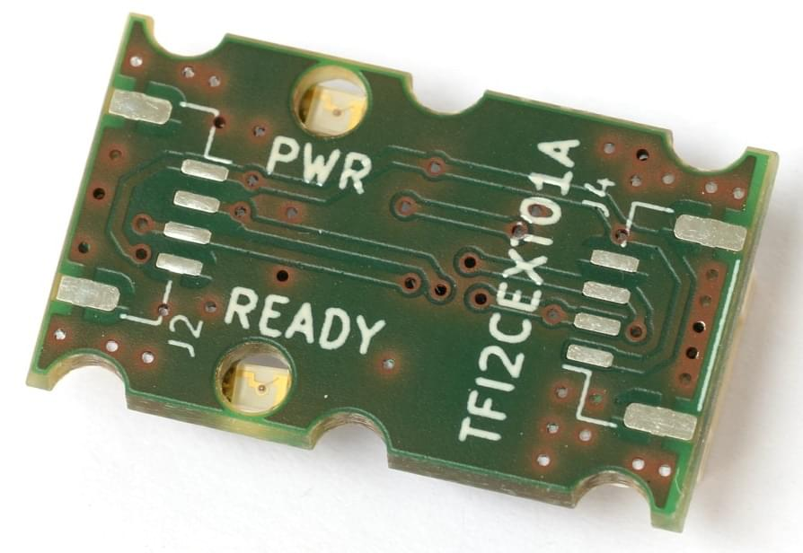

# Периферійні пристрої шини I2C

[I2C](https://en.wikipedia.org/wiki/I2C) is a serial communication protocol that is commonly used (at least on smaller drones), for connecting peripheral components like rangefinders, LEDs, Compass, etc.

Рекомендовано для:

- Connecting offboard components that require low bandwidth and low latency communication, e.g. [rangefinders](../sensor/rangefinders.md), [magnetometers](../gps_compass/magnetometer.md), [airspeed sensors](../sensor/airspeed.md) and [tachometers](../sensor/tachometers.md) .
- Сумісність з периферійними пристроями, які підтримують лише I2C.
- Можливість підключення декількох пристроїв до однієї шини, що корисно для збереження портів.

I2C дозволяє підключати декілька головних пристроїв до декількох рабочих пристроїв, використовуючи лише 2 провідника на підключення (SDA, SCL).
Теоретично шина може підтримувати 128 пристроїв, що кожен з них доступний за унікальною адресою.

:::info
UAVCAN would normally be preferred where higher data rates are required, and on larger vehicles where sensors are be mounted further from the flight controller.
:::

## Підключення

I2C використовує пару проводів: SDA (серійні дані) та SCL (серійний годинник).
Шина є типу відкритого стоку, що означає, що пристрої заземлюють лінію даних.
It uses a pullup resistor to push it to `log.1` (idle state) - every wire has it usually located on the bus terminating devices.
Одна шина може підключати до кількох пристроїв I2C.
Індивідуальні пристрої підключені без перетину.

Для підключення (згідно зі стандартом dronecode) використовуються 4-жильні кабелі з роз'ємами JST-GH.
To ensure reliable communication and to reduce crosstalk it is advised to apply recommendations concerning [cable twisting](../assembly/cable_wiring.md#i2c-cables) and pullup resistors placement.


## Перевірка статусу шини та пристроїв

A useful tool for bus analysis is [i2cdetect](../modules/modules_command.md#i2cdetect).
Це список доступних пристроїв I2C за їх адресами.
Він може бути використаний для визначення доступності пристрою на шині та можливості автопілота спілкуватися з ним.

Інструмент можна запустити в терміналі PX4 за допомогою наступної команди:

```
i2cdetect -b 1
```

where the bus number is specified after `-b` parameter

## Поширені проблеми

### Конфлікти адрес

Якщо два пристрої I2C на шині мають однаковий ідентифікатор, відбудеться конфлікт, і жоден з пристроїв не буде працювати належним чином (або взагалі).
Це зазвичай трапляється тому, що користувач повинен підключити два сенсори одного типу до шини, але це також може статися, якщо пристрої використовують однакові адреси за замовчуванням.

Деякі конкретні пристрої I2C можуть дозволити вибрати нову адресу для одного з пристроїв, щоб уникнути конфлікту.
Деякі пристрої не підтримують цю опцію, або не мають широких варіантів адрес, які можна використовувати (тобто не можуть бути використані для уникнення конфлікту).

If you can't change the addresses, one option is to use an [I2C Address Translator](#i2c-address-translators).

### Недостатня пропускна здатність передачі

Пропускна здатність, доступна для кожного окремого пристрою, зазвичай зменшується зі збільшенням кількості пристроїв. Точне зменшення залежить від пропускної здатності, використованої кожним окремим пристроєм. Therefore it is possible to connect many low bandwidth devices, like [tachometers](../sensor/tachometers.md).
Якщо додати занадто багато пристроїв, це може призвести до помилок передачі та ненадійності мережі.

Є кілька способів зменшення проблеми:

- Розподілити пристрої на групи, кожна з приблизно однаковою кількістю пристроїв та підключити кожну групу до одного порту автопілота
- Збільшити ліміт швидкості шини (звичайно встановлений в 100кГц для зовнішнього I2C bus)

### Надмірна ємність проводки

Електрична ємність шини проводки зростає, коли додаються більше пристроїв/проводів. Точне зменшення залежить від загальної довжини шини проводки та специфічної ємності проводки.
Проблему можна проаналізувати за допомогою осцилографа, де ми бачимо, що краї сигналів SDA/SCL вже не гострі.

Є кілька способів зменшення проблеми:

- Розподілити пристрої на групи, кожна з приблизно однаковою кількістю пристроїв та підключити кожну групу до одного порту автопілота
- Використання найкоротших і найвищої якості кабелів I2C, що можливо
- Відокремлення пристроїв зі слабким відкритим стоковим драйвером до меншої шини з нижчою ємністю
- [I2C Bus Accelerators](#i2c-bus-accelerators)

## Прискорювачі шини I2C

Посилювачі шини I2C - це окремі схеми, які можуть використовуватися для підтримки більшої довжини проводки на шині I2C.
Вони працюють, фізично діливши мережу I2C на 2 частини та використовуючи свої транзистори для підсилення сигналів I2C.

Доступні прискорювачі включають:

- [Thunderfly TFI2CEXT01](https://github.com/ThunderFly-aerospace/TFI2CEXT01):
  
  - Цей дронекод має з'єднувачі, тому це дуже легко додати до налаштування Pixhawk I2C.
  - Модуль не має налаштувань (він працює зразу після встановлення).

## Перетворювачі I2C адрес

Перетворювачі I2C адрес можуть використовуватися для запобігання конфліктів I2C адрес в системах, де немає іншого способу призначення унікальних адрес.
Вони працюють, слухаючи I2C комунікацію та трансформуючи адресу, коли викликається пристрій-слейв (згідно з попередньо налаштованим алгоритмом).

До підтримуваних перетворювачів I2C адрес включають:

- [Thunderfly TFI2CADT01](../sensor_bus/translator_tfi2cadt.md)

## I2C Bus Splitters

I2C Bus Splitters are circuit boards that split the I2C port on your flight controller into multiple ports.
They are useful if you want to use multiple I2C peripherals on a flight controller that has only one I2C port (or too few), such as an airspeed sensor and a distance sensor.

You can find an appropriate board using an internet search.

## I2C Level Converter

Some I2C devices have 5V on the data lines, while the Pixhawk connector standard port expects these lines to be 3.3 V.
You can use an I2C level converter to connect 5V devices to a Pixhawk I2C port.

You can find an appropriate covnerter using an internet search.

## Розробка I2C

Software development for I2C devices is described in [I2C Bus (Development Overview)](../sensor_bus/i2c_development.md).

## Подальша інформація

- [I2C](https://en.wikipedia.org/wiki/I%C2%B2C) (Wikipedia)
- [I2C Comparative Overview](https://learn.sparkfun.com/tutorials/i2c) (learn.sparkfun.com)
- [Driver Framework](../middleware/drivers.md)
