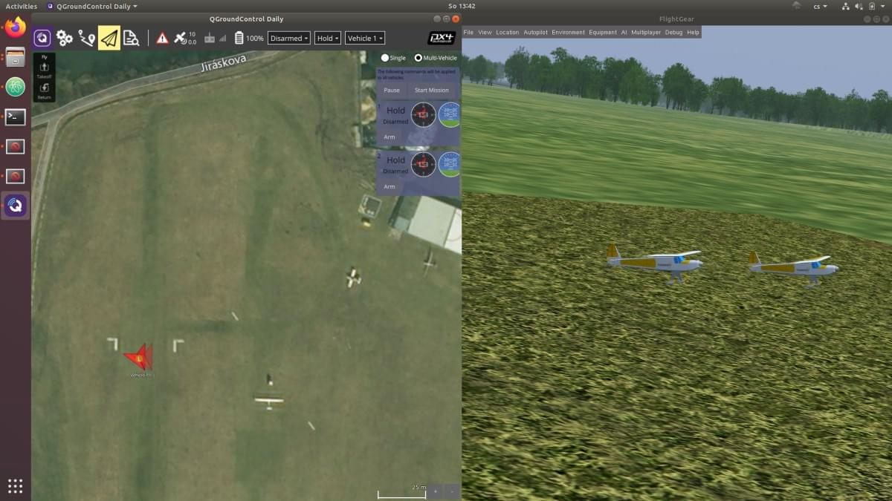

# Симуляція кількох літальних апаратів з FlightGear

:::warning
This simulator is [community supported and maintained](../simulation/community_supported_simulators.md).
Це може працювати або не працювати з поточними версіями PX4.

Дивіться [Встановлення інструментарію](../dev_setup/dev_env.md) для інформації про середовища та інструменти, що підтримуються основною командою розробників.
:::

Цей розділ пояснює як моделювати кілька транспортних засобів за допомогою FlightGear в SITL.
Всі екземпляри транспортних засобів мають параметри, визначені їхніми сценаріями запуску.

:::info
This is the most environmentally realistic way to simulate multiple vehicles running PX4, and allows easy testing of multiple different types of vehicles.
It is suitable for testing multi-vehicle support in _QGroundControl_, [MAVSDK](https://mavsdk.mavlink.io/), etc.

[Multi-Vehicle Simulation with Gazebo Classic](../sim_gazebo_classic/multi_vehicle_simulation.md) should be used instead for: swarm simulations with many vehicles, and testing features like computer vision that are only supported by Gazebo Classic.
:::

## Як запустити кілька екземплярів

Для запуску кількох екземплярів (на окремих портах та ID):

1. Checkout the [PX4 branch that supports multiple vehicles](https://github.com/ThunderFly-aerospace/PX4Firmware/tree/flightgear-multi) (at ThunderFly-aerospace):

   ```sh
   git clone https://github.com/ThunderFly-aerospace/PX4Firmware.git
   cd PX4Firmware
   git checkout flightgear-multi
   ```

2. Побудуйте прошивку PX4 за допомогою стандартного інструментарію (з встановленим FlightGear).

3. Start the first instance using the [predefined scripts](https://github.com/ThunderFly-aerospace/PX4-FlightGear-Bridge/tree/master/scripts):

   ```sh
   cd ./Tools/flightgear_bridge/scripts
   ./vehicle1.sh
   ```

4. Почніть наступні екземпляри, використовуючи інший скрипт:

   ```sh
   ./vehicle2.sh
   ```

Кожен екземпляр повинен мати свій власний запусковий скрипт, який може представляти абсолютно різний тип транспортного засобу.
Для підготовлених сценаріїв вам слід отримати наступний вигляд.



Ground stations such as _QGroundControl_ connect to all instances using the normal UDP port 14550 (all traffic goes to the same port).

Кількість одночасно працюючих екземплярів обмежена в основному ресурсами комп'ютера.
FlightGear є однопотоковим додатком, але розв'язувачі аеродинаміки споживають багато пам'яті.
Therefore splitting to multiple computers and using a [multiplayer server](https://wiki.flightgear.org/Howto:Multiplayer) is probably required to run _many_ vehicle instances.

## Додаткові ресурси

- See [Simulation](../simulation/index.md) for more information about the port configuration.
