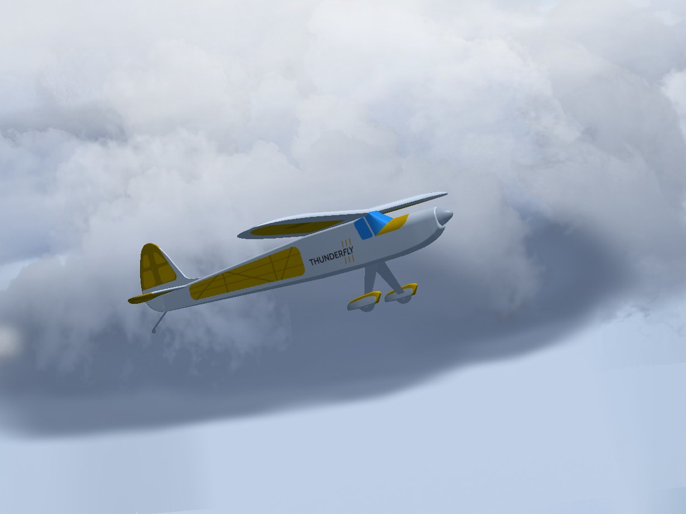
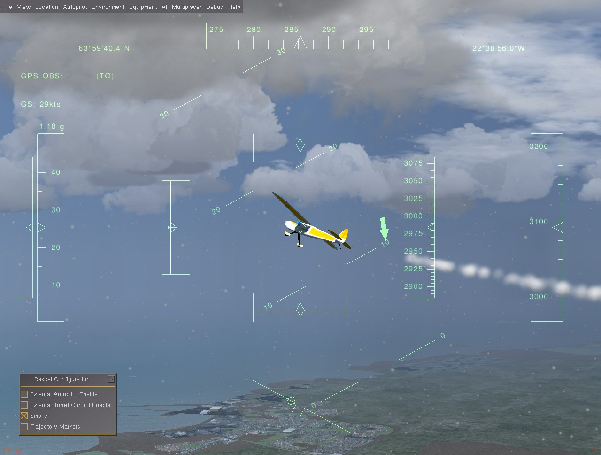
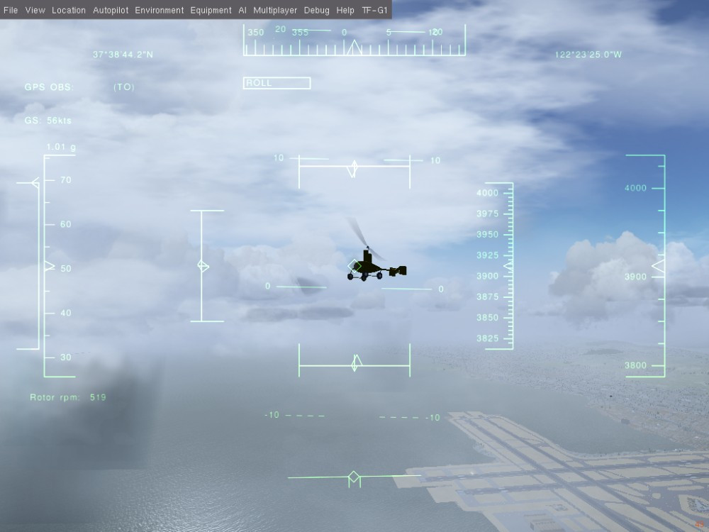
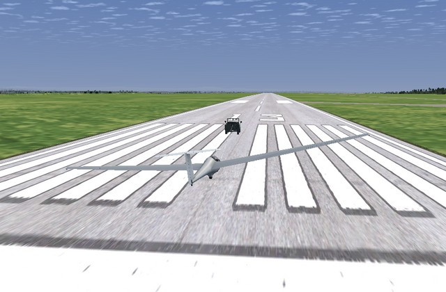

# Літальні апарати FlightGear

:::warning
This simulator is [community supported and maintained](../simulation/community_supported_simulators.md).
Це може працювати або не працювати з поточними версіями PX4.

Дивіться [Встановлення інструментарію](../dev_setup/dev_env.md) для інформації про середовища та інструменти, що підтримуються основною командою розробників.
:::

This topic lists/displays the vehicles supported by the PX4 [FlightGear](../sim_flightgear/index.md) simulation, and the `make` commands required to run them (the commands are run from terminal in the **PX4-Autopilot** directory).
Підтримувані типи: літак, автогир та ровер (існують конкретні рамки в межах цих типів).

:::tip
For the full list of build targets run `make px4_sitl list_vmd_make_targets` (filter out those that start with `flightgear_`).
:::

:::info
The [FlightGear](../sim_flightgear/index.md) page shows how to install and use FlightGear in more detail (this page is a summary of vehicle-specific features).
:::

## Стандартний літак

FlightGear має моделі для багатьох літаків.
The most suitable one for UAV development is currently the [Rascal RC plane](https://github.com/ThunderFly-aerospace/FlightGear-Rascal) (which also exists in multiple variants).



The variants differ mainly by the [FDM](http://wiki.flightgear.org/Flight_Dynamics_Model) model.
All variants have a common feature selection table that can be activated by pressing the `=` key on the computer keyboard.

Є спливаюче вікно, яке може бути використане для активації розширених функцій.



Найбільш відповідна опція:

- Smoke - generates a smoke trail to enhance the visibility of aircraft in the air (smoke and particles option needs to be activated in **FG View > rendering options > Particles checkbox**).
- Маркери траєкторії - відображають ортогональні маркери по траєкторії польоту.

Маркери траєкторії показують абсолютний шлях польоту в світових координатах, а димовий слід показує відносний шлях у повітряній масі.

### Rascal 110 YASim

Основний варіант моделі Rascal має модель згоряння поршневого двигуна.
Це призводить до ненульової потужності холостого ходу, що викликає обертання гвинта на холостих обертах двигуна.

Команда запуску:

```sh
make px4_sitl_nolockstep flightgear_rascal
```

### Rascal 110 Електричний YASim

Транспортний засіб Rascal з електричним двигуном.

```sh
make px4_sitl_nolockstep flightgear_rascal-electric
```

:::info
This variant needs the latest FlightGear code (sources at least from 26 April 2020).
В іншому випадку, FlightGear аварійно завершує роботу через неочікуване визначення електричного двигуна.
:::

### Rascal 110 JSBsim

Rascal JSBsim варіант.

This variant does not have a direct `make` option but can be manually selected in the **rascal.json** configuration file (part of [PX4-FlightGear-Bridge](https://github.com/ThunderFly-aerospace/PX4-FlightGear-Bridge)).
Simply change `Rascal110-YASim` to `Rascal110-JSBSim` in [this file](https://github.com/ThunderFly-aerospace/PX4-FlightGear-Bridge/blob/master/models/rascal.json#L2).

## Автогиро

The only UAV autogyro model supported by FlightGear is [TF-G1 Autogyro](https://github.com/ThunderFly-aerospace/TF-G1).

```sh
make px4_sitl_nolockstep flightgear_tf-g1
```



## Автомобіль Акермана (UGV/Rover)

### TF-R1 Ровер наземної підтримки

Цей ровер обладнаний буксирним гачком і може бути використаний для повітряного буксирування інших транспортних засобів.

```sh
make px4_sitl_nolockstep flightgear_tf-r1
```



## Квадротор

There is only an [incomplete multirotor model](https://github.com/ThunderFly-aerospace/FlightGear-TF-Mx1).
Це ще не можна використовувати (воно чисельно нестійке і потребує додаткової роботи).

## Додавання нового транспортного засобу

A new vehicle model needs to be included as a git submodule into [PX4-FlightGear-Bridge/models/](https://github.com/PX4/PX4-FlightGear-Bridge/tree/master/models) directory.
This directory contains an control channel definition [JSON file](https://github.com/PX4/PX4-FlightGear-Bridge/blob/master/models/rascal.json).

```json
{
  "FgModel": "Rascal110-YASim",
  "Url": "https://github.com/ThunderFly-aerospace/FlightGear-Rascal/archive/master.zip",
  "Controls": [
    ["5", "/controls/flight/aileron", "-1"],
    ["7", "/controls/flight/elevator", "-1"],
    ["2", "/controls/flight/rudder", "1"],
    ["4", "/controls/engines/engine/throttle", "1"]
  ]
}
```

Зміст файлу означає наступне:

- `FgModel` - a precise case sensitive name of the FlightGear model corresponding to "XXXX-set.xml" in the model directory (where XXXX is the model name).
- `Url` is optional and it is not currently used. Призначено для майбутнього використання для автоматичного завантаження моделей з Інтернету
- `Controls` - the most important part of the process of adding a vehicle. This section contains the mapping between the PX4 mixer file and [FlightGear property tree](http://wiki.flightgear.org/Property_tree).
  - Перше число у списку вибирає вихід змішувача PX4.
  - Рядок шляху - це змінна FlightGear, яка знаходиться в дереві властивостей.
- Останній номер у списку є множником, що дозволяє інвертування або масштабування входу мікшера.

Після підготовки всіх цих файлів до системи PX4 потрібно додати новий транспортний засіб.

The PX4 configuration is in [/platforms/posix/cmake/sitl_target.cmake](https://github.com/PX4/PX4-Autopilot/blob/c5341da8137f460c84f47f0e38293667ea69a6cb/platforms/posix/cmake/sitl_target.cmake#L164-L171).
Ім'я нового json-файлу для транспортного засобу повинно бути додане до списку.
