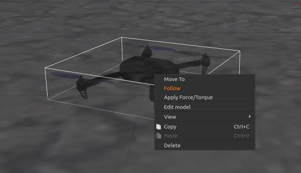
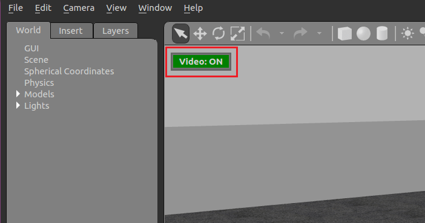
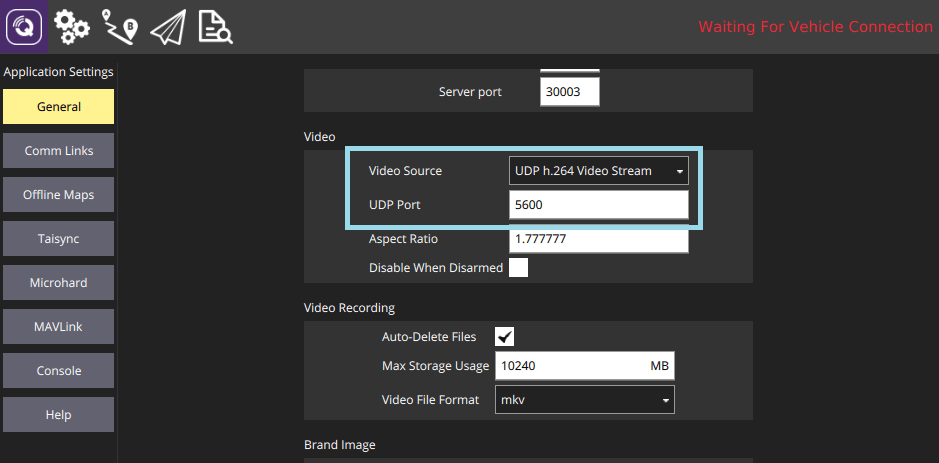
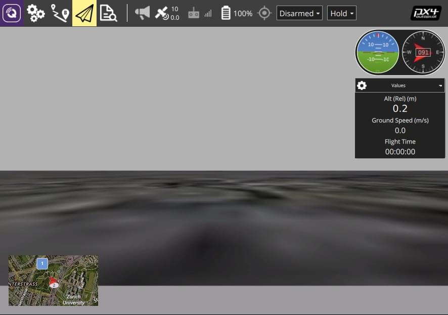

# Симуляція Gazebo Classic

:::warning
_Gazebo Classic_ is supported with PX4 up to Ubuntu Linux 20.04.
In Ubuntu 22.04 and later you must use [Gazebo](../sim_gazebo_gz/index.md) (which was [formerly known](https://www.openrobotics.org/blog/2022/4/6/a-new-era-for-gazebo) as "Gazebo Ignition").
:::

Gazebo Classic - це потужне середовище 3D симуляції для автономних систем яке зокрема підходить для перевірки уникання об'єктів та комп'ютерного зору.
Ця сторінка описує її використання з SITL та єдиним рухомим засобом.
Gazebo Classic can also be used with [HITL](../simulation/hitl.md) and for [multi-vehicle simulation](../sim_gazebo_classic/multi_vehicle_simulation.md).

**Supported Vehicles:** Quad ([Iris](../airframes/airframe_reference.md#copter_quadrotor_x_generic_quadcopter), Hex (Typhoon H480), [Generic Standard VTOL (QuadPlane)](../airframes/airframe_reference.md#vtol_standard_vtol_generic_standard_vtol), Tailsitter, Plane, Rover, Submarine/UUV.

<lite-youtube videoid="qfFF9-0k4KA" title="PX4 Flight Stack ROS 3D Software in the Loop Simulation (SITL)"/>

[](https://mermaid-js.github.io/mermaid-live-editor/#/edit/eyJjb2RlIjoiZ3JhcGggTFI7XG4gIEdhemViby0tPlBsdWdpbjtcbiAgUGx1Z2luLS0-TUFWTGluaztcbiAgTUFWTGluay0tPlNJVEw7IiwibWVybWFpZCI6eyJ0aGVtZSI6ImRlZmF1bHQifSwidXBkYXRlRWRpdG9yIjpmYWxzZX0)

<!-- original graph info
graph LR;
  Gazebo-- >Plugin;
  Plugin-- >MAVLink;
  MAVLink-- >SITL;
-->

:::info
See [Simulation](../simulation/index.md) for general information about simulators, the simulation environment, and simulation configuration (e.g. supported vehicles).
:::

## Встановлення

:::info
If you plan to use PX4 with ROS you **should follow the** [ROS Instructions](../simulation/ros_interface.md) to install both ROS and Gazebo Classic (and thereby avoid installation conflicts).
:::

Gazebo Classic setup is included in our [standard build instructions](../dev_setup/dev_env.md) for macOS, Ubuntu 18.04 and 20.04, and Windows on WSL2 for the same hosts.

For Ubuntu 22.04 LTS and later, the installation script ([/Tools/setup/ubuntu.sh](https://github.com/PX4/PX4-Autopilot/blob/main/Tools/setup/ubuntu.sh)) installs the [Gazebo](../sim_gazebo_gz/index.md) simulator instead.

If you want to use Gazebo Classic on Ubuntu 22.04 you can use the following commands to remove [Gazebo](../sim_gazebo_gz/index.md) (Harmonic) and then reinstall Gazebo-Classic 11:

```sh
sudo apt remove gz-harmonic
sudo apt install aptitude
sudo aptitude install gazebo libgazebo11 libgazebo-dev
```

Note that `aptitude` is needed because it can resolve dependency conflicts (by removing certain packages) that `apt` is unable to handle.

:::tip
You could also modify the installation script to install Gazebo Classic on later versions before it is run for the first time.
:::

Additional installation instructions can be found on gazebosim.org.

## Запуск симуляції

Виконайте симуляцію запустивши PX4 SITL та Gazebo Classic з налаштуванням планеру для завантаження (підтримуються мультикоптери, літаки, ВЗІП, оптичний потік так симуляції кількох засобів).

The easiest way to do this is to open a terminal in the root directory of the PX4 _PX4-Autopilot_ repository and call `make` for the desired target.
Наприклад для запуску симуляції квадрокоптера (за замовчуванням):

```sh
cd /path/to/PX4-Autopilot
make px4_sitl gazebo-classic
```

The supported vehicles and `make` commands are listed below (click links to see vehicle images).

:::info
For the full list of build targets run `make px4_sitl list_vmd_make_targets` (and filter on those that start with `gazebo-classic_`).
:::

| Транспортний засіб                                                                                                                                                       | Команда                                                   |
| ------------------------------------------------------------------------------------------------------------------------------------------------------------------------ | --------------------------------------------------------- |
| [Quadrotor](../sim_gazebo_classic/vehicles.md#quadrotor-default)                                                                                                         | `make px4_sitl gazebo-classic`                            |
| [Quadrotor with Optical Flow](../sim_gazebo_classic/vehicles.md#quadrotor-with-optical-flow)                                                                             | `make px4_sitl gazebo-classic_iris_opt_flow`              |
| [Quadrotor with Depth Camera](../sim_gazebo_classic/vehicles.md#quadrotor-with-depth-camera) (forward-facing)                                         | `make px4_sitl gazebo-classic_iris_depth_camera`          |
| [Quadrotor with Depth Camera](../sim_gazebo_classic/vehicles.md#quadrotor-with-depth-camera) (downward-facing)                                        | `make px4_sitl gazebo-classic_iris_downward_depth_camera` |
| [3DR Solo (Quadrotor)](../sim_gazebo_classic/vehicles.md#3dr-solo-quadrotor)                                                                          | `make px4_sitl gazebo-classic_solo`                       |
| <a id="typhoon_h480"></a>[Typhoon H480 (Hexrotor)](../sim_gazebo_classic/vehicles.md#typhoon-h480-hexrotor) (with video streaming) | `make px4_sitl gazebo-classic_typhoon_h480`               |
| [Standard Plane](../sim_gazebo_classic/vehicles.md#standard-plane)                                                                                                       | `make px4_sitl gazebo-classic_plane`                      |
| [Standard Plane (with catapult launch)](../sim_gazebo_classic/vehicles.md#standard-plane-with-catapult-launch)                                        | `make px4_sitl gazebo-classic_plane_catapult`             |
| [Standard VTOL](../sim_gazebo_classic/vehicles.md#standard-vtol)                                                                                                         | `make px4_sitl gazebo-classic_standard_vtol`              |
| [Tailsitter VTOL](../sim_gazebo_classic/vehicles.md#tailsitter-vtol)                                                                                                     | `make px4_sitl gazebo-classic_tailsitter`                 |
| [Ackerman UGV (Rover)](../sim_gazebo_classic/vehicles.md#ackermann-ugv)                                                                               | `make px4_sitl gazebo-classic_rover`                      |
| [Differential UGV (Rover)](../sim_gazebo_classic/vehicles.md#differential-ugv)                                                                        | `make px4_sitl gazebo-classic_r1_rover`                   |
| [HippoCampus TUHH (UUV: Unmanned Underwater Vehicle)](../sim_gazebo_classic/vehicles.md#unmanned-underwater-vehicle-uuv-submarine)    | `make px4_sitl gazebo-classic_uuv_hippocampus`            |
| [Boat (USV: Unmanned Surface Vehicle)](../sim_gazebo_classic/vehicles.md#hippocampus-tuhh-uuv)                                        | `make px4_sitl gazebo-classic_boat`                       |
| [Cloudship (Airship)](../sim_gazebo_classic/vehicles.md#airship)                                                                                      | `make px4_sitl gazebo-classic_cloudship`                  |

:::info
The [Installing Files and Code](../dev_setup/dev_env.md) guide is a useful reference if there are build errors.
:::

Вищенаведені команди запускають єдиний засіб з повним користувацьким інтерфейсом.
Інші варіанти включають:

- [Starting PX4 and Gazebo separately](#starting-gazebo-and-px4-separately) so that you can keep Gazebo Classic running and only re-launch PX4 when needed (quicker than restarting both).
- Run the simulation in [Headless Mode](#headless-mode), which does not start the Gazebo Classic UI (this uses fewer resources and is much faster).

## Підйом у небо

The `make` commands above first build PX4, and then run it along with the Gazebo Classic simulator.

Після запуску PX4 запуститься оболонка PX4, як показано нижче.

```sh
______  __   __    ___
| ___ \ \ \ / /   /   |
| |_/ /  \ V /   / /| |
|  __/   /   \  / /_| |
| |     / /^\ \ \___  |
\_|     \/   \/     |_/

px4 starting.

INFO  [px4] Calling startup script: /bin/sh etc/init.d-posix/rcS 0
INFO  [param] selected parameter default file eeprom/parameters_10016
[param] Loaded: eeprom/parameters_10016
INFO  [dataman] Unknown restart, data manager file './dataman' size is 11798680 bytes
INFO  [simulator] Waiting for simulator to connect on TCP port 4560
Gazebo multi-robot simulator, version 9.0.0
Copyright (C) 2012 Open Source Robotics Foundation.
Released under the Apache 2 License.
http://gazebosim.org
...
INFO  [ecl/EKF] 5188000: commencing GPS fusion
```

Консоль буде виводити статус поки PX4 завантажує файли ініціалізації та параметрів для певного планера, чекати та підключатися до симулятора.
Once there is an INFO print that [ecl/EKF] is `commencing GPS fusion` the vehicle is ready to arm.

:::info
Right-clicking the quadrotor model allows to enable follow mode from the context menu, which is handy to keep it in view.
:::



Ви можете підняти його у повітря надрукувавши:

```sh
pxh> commander takeoff
```

## Використання/Налаштування

Options that apply to all simulators are covered in the top level [Simulation](../simulation/index.md#sitl-simulation-environment) topic (some of these may be duplicated below).

### Імітація відмови датчика/обладнання

[Simulate Failsafes](../simulation/failsafes.md) explains how to trigger safety failsafes like GPS failure and battery drain.

### Режим без інтерфейсу

Gazebo Classic can be run in a _headless_ mode in which the Gazebo Classic UI is not launched.
Цей режим запускається швидше та використовує менше системних ресурсів (тобто більш "легкий" спосіб запускати симуляцію).

Simply prefix the normal `make` command with `HEADLESS=1` as shown:

```sh
HEADLESS=1 make px4_sitl gazebo-classic_plane
```

<a id="custom_takeoff_location"></a>

### Встановлення власного місця зльоту

Місце зльоту в Gazebo Classic можна встановити використовуючи змінні середовища.
This will override both the default takeoff location, and any value [set for the world](#set-world-location).

The variables to set are: `PX4_HOME_LAT`, `PX4_HOME_LON`, and `PX4_HOME_ALT`.

Наприклад:

```sh
export PX4_HOME_LAT=28.452386
export PX4_HOME_LON=-13.867138
export PX4_HOME_ALT=28.5
make px4_sitl gazebo-classic
```

### Зміна швидкості симуляції

The simulation speed can be increased or decreased with respect to realtime using the environment variable `PX4_SIM_SPEED_FACTOR`.

To run at double real-time:

```sh
PX4_SIM_SPEED_FACTOR=2 make px4_sitl_default gazebo-classic
```

Запустити в половину реального часу:

```sh
PX4_SIM_SPEED_FACTOR=0.5  make px4_sitl_default gazebo-classic
```

To apply a factor to all SITL runs in the current session, use `EXPORT`:

```sh
export PX4_SIM_SPEED_FACTOR=2
make px4_sitl_default gazebo-classic
```

### Зміна швидкості вітру

To simulate wind speed, add this plugin to your world file and set `windVelocityMean` in m/s (replace `SET_YOUR_WIND_SPEED` with your desired speed).
If needed, adapt the `windVelocityMax` parameter so that it is greater than `windVelocityMean`:

```xml
  <plugin name='wind_plugin' filename='libgazebo_wind_plugin.so'>
      <frameId>base_link</frameId>
      <robotNamespace/>
      <windVelocityMean>SET_YOUR_WIND_SPEED</windVelocityMean>
      <windVelocityMax>20.0</windVelocityMax>
      <windVelocityVariance>0</windVelocityVariance>
      <windDirectionMean>0 1 0</windDirectionMean>
      <windDirectionVariance>0</windDirectionVariance>
      <windGustStart>0</windGustStart>
      <windGustDuration>0</windGustDuration>
      <windGustVelocityMean>0</windGustVelocityMean>
      <windGustVelocityMax>20.0</windGustVelocityMax>
      <windGustVelocityVariance>0</windGustVelocityVariance>
      <windGustDirectionMean>1 0 0</windGustDirectionMean>
      <windGustDirectionVariance>0</windGustDirectionVariance>
      <windPubTopic>world_wind</windPubTopic>
    </plugin>
```

Напрямок вітру передається як вектор напрямку (за стандартною конвенцією ENU), який буде нормалізовано в плагіні gazebo.
Додатково ви можете вказати відхилення швидкості вітру у (м/с)² та відхилення у напрямку на основі нормального розподілу, щоб додати випадковий фактор в симуляцію.
Gust is internally handled in the same way as wind, with the slight difference that you can state start time and duration with the following two parameters `windGustStart` and `windGustDuration`.

You can see how this is done in [PX4/PX4-SITL_gazebo-classic/worlds/windy.world](https://github.com/PX4/PX4-SITL_gazebo-classic/blob/main/worlds/windy.world#L15-L31).

### Використання джойстика

Joystick and thumb-joystick support are supported through _QGroundControl_ ([setup instructions here](../simulation/index.md#joystick-gamepad-integration)).

### Підвищення ефективності сенсору відстані

The current default world is [PX4-Autopilot/Tools/simulation/gazebo-classic/sitl_gazebo-classic/worlds/**iris.world**](https://github.com/PX4/PX4-SITL_gazebo-classic/tree/main/worlds)), which uses a heightmap as ground.

Це може викликати труднощі під час використання датчика відстані.
If there are unexpected results we recommend you change the model in **iris.model** from `uneven_ground` to `asphalt_plane`.

### Симуляція шуму GPS

Gazebo Classic може симулювати шум GPS подібний до того, який зазвичай можна знайти в реальних системах (в іншому випадку значення GPS що передаються будуть вільними від шуму або ідеальними).
Це корисно, якщо ви працюєте над додатками, на які може вплинути шум GPS, наприклад точного позиціювання.

GPS noise is enabled if the target vehicle's SDF file contains a value for the `gpsNoise` element (i.e. it has the line: `<gpsNoise>true</gpsNoise>`).
It is enabled by default in many vehicle SDF files: **solo.sdf**, **iris.sdf**, **standard_vtol.sdf**, **delta_wing.sdf**, **plane.sdf**, **typhoon_h480**, **tailsitter.sdf**.

Щоб увімкнути/вимкнути шум GPS:

1. Зберіть будь-яку ціль збірки gazebo, щоб згенерувати SDF файл (для всіх засобів).
  Наприклад:

  ```sh
  make px4_sitl gazebo-classic_iris
  ```

  :::tip
  The SDF files are not overwritten on subsequent builds.

:::

2. Open the SDF file for your target vehicle (e.g. **./Tools/simulation/gazebo-classic/sitl_gazebo-classic/models/iris/iris.sdf**).

3. Search for the `gpsNoise` element:

  ```xml
  <plugin name='gps_plugin' filename='libgazebo_gps_plugin.so'>
    <robotNamespace/>
    <gpsNoise>true</gpsNoise>
  </plugin>
  ```

  - Якщо він присутній, GPS включений.
    You can disable it by deleting the line: `<gpsNoise>true</gpsNoise>`
  - Якщо він відсутній, GPS вимкнено.
    You can enable it by adding the `gpsNoise` element to the `gps_plugin` section (as shown above).

Наступного разу, коли ви зберете/перезапустите Gazebo Classic він буде використовувати нове налаштування шуму GPS.

## Завантаження певного світу

PX4 supports a number of [Worlds](../sim_gazebo_classic/worlds.md), which are stored in [PX4-Autopilot/Tools/simulation/gazebo-classic/sitl_gazebo-classic/worlds](https://github.com/PX4/PX4-SITL_gazebo-classic/tree/main/worlds).
By default Gazebo Classic displays a flat featureless plane, as defined in [empty.world](https://github.com/PX4/PX4-SITL_gazebo-classic/blob/main/worlds/empty.world).

Можна завантажити будь-який зі світів вказавши їх як завершальний параметр в налаштуваннях цілі збірки PX4.

For example, to load the _warehouse_ world, you can append it as shown:

```sh
make px4_sitl_default gazebo-classic_plane_cam__warehouse
```

:::info
There are _two underscores_ after the model (`plane_cam`) indicating that the default debugger is used (none).
See [Building the Code > PX4 Make Build Targets](../dev_setup/building_px4.md#px4-make-build-targets).
:::

You can also specify the full path to a world to load using the `PX4_SITL_WORLD` environment variable.
Це підходить при тестуванні нового світу, який ще не включений до PX4.

:::tip
If the loaded world does not align with the map, you may need to [set the world location](#set-world-location).
:::

## Встановлення розташування світу

Рухомий засіб відтворюється дуже близько до початкового положення моделі світу у певному симульованому GPS розташуванні.

:::info
The vehicle is not spawned exactly at the Gazebo origin (0,0,0), but using a slight offset, which can highlight a number of common coding issues.
:::

При використанні світу, що відтворює реальне місце (наприклад певний аеропорт) це може призвести до доволі наявної невідповідності між тим що показується у світі, що симулюється та тим, що показується на мапі наземної станції.
Для подолання цієї проблеми ви можете встановити місце розташування початкового положення світу до GPS координат, де воно буде в "реальному житті".

:::info
You can also set a [Custom Takeoff Location](#custom_takeoff_location) that does the same thing.
Однак додавання розташування на мапу простіше (і воно все ще може бути змінене шляхом встановлення користувацького розташування при необхідності).
:::

The location of the world is defined in the **.world** file by specifying the location of the origin using the `spherical_coordinates` tag.
Щоб це було коректним, обов'язково треба вказати широту, довготу та висоту над рівнем моря.

An example can be found in the [sonoma_raceway.world](https://github.com/PX4/PX4-SITL_gazebo-classic/blob/main/worlds/sonoma_raceway.world):

```xml
    <spherical_coordinates>
      <surface_model>EARTH_WGS84</surface_model>
      <latitude_deg>38.161479</latitude_deg>
      <longitude_deg>-122.454630</longitude_deg>
      <elevation>488.0</elevation>
    </spherical_coordinates>
```

You can test this by spawning a rover in the [Sonoma Raceway World](../sim_gazebo_classic/worlds.md#sonoma-raceway) using the following `make` command (note that spawning takes longer the first time as the model needs to be downloaded from the model database):

```sh
make px4_sitl gazebo-classic_rover__sonoma_raceway
```

У наведеному нижче відео видно, що розташування середовища збігається зі світом:

<lite-youtube videoid="-a2WWLni5do" title="Driving a simulated PX4 Rover in the Sonoma Raceway"/>

## Запуск Gazebo та PX4 окремо

Для розширених сеансів розробки можливо більш зручно запускати Gazebo Classic та PX4 окремо або навіть з IDE.

In addition to the existing cmake targets that run `sitl_run.sh` with parameters for px4 to load the correct model it creates a launcher targets named `px4_<mode>` that is a thin wrapper around original sitl px4 app.
Ця тонка обгортка просто містить аргументи застосунку типу поточної робочої директорії та шляху до файлу моделі.

Щоб запустити Gazebo Classic та PX4 окремо:

- Run gazebo classic (or any other sim) server and client viewers via the terminal specifying an `_ide` variant:

  ```sh
  make px4_sitl gazebo-classic___ide
  ```

  або

  ```sh
  make px4_sitl gazebo-classic_iris_ide
  ```

- In your IDE select `px4_<mode>` target you want to debug (e.g. `px4_iris`)

- Запустіть сеанс налагодження безпосередньо з IDE

Цей підхід суттєво зменшує час циклу налагодження, оскільки симулятор завжди працює у фоновому режимі та ви перезавантажуєте тільки процес px4, який дуже легкий.

## Симуляція камери спостереження

The _Gazebo Classic_ survey camera simulates a [MAVLink camera](https://mavlink.io/en/services/camera.html) that captures geotagged JPEG images and sends camera capture information to a connected ground station.
Камера також підтримує відеотрансляцію.
Вона може бути використана для перевірки захоплення камери, зокрема в політних завданнях спостереження.

The camera emits the [CAMERA_IMAGE_CAPTURED](https://mavlink.io/en/messages/common.html#CAMERA_IMAGE_CAPTURED) message every time an image is captured.
The captured images are saved to: `PX4-Autopilot/build/px4_sitl_default/src/modules/simulation/simulator_mavlink/frames/DSC_n.jpg` (where _n_ starts as 00000 and is iterated by one on each capture).
To simulate a plane with this camera:

```sh
make px4_sitl_default gazebo-classic_plane_cam
```

:::info
The camera also supports/responds to the following MAVLink commands: [MAV_CMD_REQUEST_CAMERA_CAPTURE_STATUS](https://mavlink.io/en/messages/common.html#MAV_CMD_REQUEST_CAMERA_CAPTURE_STATUS), [MAV_CMD_REQUEST_STORAGE_INFORMATION](https://mavlink.io/en/messages/common.html#MAV_CMD_REQUEST_STORAGE_INFORMATION), [MAV_CMD_REQUEST_CAMERA_SETTINGS](https://mavlink.io/en/messages/common.html#MAV_CMD_REQUEST_CAMERA_SETTINGS), [MAV_CMD_REQUEST_CAMERA_INFORMATION](https://mavlink.io/en/messages/common.html#MAV_CMD_REQUEST_CAMERA_INFORMATION), [MAV_CMD_RESET_CAMERA_SETTINGS](https://mavlink.io/en/messages/common.html#MAV_CMD_RESET_CAMERA_SETTINGS), [MAV_CMD_STORAGE_FORMAT](https://mavlink.io/en/messages/common.html#MAV_CMD_STORAGE_FORMAT), [MAV_CMD_SET_CAMERA_ZOOM](https://mavlink.io/en/messages/common.html#MAV_CMD_SET_CAMERA_ZOOM), [MAV_CMD_IMAGE_START_CAPTURE](https://mavlink.io/en/messages/common.html#MAV_CMD_IMAGE_START_CAPTURE), [MAV_CMD_IMAGE_STOP_CAPTURE](https://mavlink.io/en/messages/common.html#MAV_CMD_IMAGE_STOP_CAPTURE), [MAV_CMD_REQUEST_VIDEO_STREAM_INFORMATION](https://mavlink.io/en/messages/common.html#MAV_CMD_REQUEST_VIDEO_STREAM_INFORMATION), [MAV_CMD_REQUEST_VIDEO_STREAM_STATUS](https://mavlink.io/en/messages/common.html#MAV_CMD_REQUEST_VIDEO_STREAM_STATUS), [MAV_CMD_SET_CAMERA_MODE](https://mavlink.io/en/messages/common.html#MAV_CMD_SET_CAMERA_MODE).
:::

:::info
The simulated camera is implemented in [PX4/PX4-SITL_gazebo-classic/main/src/gazebo_camera_manager_plugin.cpp](https://github.com/PX4/PX4-SITL_gazebo-classic/blob/main/src/gazebo_camera_manager_plugin.cpp).
:::

## Simulated Depth Camera

The _Gazebo Classic_ [depth camera model](https://github.com/PX4/PX4-SITL_gazebo-classic/blob/main/models/depth_camera/depth_camera.sdf.jinja) simulates an Intel® RealSense™ D455 stereo depth camera using the [Openni Kinect plugin](https://classic.gazebosim.org/tutorials?tut=ros_gzplugins#OpenniKinect).

This publishes depth images and camera information on the `/camera/depth/image_raw` and `/camera/depth/camera_info` ROS topics respectively.

To use these images, you will need to install ROS or ROS 2.
Note the warning at the top of this page about how to "avoid installation conflicts" when installing ROS and Gazebo.

You can simulate a quadrotor with a forward-facing depth camera:

```sh
make px4_sitl gazebo-classic_iris_depth_camera
```

or a quadrotor with a downward-facing depth camera:

```sh
make px4_sitl gazebo-classic_iris_downward_depth_camera
```

## Simulated Parachute/Flight Termination

_Gazebo Classic_ can be used to simulate deploying a [parachute](../peripherals/parachute.md) during [Flight Termination](../advanced_config/flight_termination.md) (flight termination is triggered by the PWM command that is simulated in _Gazebo Classic_).

The `if750a` target has a parachute attached to the vehicle.
To simulate the vehicle, run the following command:

```sh
make px4_sitl gazebo-classic_if750a
```

To put the vehicle into flight termination state, you can force it to fail a [safety check](../config/safety.md) that has flight termination set as the failsafe action.
For example, you could do this by forcing a [Geofence violation](../config/safety.md#geofence-failsafe).

Для додаткової інформації дивіться:

- [Flight Termination](../advanced_config/flight_termination.md)
- [Parachute](../peripherals/parachute.md)
- [Safety Configuration (Failsafes)](../config/safety.md)

## Video Streaming

PX4 SITL for Gazebo Classic supports UDP video streaming from a camera sensor attached to a simulated vehicle model.
When streaming is enabled, you can connect to this stream from _QGroundControl_ (on UDP port 5600) and view video of the Gazebo Classic environment from the simulated vehicle - just as you would from a real camera.
The video is streamed using a _gstreamer_ pipeline and can be enabled/disabled using a button in the Gazebo Classic UI.

The simulated camera sensor is supported/enabled on the following frames:

- [Typhoon H480](#typhoon_h480)

### Вимоги

_Gstreamer 1.0_ is required for video streaming.
The required dependencies should already have been [installed when you set up Gazebo Classic](#installation) (they are included in the standard PX4 installation scripts/instructions for macOS and Ubuntu Linux).

:::info
FYI only, the dependencies include: `gstreamer1.0-plugins-base`, `gstreamer1.0-plugins-good`, `gstreamer1.0-plugins-bad`, `gstreamer1.0-plugins-ugly`, `libgstreamer-plugins-base1.0-dev`.
:::

### Start/Stop Video Streaming

Video streaming is automatically started when supported by the target vehicle.
For example, to start streaming video on the Typhoon H480:

```sh
make px4_sitl gazebo-classic_typhoon_h480
```

Streaming can be paused/restarted using the Gazebo UI _Video ON/OFF_ button..



### How to View Gazebo Video

The easiest way to view the SITL/Gazebo Classic camera video stream is in _QGroundControl_.
Simply open **Application Settings > General** and set **Video Source** to _UDP h.264 Video Stream_ and **UDP Port** to _5600_:



The video from Gazebo Classic should then display in _QGroundControl_ just as it would from a real camera.



:::info
The Typhoon world is not very interesting.
:::

It is also possible to view the video using the _Gstreamer Pipeline_.
Simply enter the following terminal command:

```sh
gst-launch-1.0  -v udpsrc port=5600 caps='application/x-rtp, media=(string)video, clock-rate=(int)90000, encoding-name=(string)H264' \
! rtph264depay ! avdec_h264 ! videoconvert ! autovideosink fps-update-interval=1000 sync=false
```

### Докладне ведення журналу

SITL fails silently when there is something wrong with the model.
You can enable more verbose logging using `VERBOSE_SIM`, as shown:

```sh
export VERBOSE_SIM=1
make px4_sitl gazebo-classic
```

або

```sh
VERBOSE_SIM=1 make px4_sitl gazebo-classic
```

## Lockstep

PX4 SITL and Gazebo-Classic have been set up to run in _lockstep_.
What this means is that PX4 and the simulator run at the same speed, and therefore can react appropriately to sensor and actuator messages.
Lockstep makes it possible to [change the simulation speed](#change-simulation-speed), and also to pause it in order to step through code.

#### Lockstep Sequence

Послідовність кроків для lockstep наступна:

1. The simulation sends a sensor message [HIL_SENSOR](https://mavlink.io/en/messages/common.html#HIL_SENSOR) including a timestamp `time_usec` to update the sensor state and time of PX4.
2. PX4 receives this and does one iteration of state estimation, controls, etc. and eventually sends an actuator message [HIL_ACTUATOR_CONTROLS](https://mavlink.io/en/messages/common.html#HIL_ACTUATOR_CONTROLS).
3. Симуляція чекає, поки не отримає повідомлення від приводу/двигуна, потім моделює фізику і обчислює наступне повідомлення від датчика, яке знову надсилається до PX4.

Система починається з "вільного ходу", під час якого симуляція надсилає повідомлення від датчиків, зокрема про час, і, таким чином, запускає PX4, доки він не ініціалізується і не надішле відповідне повідомлення від приводу.

#### Disabling Lockstep

Lockstep симуляцію можна вимкнути, якщо, наприклад, SITL потрібно використовувати з тренажером, який не підтримує цю функцію.
У цьому випадку симулятор і PX4 використовують системний час хоста і не чекають один на одного.

To disable lockstep in:

- PX4, run `make px4_sitl_default boardconfig` and set the `BOARD_NOLOCKSTEP` "Force disable lockstep" symbol which is located under toolchain.
- Gazebo Classic, edit [the model SDF file](https://github.com/PX4/PX4-SITL_gazebo-classic/blob/3062d287c322fabf1b41b8e33518eb449d4ac6ed/models/plane/plane.sdf#L449) and set `<enable_lockstep>false</enable_lockstep>`.

## Розширення та персоналізація

To extend or customize the simulation interface, edit the files in the `Tools/simulation/gazebo/sitl_gazebo` folder.
The code is available on the [sitl_gazebo repository](https://github.com/PX4/PX4-SITL_gazebo) on Github.

:::info
The build system enforces the correct GIT submodules, including the simulator.
It will not overwrite changes in files in the directory.
:::

## Подальша інформація

- [ROS with Gazebo Classic Simulation](../simulation/ros_interface.md)
- [Gazebo Classic Octomap](../sim_gazebo_classic/octomap.md)
