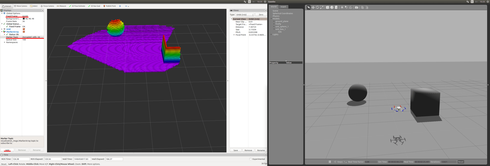

# 3D Моделі OctoMap з ROS/Gazebo Classic

The [OctoMap library](http://octomap.github.io/) is an open source library for generating volumetric 3D environment models from sensor data.
Дані цієї моделі потім можуть використовуватись дроном для навігації та уникнення перешкод.

This guide covers how to use _OctoMap_ with the [Gazebo Classic](../sim_gazebo_classic/index.md) [Rotors Simulator](https://github.com/ethz-asl/rotors_simulator/wiki/RotorS-Simulator) and ROS.

## Встановлення

The installation requires ROS, [Gazebo Classic](../sim_gazebo_classic/index.md) and the Rotors Simulator plugin.
Follow the [Rotors Simulator instructions](https://github.com/ethz-asl/rotors_simulator) to install.

Next, install the _OctoMap_ library:

```sh
sudo apt-get install ros-indigo-octomap ros-indigo-octomap-mapping
rosdep install octomap_mapping
rosmake octomap_mapping
```

Now, open `~/catkin_ws/src/rotors_simulator/rotors_gazebo/CMakeLists.txt` and add the following lines to the bottom of the file:

```sh
find_package(octomap REQUIRED)
include_directories(${OCTOMAP_INCLUDE_DIRS})
link_libraries(${OCTOMAP_LIBRARIES})
```

Open `~/catkin_ws/src/rotors_simulator/rotors_gazebo/package.xml` and add the following lines:

```xml
<build_depend>octomap</build_depend>
<run_depend>octomap</run_depend>
```

Виконайте наступні два рядки:

:::info
The first line changes your default shell editor to _gedit_. This is recommended for users who have little experience with _vim_ (the default editor), but can otherwise be omitted.
:::

```sh
export EDITOR='gedit'
rosed octomap_server octomap_tracking_server.launch
```

та змінити наступні два рядки:

```xml
<param name="frame_id" type="string" value="map" />
...
<!--remap from="cloud_in" to="/rgbdslam/batch_clouds" /-->
```

на:

```xml
<param name="frame_id" type="string" value="world" />
...
<remap from="cloud_in" to="/firefly/vi_sensor/camera_depth/depth/points" />
```

## Запуск симуляції

Run the following three lines in _separate_ terminal windows.
This opens up [Gazebo Classic](../sim_gazebo_classic/index.md), _Rviz_ and an octomap server.

```sh
roslaunch rotors_gazebo mav_hovering_example_with_vi_sensor.launch  mav_name:=firefly
rviz
roslaunch octomap_server octomap_tracking_server.launch
```

In _Rviz_, change the field 'Fixed Frame' from 'map' to 'world' in the top left of the window.
Тепер натисніть кнопку "Додати" в нижньому лівому куті та оберіть MarkerArray. Then double click the MarkerArray and change 'Marker Topic' from `/free_cells_vis_array` to `/occupied_cells_vis_array`.

Тепер ви повинні побачити частину підлоги.

In the _Gazebo Classic_ window, insert a cube in front of the red rotors and you should see it in _Rviz_.


