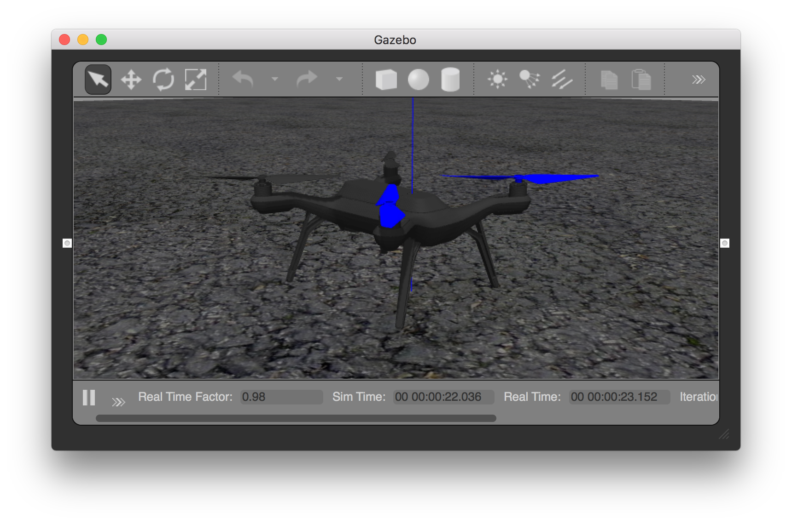
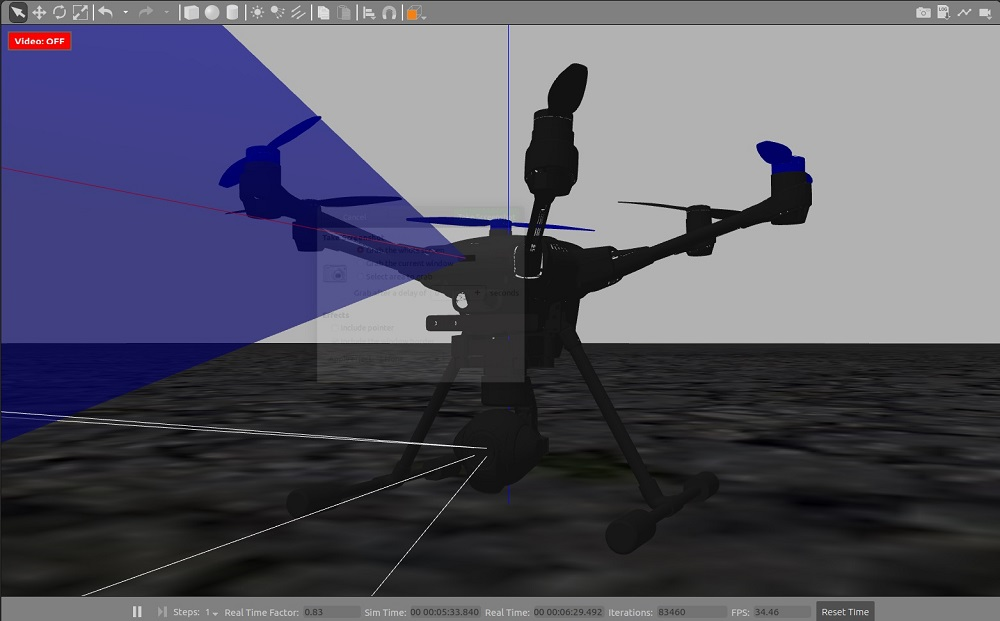
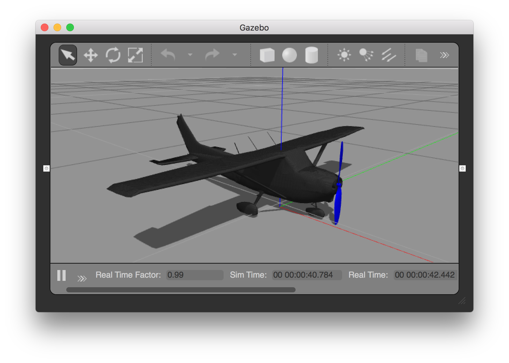
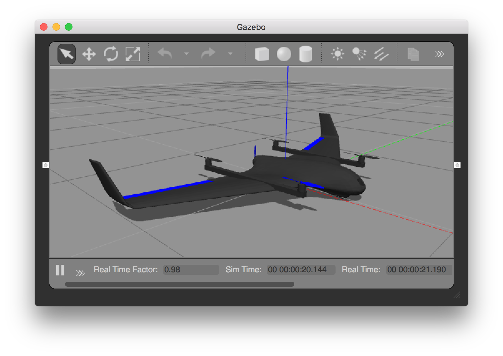
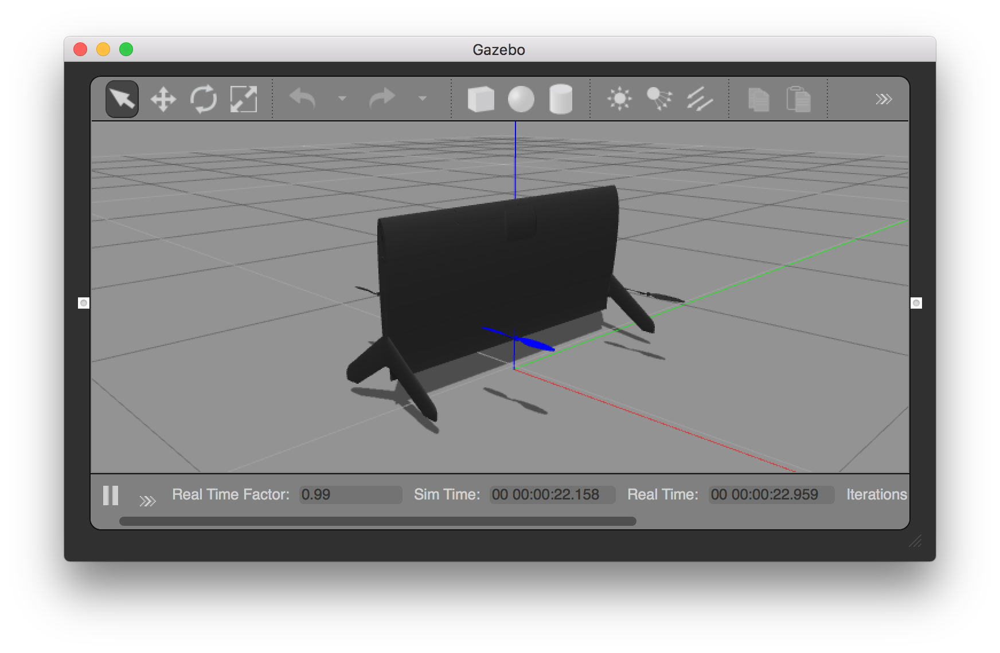
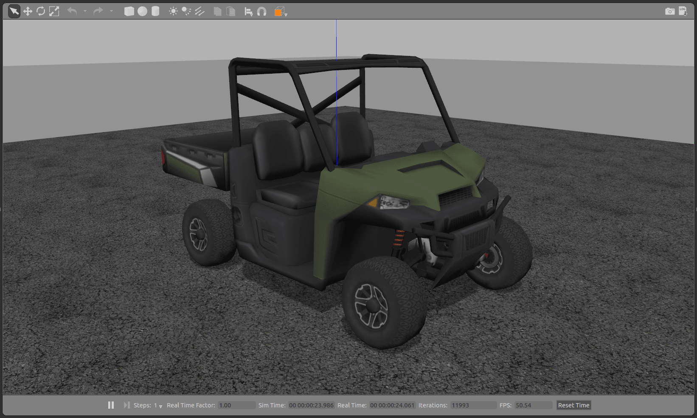
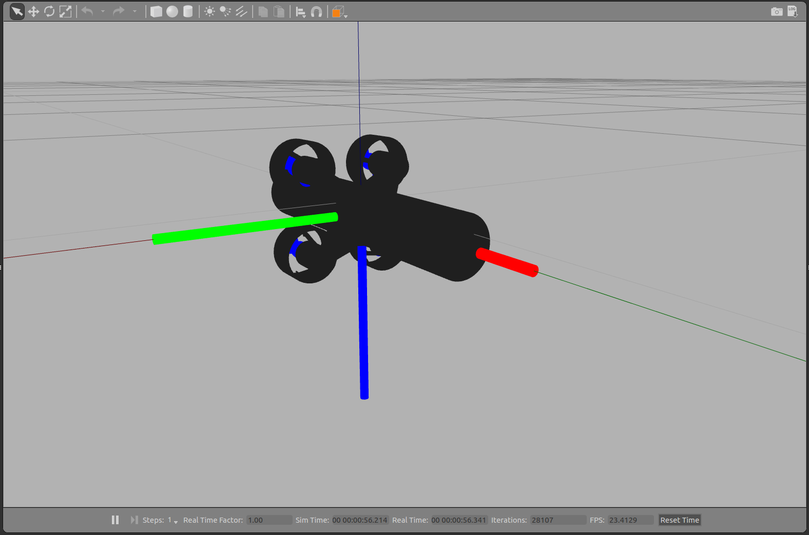
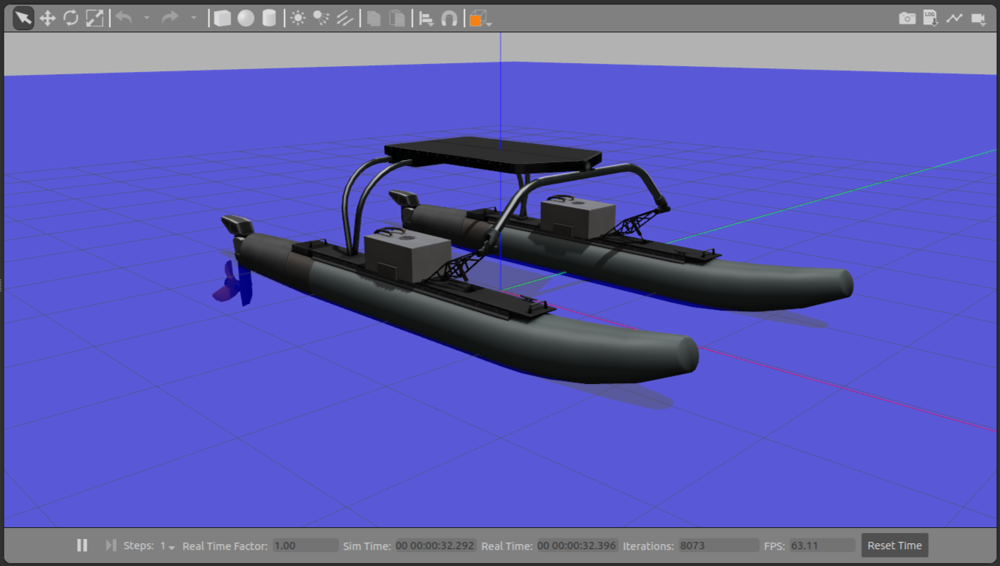
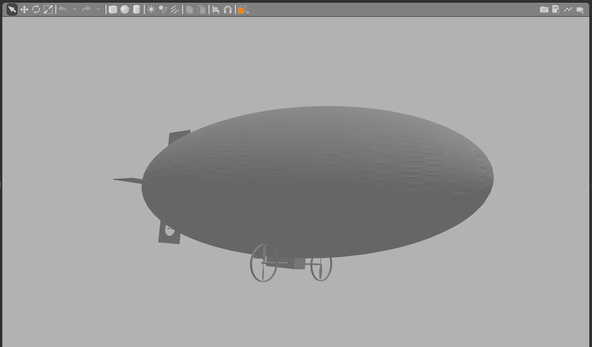

# Рухомі засоби Gazebo Classic

This topic lists/displays the vehicles supported by the PX4 [Gazebo Classic](../sim_gazebo_classic/index.md) simulation and the `make` commands required to run them (the commands are run from a terminal in the **PX4-Autopilot** directory).

Типи рухомих засобів що підтримуються включають: мультиротори, ВЗІП, ВЗІП з хвоста, літак, ровер, підводний човен/підводний дрон.

:::info
The [Gazebo Classic](../sim_gazebo_classic/index.md) page shows how to install Gazebo Classic, how to enable video and load custom maps, and many other configuration options.
:::

## Мультикоптер

### Квадрокоптер (за замовчуванням)

```sh
make px4_sitl gazebo-classic
```

### Квадрокоптер з оптичним потоком

```sh
make px4_sitl gazebo-classic_iris_opt_flow
```

### Квадрокоптер з камерою глибини

Ці моделі мають додану камеру глибини, змодельовану за зразком Intel® RealSense™ D455.

_Forward-facing depth camera:_

```sh
make px4_sitl gazebo-classic_iris_depth_camera
```

_Downward-facing depth camera:_

```sh
make px4_sitl gazebo-classic_iris_downward_depth_camera
```

### 3DR Solo (Квадрокоптер)

```sh
make px4_sitl gazebo-classic_solo
```



### Typhoon H480 (Гексакоптер)

```sh
make px4_sitl gazebo-classic_typhoon_h480
```



:::info
This target also supports [video streaming simulation](../sim_gazebo_classic/index.md#video-streaming).
:::

<a id="fixed_wing"></a>

## Літак/Фіксоване крило

### Стандартний літак

```sh
make px4_sitl gazebo-classic_plane
```



#### Стандартний літак із запуском з катапульти

```sh
make px4_sitl gazebo-classic_plane_catapult
```

This model simulates hand/catapult launch, which can be used for [fixed-wing takeoff](../flight_modes_fw/takeoff.md) in position mode, takeoff mode, or missions.

Літак буде автоматично запущено як тільки засіб буде в стані готовності.

## VTOL

### Standard VTOL

```sh
make px4_sitl gazebo-classic_standard_vtol
```



### Тейлсіттер

```sh
make px4_sitl gazebo-classic_tailsitter
```



<a id="ugv"></a>

## Безпілотний наземний засіб (Ровер/Автомобіль)

### Наземний засіб з трапецією Аккермана

```sh
make px4_sitl gazebo-classic_rover
```



### Наземний засіб з диференціалом

```sh
make px4_sitl gazebo-classic_r1_rover
```


## Безпілотний підводний засіб(Підводний човен)

### HippoCampus TUHH

```sh
make px4_sitl gazebo-classic_uuv_hippocampus
```



## Безпілотний надводний засіб (Човен)

<a id="usv_boat"></a>

### Човен

```sh
make px4_sitl gazebo-classic_boat
```



<a id="airship"></a>

## Дирижабль

### Cloudship

```sh
make px4_sitl gazebo-classic_cloudship
```


