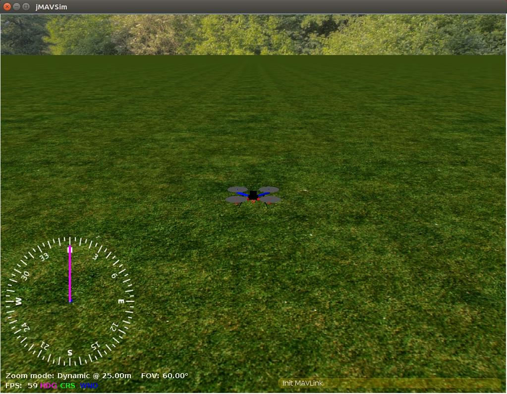

# jMAVSim з SITL

:::warning
This simulator is [community supported and maintained](../simulation/community_supported_simulators.md).
It may or may not work with current versions of PX4 and may be removed in future releases.

Дивіться [Встановлення інструментарію](../dev_setup/dev_env.md) для інформації про середовища та інструменти, що підтримуються основною командою розробників.
:::

jMAVSim is a simple multirotor/Quad simulator that allows you to fly _copter_ type vehicles running PX4 around a simulated world.
Його легко налаштувати і можна використовувати для перевірки того, що ваш апарат може злітати, летіти, приземлятися і належним чином реагувати на різні несправності (наприклад, несправність GPS).

<strong>Supported Vehicles:</strong>

- Quad

Ця тема показує, як налаштувати jMAVSim для підключення до SITL версії PX4.

:::tip
jMAVSim can also be used for HITL Simulation ([as shown here](../simulation/hitl.md#jmavsim-quadrotor-only)).
:::

## Встановлення

jMAVSim setup is included in our [standard build instructions](../dev_setup/dev_env.md) for Ubuntu Linux and Windows.
Follow the instructions below to install jMAVSim on macOS.

### macOS

To setup the environment for [jMAVSim](../sim_jmavsim/index.md) simulation:

1. Install a recent version of Java (e.g. Java 15).
  You can download [Java 15 (or later) from Oracle](https://www.oracle.com/java/technologies/javase-downloads.html) or use [Eclipse Temurin](https://adoptium.net):

  ```sh
  brew install --cask temurin
  ```

2. Install jMAVSim:

  ```sh
  brew install px4-sim-jmavsim
  ```

  :::warning
  PX4 v1.11 and beyond require at least JDK 15 for jMAVSim simulation.

  For earlier versions, macOS users might see the error `Exception in thread "main" java.lang.UnsupportedClassVersionError:`.
  You can find the fix in the [jMAVSim with SITL > Troubleshooting](../sim_jmavsim/index.md#troubleshooting)).

:::

## Середовище симуляції

Симуляція програмного забезпечення в петлі виконує повну систему на комп'ютері та моделює автопілот. Він підключається через локальну мережу до симулятора. Вигляд налаштування виглядає наступним чином:

[](https://mermaid-js.github.io/mermaid-live-editor/#/edit/eyJjb2RlIjoiZ3JhcGggTFI7XG4gIFNpbXVsYXRvci0tPk1BVkxpbms7XG4gIE1BVkxpbmstLT5TSVRMOyIsIm1lcm1haWQiOnsidGhlbWUiOiJkZWZhdWx0In0sInVwZGF0ZUVkaXRvciI6ZmFsc2V9)

<!-- original graph
graph LR;
  Simulator-- >MAVLink;
  MAVLink-- >SITL;
-->

## Запуск SITL

After ensuring that the [simulation prerequisites](../dev_setup/dev_env.md) are installed on the system, just launch: The convenience make target will compile the POSIX host build and run the simulation.

```sh
make px4_sitl_default jmavsim
```

Це запустить консоль PX4 як показано нижче:

```sh
[init] shell id: 140735313310464
[init] task name: px4

______  __   __    ___
| ___ \ \ \ / /   /   |
| |_/ /  \ V /   / /| |
|  __/   /   \  / /_| |
| |     / /^\ \ \___  |
\_|     \/   \/     |_/

Ready to fly.


pxh>
```

It will also bring up a window showing a 3D view of the [jMAVSim](https://github.com/PX4/jMAVSim) simulator:



## Підйом у небо

Система почне друкувати інформацію про статус. You will be able to start flying once you have a position lock (shortly after the console displays the message: _EKF commencing GPS fusion_).

Щоб злітіти, введіть наступне у консоль:

```sh
pxh> commander takeoff
```

You can use _QGroundControl_ to fly a mission or to connect to a [joystick](#using-a-joystick).

## Використання/Налаштування

Options that apply to all simulators are covered in the top level [Simulation](../simulation/index.md#sitl-simulation-environment) topic (some of these may be duplicated below).

### Імітація відмови датчика/обладнання

[Simulate Failsafes](../simulation/failsafes.md) explains how to trigger safety failsafes like GPS failure and battery drain.

### Встановлення власного місця зльоту

The default takeoff location in can be overridden using the environment variables: `PX4_HOME_LAT`, `PX4_HOME_LON`, and `PX4_HOME_ALT`.

Наприклад, щоб встановити широту, довготу та висоту:

```sh
export PX4_HOME_LAT=28.452386
export PX4_HOME_LON=-13.867138
export PX4_HOME_ALT=28.5
make px4_sitl_default jmavsim
```

### Зміна швидкості симуляції

The simulation speed can be increased or decreased with respect to realtime using the environment variable `PX4_SIM_SPEED_FACTOR`.

To run at double real-time:

```sh
PX4_SIM_SPEED_FACTOR=2 make px4_sitl_default jmavsim
```

Запустити в половину реального часу:

```sh
PX4_SIM_SPEED_FACTOR=0.5  make px4_sitl_default jmavsim
```

To apply a factor to all SITL runs in the current session, use `EXPORT`:

```sh
export PX4_SIM_SPEED_FACTOR=2
make px4_sitl_default jmavsim
```

### Використання джойстика

Joystick and thumb-joystick support are supported through _QGroundControl_ ([setup instructions here](../simulation/index.md#joystick-gamepad-integration)).

### Моделювання Wifi Дрона

Є спеціальна ціль для моделювання безпілотника, підключеного через Wifi до локальної мережі:

```sh
make broadcast jmavsim
```

Симулятор транслює свою адресу в локальній мережі так, як це робив би справжній безпілотник.

### Запуск JMAVSim та PX4 окремо

Ви можете запустити JMAVSim та PX4 окремо:

```sh
./Tools/simulation/jmavsim/jmavsim_run.sh -l
make px4_sitl none
```

Це дозволяє швидший цикл тестування (перезапуск jMAVSim займає значно більше часу).

### Режим без інтерфейсу

To start jMAVSim without the GUI, set the env variable `HEADLESS=1` as shown:

```sh
HEADLESS=1 make px4_sitl jmavsim
```

## Симуляція кількох рухомих засобів

JMAVSim can be used for multi-vehicle simulation: [Multi-Vehicle Sim with JMAVSim](../sim_jmavsim/multi_vehicle.md).

## Lockstep

PX4 SITL and jMAVSim have been set up to run in _lockstep_.
What this means is that PX4 and the simulator run at the same speed, and therefore can react appropriately to sensor and actuator messages.
Lockstep makes it possible to [change the simulation speed](#change-simulation-speed), and also to pause it in order to step through code.

#### Lockstep Sequence

Послідовність кроків для lockstep наступна:

1. The simulation sends a sensor message [HIL_SENSOR](https://mavlink.io/en/messages/common.html#HIL_SENSOR) including a timestamp `time_usec` to update the sensor state and time of PX4.
2. PX4 receives this and does one iteration of state estimation, controls, etc. and eventually sends an actuator message [HIL_ACTUATOR_CONTROLS](https://mavlink.io/en/messages/common.html#HIL_ACTUATOR_CONTROLS).
3. Симуляція чекає, поки не отримає повідомлення від приводу/двигуна, потім моделює фізику і обчислює наступне повідомлення від датчика, яке знову надсилається до PX4.

Система починається з "вільного ходу", під час якого симуляція надсилає повідомлення від датчиків, зокрема про час, і, таким чином, запускає PX4, доки він не ініціалізується і не надішле відповідне повідомлення від приводу.

#### Disabling Lockstep

Lockstep симуляцію можна вимкнути, якщо, наприклад, SITL потрібно використовувати з тренажером, який не підтримує цю функцію.
У цьому випадку симулятор і PX4 використовують системний час хоста і не чекають один на одного.

To disable lockstep in:

- PX4, run `make px4_sitl_default boardconfig` and set the `BOARD_NOLOCKSTEP` "Force disable lockstep" symbol which is located under toolchain.
- jMAVSim, remove `-l` in [sitl_run.sh](https://github.com/PX4/PX4-Autopilot/blob/main/Tools/simulation/jsbsim/sitl_run.sh#L40), or make sure otherwise that the java binary is started without the `-lockstep` flag.

<!-- Relevant lines in sitl_run.sh are: -->

<!-- # Start Java simulator -->

<!-- "$src_path"/Tools/simulation/jmavsim/jmavsim_run.sh -r 250 -l & SIM_PID=$!  -->

## Розширення та персоналізація

To extend or customize the simulation interface, edit the files in the **Tools/jMAVSim** folder. The code can be accessed through the[jMAVSim repository](https://github.com/px4/jMAVSim) on Github.

:::info
The build system enforces the correct submodule to be checked out for all dependencies, including the simulator.
Це не перезапише зміни в файлах у каталозі, проте, коли ці зміни будуть зафіксовані, підмодуль повинен бути зареєстрований у репозиторії Firmware з новим хешем коміту. To do so, `git add Tools/jMAVSim` and commit the change.
Це оновить хеш GIT симулятора.
:::

## Взаємодія з ROS

The simulation can be [interfaced to ROS](../simulation/ros_interface.md) the same way as onboard a real vehicle.

## Важливі файли

- The startup scripts are discussed in [System Startup](../concept/system_startup.md).
- The simulated root file system ("`/`" directory) is created inside the build directory here: `build/px4_sitl_default/rootfs`.

## Усунення проблем

### java.long.NoClassDefFoundError

```sh
Exception in thread "main" java.lang.NoClassDefFoundError: javax/vecmath/Tuple3d
at java.base/java.lang.Class.forName0(Native Method)
at java.base/java.lang.Class.forName(Class.java:374)
at org.eclipse.jdt.internal.jarinjarloader.JarRsrcLoader.main(JarRsrcLoader.java:56)
Caused by: java.lang.ClassNotFoundException: javax.vecmath.Tuple3d
at java.base/java.net.URLClassLoader.findClass(URLClassLoader.java:466)
at java.base/java.lang.ClassLoader.loadClass(ClassLoader.java:566)
at java.base/java.lang.ClassLoader.loadClass(ClassLoader.java:499)
... 3 more
Exception in thread "main" java.lang.NoClassDefFoundError: javax/vecmath/Tuple3d
at java.base/java.lang.Class.forName0(Native Method)
at java.base/java.lang.Class.forName(Class.java:374)
at org.eclipse.jdt.internal.jarinjarloader.JarRsrcLoader.main(JarRsrcLoader.java:56)
Caused by: java.lang.ClassNotFoundException: javax.vecmath.Tuple3d
at java.base/java.net.URLClassLoader.findClass(URLClassLoader.java:466)
at java.base/java.lang.ClassLoader.loadClass(ClassLoader.java:566)
at java.base/java.lang.ClassLoader.loadClass(ClassLoader.java:499)
```

This error should no longer occur once the jMAVSim submodule is [updated to newer jar libs](https://github.com/PX4/jMAVSim/pull/119) and Java 11 or Java 14 should work fine.

### Відбулася незаконна відображувальна операція доступу

Це попередження можна ігнорувати (ймовірно, воно буде відображено, але симуляція все одно буде працювати правильно).

```sh
WARNING: An illegal reflective access operation has occurred
WARNING: Illegal reflective access by javax.media.j3d.JoglPipeline (rsrc:j3dcore.jar) to method sun.awt.AppContext.getAppContext()
WARNING: Please consider reporting this to the maintainers of javax.media.j3d.JoglPipeline
WARNING: Use --illegal-access=warn to enable warnings of further illegal reflective access operations
WARNING: All illegal access operations will be denied in a future release
Inconsistency detected by ld.so: dl-lookup.c: 112: check_match: Assertion version->filename == NULL || ! _dl_name_match_p (version->filename, map)' failed!
```

### java.awt.AWTError: Assistive Technology not found: org.GNOME.Accessibility.AtkWrapper

```sh
Виключення в потоці "main" java.lang.reflect.InvocationTargetException
в sun.reflect.NativeMethodAccessorImpl.invoke0 (Нативний метод)
в sun.reflect.NativeMethodAccessorImpl.invoke (NativeMethodAccessorImpl.java:62)
в sun.reflect.DelegatingMethodAccessorImpl.invoke (DelegatingMethodAccessorImpl.java:43)
в java.lang.reflect.Method.invoke (Method.java:498)
в org.eclipse.jdt.internal.jarinjarloader.JarRsrcLoader.main (JarRsrcLoader.java:58)
Викликано: java.awt.AWTError: Не знайдено технологію сприяння: org.GNOME.Accessibility.AtkWrapper
в java.awt.Toolkit.loadAssistiveTechnologies (Toolkit.java:807)
в java.awt.Toolkit.getDefaultToolkit (Toolkit.java:886)
в java.awt.Window.getToolkit (Window.java:1358)
в java.awt.Window.init (Window.java:506)
в java.awt.Window. (Window.java:537)
в java.awt.Frame. (Frame.java:420)
в java.awt.Frame. (Frame.java:385)
в javax.swing.JFrame. (JFrame.java:189)
в me.drton.jmavsim.Visualizer3D. (Visualizer3D.java:104)
в me.drton.jmavsim.Simulator. (Simulator.java:157)
в me.drton.jmavsim.Simulator.main (Simulator.java:678)
```

Якщо ви бачите цю помилку, спробуйте цей обхідний шлях:

Edit the **accessibility.properties** file:

```sh
sudo gedit /etc/java-8-openjdk/accessibility.properties
```

та закоментуйте рядок, вказаний нижче:

```sh
#assistive_technologies=org.GNOME.Acessibility.AtkWrapper
```

For more info, check [this GitHub issue](https://github.com/PX4/PX4-Autopilot/issues/9557).
A contributor found the fix in [askubuntu.com](https://askubuntu.com/questions/695560).

### Виняток у потоці "main" java.lang.UnsupportedClassVersionError

При компіляції jMAVsim ви можливо зіткнетеся з наступною помилкою:

```sh
Exception in thread "main" java.lang.UnsupportedClassVersionError: me/drton/jmavsim/Simulator has been compiled by a more recent version of the Java Runtime (class file version 59.0), this version of the Java Runtime only recognizes class file versions up to 58.0
```

Ця помилка говорить вам, вам потрібна більш свіжа версія Java у вашому середовищі.
Версія файлу класу 58 відповідає jdk14, версія 59 - jdk15, версія 60 - jdk 16 тощо.

Щоб виправити це під macOS, ми рекомендуємо встановити OpenJDK через homebrew

```sh
brew install --cask adoptopenjdk16
```
