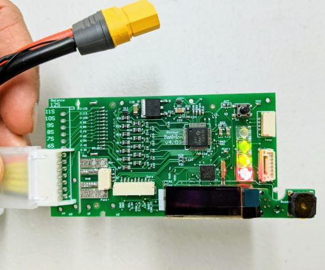
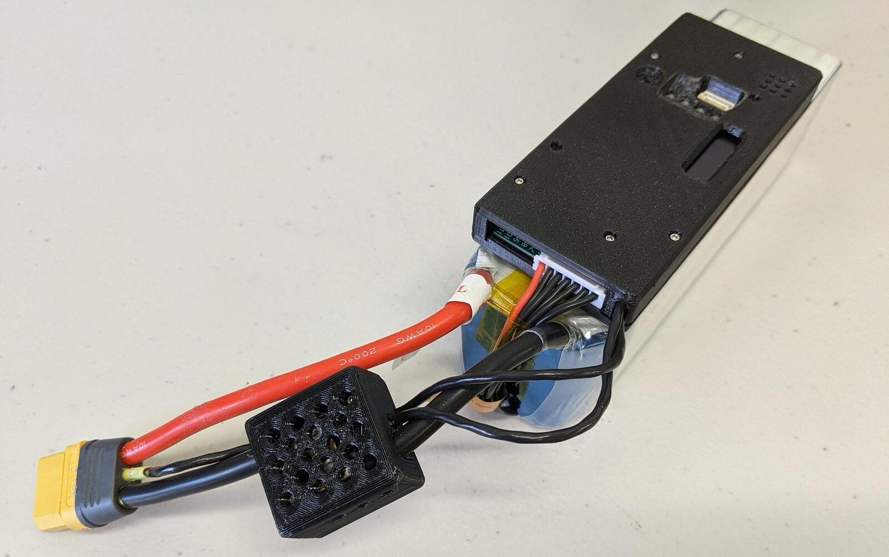

# Rotoye Batmon

[Rotoye Batmon](https://rotoye.com/batmon/) is a kit for adding smart battery functionality to off-the-shelf Lithium-Ion and LiPo batteries.
Його можна придбати як самостійний пристрій або як частину заводсько зібраної розумної батареї.

:::info
At time of writing you can only use Batmon by [building a custom branch of PX4](#build-px4-firmware).
Support in the codeline is pending [PR approval](https://github.com/PX4/PX4-Autopilot/pull/16723).
:::





## Де купити

[Rotoye Store](https://rotoye.com/batmon/): Batmon kits, custom smart-batteries, and accessories

## Проведення/Підключення

Система Rotoye Batmon використовує роз'єм батареї XT-90 з контактами I2C та оптоволоконно-ізоляційну плату для передачі даних.


More details can be found [here](https://github.com/rotoye/batmon_reader)

## Налаштування програмного забезпечення

### Створення прошивки PX4

1. Clone or download [Rotoye's fork of PX4:](https://github.com/rotoye/PX4-Autopilot/tree/batmon_4.03)
   ```sh
   git clone https://github.com/rotoye/PX4-Autopilot.git
   cd PX4-Autopilot
   ```
2. Checkout the _batmon_4.03_ branch
   ```sh
   git fetch origin batmon_4.03
   git checkout batmon_4.03
   ```
3. [Build and upload the firmware](../dev_setup/building_px4.md) for your target board

### Налаштування параметрів

In _QGroundControl_:

1. Set the following [parameters](../advanced_config/parameters.md):
   - `BATx_SOURCE` to `External`,
   - `SENS_EN_BAT` to `true`,
   - `BAT_SMBUS_MODEL` to `3:Rotoye`
2. Open the [MAVLink Console](https://docs.qgroundcontrol.com/master/en/qgc-user-guide/analyze_view/mavlink_console.html)
3. Start the [batt_smbus driver](../modules/modules_driver.md) in the console.
   Наприклад, для запуску двох BatMons у одному підключенні:
   ```sh
   batt_smbus start -X -b 1 -a 11 # External bus 1, address 0x0b  
   batt_smbus start -X -b 1 -a 12 # External bus 1, address 0x0c
   ```

## Подальша інформація

[Quick Start Guide](https://rotoye.com/batmon-tutorial/) (Rotoye)
