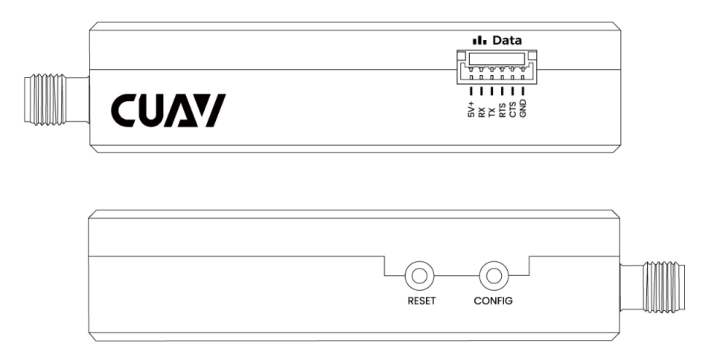

# CUAV P8 Телеметрійне радіо

CUAV P8 Radio is a long range (>60km) and high data rate (375 Kbps) remote data transmission module for drones that works plug-and-play with PX4.

Він підтримує кілька режимів, таких як точка-точка, точка-багатоточка та релеєве спілкування.

## Основні характеристики

- Long range: >60km (depending on the antenna and environment, up to 100 km).
- Підтримує режими точка-точка, точка-багатоточка та ретранслятор.
- До 2 Вт потужності (фіксована частота 2 Вт; стробування частотою 1 Вт)
- До 345 Кбіт / с швидкість передачі.
- Підтримує 12v~60V операційну напругу.
- Одиниця може працювати або як наземний модем станції, або як модем літака.
- Незалежне енергопостачання для більш стабільної операції
- USB порт Type-C, інтегрований USB до конвертера UART

## Де купити

- [CUAV store](https://www.cuav.net/en/p8-2/)
- [CUAV alibaba](https://www.alibaba.com/product-detail/Free-shipping-CUAV-UAV-P8-Radio_1600324379418.html?spm=a2747.manage.0.0.2dca71d2bY4B0M)

## Конфігурація PX4

CUAV P8 радіо є попередньо налаштованим (швидкість 57600, режим трансляції) для використання з PX4.
It should require no additional setup if connected to `TELEM1` OR `TELEM2`.

On some flight controllers, or if used with a different serial port, you may need to [configure the port for MAVLink communication](../peripherals/mavlink_peripherals.md).

:::tip
[P8 Configuration](https://doc.cuav.net/data-transmission/p8-radio/en/config.html) provides full information about radio configuration, if required.
:::

## Схема розташування виводів

### Порт даних

| pin | C-RTK GPS 6P               | pin | Pixhawk стандартні контакти |
| --- | -------------------------- | --- | --------------------------- |
| 1   | 5V+(NC) | 1   | VCC                         |
| 2   | RX                         | 2   | TX                          |
| 3   | TX                         | 3   | RX                          |
| 4   | RTS                        | 4   | RTS                         |
| 5   | CTS                        | 5   | CTS                         |
| 6   | GND                        | 6   | GND                         |

## Підключення

Connect the CUAV P8 Radio to the `TELEM1`/`TELEM2` interface of the flight controller and use a battery or BEC to power the module.
Необхідні кабелі включені в комплект.

:::tip
CUAV P8 Radio does not support power supply from the flight controller, it needs to be connected to a 12~60v battery or BEC.
:::

## Докладніше

[P8 manual](http://manual.cuav.net/data-transmission/p8-radio/p8-user-manual-en.pdf)

[CUAV P8 Radio](https://doc.cuav.net/data-transmission/p8-radio/en/) (Official Guide)
