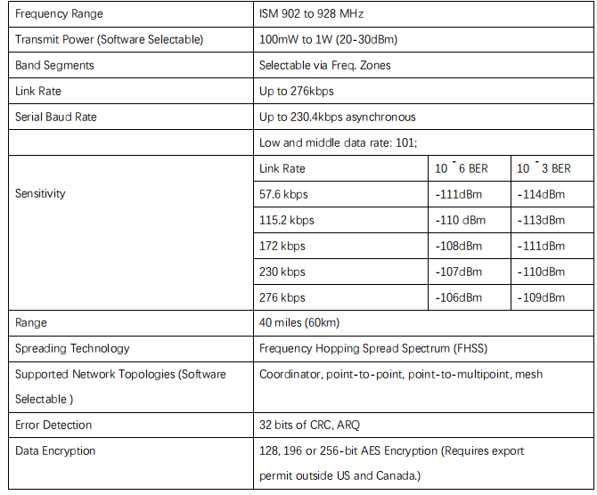

# Holybro Microhard P900 Радіо

The [Holybro Microhard P900 Radio](https://holybro.com/products/microhard-radio) integrates the [Microhard Pico Serial](http://microhardcorp.com/P900.php) P900 RF module, which is capable of delivering high-performance wireless serial communications in robust and secure mesh, point-to-point or point-to-multipoint topologies.
Він дозволяє комунікацію MAVLink між радіо на транспортному засобі та GCS.

Цей радіопередавач працює у діапазоні частот 902-928 МГц ISM, використовуючи технологію розподіленого спектра з переходом по частоті (FHSS), що забезпечує надійний бездротовий асинхронний передачу даних між більшістю типів обладнання, яке використовує послідовний інтерфейс.
Радіопередавач може бути налаштований як основний координатор, вторинний координатор, резервний координатор або віддалений в мережевій топології меш, або як майстер(master,), ретранслятор(repeater) або віддалений в топології точка-точка(PP) або точка-багатоточка (PMP).

Ця універсальність дуже зручна для користувача.
This radio is configured using AT commands through the data port or using _PicoConfig_ application through the diagnosis port.

Потужність передачі програмно вибирається від 100 мВт до 1 Вт, з дальністю до 40 миль.
Одне радіо земної станції може бути використано для зв'язку з кількома транспортними засобами за допомогою точка-багатоточної або мережевої топології меш.
Транспортні засоби повинні мати різні ідентифікатори MAVLINK.

## Функції

- USB порт Type-C, інтегрований USB до конвертера UART
- 6-position JST-GH connector, can be directly connected to the TELEM port on various Pixhawk-standard flight controllers such [Pixhawk 4](../flight_controller/pixhawk4.md) & [Pixhawk 5X](../flight_controller/pixhawk5x.md)
- Високовольтний BEC на борту, Підтримка живлення напругою DC7~35V
- UART transmission & Three-stage RSSI LED indicator
- Передача в межах громадського, ліцензійно-вільного діапазону радіочастот
- Прозорий, низькій затримкою швидкості зв'язку до 276 Кбіт/с
- Підтримує потужну операцію із справжньою мережею Mesh з автоматичним маршрутизуванням
- 32 біти CRC, вибіркове перетранслювання та корекція помилок вперед
- Окремий порт діагностики, прозора віддалена діагностика та онлайн контроль мережі

## Де купити

- [Holybro Microhard P900 Telemetry Radio (100mW - 1W)](https://holybro.com/products/microhard-radio)

## Специфікація

## З'єднання

#### Транспортний радіопередавач

This radio comes with a 6-Pin JST GH cable that can be connected to the `TELEM1` port on flight controllers that are compliant with the Pixhawk connector standard.
Радіопередавач повинен окремо живитися через кабель живлення з 4-контактним роз'ємом JST-GH XT30 (7-35VDC).

#### Радіо наземної станції

У цього радіопередавача є внутрішній конвертер USB в UART, земний радіопередавач може бути підключений до земної станції через USB C. Радіопередавач повинен окремо живитися через кабель живлення XT30 (7-35VDC).

## Налаштування/Конфігурація

Радіопередавачі Holybro Microhard P900 налаштовані на режим роботи точка-точка та швидкість передачі даних 57600 бод в заводських умовах.
This allows them to connect to the PX4 `TELEM1` port and _QGroundControl_ **without any further configuration**.

:::info
You can use a different baud rate, mode or flight controller port.
Єдине "вимога" - земний радіопередавач, повітряний радіопередавач, PX4 та QGroundControl повинні мати однакову швидкість передачі даних.
:::

[Microhard Serial Telemetry Radios > Configuration](../telemetry/microhard_serial.md#configuration) explains how to configure the radios, _QGroundControl_, and PX4.

In order to configure the radios using the _PicoConfig_ application (as described in the link above) it must be connected through the diagnostic port:

Діагностичний порт використовує роз'єм JST SH з 4 позиціями.
If you use _PicoConfig_ application or special diagnostic commands to config the radio, you should connect to this port.
Діагностичний порт сумісний з логічним рівнем напруги 3,3 В.
Для підключення радіопередавача до комп'ютера потрібна плата USB-серійного перетворювача.
You can purchase a [Holybro UART to USB Converter](https://holybro.com/products/uart-to-usb-converter).

_Pico Config_ will automatically detect and connect to the configuration port.
Налаштуйте параметри так, щоб швидкість передачі даних відповідала PX4 (та земній станції).

Holding the **Config** button while powering-up the radio will boot the unit into COMMAND mode: the default serial interface will be active and temporarily set to operate at its default serial settings of 9600/8/N/1.

Зверніть увагу, що також можна налаштувати радіоприймачі за допомогою команд AT в порту.

### Конфігурація за замовчуванням

The default radio configuration as shipped is shown in _PicoConfig_ below (you may need to reconfigure them as shown after firmware update or resetting the radio).

У режимах роботи «точка-точка» для забезпечення мережевої синхронізації системи має бути головний пристрій, тому один радіоприймач має бути налаштований на головний PP, а інший — на віддалений PP.

## Індикатор стану

Радіо P900 має 6 світлодіодів статусу: три з них сині, два помаранчеві, а один зелений.
Інтерпретація різних станів світлодіодів LEDs:

- Power LED(green)
  - Цей світлодіод буде світитися, коли радіо P900 підключено до джерела живлення (7-35VDC).
- TX LED (orange)
  - Коли підсвічується, цей світлодіод вказує на те, що радіо передає дані повітрям.
- RX LED (orange)
  - Цей світлодіод показує, що радіо синхронізовано і отримано дійсні пакети.
- RSSI LEDs (3x Blue)
  - По мірі збільшення отриманої сили сигналу, починаючи з найлівішого, кількість активних
- RSSI LEDs
  increases. Сила сигналу обчислюється на основі останніх чотирьох отриманих пакетів з правильним CRC. Значення RSSI повідомляється в S123.

### Схема розташування виводів

#### Порт діагностики

| Pin                          | Сигнал | Напруга               |
| ---------------------------- | ------ | --------------------- |
| 1                            | NC     | --                    |
| 2 (black) | RX     | +3.3V |
| 3 (black) | TX     | +3.3V |
| 4 (black) | GND    | GND                   |

#### Порт даних

| Pin                          | Сигнал | Напруга               |
| ---------------------------- | ------ | --------------------- |
| 1 (red)   | NC     | --                    |
| 2 (black) | RX     | +3.3V |
| 3 (black) | TX     | +3.3V |
| 4 (black) | CTS    | +3.3V |
| 5 (black) | RTS    | +3.3V |
| 6 (black) | GND    | GND                   |

#### Порт живлення

| Pin                          | Сигнал | Напруга |
| ---------------------------- | ------ | ------- |
| 1(red)    | BAT+   | 7-35V   |
| 2 (red)   | BAT+   | 7-35V   |
| 3 (black) | BAT-   | GND     |
| 4 (black) | BAT-   | GND     |

### Розміри

### Споживання електроенергії

- Напруга живлення: DC7~35V від 4-контактного роз'єму JST-GH до XT30 (включено)
- Передавати поточний: 200 мА / 7 В при 20 дБм
  - 350мА/7В при 27дБм
  - 800 мА/7V при 30 дБм
- Отримуваний струм: 100 мА
- Вага: 42 г (без антени)

## Подальша інформація

- [Microhard Radio](https://docs.holybro.com/telemetry-radio/microhard-radio) (docs.holybro.com)
- [Holybro Microhard P900 Downloads](https://docs.holybro.com/telemetry-radio/microhard-radio/download) (Manuals, and other docs) (Holybro)
