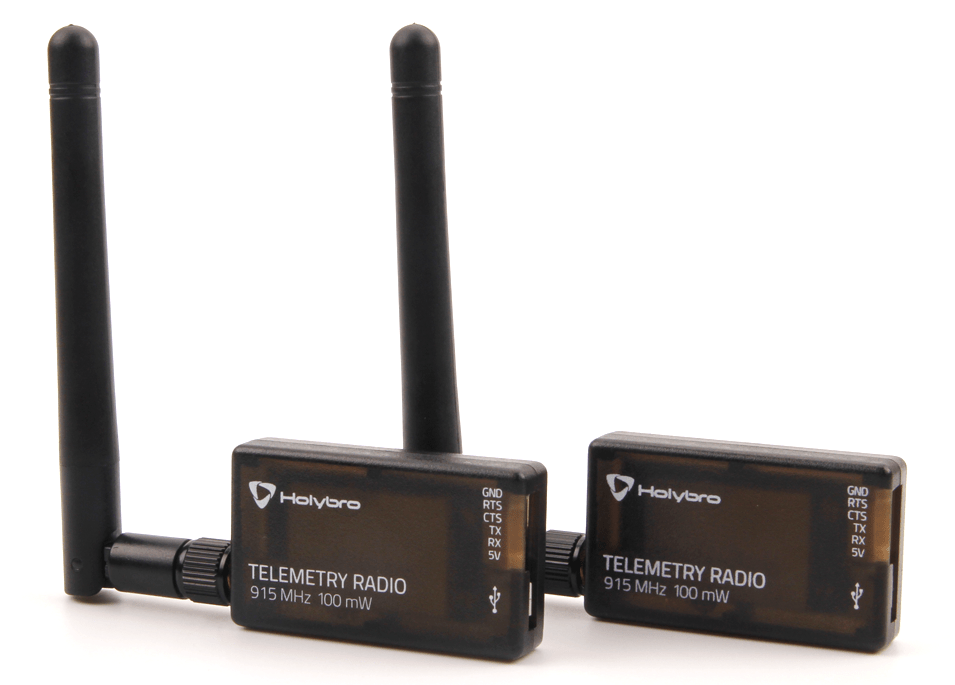

# HolyBro Телеметричне радіо

This Holybro [SiK](../telemetry/sik_radio.md) Telemetry Radio is a small, light and inexpensive open source "plug-and-play" radio platform to connect your Autopilot Flight Controller and Ground Station.

This radio is "plug-and-play" with all flight controllers running PX4 that have a JST-GH 6 Pin Connector TELEM port ([Pixhawk Connector Standard](https://github.com/pixhawk/Pixhawk-Standards)).
Це надає найлегший спосіб налаштування телеметрійного з'єднання між вашим контролером польоту та наземною станцією.
It uses open source firmware that has been specially designed to work well with MAVLink packets and to be integrated with the QGroundControl & PX4 Autopilot.

Вони, як правило, дозволяють межі краще, ніж 300 "поза коробкою" (діапазон можна поширити на кілька кілометрів із використанням патч-антени на землі).

Радіоприймач може бути 915 МГц (США), або 433 МГц з кроком (ЄС, Азія, Африка Океанія).
Зверніть увагу, що регіони, зазначені вище, є орієнтовними, і вам слід перевірити правила для вашої країни.

## Де купити

- [Holybro SiK Telemetry Radio V3](https://holybro.com/collections/telemetry-radios/products/sik-telemetry-radio-v3)

## Функції

- Відкрите програмне забезпечення SiK
- Plug-n-play для стандартного контролера польоту Pixhawk
- Найлегший спосіб підключити ваш автопілот та наземну станцію
- Можливість взаємозамінності радіо на повітрі та на землі
- Порт Micro-USB (кабель адаптера Type-C включено)
- 6-позиційний роз'єм JST-GH

## Специфікація

- Максимальна вихідна потужність 100 мВт (налаштовувана) -117 дБм чутливість прийому
- РП-SMA роз'єм
- Двосторонній повний дуплексний зв'язок через адаптивний інтерфейс TDM UART
- Прозоре послідовне посилання
- Формування протоколу MAVLink
- Частотно-перестроювана розподілена спектральна модуляція (FHSS) Налаштований цикл роботи
- Корекція помилок виправляє до 25% помилок бітів Відкрите програмне забезпечення SIK
- Configurable through Mission Planner & APM Planner
- FT230X USB на BASIC UART IC

## Стан індикатора світлодіодів

Радіоприймачі мають 2 індикатори стану, один червоний і один зелений.
Інтерпретація різних станів світлодіодів:

- Зелений світлодіод мигає - пошук іншого радіо
- Зелений світлодіод постійно горить - з'єднання встановлено з іншим радіо
- Червоний світлодіод мигає - передача даних
- Червоний світлодіод постійний - у режимі оновлення прошивки

## Підключення до Політного Контролера

Use the 6 pin JST-GH connector that come with the radio to connect the radio to your flight controller's `TELEM1` port (`TELEM2` can also be used but the default recommendation is `TELEM1`).

## Підключення до ПК або Наземної станції

Підключення радіо до вашого ПК з Windows або станції землі є настільки простим, як підключення кабелю USB мікро/типу-C (адаптер Type-C включений до радіо) до вашого ПК/станції землі.

The necessary drivers should be installed automatically and the radio will appear as a new “USB Serial Port” in the Windows Device Manager under Ports (COM & LPT).
Випадаючий список вибору порту COM планувальника місій також повинен містити той самий новий порт COM.

## Пакет включає

- Радіомодулі з антенами \*2
- Мікро-USB для USB-кабелю \*1
- Кабель-переходник Micro-USB на Micro-USB OTG \*1
- Адаптер Micro USB до Type C
- Кабель JST-GH-6P до кабелю JST-GH-6P \*1 (для Pixhawk Standard FC)
- JST-GH-6P до Molex DF12 6P (для Pix32, Pixhawk 2.4.6, тощо)

