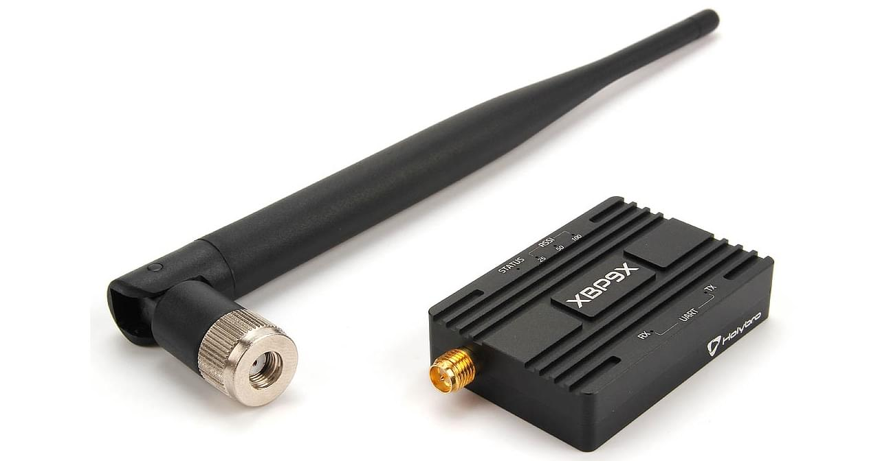

# Holybro XBP9X Телеметрійне радіо (Припинено)

Радіо Holybro XBP9X можна легко налаштувати за допомогою безкоштовного програмного забезпечення XCTU від Digi або через спрощені набори команд AT або API від Digi.
Радіо забезпечує безпеку, надійну доставку критичних даних між пристроями з 256-бітним шифруванням AES.

З лінійно-видимим радіодоступом RF до 65 миль/100 км та високою здатністю блокування втручань, радіостанції ідеально підходять для застосувань, які вимагають поєднання дальності, резервування даних та надійності даних.

**Features:**

- USB порт Type-C, інтегрований USB до конвертера UART
- 6-позиційний роз'єм JST-GH, може бути підключений безпосередньо до контролера польоту pixhawk4
- Високовольтний BEC на борту, Підтримка живлення напругою DC7~35V
- Може бути живлений через USB або контролер польоту в режимі передавача потужністю 100 мВт
- Індикатор світлодіода передачі UART
- Триетапний індикатор RSSI світлодіодом
- 256-бітне шифрування AES для безпечних даних
- Топологія мережі DigiMesh для забезпечення резерву та надійності
- Повністю сертифікований для використання в неліцензованому діапазоні 900 МГц

## Де купити

Припинено (більше недоступно в Holybro).

## Характеристики

