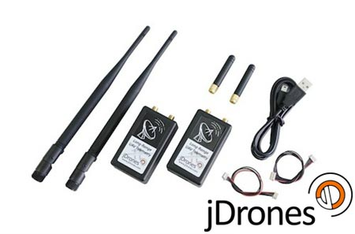

# Дальній телеметр RFD900

[RFDesign](https://rfdesign.com.au/) offers _long-range_ [SiK](../telemetry/sik_radio.md)-compatible telemetry radios.
Радіостанції забезпечують надійне підключення на відстанях більше 5 км звичайними антенами (і було повідомлено про досягнення набагато більших відстаней).

The raw modems expose bare pin headers, multiple vendors—along with _RFDesign_ themselves—offer productized versions.
Depending on your region and target deployment, several turn-key solutions and regional bundles are available:

- **Official RFDesign Store:**
  - [RFD900x Modem (915MHz - Americas/APAC)](https://store.rfdesign.com.au/rfd-900x-modem/)
  - [RFD868x Modem (868MHz - Europe)](https://store.rfdesign.com.au/rfd868x-eu-hs-8517-62-00-90/)

- **Productized Enclosures & Bundles:**
  - [Bask Aerospace AeroLink System](https://baskaerospace.com.au/products/aerolink/) (Rugged, weather-resistant base station and drone adapters)
  - [IR-Lock RFD900x TXMOD V2 Bundle](https://irlock.com/products/rfd900-txmod-bundle) (Complete ground-to-air transmitter kit)
