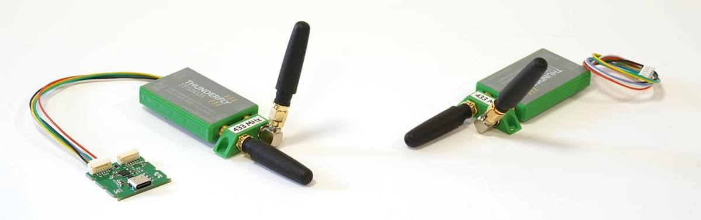

# TFSIK01 Telemetry Modem

The [TFSIK01](https://docs.thunderfly.cz/avionics/TFSIK01/) is a high-performance open-source telemetry modem developed by [ThunderFly](https://www.thunderfly.cz/).
It is designed to provide robust wireless communication between UAVs and ground stations.
Featuring dual antenna diversity, strong interference immunity, and compatibility with MAVLink framing, it is an ideal choice for demanding UAV and robotics applications.

The modem is plug-and-play with flight controllers using a JST-GH UART interface and is available pre-configured for the 433, 868, and 915 MHz bands, (other non-standard frequencies available on request).

## Де купити

- [TFSIK01A on Tindie](https://www.tindie.com/products/thunderfly/tfsik01-high-performance-uav-telemetry-modem/)
- Directly from [ThunderFly](https://www.thunderfly.cz/contact-us.html) ([sale@thunderfly.cz](mailto:sale@thunderfly.cz))

## Функції

- Відкрите програмне забезпечення SiK
- Dual antenna diversity with automatic switching
- Robust against interference and out-of-band signal jamming
- Frequency-Hopping Spread Spectrum (FHSS)
- Adaptive TDM, LBT, and AFA support
- MAVLink protocol support
- Up to 250 kbps air data rate
- Several kilometres of range
- Plug-n-play with Pixhawk-compatible flight controllers

## Специфікація

- Frequency: 433 MHz (default), 868 MHz, 915 MHz, or custom
- Power: up to 500 mW (27 dBm), adjustable (100mW default)
- Interface: JST-GH 6-pin UART (3.3V)
- Connectors: Dual MCX — snap-on connectors that reduce the risk of damage in case of crash impacts
- Weight: 18 g

## Стан індикатора світлодіодів

- **Green blinking** – searching for link
- **Green solid** – link established
- **Red flashing** – data transmission
- **Red solid** – firmware update mode
- **Orange** – indicates selected antenna for RX/TX

## Підключення до Політного Контролера

Connect to the `TELEM1` port of your flight controller using the included JST-GH cable.
Configuration may be required for alternative UART ports.

## Connecting to PC or Ground Station

Use the [TFUSBSERIAL01](https://docs.thunderfly.cz/avionics/TFUSBSERIAL01/) USB-C to UART adapter to connect the modem to your PC, tablet, or Raspberry Pi.

## Пакет включає

- 2× TFSIK01 Modems (with housing)
- 2× JST-GH serial cables
- 1× TFUSBSERIAL01 USB-C to UART converter
- 2× MCX Antenna kit (optional)

## Докладніше

For detailed specifications, configuration options, firmware updates, and advanced usage, visit the full [TFSIK01 documentation](https://docs.thunderfly.cz/avionics/TFSIK01/)
