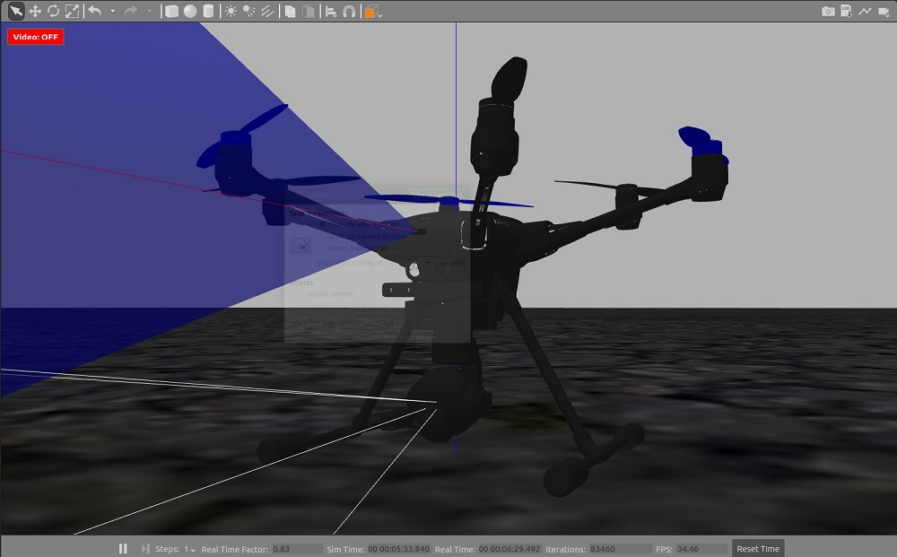
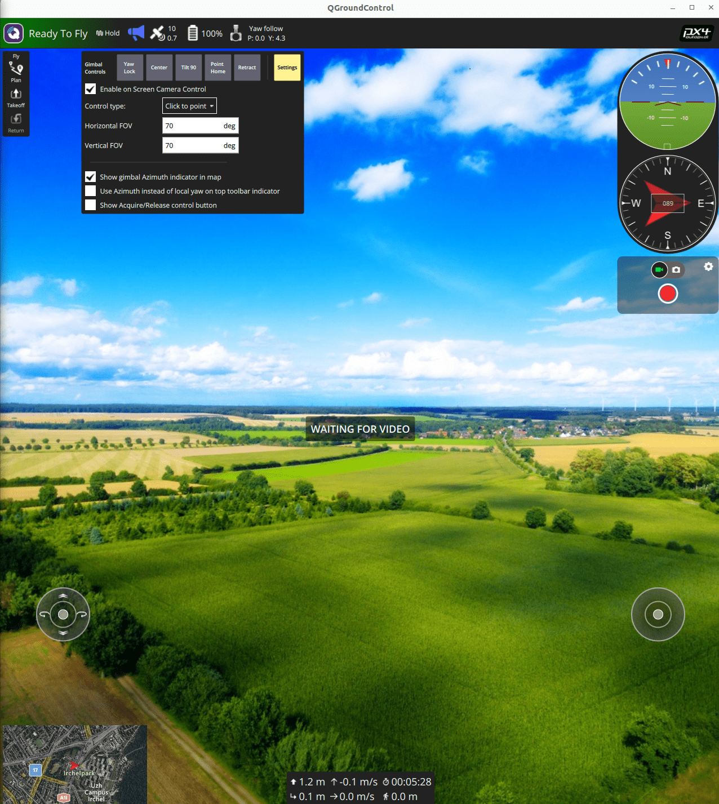

# 云台配置

本页面介绍了如何配置及控制一个安装了相机（或其他任务载荷）的云台。

## 综述

PX4 包含了一个通用的挂载设备/云台的控制驱动，它含有多种输入输出方式。

- 输入方式定义控制云台挂在的协议，该协议由 PX4 管理。
  该输入方式可能是一个遥控器，一个可以发送 MAVLink 的地面站，或者两者 — 两种可以自动切换。
- 输出方式定义了 PX4 如何与连接的云台通信。
  推荐的协议是 MAVLink v2, 但您也可以直接连接到飞控的 PWM 输出端口。

PX4 接收输入信号，并且将其路由/翻译后发送到输出。
任何输入方式都可以被选择来驱动任何输出。

输入和输出都使用参数进行配置。
The input is set using the parameter [MNT_MODE_IN](../advanced_config/parameter_reference.md#MNT_MODE_IN).
By default this is set to `Disabled (-1)` and the driver does not run.
在选择输入模式后，请重新启动飞行器以启动挂载驱动程序。

You should set `MNT_MODE_IN` to one of: `RC (1)`, `MAVlink gimbal protocol v2 (4)` or `Auto (0)` (the other options are deprecated).
If you select `Auto (0)`, the gimbal will automatically select either RC or or MAVLink input based on the latest input.
请注意，从 MAVLink 到 RC 的自动切换需要一个大幅度地杆量操作！

The output is set using the [MNT_MODE_OUT](../advanced_config/parameter_reference.md#MNT_MODE_OUT) parameter.
By default the output is set to a PXM port (`AUX (0)`).
If the [MAVLink Gimbal Protocol v2](https://mavlink.io/en/services/gimbal_v2.html) is supported by your gimbal, you should instead select `MAVLink gimbal protocol v2 (2)`.

The full list of parameters for setting up the mount driver can be found in [Parameter Reference > Mount](../advanced_config/parameter_reference.md#mount).
下面介绍了一些通用的云台相关设置。

## MAVLink 云台 (MNT_MODE_OUT=MAVLINK)

系统上的每个物理云台装置必须有自己的高级云台管理器， 地面站通过使用MAVLink云台协议发现它。
The ground station sends high level [MAVLink Gimbal Manager](https://mavlink.io/en/services/gimbal_v2.html#gimbal-manager-messages) commands to the manager of the gimbal it wants to control, and the manager will in turn send appropriate lower level "gimbal device" commands to control the gimbal.

PX4 can be configured as the gimbal manager to control a single gimbal device (which can either be physically connected or be a MAVLink gimbal that implements the [gimbal device interface](https://mavlink.io/en/services/gimbal_v2.html#gimbal-device-messages)).

To enable a MAVLink gimbal, first set parameter [MNT_MODE_IN](../advanced_config/parameter_reference.md#MNT_MODE_IN) to `MAVlink gimbal protocol v2` and [MNT_MODE_OUT](../advanced_config/parameter_reference.md#MNT_MODE_OUT) to `MAVLink gimbal protocol v2`.

The gimbal can be connected to _any free serial port_ using the instructions in [MAVLink Peripherals (GCS/OSD/Companion)](../peripherals/mavlink_peripherals.md) (also see [Serial Port Configuration](../peripherals/serial_configuration.md#serial-port-configuration)).
For example, if the `TELEM2` port on the flight controller is unused you can connect it to the gimbal and set the following PX4 parameters:

- [MAV_1_CONFIG](../advanced_config/parameter_reference.md#MAV_1_CONFIG) to **TELEM2** (if `MAV_1_CONFIG` is already used for a companion computer (say), use `MAV_2_CONFIG`).
- [MAV_1_MODE](../advanced_config/parameter_reference.md#MAV_1_MODE) to **Gimbal**
- [MAV_1_FLOW_CTRL](../advanced_config/parameter_reference.md#MAV_1_FLOW_CTRL) to **Off (0)** (very few gimbals will have RST/CST wires connected).
- [MAV_1_FORWARD](../advanced_config/parameter_reference.md#MAV_1_FORWARD) to **Enabled** (Note strictly necessary as forwarding is enabled when `MAV_1_MODE` is set to Gimbal).
- [SER_TEL2_BAUD](../advanced_config/parameter_reference.md#SER_TEL2_BAUD) to manufacturer recommended baud rate.

### 多云台支持

PX4 可以自动为已连接的 PWM 云台或第一个在任何接口上检测到相同的系统 id 的 MAVLink 云台设备创建一个云台管理器。
它不会自动为它检测到的其他MAVLink云台设备创建云台管理器。

You can support additional MAVLink gimbals provided that they:

- Implement the gimbal _manager_ protocol.
- 在 MAVLink 网络上对地面站和 PX4 可见。
  这可能需要在PX4、GCS和云台之间配置流量转接。
- Have a unique component id, and this component id must be in the range 7 - 255.

## 飞控 PWM 输出上的云台 (MNT_MODE_OUT=AUX)

The gimbal can also be controlled by connecting it to up to three flight controller PWM ports and setting the output mode to `MNT_MODE_OUT=AUX`.

The output pins that are used to control the gimbal are set in the [Acuator Configuration > Outputs](../config/actuators.md#actuator-outputs) by selecting any three unused Actuator Outputs and assigning them the following output functions:

- `Gimbal Roll`: Output controls gimbal roll.
- `Gimbal Pitch`: Output controls Gimbal pitch.
- `Gimbal Yaw`: Output controls Gimbal yaw.

例如，您可能有以下设置可将云台滚动、俯仰和偏航分配给 AUX1-3 输出。


The PWM values to use for the disarmed, maximum and minimum values can be determined in the same way as other servo, using the [Actuator Test sliders](../config/actuators.md#actuator-testing) to confirm that each slider moves the appropriate axis, and changing the values so that the gimbal is in the appropriate position at the disarmed, low and high position in the slider.
这些数值也可以在云台文档中提供。

## Gimbal Control in Missions

[Gimbal Manager commands](https://mavlink.io/en/services/gimbal_v2.html#gimbal-manager-messages) may be used in missions if supported by the vehicle type.
For example [MAV_CMD_DO_GIMBAL_MANAGER_PITCHYAW](https://mavlink.io/en/messages/common.html#MAV_CMD_DO_GIMBAL_MANAGER_PITCHYAW) is supported in [multicopter mission mode](../flight_modes_mc/mission.md).

In theory you can address commands to a particular gimbal, specifying its component id using the "Gimbal device id" parameter.
However at time of writing (December 2024) this is [not supported](https://github.com/PX4/PX4-Autopilot/blob/main/src/modules/gimbal/input_mavlink.cpp#L889): all mission commands are sent to the (only) gimbal managed by the PX4 gimbal manager (if this is a MAVLink gimbal, it will be the gimbal with component id defined in the parameter [MNT_MAV_COMPID](../advanced_config/parameter_reference.md#MNT_MAV_COMPID), which is set by default to [MAV_COMP_ID_GIMBAL (154)](https://mavlink.io/en/messages/common.html#MAV_COMP_ID_GIMBAL)).

Gimbal movement is not immediate.
To ensure that the gimbal has time to move into position before the mission progresses to the next item (if gimbal feedback is not provided or lost), you should set [MIS_COMMAND_TOUT](../advanced_config/parameter_reference.md#MIS_COMMAND_TOUT) to be greater than the time taken for the gimbal to traverse its full range.
After this timeout the mission will proceed to the next item.

## Simulation / SITL

The following simulation environments come with a preconfigured simulated gimbal.
You can test the gimbal using the [QGroundControl UI](#qgc-testing) or by sending [driver commands](#driver-testing)

:::tip
If you only need to test the [gimbal driver](../modules/modules_driver.md#gimbal), then you can do this on any model or simulators.
Just make sure that the driver runs, using `gimbal start` in the MAVLink console, then configure the driver parameters.
:::

### Gazebo

To run the [Gazebo](../sim_gazebo_gz/index.md) simulation [Quadrotor(x500) with gimbal (Front-facing) in Gazebo](../sim_gazebo_gz/vehicles.md#x500-quadrotor-with-gimbal-front-facing), use:

```sh
make px4_sitl gz_x500_gimbal
```


### Gazebo Classic

To run the [Gazebo Classic](../sim_gazebo_classic/index.md) simulation [Typhoon H480 model](../sim_gazebo_classic/vehicles.md#typhoon-h480-hexrotor), use:

```sh
make px4_sitl gazebo-classic_typhoon_h480
```




## 测试

### QGC Testing

The on-screen gimbal control can be used to move/test a connected MAVLink camera:

1. Start your preferred [simulator](#simulation-sitl) or connect to a real device.

2. Open QGroundControl and enable the on-screen camera control (Application settings).

  

3. Make sure the vehicle is armed and flying, e.g. by entering with `commander takeoff`.

4. To change gimbal target position, click in the QGC GUI up, down, left, right, or use the buttons on the gimbal control (**Center**, **Tilt 90**, **Yaw lock**).

### Driver Testing

You can test a gimbal by sending `gimbal` driver commands in the [QGroundControl MAVLink Console](https://docs.qgroundcontrol.com/master/en/qgc-user-guide/analyze_view/mavlink_console.html):

1. Start your preferred [simulator](#simulation-sitl) or connect to a real device.
2. Open QGroundControl and connect to your vehicle.
3. Open the MAVLink Console using the menu: **Analyze > Mavlink Console**.
4. Make sure the vehicle is armed and flying, e.g. by entering the command: `commander takeoff`.

To check gimbal status enter:

```sh
gimbal status
```

To set the gimbal yaw to 30 degrees, use the command:

```sh
gimbal test yaw 30
```

More generally, you can set the angle or angular rate command using a command with this format:

```sh
gimbal test <axis> <value>
```

- `axis`:
  - `<roll|pitch|yaw>` for angles
  - `<rollrate|pitchrate|yawrate>` for angular rates
- `value`:
  - `<degrees>` for angles
  - `<degrees / second>` for angular rates

To set the MAVLink component that is in primary control of the gimbal:

```sh
gimbal primary-control <sys_id> <comp_id>
```

- `sys_id`: MAVLink system ID
- `comp_id`: MAVLink component ID

For other commands, see the [`gimbal`](../modules/modules_driver.md#gimbal) driver module document.

### MAVLink Testing

The gimbal can be tested by sending MAVLink gimbal manager commands using [MAVSDK](../robotics/mavsdk.md) or some other MAVLink library.

Note that the simulated gimbal stabilizes itself, so if you send MAVLink commands, set the `stabilize` flags to `false`.
