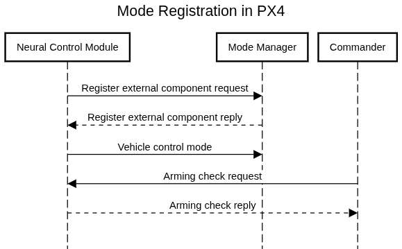

# Neural Network Module: System Integration

The neural control module ([mc_nn_control](../modules/modules_controller.md#mc-nn-control)) implements an end-to-end controller utilizing neural networks.

The parts of the module directly concerned with generating the code for the trained neural network and integrating it into the module are covered in [TensorFlow Lite Micro (TFLM)](../advanced/tflm.md).
This page covers the changes that were made to integrate the module into PX4, both within the module, and in larger system configuration.

:::tip
This topic should help you to shape the module to your own needs.

You will need some familiarity with PX4 development.
For more information see the developer [Getting Started](../dev_setup/getting_started.md).
:::

## Autostart

A line to autostart the [mc_nn_control](../modules/modules_controller.md#mc-nn-control) module has been added in the [`ROMFS/px4fmu_common/init.d/rc.mc_apps`](https://github.com/PX4/PX4-Autopilot/blob/main/ROMFS/px4fmu_common/init.d/rc.mc_apps) startup script.

It checks whether the module is included by looking for the parameter [MC_NN_EN](../advanced_config/parameter_reference.md#MC_NN_EN).
If this is set to `1` (the default value), the module will be started when booting PX4.
Similarly you could create other parameters in the [`mc_nn_control_params.c`](https://github.com/PX4/PX4-Autopilot/blob/main/src/modules/mc_nn_control/mc_nn_control_params.c) file for other startup script checks.

## Custom Flight Mode

The module creates its own flight mode "Neural Control" which lets you choose it from the flight mode menu in QGC and bind it to a switch on you RC controller.
This is done by using the [ROS 2 Interface Library](../ros2/px4_ros2_interface_lib.md) internally.
This involves several steps and is visualized here:

:::info
The module does not actually use ROS 2, it just uses the API exposed through uORB topics.
:::

:::info
In some QGC versions the flight mode does not show up, so make sure to update to the newest version.
This only works for some flight controllers, so you might have to use an RC controller to switch to the correct external flight mode.
:::



1. Publish a [RegisterExtComponentRequest](../msg_docs/RegisterExtComponentRequest.md).
   This specifies what you want to create, you can read more about this in the [Control Interface](../ros2/px4_ros2_control_interface.md).
   In this case we register an arming check and a mode.
2. Wait for a [RegisterExtComponentReply](../msg_docs/RegisterExtComponentReply.md).
   This will give feedback on wether the mode registration was successful, and what the mode and arming check id is for the new mode.
3. [Optional] With the mode id, publish a [VehicleControlMode](../msg_docs/VehicleControlMode.md) message on the `config_control_setpoints` topic.
   Here you can configure what other modules run in parallel.
   The example controller replaces everything, so it turns off allocation.
   If you want to replace other parts you can enable or disable the modules accordingly.
4. [Optional] With the mode id, publish a [ConfigOverrides](../msg_docs/ConfigOverrides.md) on the `config_overrides_request` topic.
   (This is not done in the example module) This will let you defer failsafes or stop it from automatically disarming.
5. When the mode has been registered a [ArmingCheckRequest](../msg_docs/ArmingCheckRequest.md) will be sent, asking if your mode has everything it needs to run.
   This message must be answered with a [ArmingCheckReply](../msg_docs/ArmingCheckReply.md) so the mode is not flagged as unresponsive.
   In this response it is possible to set what requirements the mode needs to run, like local position.
   If any of these requirements are set the commander will stop you from switching to the mode if they are not fulfilled.
   It is also important to set health_component_index and num_events to 0 to not get a segmentation fault.
   Unless you have a health component or events.
6. Listen to the [VehicleStatus](../msg_docs/VehicleStatus.md) topic.
   If the nav_state equals the assigned `mode_id`, then the Neural Controller is activated.
7. When active the module will run the controller and publish to [ActuatorMotors](../msg_docs/ActuatorMotors.md).
   If you want to replace a different part of the controller, you should find the appropriate topic to publish to.

To see how the requests are handled you can check out [src/modules/commander/ModeManagement.cpp](https://github.com/PX4/PX4-Autopilot/blob/main/src/modules/commander/ModeManagement.cpp).

## 日志

To add module-specific logging a new topic has been added to [uORB](../middleware/uorb.md) called [NeuralControl](../msg_docs/NeuralControl.md).
The message definition is also added in `msg/CMakeLists.txt`, and to [`src/modules/logger/logged_topics.cpp`](https://github.com/PX4/PX4-Autopilot/blob/main/src/modules/logger/logged_topics.cpp) under the debug category.
For these messages to be saved in your logs you need to include `debug` in the [SDLOG_PROFILE](../advanced_config/parameter_reference.md#SDLOG_PROFILE) parameter.

## Timing

The module has two includes for measuring the inference times.
The first one is a driver that works on the actual flight controller units, but a second one, `chrono`, is loaded for SITL testing.
Which timing library is included and used is based on wether PX4 is built with NUTTX or not.

## Changing the setpoint

The module uses the [TrajectorySetpoint](../msg_docs/TrajectorySetpoint.md) message’s position fields to define its target.
To follow a trajectory, you can send updated setpoints.
For an example of how to do this in a PX4 module, see the [mc_nn_testing](https://github.com/SindreMHegre/PX4-Autopilot-public/tree/main/src/modules/mc_nn_testing) module in this fork.
Note that this is not included in upstream PX4.
To use it, copy the module folder from the linked repository into your workspace, and enable it by adding the following line to your `.px4board` file:

```sh
CONFIG_MODULES_MC_NN_TESTING=y
```
