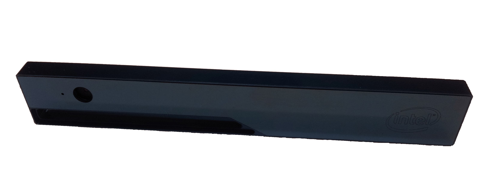

# 在 Ubuntu 上安装英特尔 RealSense R200 的驱动程序

本教程旨在提供有关如何在 linux 环境中安装英特尔 RealSense R200 相机头的相机驱动程序的说明，以便可以通过机器人操作系统 ( ROS ) 访问收集到的图像。
RealSense R200 相机头如下图所示:



驱动程序包的安装是在 Virtual Box 中作为虚拟机运行的 Ubuntu 操作系统 (OS) 上执行的。
运行 Virtual Box 的宿主机、虚拟机的规格如下:

- 主机操作系统：Windows 8
- 处理器：Intel(R) Core(TM) i7-4702MQ CPU @ 2.20GHz
- Virtual Box：Oracle VM。 版本 5.0.14 r105127
- 扩展：安装了 Virtual Box 的扩展包（用于 USB3.0 支持）
- 客户机操作系统：Linux - Ubuntu 14.04.3 LTS

本教程按以下方式排序: 在第一部分中, 演示如何在 Virtual Box 中安装 Ubuntu 14.04 作为客户机系统。 第二部分会演示如何安装 ROS Indigo 和相机驱动程序。 常用短语解释如下：

- Virtual Box（VB）：运行不同虚拟机的程序。 此处使用 Oracle 虚拟机。
- Virtual Machine（VM）：作为访客系统在虚拟框中运行的操作系统。 此处使用 Ubuntu。

## 在 Virtual Box 中安装 Ubuntu 14.04.3 LTS

- 创建一个新的虚拟机 (VM): Linux 64-Bit.
- Download the iso file of Ubuntu 14.04.3 LTS: ([ubuntu-14.04.3-desktop-amd64.iso](https://ubuntu.com/download/desktop)).
- Ubuntu 的安装:
  - 在安装过程中，保留以下两项:
    - 安装时下载更新
    - 安装此第三方软件
- 安装完成后，您可能需要启用 Virtual Box 在整个桌面上显示 Ubuntu：
  - Start VM Ubuntu and login, Click on **Devices->Insert Guest Additions CD image** in the menu bar of the Virtual Box.
  - Click on **Run** and enter password on the windows that pop up in Ubuntu.
  - 等待安装完成，然后重新启动。
    现在，应该可以在整个桌面上显示 VM。
  - 如果 ubuntu 中弹出一个窗口, 询问是否更新, 请在此时拒绝更新。
- 在 Virtual Box 中启用 USB 3 控制器:
  - 关闭虚拟机。
  - 转到 "虚拟机" 的设置到菜单选择 USB，然后选择: "USB 3.0(xHCI)"。
    只有在安装了虚拟框的扩展包时, 才有可能执行此操作。
  - 再次启动虚拟机。

## 安装 ROS Indigo

- Follow instructions given at [ROS indigo installation guide](http://wiki.ros.org/indigo/Installation/Ubuntu):
  - 安装桌面完整版。
  - 执行 "初始化 rosdep" 和 "环境设置" 部分中描述的步骤。

## 安装摄像头驱动

- 安装 Git

  ```sh
  sudo apt-get install git
  ```

- 下载并安装驱动:

  - Clone [RealSense_ROS repository](https://github.com/bestmodule/RealSense_ROS):

    ```sh
    git clone https://github.com/bestmodule/RealSense_ROS.git
    ```

- Follow instructions given in [here](https://github.com/bestmodule/RealSense_ROS/tree/master/r200_install).

  - 无论要不要安装如下包都敲击回车：

    ```sh
    Intel Low Power Subsystem support in ACPI mode (MFD_INTEL_LPSS_ACPI) [N/m/y/?] (NEW)
    ```

    ```sh
    Intel Low Power Subsystem support in PCI mode (MFD_INTEL_LPSS_PCI) [N/m/y/?] (NEW)
    ```

    ```sh
    Dell Airplane Mode Switch driver (DELL_RBTN) [N/m/y/?] (NEW)
    ```

  - 进程安装结束时如下错误信息会出现，但不应该导致驱动故障：

    ```sh
    rmmod: ERROR: Module uvcvideo is not currently loaded
    ```

- 安装结束后，重启虚拟机。

- 测试摄像头驱动：

  - 使用 USB 线缆，一头连接电脑的 USB3 接口，另一端连接　Intel RealSense 相机。
  - Click on Devices->USB-> Intel Corp Intel RealSense 3D Camera R200 in the menu bar of the Virtual Box, in order to forward the camera USB connection to the Virtual Machine.
  - 执行文件 [unpacked folder]/bin/dsreadcamerainfo：

    - 如果出现以下错误消息，请拔下相机 (从计算机物理上拔下 usb 电缆)。 Plug it in again + Click on Devices->USB-> Intel Corp Intel RealSense 3D Camera R200 in the menu bar of the Virtual Box again and execute again the file [unpacked folder]/Bin/DSReadCameraInfo.

      ```sh
      DSAPI call failed at ReadCameraInfo.cpp:134!
      ```

    - 如果相机驱动程序工作正常并识别 Intel RealSense R200，您应该看到有关 Intel RealSense R200 相机头的特定信息。

- ROS 节点的安装和测试：
  - Follow the installation instructions in the "Installation" section given [here](https://github.com/bestmodule/RealSense_ROS/blob/master/realsense_dist/2.3/doc/RealSense-ROS-R200-nodelet.md), to install the ROS nodlet.
  - Follow the instructions in the "Running the R200 nodelet" section given [here](https://github.com/bestmodule/RealSense_ROS/blob/master/realsense_dist/2.3/doc/RealSense-ROS-R200-nodelet.md), to test the ROS nodlet together with the Intel RealSense R200 camera head.
    - 如果一切正常，Intel RealSense R200 相机中的不同数据流将作为 ROS 主题发布。
