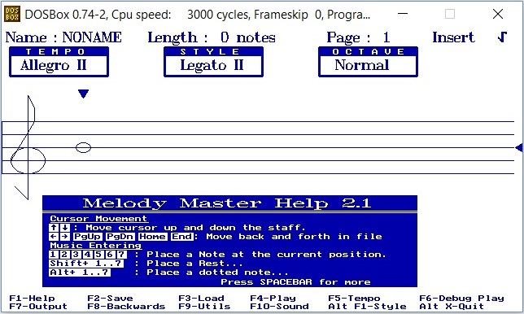
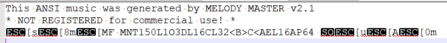

# 系统通知提示音

PX4 defines a number of [standard tones/tunes](../getting_started/tunes.md) that are used to provide audio notification for important system states and problems (e.g. system startup, arming success, battery warnings, etc.)

Tunes are specified using strings (in [ANSI Music notation](http://artscene.textfiles.com/ansimusic/information/ansimtech.txt)) and played by code using the [tunes](https://github.com/PX4/PX4-Autopilot/tree/main/src/lib/tunes) library.
The tunes library also contains the list of default system tunes - see [lib/tunes/tune_definition.desc](https://github.com/PX4/PX4-Autopilot/blob/main/src/lib/tunes/tune_definition.desc).

PX4 还有一个模块可以用于播放（测试）默认或用户自定义音乐。

本主题提供了如何创建您自己的声音并添加/替换系统通知音调/乐曲的通用指导。

## 创建乐曲

Tune strings are defined using [ANSI Music notation](http://artscene.textfiles.com/ansimusic/information/ansimtech.txt).

:::tip
More information about the format can be found in [QBasic PLAY statement](https://en.wikibooks.org/wiki/QBasic/Appendix#PLAY) (Wikibooks) and has been reproduced in [tune_definition.desc](https://github.com/PX4/PX4-Autopilot/blob/main/src/lib/tunes/tune_definition.desc).
:::

创建新调节的最简单方式是使用音乐编辑器。
这允许您编辑音乐并在您的电脑上播放， 然后导出为 PX4 可以播放的格式。

ANSI 音乐在 ANSI BBS 系统中很受欢迎，因此最好的编辑工具是 DOS 实用程序。
On Windows, one option is to use _Melody Master_ within _Dosbox_.

使用软件的步骤是：

1. Download [DosBox](http://www.dosbox.com/) and install the app

2. Download [Melody Master](ftp://archives.thebbs.org/ansi_utilities/melody21.zip) and unzip into a new directory

3. Open the _Dosbox_ console

4. 将 Melody 主目录挂载到 DosBox，如下：

   ```sh
   mount c C:\<path_to_directory\Melody21
   ```

5. Start _Melody Master_ with the following commands

   ```sh
   c:
   start
   ```

6. You will then have the option to click through a few screens, then press **1** to display _Melody Master_:
   

   屏幕的下半部分提供了关于键盘快捷键的实用工具（箭头用于移动， 和选择笔记长度的数字等）。

7. 当您准备好时保存音乐：
   - Press **F2** to give the tune a name and save it in the _/Music_ sub folder of your Melody Master installation.
   - Press **F7**, the scroll down the list of output formats on the right to get to ANSI.
      The file will be exported to the _root_ of the Melody Master directory (with the same name and a file-type specific extension).

8. 打开文件。
   输出可能看起来像这样：

   

9. The string that can be played in PX4 is the bit between `MNT` and `P64`: `150L1O3DL16CL32<B>C<AEL16A`

## 测试乐曲

When you're ready to try it out a new tune on PX4, use the [tune_control](../modules/modules_system.md#tune-control) library.
For example, to test the tune we "created" above you would enter the following command on a console or shell (e.g. the [MAVLink Shell](../debug/mavlink_shell.md)):

```sh
tune_control play -m "150L1O3DL16CL32<B>C<AEL16A"
```

:::info
Out of the box, the `tune_control` is only present on real hardware (not the simulator).
:::

## 正在替换已存在的乐曲

Tunes are defined within [tune_definition.desc](https://github.com/PX4/PX4-Autopilot/blob/main/src/lib/tunes/tune_definition.desc).

If you just need to replace an existing tune, then you can replace the file in your own fork, and update the tune strings defined in `PX4_DEFINE_TUNE`.

## 添加新乐曲

待开发

<!--

1. Assumption is that you need to define a new `PX4_DEFINE_TUNE` with its own number in the file.
2. Need to look at how tunes are played. Problem for another day.

-->
