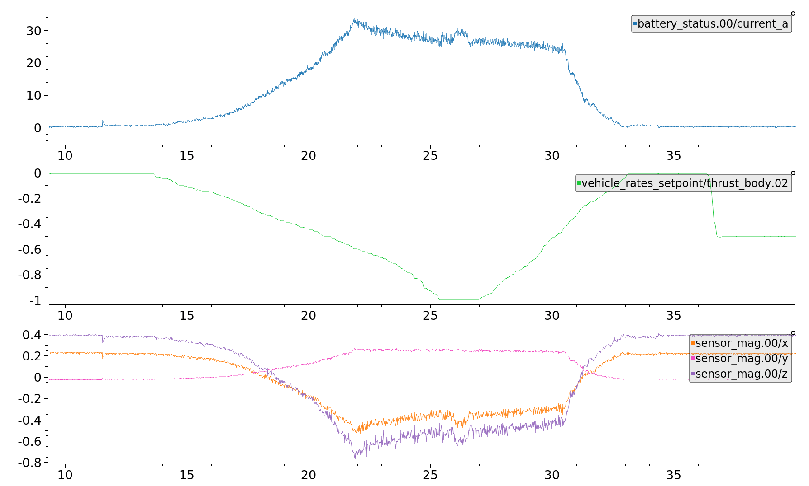
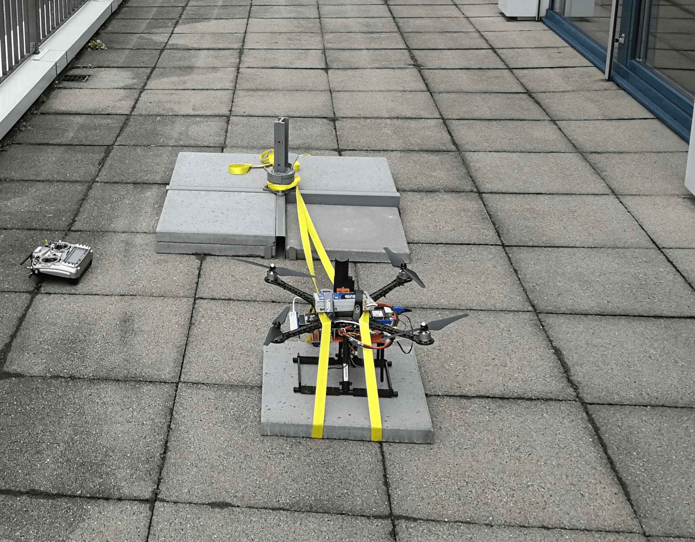
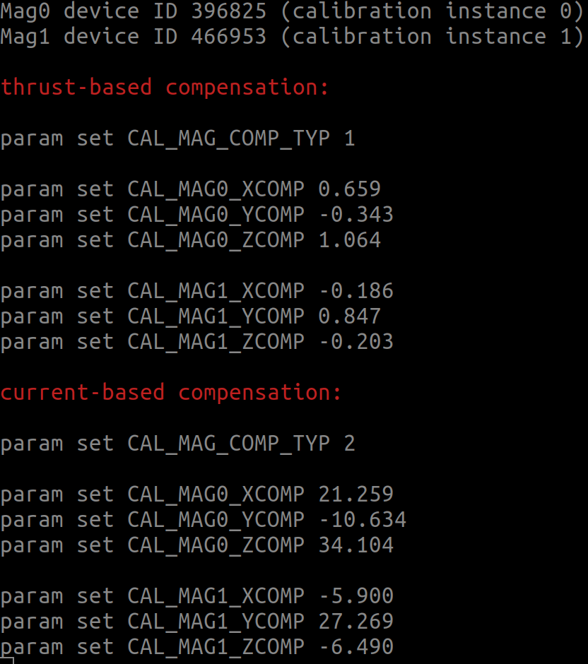

# 指南针动力补偿

罗盘（磁力计）应该安装在尽可能远离通过大电流的线缆的位置，因为大电流诱发的磁场会干扰罗盘的读数。

本文解释了如何在不能改变磁航向计安装位置的情况下如何补偿诱发磁场带来的影响。

:::tip
Moving the compass away from power-carrying cables is the easiest and most effective way to fix this issue, because the strength of the magnetic fields decreases quadratically with the distance from the cable.
:::

:::info
The process is demonstrated for a multicopter, but is equally valid for other vehicle types.
:::

<a id="when"></a>

## 本节补偿方法可用的前提

只有当下述的全部条件都满足时才建议采用功率补偿：

1. 磁航向计无法远离动力线缆。

2. There is a strong correlation between the compass readings and the thrust setpoint, and/or the battery current.

   

3. 无人机的线缆都是固定的或不会移动的（当通电的线缆能够移动会导致计算出的补偿参数失效）。

<a id="how"></a>

## 如何实现罗盘补偿

1. 确保无人机运行在支持电源补偿的固件版本上（当前的Master版，或v1.11.0之后的版本）。

2. Perform the [standard compass calibration](../config/compass.md#compass-calibration).

3. Set the parameter [SDLOG_MODE](../advanced_config/parameter_reference.md#SDLOG_MODE) to 2 to enable logging of data from boot.

4. Set the parameter [SDLOG_PROFILE](../advanced_config/parameter_reference.md#SDLOG_PROFILE) checkbox for _Sensor comparison_ (bit 6) to get more data points.

5. 固定好无人机使其无法移动，然后装好螺旋桨（这样电机可以获得与实际飞行中同样大的电流）。
   本例中用带子固定了无人机。

   

6. Power the vehicle and switch into [ACRO flight mode](../flight_modes_mc/acro.md) (using this mode ensures the vehicle won't attempt to compensate for movement resulting from the straps).

   - 解锁无人机，然后缓缓将油门推到最大。
   - 慢慢将油门降到0
   - 给无人机加锁
      &#062; <strong x-id="1">Note</strong> 谨慎地进行测试，并密切注意振动情况。

   ::: info
   Perform the test carefully and closely monitor the vibrations.

:::

7. Retrieve the ulog and use the python script [mag_compensation.py](https://github.com/PX4/PX4-Autopilot/blob/main/src/modules/sensors/vehicle_magnetometer/mag_compensation/python/mag_compensation.py) to identify the compensation parameters.

   ```sh
   python mag_compensation.py ~/path/to/log/logfile.ulg <type> [--instance <number>]
   ```

   where:

   - `<type>`: `current` or `thrust` (power signal used for compensation)
   - `--instance <number>` (optional): The number is `0` (default) or `1`, the instance of the current or thrust signal to use.

   ::: info
   If your log does not contain battery current measurements, you will need to comment out the respective lines in the Python script, such that it does the calculation for thrust only.

:::

8. 这个脚本将返回基于推力和基于电流的补偿参数，并打印输出到控制台。
   脚本弹出的数值显示了每个罗盘匹配的程度，以及使用了建议的补偿值后数据将是什么样的。
   如果有电流测数，那么依据电流补偿通常可以获得更好的结果。这里是一个日志的例子，电流匹配得很好，然而因为不是线性关系推力参数则完全不可用。

   

9. Once the parameters are identified, the power compensation must be enabled by setting [CAL_MAG_COMP_TYP](../advanced_config/parameter_reference.md#CAL_MAG_COMP_TYP) to 1 (when using thrust parameters) or 2 (when using current parameters).
   此外，还要设置好每个罗盘每个轴的补偿参数值。

   
