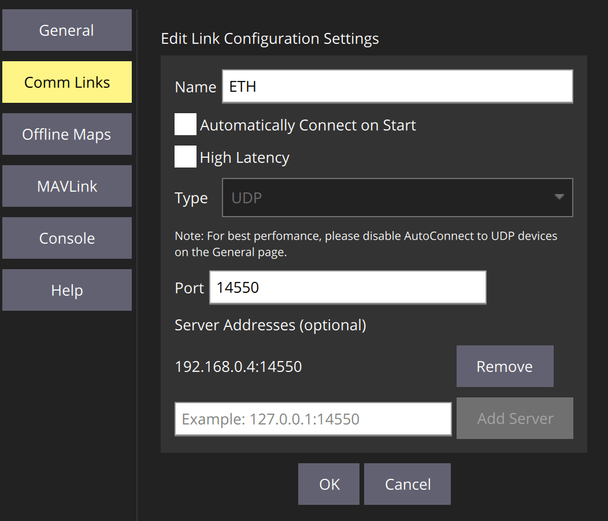

# PX4以太网配置

以太网连接提供了一种快速、可靠和灵活的通信选择，可替代使用USB或其他串行连接。

它可以用于连接地面站、机载计算机和其他MAVLink系统。
特别建议使用它连接到"原生"使用以太网的系统——例如IP数传。

本主题涵盖:

- [PX4 Ethernet Setup](#px4-ethernet-setup)
  - [Supported Flight Controllers](#supported-flight-controllers)
  - [Setting up the Ethernet Network](#setting-up-the-ethernet-network)
    - [PX4 Ethernet Network Setup](#px4-ethernet-network-setup)
    - [Ubuntu Ethernet Network Setup](#ubuntu-ethernet-network-setup)
    - [Companion Computer Ethernet Network Setup](#companion-computer-ethernet-network-setup)
  - [PX4 MAVLink Serial Port Configuration](#px4-mavlink-serial-port-configuration)
  - [QGroundControl Setup Example](#qgroundcontrol-setup-example)
  - [MAVSDK-Python Setup Example](#mavsdk-python-setup-example)
  - [ROS 2 Setup Example](#ros-2-setup-example)

## 支持的飞行控制器

PX4 supports Ethernet connectivity on [Pixhawk 5X-standard](https://github.com/pixhawk/Pixhawk-Standards/blob/master/DS-011%20Pixhawk%20Autopilot%20v5X%20Standard.pdf) flight controllers (and later) that have an Ethernet port.
可能也支持其他板子。

支持的飞行控制器包括:

- [CUAV Pixhawk V6X](../flight_controller/cuav_pixhawk_v6x.md)
- [Holybro Pixhawk 5X](../flight_controller/pixhawk5x.md)
- [Holybro Pixhawk 6X](../flight_controller/pixhawk6x.md)
- [RaccoonLab FMUv6X Autopilot](../flight_controller/raccoonlab_fmu6x.md)

## 设置以太网网络

要通过以太网连接系统，您需要将它们连接到同一个网络，以便每个系统有一个唯一的IP地址并且可以找到其他系统。
可以使用DHCP服务器来分配地址，或者通过手动配置网络上每个系统的地址来完成。

我们不能提供一个确保可以在您的本地网络中工作的“开箱即用配置”。
Therefore as an example of the kind of configuration you might do, below we show how to set up the systems on an IP network with static addresses in the range `10.41.10.Xxx`, where PX4 has a statically allocated address `10.41.10.2` (PX4-default) and the computer has address `10.41.10.1`.
如果您想要连接一台机载计算机或其他系统到网络上，您可以使用类似的方法来分配一个静态地址。

:::info
There is nothing "special" about the network configuration (other than perhaps the tools used to modify the network settings); it works much the same as any home or business network.
这就是说，了解IP网络如何工作是非常有利的！
:::

### PX4以太网网络设置

<!-- Information about NuttX network manager: https://github.com/PX4/PX4-Autopilot/pull/16330 -->

PX4 uses the [netman](../modules/modules_system.md#netman) module to apply and update network settings.

The default configuration first requests an IP address from DHCP, and if that fails will fallback to the default static address `10.41.10.2`.
您可以显式设置任何静态 IP 地址（包括默认地址）来绕过初始的 DHCP，使连接速度稍快。

:::info
If you want to use the default static IP address for PX4 you can skip forward to the next section.
:::

Network settings are defined in the configuration file `/fs/microsd/net.cfg` on the SD card.
This is a text file, that defines each setting on a new line as a `name=value` pair.
配置文件看起来像这样：

```ini
DEVICE=eth0
BOOTPROTO=fallback
IPADDR=10.41.10.2
NETMASK=255.255.255.0
ROUTER=10.41.10.254
DNS=10.41.10.254
```

值为：

- `DEVICE`: Interface name. Default is `eth0`.
- `BOOTPROTO`: Protocol for getting PX4 IP address. Valid values for proto are: `dhcp`, `static`, `fallback` (use DHCP but fall back to static address after time, if that fails)
- `IPADDR`: Static IP address (used if BOOTPROTO is `static` or `fallback`)
- `NETMASK`: Network mask
- `ROUTER`: The address of the default route.
- `DNS`: The address of the DNS server.

To set the above "example" configuration using the _QGroundControl_:

1. 将飞行控制器通过USB线连接到计算机。

2. Open **QGroundcontrol > Analyze Tools > MAVLink Console**

3. Enter commands "like" the ones below into the _MAVLink Console_ (to write the values to the configuration file):

  ```sh
  echo DEVICE=eth0 > /fs/microsd/net.cfg
  echo BOOTPROTO=fallback >> /fs/microsd/net.cfg
  echo IPADDR=10.41.10.2 >> /fs/microsd/net.cfg
  echo NETMASK=255.255.255.0 >>/fs/microsd/net.cfg
  echo ROUTER=10.41.10.254 >>/fs/microsd/net.cfg
  echo DNS=10.41.10.254 >>/fs/microsd/net.cfg
  ```

4. 一旦设置了网络配置，您可以断开 USB 电缆。

5. 重启飞行控制器以应用设置。

请注意，上述设置为飞行控制器在以太网网络上分配了一个地址。
You also need to [configure the Ethernet port](#px4-mavlink-serial-port-configuration) to use MAVLink.

### Ubuntu以太网网络设置

If you're using Ubuntu for your ground station (or companion computer) then you can use [netplan](https://netplan.io/) to configure the network.

Below we show how you write a setup to the netplan configuration file "`/etc/netplan/01-network-manager-all.yaml`", which would run on the same network as used by the PX4 setup above.
Note that there are many more [examples](https://netplan.io/examples/) and instructions in the [netplan](https://netplan.io/) documentation.

设置Ubuntu计算机：

1. In a terminal, create and open a `netplan` configuration file: `/etc/netplan/01-network-manager-all.yaml`
  Below we do this using the _nano_ text editor.

  ```
  sudo nano /etc/netplan/01-network-manager-all.yaml
  ```

2. 将以下配置信息复制并粘贴到文件中（注意：缩进很重要！）:

  ```
  network:
    version: 2
    renderer: NetworkManager
    ethernets:
        enp2s0:
            addresses:
                - 10.41.10.1/24
            nameservers:
                addresses: [10.41.10.1]
            routes:
                - to: 10.41.10.1
                  via: 10.41.10.1
  ```

  保存并退出编辑器。

3. Apply the _netplan_ configuration by entering the following command into the Ubuntu terminal.

  ```
  sudo netplan apply
  ```

### 机载计算机以太网网络设置

机载计算机的设置将取决于它的操作系统。

A Linux operating system may support `netplan`, in which case the instructions would be the same as above, but using a unique IP address.

## PX4 MAVLink 串口配置

The Ethernet port configuration sets the properties of the _serial link_ (which is how PX4 views the Ethernet connection).
这包括被发送的 MAVLink 消息集合、数据传输速率、远程系统可以连接并监听的 UDP 端口等。

:::info
You must separately configure the PX4 IP address and other _network settings_ ([as shown previously](#px4-ethernet-network-setup)).
:::

PX4配置串行端口以通过MAVLink连接到地面站，使用下面的参数:

| 参数                                                                                                                                            | 值      | 描述                             |
| --------------------------------------------------------------------------------------------------------------------------------------------- | ------ | ------------------------------ |
| [MAV_2_CONFIG](../advanced_config/parameter_reference.md#MAV_2_CONFIG)                              | 1000   | 配置以太网端口                        |
| [MAV_2_BROADCAST](../advanced_config/parameter_reference.md#MAV_2_BROADCAST)                        | 1      | Broadcast `HEARTBEAT` messages |
| [MAV_2_MODE](../advanced_config/parameter_reference.md#MAV_2_MODE)                                  | 0      | 发送“正常”的 MAVLink 消息集合（即地面站消息集合） |
| [MAV_2_RADIO_CTL](../advanced_config/parameter_reference.md#MAV_2_RADIO_CTL)   | 0      | 禁用MAVLink流量控制                  |
| [MAV_2_RATE](../advanced_config/parameter_reference.md#MAV_2_RATE)                                  | 100000 | 最大发送速率                         |
| [MAV_2_REMOTE_PRT](../advanced_config/parameter_reference.md#MAV_2_REMOTE_PRT) | 14550  | MAVLink远程端口14550（地面站）          |
| [MAV_2_UDP_PRT](../advanced_config/parameter_reference.md#MAV_2_UDP_PRT)       | 14550  | MAVLink网络端口14550（地面站）          |

Normally a companion computer would use port `14540` (rather than `14550`) and stream the set of MAVLink messages specified in the `Onboard` profile.
You can configure this setup by changing [MAV_2_REMOTE_PRT](../advanced_config/parameter_reference.md#MAV_2_REMOTE_PRT) and [MAV_2_UDP_PRT](../advanced_config/parameter_reference.md#MAV_2_UDP_PRT) to `14540` and [MAV_2_MODE](../advanced_config/parameter_reference.md#MAV_2_MODE) to `2` (Onboard).
请注意，这仍将使用GCS配置文件正常工作。

For more information on MAVLink serial port configuration see [MAVLink Peripherals (GCS/OSD/Companion)](../peripherals/mavlink_peripherals.md)

## QGroundControl 设置示例

Assuming you have already [Set up the Ethernet Network](#setting-up-the-ethernet-network) so your ground station computer and PX4 run on the same network, and

要将 QGroundControl 通过以太网连接到 PX4 ：

1. [Set up the Ethernet Network](#setting-up-the-ethernet-network) so your ground station computer and PX4 run on the same network.

2. 使用网线连接地面站计算机和PX4。

3. Start QGroundControl and [define a comm link](https://docs.qgroundcontrol.com/master/en/qgc-user-guide/settings_view/settings_view.html) (**Application Settings > Comm Links**) specifying the _server address_ and port as the IP address and port assigned in PX4, respectively.

  假设值已按本主题其余部分所述设置，设置将如下所示：

  

4. 如果你选择这个链接，QGroundControl 应该会连接。

:::info
[PX4 Ethernet Port Configuration](#px4-ethernet-network-setup) should not be needed (the default are appropriate for a GCS).
:::

## MAVSDK-Python 设置示例

要在一台机载计算机上运行MAVSDK-Python:

1. [Set up the Ethernet Network](#setting-up-the-ethernet-network) so your companion computer and PX4 run on the same network.
2. Modify the [PX4 Ethernet Port Configuration](#px4-ethernet-network-setup) to connect to a companion computer.
  You might change the parameters [MAV_2_REMOTE_PRT](../advanced_config/parameter_reference.md#MAV_2_REMOTE_PRT) and [MAV_2_UDP_PRT](../advanced_config/parameter_reference.md#MAV_2_UDP_PRT) to `14540`, and [MAV_2_MODE](../advanced_config/parameter_reference.md#MAV_2_MODE) to `2` (Onboard).
3. Follow the instructions in [MAVSDK-python](https://github.com/mavlink/MAVSDK-Python) to install and use MAVSDK.

  例如，您的代码将使用以下方式连接到PX4：

  ```python
  await drone.connect(system_address="udp://10.41.10.2:14540")
  ```

:::info
MAVSDK can connect to the PX4 on port `14550` if you don't modify the PX4 Ethernet port configuration.
然而，这并不推荐，因为默认配置是针对与地面控制站（而不是机载计算机）通信进行优化的。
:::

## ROS 2设置示例

:::info ROS / MAVROS 测试

- You have a supported autopilot hardware running PX4 firmware that includes [uXRCE-DDS](../middleware/uxrce_dds.md) middleware.
  Note that PX4 v1.14 and later include the required [uxrce_dds_client](../modules/modules_system.md#uxrce-dds-client) module by default.
- [ROS 2](../ros2/user_guide.md) has been set up correctly on the companion computer.
- 您已按照本页顶部讨论的以太网网络和端口设置进行了设置。

:::

设置 ROS 2：

1. 通过以太网连接您的飞行控制器和机载计算机。

2. [Start the uXRCE-DDS client on PX4](../middleware/uxrce_dds.md#starting-the-client), either manually or by customizing the system startup script.
  Note that you must use the IP address of the companion computer and the UDP port on which the agent is listening (the example configuration above sets the companion IP address to `10.41.10.1`, and the agent UDP port is set to `8888` in the next step).

3. [Start the micro XRCE-DDS agent on the companion computer](../middleware/uxrce_dds.md#starting-the-agent).
  For example, enter the following command in a terminal to start the agent listening on UDP port `8888`.

  ```sh
  MicroXRCEAgent udp4 -p 8888
  ```

4. Run a [listener node](../ros2/user_guide.md#running-the-example) in a new terminal to confirm the connection is established:

  ```sh
  source ~/ws_sensor_combined/install/setup.bash
  ros2 launch px4_ros_com sensor_combined_listener.launch.py
  ```

  如果所有设置都正确，终端应显示如下输出:

  ```sh
  RECEIVED SENSOR COMBINED DATA
  =============================
  ts: 855801598
  gyro_rad[0]: -0.00339938
  gyro_rad[1]: 0.00440091
  gyro_rad[2]: 0.00513893
  gyro_integral_dt: 4997
  accelerometer_timestamp_relative: 0
  accelerometer_m_s2[0]: -0.0324082
  accelerometer_m_s2[1]: 0.0392213
  accelerometer_m_s2[2]: -9.77914
  accelerometer_integral_dt: 4997
  ```

## See Also

- [Get The Pixhawk Raspberry Pi CM4 Baseboard By Holybro Talking With PX4](https://px4.io/get-the-pixhawk-raspberry-pi-cm4-baseboard-by-holybro-talking-with-px4/) (px4.io blog):
  - 展示如何通过有线以太网连接 Pixhawk 6X + Raspberry Pi 到 CM4 主板。
  - 博客从这个主题复制了很多材料。
