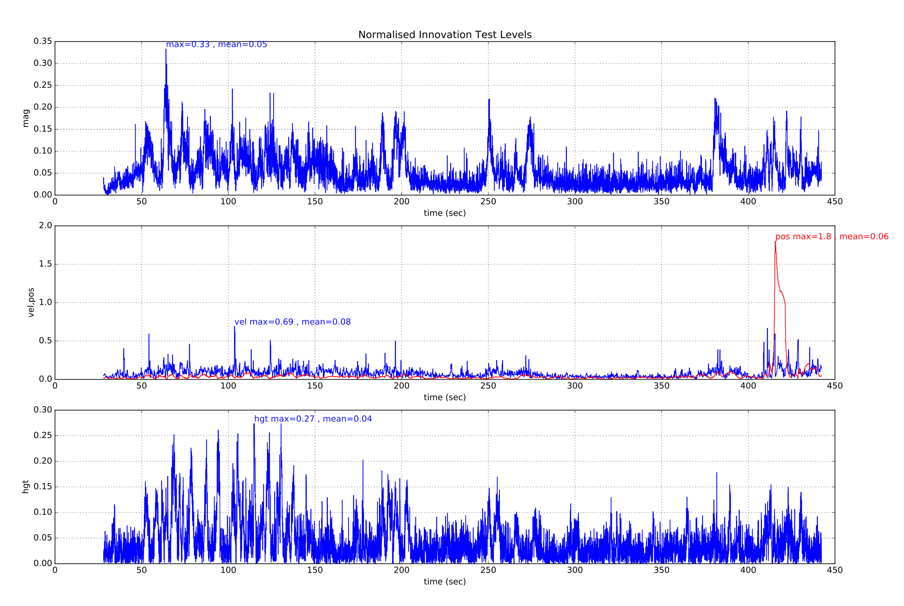

# 使用 PX4 的导航滤波器（EKF2）

本教程回答了关于使用 EKF 算法进行导航的常见问题。

:::tip
来自 _PX4 开发者峰会 2019_ 的 [PX4 状态估计概述](https://youtu.be/HkYRJJoyBwQ) 视频 (Dr. Paul Riseborough) 提供了估计器的概述，并额外描述了 2018/2019 年的主要变化，自那时起又增加了许多重大变更和改进。
:::

## 综述

PX4 的导航滤波器使用扩展卡尔曼滤波 (EKF) 算法来处理传感器测量数据，并提供以下状态的估计值：

- 定义从北、东、地 (NED) 局部导航坐标系到 X、Y、Z 机体坐标系旋转的四元数
- IMU 处的速度 - 北，东，地 (m/s)
- IMU 处的位置 - 纬度 (rad)、经度 (rad)、高度 (m)
- IMU 陀螺仪零偏估计 - X、Y、Z (rad/s)
- IMU 加速度计零偏估计 - X、Y、Z (m/s<sup>2</sup>)
- 地磁场分量 - 北、东、地 (gauss)
- 载具机体坐标系磁场零偏 - X、Y、Z (gauss)
- 风速 - 北、东 (m/s)
- 地形高度 (m)

为了提高稳定性，实施了“误差状态 (error-state)”表述，
这在估计旋转（即 3D 向量，SO(3) 的切空间）的不确定性时尤为重要。

EKF 在延迟的“融合时域 (fusion time horizon)”上运行，以允许每个测量值相对于 IMU 存在不同的时间延迟。
每个传感器的数据都经过 FIFO 缓冲，并由 EKF 从缓冲区中检索，以便在正确的时间使用。
每个传感器的延迟补偿由 [EKF2\_\*\_DELAY](../advanced_config/parameter_reference.md#ekf2) 参数控制。

互补滤波器用于使用缓冲的 IMU 数据将状态从“融合时域”向前传播到当前时间。
该滤波器的时间常数由 [EKF2_TAU_VEL](../advanced_config/parameter_reference.md#EKF2_TAU_VEL) 和 [EKF2_TAU_POS](../advanced_config/parameter_reference.md#EKF2_TAU_POS) 参数控制。

:::info
缓冲区的“融合时域”延迟和长度由 [EKF2_DELAY_MAX](../advanced_config/parameter_reference.md#EKF2_DELAY_MAX) 决定。
该值应至少与最长的 `EKF2\_\*\_DELAY` 延迟一样大。
减小“融合时域”延迟会减少用于将状态向前传播到当前时间的互补滤波器的误差。
:::

EKF 仅将 IMU 数据用于状态预测。
IMU 数据不作为观测值用于 EKF 推导。
协方差预测和测量雅可比矩阵的代数方程是使用 [SymForce](https://symforce.org/) 推导的，可以在这里找到：[符号推导](https://github.com/PX4/PX4-Autopilot/blob/main/src/modules/ekf2/EKF/python/ekf_derivation/derivation.py)。
协方差更新使用 [约瑟夫稳定形式 (Joseph Stabilized form)](https://en.wikipedia.org/wiki/Kalman_filter#Deriving_the_posteriori_estimate_covariance_matrix) 完成，以提高数值稳定性并允许独立状态的条件更新。

### 关于位置输出的精度

位置是以纬度、经度和高度估算的，INS（惯性导航系统）积分是使用 WGS84 椭球模型执行的。然而，位置不确定性是在当前位置的局部导航坐标系中定义的（即：NED 误差，单位为米）。

位置和速度状态在输出到控制回路之前，会根据 IMU 和机体坐标系之间的偏移量进行调整。

IMU 相对于机体坐标系的位置由 `EKF2_IMU_POS_X,Y,Z` 参数设置。

除了纬度/经度/高度的全局位置估计外，滤波器还通过使用以任意原点为中心的 [等距方位投影 (azimuthal_equidistant_projection)](https://en.wikipedia.org/wiki/Azimuthal_equidistant_projection) 投影全局位置估计值，提供局部位置估计（以米为单位的 NED）。
当融合全局位置测量值时，会自动设置此原点，也可以手动指定。
如果未提供全局位置信息，则只有局部位置可用，并且 INS 积分是在球形地球模型上执行的。

## 运行单个 EKF 实例

_默认行为_ 是运行单个 EKF 实例。
在这种情况下，传感器选择和故障转移是在数据被 EKF 接收之前执行的。
这针对有限数量的传感器故障（例如数据丢失）提供了保护，但无法防止传感器提供超出 EKF 和控制回路补偿能力的不准确数据。

运行单个 EKF 实例的参数设置如下：

- [EKF2_MULTI_IMU](../advanced_config/parameter_reference.md#EKF2_MULTI_IMU) = 0
- [EKF2_MULTI_MAG](../advanced_config/parameter_reference.md#EKF2_MULTI_MAG) = 0
- [SENS_IMU_MODE](../advanced_config/parameter_reference.md#SENS_IMU_MODE) = 1
- [SENS_MAG_MODE](../advanced_config/parameter_reference.md#SENS_MAG_MODE) = 1

## 运行多个 EKF 实例

根据 IMU 和磁力计的数量以及飞控的 CPU 能力，可以运行多个 EKF 实例。
这针对更广泛的传感器误差提供了保护，并通过每个 EKF 实例使用不同的传感器组合来实现。
通过比较每个 EKF 实例的内部一致性，EKF 选择器能够确定具有最佳数据一致性的 EKF 和传感器组合。
这使得可以检测并隔离诸如 IMU 零偏突变、饱和或数据卡死等故障。

EKF 实例的总数是 [EKF2_MULTI_IMU](../advanced_config/parameter_reference.md#EKF2_MULTI_IMU) 和 [EKF2_MULTI_MAG](../advanced_config/parameter_reference.md#EKF2_MULTI_MAG) 选择的 IMU 数量和磁力计数量的乘积，由以下公式给出：

> N_instances = MAX([EKF2_MULTI_IMU](../advanced_config/parameter_reference.md#EKF2_MULTI_IMU) , 1) x MAX([EKF2_MULTI_MAG](../advanced_config/parameter_reference.md#EKF2_MULTI_MAG) , 1)

例如，具有 2 个 IMU 和 2 个磁力计的飞控可以运行 EKF2_MULTI_IMU = 2 和 EKF2_MULTI_MAG = 2，总共 4 个 EKF 实例，其中每个实例使用以下传感器组合：

- EKF 实例 1 : IMU 1, 磁力计 1
- EKF 实例 2 : IMU 1, 磁力计 2
- EKF 实例 3 : IMU 2, 磁力计 1
- EKF 实例 4 : IMU 2, 磁力计 2

可以处理的 IMU 或磁力计传感器的最大数量各为 4 个，理论最大值为 4 x 4 = 16 个 EKF 实例。
实际上，这受到可用计算资源的限制。
在此功能的开发过程中，使用基于 STM32F7 CPU 的硬件进行的测试表明，4 个 EKF 实例具有可接受的处理负载和内存利用率余量。

:::warning
飞行前应进行地面测试以检查 CPU 和内存利用率。
:::

如果 [EKF2_MULTI_IMU](../advanced_config/parameter_reference.md#EKF2_MULTI_IMU) >= 3，则针对大速率陀螺仪误差的故障转移时间将进一步缩短，因为 EKF 选择器能够应用中值选择策略以更快地隔离故障 IMU。

多 EKF 实例的设置由以下参数控制：

- [SENS_IMU_MODE](../advanced_config/parameter_reference.md#SENS_IMU_MODE):
  如果是以 IMU 传感器多样性运行多个 EKF 实例，即 [EKF2_MULTI_IMU](../advanced_config/parameter_reference.md#EKF2_MULTI_IMU) > 1，则设置为 0。

  当设置为 1（单个 EKF 操作的默认值）时，传感器模块选择 EKF 使用的 IMU 数据。
  这提供了针对传感器数据丢失的保护，但不提供针对错误传感器数据的保护。
  当设置为 0 时，传感器模块不进行选择。

- [SENS_MAG_MODE](../advanced_config/parameter_reference.md#SENS_MAG_MODE):
  如果是以磁力计传感器多样性运行多个 EKF 实例，即 [EKF2_MULTI_MAG](../
  advanced_config/parameter_reference.md#EKF2_MULTI_MAG) > 1，则设置为 0。

  当设置为 1（单个 EKF 操作的默认值）时，传感器模块选择 EKF 使用的磁力计数据。
  这提供了针对传感器数据丢失的保护，但不提供针对错误传感器数据的保护。
  当设置为 0 时，传感器模块不进行选择。

- [EKF2_MULTI_IMU](../advanced_config/parameter_reference.md#EKF2_MULTI_IMU):
  此参数指定多个 EKF 使用的 IMU 传感器数量。
  如果 `EKF2_MULTI_IMU` <= 1，则仅使用第一个 IMU 传感器。
  当 [SENS_IMU_MODE](../advanced_config/parameter_reference.md#SENS_IMU_MODE) = 1 时，这将是传感器模块选择的传感器。
  如果 `EKF2_MULTI_IMU` >= 2，则将针对指定数量的 IMU 传感器（最多 4 个或存在的 IMU 数量，取较小值）运行单独的 EKF 实例。

- [EKF2_MULTI_MAG](../advanced_config/parameter_reference.md#EKF2_MULTI_MAG):
  此参数指定多个 EKF 使用的磁力计传感器数量。
  如果 `EKF2_MULTI_MAG` <= 1，则仅使用第一个磁力计传感器。
  当 [SENS_MAG_MODE](../advanced_config/parameter_reference.md#SENS_MAG_MODE) = 1 时，这将是传感器模块选择的传感器。
  如果 `EKF2_MULTI_MAG` >= 2，则将针对指定数量的磁力计传感器（最多 4 个或存在的磁力计数量，取较小值）运行单独的 EKF 实例。

:::info
不支持多 EKF 实例飞行日志的记录和 [EKF2 回放](../debug/system_wide_replay.md#ekf2-replay)。
要启用 EKF 回放记录，必须设置参数以启用 [单个 EKF 实例](#running-a-single-ekf-instance)。
:::

## 它使用哪些传感器测量？

EKF 具有不同的操作模式，允许不同的传感器测量组合。
启动时，滤波器会检查最小的可行传感器组合，并在初始倾斜、偏航和高度对准完成后，进入提供旋转、垂直速度、垂直位置、IMU 角度增量零偏和 IMU 速度增量零偏估计的模式。

此模式需要 IMU 数据、偏航源（磁力计或外部视觉）和高度数据源。
所有 EKF 操作模式都需要此最小数据集。
然后可以使用其他传感器数据来估计额外的状态。

### IMU

- 三轴机体固定惯性测量单元 (IMU) 的角度增量和速度增量数据，最小速率为 100Hz。
  注意：在 EKF 使用 IMU 角度增量数据之前，应先对其应用圆锥效应校正。

### 磁力计

估计器需要三轴机体固定磁力计数据，最小速率为 5Hz。

::: info

- 磁力计 **零偏 (biases)** 仅在无人机旋转时可观测。
- 当载具加速（线性加速度）且同时融合绝对位置或速度测量值（例如 GPS）时，真实航向是可观测的。
  这意味着如果这些条件能够足够频繁地满足以约束航向漂移（由陀螺仪零偏引起），则初始化后的磁力计航向测量是可选的。

:::

磁力计数据融合可以使用 [EKF2_MAG_TYPE](../advanced_config/parameter_reference.md#EKF2_MAG_TYPE) 进行配置：

0. 自动 (Automatic):
   - 磁力计读数仅在解锁前影响航向估计，解锁后影响整个姿态。
   - 使用此方法时会补偿航向和倾斜误差。
   - 不正确的磁场测量会降低倾斜估计的质量。
   - 只要可观测，就会估计磁力计零偏。
1. 磁航向 (Magnetic heading):
   - 仅修正航向。
     倾斜估计永远不会受到不正确磁场测量的影响。
   - 使用此方法时，不会修正因没有速度/位置辅助飞行而产生的倾斜误差。
   - 只要可观测，就会估计磁力计零偏。
2. 已弃用
3. 已弃用
4. 已弃用
5. 无 (None)：
   - 永不使用磁力计数据。
     当数据完全不可信时（例如：传感器附近有大电流、外部异常），这很有用。
   - 估计器将使用其他航向源：[GPS 航向](#yaw-measurements) 或外部视觉。
   - 当使用 GPS 测量而没有其他航向源时，航向只能在充分的水平加速后才能初始化。
     参见下文的 [从载具运动估计偏航](#yaw-from-gps-velocity)。
6. 仅初始化 (Init only):
   - 磁力计数据仅用于初始化航向估计。
     当数据可以在解锁前使用但解锁后不能使用（例如：载具解锁后有大电流）时，这很有用。
   - 初始化后，航向使用其他观测值进行约束。
   - 与 `None` 模式不同，当与 GPS 测量结合使用时，此方法允许位置控制模式在起飞期间直接运行。

可以使用以下选择树来选择正确的选项：


### 高度

需要高度数据源 - GPS、气压计、测距仪、外部视觉或这些源的组合，最小速率为 5Hz。

如果不存在任何选定的测量值，EKF 将不会启动。
当检测到这些测量值时，EKF 将初始化状态并完成倾斜和偏航对准。
当倾斜和偏航对准完成后，EKF 可以转换到其他操作模式，从而能够使用额外的传感器数据：

可以使用其专用控制参数启用/禁用每个高度源：

- [GNSS/GPS](#gnss-gps): [EKF2_GPS_CTRL](../advanced_config/parameter_reference.md#EKF2_GPS_CTRL)
- [气压计](#barometer): [EKF2_BARO_CTRL](../advanced_config/parameter_reference.md#EKF2_BARO_CTRL)
- [测距仪](#range-finder): [EKF2_RNG_CTRL](../advanced_config/parameter_reference.md#EKF2_RNG_CTRL)
- [外部视觉](#external-vision-system): 当 [EKF2_HGT_REF](../advanced_config/parameter_reference.md#EKF2_HGT_REF) 设置为 "Vision" 时启用

从长远来看，高度估计遵循高度数据的“参考源”。
此参考由 [EKF2_HGT_REF](../advanced_config/parameter_reference.md#EKF2_HGT_REF) 参数定义。

#### 典型配置

|                               | [EKF2_GPS_CTRL](../advanced_config/parameter_reference.md#EKF2_GPS_CTRL) | [EKF2_BARO_CTRL](../advanced_config/parameter_reference.md#EKF2_BARO_CTRL) | [EKF2_RNG_CTRL](../advanced_config/parameter_reference.md#EKF2_RNG_CTRL) | [EKF2_HGT_REF](../advanced_config/parameter_reference.md#EKF2_HGT_REF) |
| ----------------------------- | ------------------------------------------------------------------------------------------------------------------ | -------------------------------------------------------------------------------------------------------------------- | ------------------------------------------------------------------------------------------------------------------ | ---------------------------------------------------------------------------------------------------------------- |
| 户外 (默认)    | 7 (经/纬/高/速)                                                                                     | 1 (启用)                                                                                            | 1 ([条件性](#conditional-range-aiding))                                                            | 1 (GNSS)                                                                                      |
| 室内 (非平坦地形) | 0 (禁用)                                                                                          | 1 (启用)                                                                                            | 1 ([条件性](#conditional-range-aiding))                                                            | 2 (测距仪)                                                                                       |
| 室内 (平坦地形)  | 0 (禁用)                                                                                          | 1 (启用)                                                                                            | 2 ([始终启用](#range-height-fusion))                                                                | 2 (测距仪)                                                                                       |
| 外部视觉                          | 按需                                                                                                                 | 按需                                                                                                                   | 按需                                                                                                                 | 3 (视觉)                                                                                        |

### Barometer

使用 [EKF2_BARO_CTRL](../advanced_config/parameter_reference.md#EKF2_BARO_CTRL) 启用/禁用作为 [高度](#height) 数据的来源。

注意，即使有多个气压计可用，也只融合来自一个气压计的数据。
首先选择具有最高 [CAL_BAROx_PRIO](../advanced_config/parameter_reference.md#CAL_BARO0_PRIO) 优先级值的气压计，如果检测到传感器故障，则回退到下一个最高优先级的气压计。
如果气压计具有相同的最高优先级，则使用第一个检测到的气压计。
可以通过将其 `CAL_BAROx_PRIO` 值设置为 `0`（禁用）来完全禁用某个气压计作为可能的来源。

有关高度源配置的更多详细信息，请参阅 [高度](#height)。

#### 静压位置误差校正

气压高度容易受到由载具风相对速度和方向产生的气动扰动引起的误差的影响。
这在航空学中被称为 _静压位置误差 (static pressure position error)_。
使用 ECL/EKF2 估计器库的 EKF2 模块提供了一种补偿这些误差的方法，前提是风速状态估计处于激活状态。

对于以固定翼模式运行的飞行器，风速状态估计需要启用 [空速](#airspeed) 和/或 [合成侧滑](#synthetic-sideslip) 融合。

对于多旋翼飞行器，可以启用并调整 [阻力比力](#mc_wind_estimation_using_drag) 的融合，以提供所需的风速状态估计。

EKF2 模块将误差建模为一个机体固定的椭球体，该椭球体指定了在转换为高度估计之前，需要从气压中增加/减去的动压比例。

可以通过以下方式获得良好的调参：

1. 在 [位置模式](../flight_modes_mc/position.md) 下反复向前/向后/向左/向右/向上/向下飞行，在静止和最大速度之间切换（在静风条件下进行此测试可获得最佳结果）。

2. 使用例如 [QGroundControl: Analyze > Log Download](https://docs.qgroundcontrol.com/master/en/qgc-user-guide/analyze_view/log_download.html) 提取 `.ulg` 日志文件。

   同一日志文件可用于调整 [多旋翼风速估计器](#mc_wind_estimation_using_drag)。

:::

3. 使用 [baro_static_pressure_compensation_tuning.py](https://github.com/PX4/PX4-Autopilot/tree/main/src/modules/ekf2/EKF/python/tuning_tools/baro_static_pressure_compensation) Python 脚本处理日志，以获得最佳参数集。

调参参数：

- [EKF2_PCOEF_XP](../advanced_config/parameter_reference.md#EKF2_PCOEF_XP)
- [EKF2_PCOEF_XN](../advanced_config/parameter_reference.md#EKF2_PCOEF_XN)
- [EKF2_PCOEF_YP](../advanced_config/parameter_reference.md#EKF2_PCOEF_YP)
- [EKF2_PCOEF_YN](../advanced_config/parameter_reference.md#EKF2_PCOEF_YN)
- [EKF2_PCOEF_Z](../advanced_config/parameter_reference.md#EKF2_PCOEF_Z)

#### 气压计零偏补偿

恒定高度下的气压计容易因环境压力变化或传感器温度变化而产生测量漂移。
为了补偿这种测量误差，EKF2 使用 GNSS 高度（如果可用）作为“无漂移”参考来估计零偏。
不需要调参。

### GNSS/GPS

#### 位置和速度测量

如果满足以下条件，将使用 GPS 测量进行位置和速度估计：

- 通过设置 [EKF2_GPS_CTRL](../advanced_config/parameter_reference.md#EKF2_GPS_CTRL) 参数启用 GPS 使用。
- GPS 质量检查已通过。
  这些检查由 [EKF2_GPS_CHECK](../advanced_config/parameter_reference.md#EKF2_GPS_CHECK) 和 `EKF2_REQ_*` 参数控制。

有关高度源配置的更多详细信息，请 [点击这里](#height)。

#### 偏航角测量

某些 GPS 接收机，例如 [Trimble MB-Two RTK GPS 接收机](https://oemgnss.trimble.com/en/products/receiver-modules/mb-two)，可用于提供航向测量，以替代磁力计数据的使用。
当在存在大型磁异常的环境中或在地球磁场倾角较大的纬度地区运行时，这可能是一个显著的优势。
通过将 [EKF2_GPS_CTRL](../advanced_config/parameter_reference.md#EKF2_GPS_CTRL) 参数中的第 3 位设置为 1（加 8）来启用 GPS 偏航测量。

#### 从 GPS 速度数据获取偏航角

EKF 在内部运行一个额外的多假设滤波器，该滤波器使用多个 3 状态扩展卡尔曼滤波器 (EKF)，其状态为北东 (NE) 速度和偏航角。
然后使用高斯求和滤波器 (GSF) 组合这些单独的偏航角估计值。
单独的 3 状态 EKF 使用 IMU 和 GPS 水平速度数据（加上可选的空速数据），不依赖于偏航角或磁力计测量的任何先验知识。
这为自主滤波器的偏航提供了备份，并用于在起飞后导航丢失表明来自磁力计的偏航估计错误时重置主 24 状态 EKF 的偏航。
这将导致 GCS 显示 `Emergency yaw reset - magnetometer use stopped`（紧急航向重置 - 磁力计停止使用）信息消息。

启用 ekf2 回放日志记录后，将记录来自此估计器的数据，并可在 `yaw_estimator_status` 消息中查看。
来自各个 3 状态 EKF 偏航估计器的单独偏航估计值位于 `yaw` 字段中。
GSF 组合偏航估计值位于 `yaw_composite` 字段中。
GSF 偏航估计值的方差位于 `yaw_variance` 字段中。
所有角度均以弧度为单位。
GSF 应用于各个 3 状态 EKF 输出的权重位于 `weight` 字段中。

这也可以实现在没有任何磁力计数据或双天线 GPS 接收机的情况下进行偏航操作，前提是起飞后可以进行一些水平运动以使偏航变得可观测。
要使用此功能，请将 [EKF2_MAG_TYPE](../advanced_config/parameter_reference.md#EKF2_MAG_TYPE) 设置为 `none` (5) 以禁用磁力计使用。
一旦载具进行了足够的水平运动使偏航可观测，主 24 状态 EKF 将把它的偏航对准 GSF 估计值并开始使用 GPS。

#### 双 GPS 接收器

可以使用一种算法混合来自 GPS 接收机的数据，该算法根据报告的精度对数据进行加权（如果两个接收机以相同的速率输出数据并使用相同的精度，效果最佳）。
如果来自接收机的数据丢失，该机制还提供自动故障转移（例如，它允许使用标准 GPS 作为更精确的 RTK 接收机的备份）。
这由 [SENS_GPS_MASK](../advanced_config/parameter_reference.md#SENS_GPS_MASK) 参数控制。

[SENS_GPS_MASK](../advanced_config/parameter_reference.md#SENS_GPS_MASK) 参数默认设置为禁用混合并始终使用第一个接收机，因此必须设置它以选择使用哪些接收机精度指标来决定每个接收机输出对混合解算的贡献程度。
当使用不同的接收机型号时，重要的是将 [SENS_GPS_MASK](../advanced_config/parameter_reference.md#SENS_GPS_MASK) 参数设置为两个接收机都支持的精度指标值。
例如，除非两个接收机的驱动程序都在 `vehicle_gps_position` 消息的 `s_variance_m_s` 字段中发布可比较的值，否则不要将第 0 位设置为 `true`。
由于不同制造商定义精度的方式不同（例如 CEP 与 1-sigma 等），这对于来自不同制造商的接收机可能很困难。

设置期间应检查以下项目：

- 验证第二个接收机的数据是否存在。
  这将记录为 `vehicle_gps_position_1`，也可以在连接 _nsh console_ 时使用命令 `listener vehicle_gps_position -i 1` 进行检查。
  [GPS_2_CONFIG](../advanced_config/parameter_reference.md#GPS_2_CONFIG) 参数需要正确设置。
- 检查来自每个接收机的 `s_variance_m_s`、`eph` 和 `epv` 数据，并决定可以使用哪些精度指标。
  如果两个接收机都输出合理的 `s_variance_m_s` 和 `eph` 数据，并且 GPS 垂直位置未直接用于导航，则建议将 [SENS_GPS_MASK](../advanced_config/parameter_reference.md#SENS_GPS_MASK) 设置为 3。
  如果只有 `eph` 数据可用，且两个接收机都不输出 `s_variance_m_s` 数据，则将 [SENS_GPS_MASK](../advanced_config/parameter_reference.md#SENS_GPS_MASK) 设置为 2。
  只有当 GPS 已通过 [EKF2_HGT_REF](../advanced_config/parameter_reference.md#EKF2_HGT_REF) 参数被选为参考高度源，且两个接收机都输出合理的 `epv` 数据时，才会设置第 2 位。
- 混合接收机数据的输出记录为 `ekf_gps_position`，可以在连接 nsh 终端时使用命令 `listener ekf_gps_position` 进行检查。
- 如果接收机以不同的速率输出，则混合输出将采用较慢接收机的速率。
  在可能的情况下，接收机应配置为以相同的速率输出。

#### GNSS 性能要求

为了让 ECL 接受 GNSS 数据进行导航，需要在一段时间内满足某些最低要求，该时间由 [EKF2_REQ_GPS_H](../advanced_config/parameter_reference.md#EKF2_REQ_GPS_H) 定义（默认为 10 秒）。

最小值在 [EKF2_REQ_\*](../advanced_config/parameter_reference.md#EKF2_REQ_EPH) 参数中定义，并且可以使用 [EKF2_GPS_CHECK](../advanced_config/parameter_reference.md#EKF2_GPS_CHECK) 参数启用/禁用每个检查。

下表显示了直接报告或从 GNSS 数据计算出的不同指标，以及 ECL 使用数据所需的最小值。
此外，_平均值 (Average Value)_ 列显示了可能从标准 GNSS 模块（例如 u-blox M8 系列）合理获得的典型值 - 即被认为良好/可接受的值。

| 指标 (Metric)     | 最低要求                                                                                                                                                                                                             | 平均值 (Average Value) | 单位 (Units) | 备注                                                                                                                                                                                                                                            |
| ---------------------------------- | ---------------------------------------------------------------------------------------------------------------------------------------------------------------------------------------------------------------- | -------------------------------------- | ----------------------------- | --------------------------------------------------------------------------------------------------------------------------------------------------------------------------------------------------------------------------------------------- |
| eph                                | <&nbsp;3 ([EKF2_REQ_EPH](../advanced_config/parameter_reference.md#EKF2_REQ_EPH))                      | 0.8                    | 米                             | 水平位置误差的标准偏差                                                                                                                                                                                                                                   |
| epv                                | <&nbsp;5 ([EKF2_REQ_EPH](../advanced_config/parameter_reference.md#EKF2_REQ_EPV))                      | 1.5                    | 米                             | 垂直位置误差的标准偏差                                                                                                                                                                                                                                   |
| 卫星数量                               | ≥&nbsp;6 ([EKF2_REQ_EPH](../advanced_config/parameter_reference.md#EKF2_REQ_NSATS))                                             | 14                                     | -                             |                                                                                                                                                                                                                                               |
| sacc                               | <&nbsp;0.5 ([EKF2_REQ_EPH](../advanced_config/parameter_reference.md#EKF2_REQ_SACC))   | 0.2                    | 米/秒                           | 水平速度误差的标准偏差                                                                                                                                                                                                                                   |
| 定位类型 (fix type) | ≥&nbsp;3                                                                                                                                                                                     | 4                                      | -                             | 0-1: 无定位, 2: 2D 定位, 3: 3D 定位, 4: RTCM 码差分, 5: 实时动态 (RTK) 浮点解, 6: 实时动态 (RTK) 固定解, 8: 外推值 |
| 位置精度衰減因子(PDOP)  | <&nbsp;2.5 ([EKF2_REQ_EPH](../advanced_config/parameter_reference.md#EKF2_REQ_PDOP))   | 1.0                    | -                             | 位置精度衰减                                                                                                                                                                                                                                        |
| hpos 漂移率                           | <&nbsp;0.1 ([EKF2_REQ_EPH](../advanced_config/parameter_reference.md#EKF2_REQ_HDRIFT)) | 0.01                   | 米/秒                           | 静止时基于 GNSS 位置计算的漂移率                                                                                                                                                                                                                           |
| vpos 漂移率                           | <&nbsp;0.2 ([EKF2_REQ_EPH](../advanced_config/parameter_reference.md#EKF2_REQ_VDRIFT)) | 0.02                   | 米/秒                           | 静止时基于 GNSS 高度计算的漂移率。                                                                                                                                                                                                                          |
| hspd                               | <&nbsp;0.1 ([EKF2_REQ_EPH](../advanced_config/parameter_reference.md#EKF2_REQ_HDRIFT)) | 0.01                   | 米/秒                           | 报告的 GNSS 水平速度的滤波幅值。                                                                                                                                                                                                                           |
| 报告的 GNSS 垂直速度的滤波幅值。                | <&nbsp;0.2 ([EKF2_REQ_EPH](../advanced_config/parameter_reference.md#EKF2_REQ_VDRIFT)) | 0.02                   | 米/秒                           | 所报告的全球导航卫星系统垂直速度的滤波量级。                                                                                                                                                                                                                        |

:::info
`hpos_drift_rate`、`vpos_drift_rate` 和 `hspd` 是在 10 秒的时间段内计算的，并在 `ekf2_gps_drift` 主题中发布。
注意 `ekf2_gps_drift` 不会被记录！
:::

#### GNSS 故障检测

PX4 的 GNSS 故障检测使用基于测量验证的选择性融合控制来防止恶意或错误的 GNSS 信号。

故障检测逻辑取决于 GPS 模式，并且对于水平位置和高度测量的操作也有所不同。
该模式使用 [EKF2_GPS_MODE](../advanced_config/parameter_reference.md#EKF2_GPS_MODE) 参数设置：

- **自动 (`0`)** (默认): 假设 GNSS 通常是可靠的，并且很可能会恢复。
  如果此时没有其他位置源可用，EKF2 会在融合超时时重置。
- **航位推算 (`1`)**: 假设 GNSS 可能会无限期丢失，因此当我们有其他位置数据估计时应避免重置。
  如果没有其他位置或速度源可用，EKF2 可能会重置。
  如果 GNSS 高度或水平位置数据漂移，系统将同时禁用这两个测量值的融合（即使其中一个仍能通过验证），并避免执行重置。

##### 检测逻辑

水平位置：

- **自动模式**: 如果当前没有融合其他水平位置源（例如：辅助全局位置 - AGP），水平位置将重置为 GNSS 数据。
- **航位推算模式**: 仅当当前没有融合其他水平位置或速度源（例如：AGP、空速、光流）时，水平位置才会重置为 GNSS 数据。

高度：

- 由于高度参考传感器 ([EKF2_HGT_REF](../advanced_config/parameter_reference.md#EKF2_HGT_REF)) 参数（在无 GNSS 场景中通常设置为 GNSS 或气压计），高度逻辑更加复杂。
- 如果高度参考设置为气压计，则防止基于 GNSS 的高度重置（除非气压计融合完全失败且高度参考自动切换到 GNSS）。
- 当高度参考设置为 GNSS 时：
- **自动模式**: 在 GNSS 高度测量值漂移时发生重置。
- **航位推算模式**: 当验证开始失败时，系统会阻止 GNSS 高度重置并将 GNSS 数据标记为故障。

##### 启动期间的错误 GNSS 数据

系统无法在载具启动期间自动检测错误的 GNSS 数据，因为不存在基线比较。

如果启用了 GNSS 融合 ([EKF2_GPS_CTRL](../advanced_config/parameter_reference.md#EKF2_GPS_CTRL))，操作员将在地图上观察到不正确的位置，并应禁用 GNSS 融合，然后通过地面站手动设置正确的位置。
全局位置得到修正，如果启用了 [SENS_BAR_AUTOCAL](../advanced_config/parameter_reference.md#SENS_BAR_AUTOCAL)，气压计偏移量会自动调整（通过零偏校正，而不是参数更改）。

##### 飞行中启用 GNSS 融合

存在错误 GNSS 数据时：

- **自动模式**: 载具将重置到错误位置 - 具有潜在危险。
- **航位推算模式**: 大的测量差异会导致 GNSS 被拒绝并激活故障检测。

存在有效 GNSS 数据时：

- **自动模式**: 载具将重置到 GNSS 测量值。
- **航位推算模式**: 如果估计位置/高度与测量值足够接近，则恢复融合；如果相距太远，数据将被标记为故障。

##### 备注

- **双重检测**: 水平和高度检查完全分开运行，但在触发时都会导致相同的结果 - 所有 GNSS 融合被禁用。
- **恢复**: 只有将数据标记为无效的特定检查才能重新启用融合。
- **替代来源**: 航位推算模式通过在允许重置之前要求没有替代导航源，提供了增强的保护。
- **启动漏洞**: 初始错误 GNSS 数据无法自动检测；需要操作员干预和手动位置校正。

### 测距仪

[测距仪](../sensor/rangefinders.md) 对地距离由单状态滤波器使用，用于估计地形相对于高度基准的垂直位置。

融合操作模式由 [EKF2_RNG_CTRL](../advanced_config/parameter_reference.md#EKF2_RNG_CTRL) 控制：

1. [条件测距辅助](#conditional-range-aiding)
2. [测距高度融合](#range-height-fusion)

有关高度源配置的更多详细信息，请 [点击这里](#height)。

#### 条件测距辅助

条件测距仪融合（又名  _条件测距辅助_）在低速/低空操作期间激活测距仪融合以进行高度估计（除了其他活动的高度源之外）。
如果测距仪被设置为参考高度源（使用 [EKF2_HGT_REF](../advanced_config/parameter_reference.md#EKF2_HGT_REF)），其他活动的高度源（如气压计和 GNSS 高度）将随着时间的推移调整其测量值以匹配测距仪的读数。
当不满足启动测距辅助的条件时，会自动选择次要参考。

:::info
在高度参考之间切换会导致绝对高度估计随时间漂移。
当在位置模式下飞行时，这不是问题，但如果无人机应该在特定的 GNSS 高度执行任务，则可能会有问题。
如果不希望出现绝对高度漂移，建议将 GNSS 高度设置为高度参考，即使在使用条件测距辅助时也是如此。
:::

它主要用于 _起飞和降落_，在这些情况下，气压计的设置可能会受到旋翼气流的过度干扰，从而破坏 EKF 状态估计。

测距辅助也可用于改善载具静止时的高度保持。

:::tip
对于地形保持，推荐使用 [地形保持](../flying/terrain_following_holding.md#terrain_hold) 而不是 _测距辅助_。
这是因为地形保持使用正常的 ECL/EKF 估计器来确定高度，这在大多数情况下比距离传感器更可靠。
:::

_条件测距辅助_ 通过设置 [EKF2_RNG_CTRL](../advanced_config/parameter_reference.md#EKF2_RNG_CTRL) = "Enabled (conditional mode)" (1) 来启用。

它使用 `EKF2_RNG_A_` 参数进一步配置：

- [EKF2_RNG_A_VMAX](../advanced_config/parameter_reference.md#EKF2_RNG_A_VMAX): 最大水平速度，高于此速度将禁用测距辅助。
- [EKF2_RNG_A_HMAX](../advanced_config/parameter_reference.md#EKF2_RNG_A_HMAX): 最大高度，高于此高度将禁用测距辅助。

#### 测距高度融合

PX4 允许您持续融合测距仪作为高度源（在任何飞行模式/载具类型中）。
当载具 _保证_ 仅在接近平坦的表面上飞行（例如室内）时，这可能对应用程序有用。

当使用距离传感器作为高度源时，飞行者应注意：

- 飞越障碍物可能导致估计器拒绝测距仪数据（由于内部数据一致性检查），这可能导致高度保持效果不佳，而估计器仅依赖加速度计估计。

  这种情况可能会发生在载具以相对于地面几乎恒定的高度爬坡时，因为测距仪高度没有变化，而加速度计估计的高度却在变化。
  EKF 执行新息一致性检查，该检查考虑了测量值与当前状态之间的误差以及状态的估计方差和测量本身的方差。
  如果检查失败，测距仪数据将被拒绝，高度将根据加速度计和其他选定的高度源（GNSS、气压计、视觉，如果启用且可用）进行估计。
  如果距离传感器是活动的高度数据源，在数据不一致持续 5 秒后，估计器会重置高度状态以匹配当前的距离传感器数据。
  如果一个或多个其他高度源处于活动状态，则测距仪被声明为故障，估计器继续使用其他传感器估计其高度。
  测量值也可能再次变得一致，例如，如果载具下降，或者如果估计的高度漂移以匹配测量的测距仪高度。

:::

- 局部 NED 原点将随地平面上下移动。

- 测距仪在不平坦表面（例如树木）上的性能可能非常差，导致数据嘈杂且不一致。
  这同样会导致高度保持不佳。

该功能通过将 [EKF2_RNG_CTRL](../advanced_config/parameter_reference.md#EKF2_RNG_CTRL) 设置为 "Enabled" (2) 来启用。
要在活动时使测距仪成为高度参考，请设置：[EKF2_HGT_REF](../advanced_config/parameter_reference.md#EKF2_HGT_REF) 为 "Range sensor"。

:::tip
要仅在无人机静止时启用测距仪融合（以便在起飞和降落期间获得更好的高度估计），但在其余时间不融合测距仪，请使用 [EKF2_RNG_CTRL](../advanced_config/parameter_reference.md#EKF2_RNG_CTRL) 的 [条件模式](#conditional-range-aiding) (1)。
:::

#### 测距仪遮挡检测

EKF 可以使用垂直速度估计值与测距仪数据数值导数之间的运动学一致性检查，来检测测距仪对地路径是否被遮挡（可能被负载遮挡）。
如果测距仪在统计上与 EKF2 不一致，则在本次飞行的剩余时间内传感器将被拒绝，除非统计测试在 0.5m/s 或更高的垂直速度下再次通过至少 1 秒。

该检查仅在测距仪未用作主要高度源时启用，并且仅在载具未水平移动时处于活动状态（因为它假设地面高度是静态的）。

为了进行有效的遮挡检测，需要使用飞行数据对测距仪噪声参数进行严格调整。
然后可以调整运动学一致性门限参数以获得所需的故障检测灵敏度。

调参参数：

- [EKF2_RNG_NOISE](../advanced_config/parameter_reference.md#EKF2_RNG_NOISE)
- [EKF2_RNG_K_GATE](../advanced_config/parameter_reference.md#EKF2_RNG_K_GATE)

### 空速：

通过将 [EKF2_ARSP_THR](../advanced_config/parameter_reference.md#EKF2_ARSP_THR) 设置为正值，可以使用等效空速 (EAS) 数据来估计风速并在 GPS 丢失时减少漂移。
当空速超过 [EKF2_ARSP_THR](../advanced_config/parameter_reference.md#EKF2_ARSP_THR) 正值设置的阈值且载具类型不是旋翼机时，将使用空速数据。

### 合成侧滑

固定翼平台可以利用假设的零侧滑观测来改善风速估计，并且还可以在没有空速传感器的情况下启用风速估计。
这是通过将 [EKF2_FUSE_BETA](../advanced_config/parameter_reference.md#EKF2_FUSE_BETA) 参数设置为 1 来启用的。

### 使用阻力比力的多旋翼风速估计 {#mc_wind_estimation_using_drag}

多旋翼平台可以利用空速与沿 X 和 Y 机体轴的阻力之间的关系来估计风速的北/东分量。
可以使用 [EKF2_DRAG_CTRL](../advanced_config/parameter_reference.md#EKF2_DRAG_CTRL) 启用此功能。

空速与沿 X 和 Y 机体轴的比力（IMU 加速度计测量值）之间的关系由 [EKF2_BCOEF_X](../advanced_config/parameter_reference.md#EKF2_BCOEF_X)、[EKF2_BCOEF_Y](../advanced_config/parameter_reference.md#EKF2_BCOEF_Y) 和 [EKF2_MCOEF](../advanced_config/parameter_reference.md#EKF2_MCOEF) 参数控制，这些参数分别设置 X 和 Y 方向飞行的弹道系数以及螺旋桨产生的动量阻力。
比力观测噪声的大小由 [EKF2_DRAG_NOISE](../advanced_config/parameter_reference.md#EKF2_DRAG_NOISE) 参数设置。

可以通过以下方式获得良好的调参：

1. 在 [位置模式](../flight_modes_mc/position.md) 下反复向前/向后/向左/向右/向上/向下飞行，在静止和最大速度之间切换（在静风条件下进行此测试可获得最佳结果）。
2. 使用例如 [QGroundControl: Analyze > Log Download](https://docs.qgroundcontrol.com/master/en/qgc-user-guide/analyze_view/log_download.html) 提取 **.ulg** 日志文件。
   ::: info
   同一 **.ulg** 日志文件也可用于调整 [静压位置误差系数](#correction-for-static-pressure-position-error)。

:::
3. 使用 [mc_wind_estimator_tuning.py](https://github.com/PX4/PX4-Autopilot/tree/main/src/modules/ekf2/EKF/python/tuning_tools/mc_wind_estimator) Python 脚本处理日志，以获得最佳参数集。

### 光流

如果满足以下条件，将使用 [光流](../sensor/optical_flow.md) 数据：

- 有效的测距仪数据可用。
- [EKF2_OF_CTRL](../advanced_config/parameter_reference.md#EKF2_OF_CTRL) 已设置。
- 流量传感器返回的质量指标大于 [EKF2_OF_QMIN](../advanced_config/parameter_reference.md#EKF2_OF_QMIN) 参数设置的最低要求。

为了获得更好的性能，请按照 [此处](../sensor/optical_flow.md#ekf2) 所述设置光流传感器的位置。

如果在低空（< 10m）可以实现稳定的悬停，但在较高高度出现缓慢振荡，请考虑调整 [光流比例因子](../sensor/optical_flow.md#scale-factor)。

### 外部视觉系统

可以使用来自外部视觉系统（例如 Vicon）的位置、速度或方向测量值。

通过将 [EKF2_EV_CTRL](../advanced_config/parameter_reference.md#EKF2_EV_CTRL) 的相应位设置为 `true` 来配置融合的测量值：

- `0`: 水平位置数据
- `1`: 垂直位置数据。
  垂直位置数据。
  高度源还可以使用 [EKF2_HGT_REF](../advanced_config/parameter_reference.md#EKF2_HGT_REF) 进行配置（参见 [高度](#height) 部分）。
- `2`：速度数据
- `3`:偏航角数据

注意，如果使用偏航数据（第 3 位），则航向是相对于外部视觉坐标系的；否则航向是相对于北方的。

EKF 会考虑视觉位姿估计中的不确定性。
此不确定性信息可以通过 MAVLink [ODOMETRY](https://mavlink.io/en/messages/common.html#ODOMETRY) 消息中的协方差字段发送，也可以通过参数 [EKF2_EVP_NOISE](../advanced_config/parameter_reference.md#EKF2_EVP_NOISE)、[EKF2_EVV_NOISE](../advanced_config/parameter_reference.md#EKF2_EVV_NOISE) 和 [EKF2_EVA_NOISE](../advanced_config/parameter_reference.md#EKF2_EVA_NOISE) 进行设置。
您可以使用 [EKF2_EV_NOISE_MD](../advanced_config/parameter_reference.md#EKF2_EV_NOISE_MD) 选择不确定性的来源。

## 如何使用 'ecl' 库 EKF？

EKF2 默认启用（有关更多信息，请参阅 [切换状态估计器](../advanced/switching_state_estimators.md) 和 [EKF2_EN](../advanced_config/parameter_reference.md#EKF2_EN)）。

## 如何使用 'ecl' 库 EKF？

像所有估计器一样，大部分性能来自于与传感器特性相匹配的调参。
调参是精度和鲁棒性之间的折衷，虽然我们试图提供满足大多数用户需求的参数，但仍会有需要更改参数的应用。

因此，相对于 `attitude_estimator_q` + `local_position_estimator` 的传统组合，我们不对精度做出声明，最佳的估计器选择将取决于应用和调参。

### 缺点

- ecl EKF 是一个复杂的算法，需要充分理解扩展卡尔曼滤波理论及其在导航问题中的应用才能成功调参。
  因此，对于没有获得良好结果的用户来说，知道要更改什么比较困难。
- ecl EKF 使用更多的 RAM 和闪存空间。
- ecl EKF 使用更多的日志空间。

### 优点

- ecl EKF 能够以数学上一致的方式融合来自具有不同时间延迟和数据速率的传感器的数据，一旦正确设置时间延迟参数，即可提高动态机动期间的精度。
- ecl EKF 能够融合各种不同类型的传感器。
- ecl EKF 检测并报告传感器数据中统计上的显著不一致，协助诊断传感器错误。
- 对于固定翼操作，ecl EKF 在有或没有空速传感器的情况下均可估计风速，并且能够在飞行中 GPS 丢失时结合空速测量和侧滑假设来使用估计的风速，以延长可用的航位推算时间。
- ecl EKF 估计三轴加速度计零偏，这提高了尾座式飞机和其他在飞行阶段之间经历大姿态变化的载具的精度。
- 联邦结构（组合姿态和位置/速度估计）意味着姿态估计受益于所有传感器测量。
  如果调参正确，这应该提供改善态度估计的潜力。

## 如何检查 EKF 性能？

EKF 输出、状态和状态数据发布到许多 uORB 主题，这些主题在飞行期间记录到 SD 卡。
以下指南假设已使用 _.ulog 文件格式_ 记录数据。
可以使用 [PX4 pyulog 库](https://github.com/PX4/pyulog) 在 python 中解析 **.ulog** 格式数据。

大多数 EKF 数据可以在记录到 .ulog 文件的 [EstimatorInnovations](https://github.com/PX4/PX4-Autopilot/blob/main/msg/EstimatorInnovations.msg) 和 [EstimatorStatus](https://github.com/PX4/PX4-Autopilot/blob/main/msg/EstimatorStatus.msg) uORB 消息中找到。

可以在 [这里](https://github.com/PX4/PX4-Autopilot/blob/main/Tools/ecl_ekf/process_logdata_ekf.py) 找到自动生成分析图和元数据的 python 脚本。
要使用此脚本文件，请 cd 到 `Tools/ecl_ekf` 目录并输入 `python process_logdata_ekf.py <log_file.ulg>`。
这将性能元数据保存在名为 **<log_file>.mdat.csv** 的 csv 文件中，并将图表保存在名为 `<log_file>.pdf` 的 pdf 文件中。

可以使用 [batch_process_logdata_ekf.py](https://github.com/PX4/PX4-Autopilot/blob/main/Tools/ecl_ekf/batch_process_logdata_ekf.py) 脚本分析目录中的多个日志文件。
完成后，可以使用 [batch_process_metadata_ekf.py](https://github.com/PX4/PX4-Autopilot/blob/main/Tools/ecl_ekf/batch_process_metadata_ekf.py) 脚本处理性能元数据文件，以对日志总体的估计器性能进行统计评估。

### 输出数据

- 姿态输出数据位于 [VehicleAttitude](https://github.com/PX4/PX4-Autopilot/blob/main/msg/versioned/VehicleAttitude.msg) 消息中。
- 局部位置输出数据位于 [VehicleLocalPosition](https://github.com/PX4/PX4-Autopilot/blob/main/msg/versioned/VehicleLocalPosition.msg) 消息中。
- 全局 (WGS-84) 输出数据位于 [VehicleGlobalPosition](https://github.com/PX4/PX4-Autopilot/blob/main/msg/versioned/VehicleGlobalPosition.msg) 消息中。
- 风速输出数据位于 [Wind.msg](https://github.com/PX4/PX4-Autopilot/blob/main/msg/Wind.msg) 消息中。

### 状态

参考 [EstimatorStates](https://github.com/PX4/PX4-Autopilot/blob/main/msg/EstimatorStates.msg) 中的 states\[24\]。
states\[24\] 的索引映射如下：

- \[0 ... 3\] 四元数
- \[4 ... 6\] 速度 NED \(m/s\)
- \[7 ... 9\] 位置 NED \(m\)
- \[10 ... 12\] IMU 角度增量零偏 XYZ \(rad\)
- \[13 ... 15\] IMU 速度增量零偏 XYZ \(m/s\)
- \[16 ... 18\] 地球磁场 NED \(gauss\)
- \[19 ... 21\] 机体磁场 XYZ \(gauss\)
- \[22 ... 23\] 风速 NE \(m/s\)

### 状态方差

参考 [EstimatorStates](https://github.com/PX4/PX4-Autopilot/blob/main/msg/EstimatorStates.msg) 中的 covariances\[24\]。
covariances\[24\] 的索引映射如下：

- \[0 ... 3\] 四元数
- \[4 ... 6\] 速度 NED \(m/s\)^2
- \[7 ... 9\] 位置 NED \(m^2\)
- \[10 ... 12\] IMU 角度增量零偏 XYZ \(rad^2\)
- \[13 ... 15\] IMU 速度增量零偏 XYZ \(m/s\)^2
- \[16 ... 18\] 地球磁场 NED \(gauss^2\)
- \[19 ... 21\] 机体磁场 XYZ \(gauss^2\)
- \[22 ... 23\] 风速 NE \(m/s\)^2

### 观测创新量与创新方差

观测 `estimator_innovations`、`estimator_innovation_variances` 与 `estimator_innovation_test_ratios` 消息字段定义在 [EstimatorInnovations.msg](https://github.com/PX4/PX4-Autopilot/blob/main/msg/EstimatorInnovations.msg) 中。
这些消息字段名称/类型相同（但单位不同）。

:::info
这些消息具有相同字段，是因为它们来自同一字段定义。
`# TOPICS` 行（见 [文件末尾](https://github.com/PX4/PX4-Autopilot/blob/main/msg/EstimatorInnovations.msg)）列出了要生成的消息名：

```
# TOPICS estimator_innovations estimator_innovation_variances estimator_innovation_test_ratios
```

:::

部分观测包括：

- 磁力计 XYZ（gauss, gauss^2）：`mag_field[3]`
- 航向角（rad, rad^2）：`heading`
- 真空速（m/s, (m/s)^2）：`airspeed`
- 合成侧滑（rad, rad^2）：`beta`
- 光流 XY（rad/sec, (rad/s)^2）：`flow`
- 离地高度（m, m^2）：`hagl`
- 阻力特定力（(m/s)^2）：`drag`
- 速度和位置新息：每个传感器

此外，每个传感器都有其自己的字段，即横向和纵向位置和/或速度值（视情况而定）。
这些字段基本自说明，下面给出原始定义：

```
float32[2] gps_hvel	# 水平 GPS 速度创新量 (m/sec) 与创新方差 ((m/sec)**2)
float32    gps_vvel	# 垂直 GPS 速度创新量 (m/sec) 与创新方差 ((m/sec)**2)
float32[2] gps_hpos	# 水平 GPS 位置创新量 (m) 与创新方差 (m**2)
float32    gps_vpos	# 垂直 GPS 位置创新量 (m) 与创新方差 (m**2)

# External Vision
float32[2] ev_hvel	# 水平外部视觉速度创新量 (m/sec) 与创新方差 ((m/sec)**2)
float32    ev_vvel	# 垂直外部视觉速度创新量 (m/sec) 与创新方差 ((m/sec)**2)
float32[2] ev_hpos	# 水平外部视觉位置创新量 (m) 与创新方差 (m**2)
float32    ev_vpos	# 垂直外部视觉位置创新量 (m) 与创新方差 (m**2)

# Fake Position and Velocity
float32[2] fake_hvel	# 虚拟水平速度创新量 (m/s) 与创新方差 ((m/s)**2)
float32    fake_vvel	# 虚拟垂直速度创新量 (m/s) 与创新方差 ((m/s)**2)
float32[2] fake_hpos	# 虚拟水平位置创新量 (m) 与创新方差 (m**2)
float32    fake_vpos	# 虚拟垂直位置创新量 (m) 与创新方差 (m**2)

# Height sensors
float32 rng_vpos	# 测距高度创新量 (m) 与创新方差 (m**2)
float32 baro_vpos	# 气压计高度创新量 (m) 与创新方差 (m**2)

# Auxiliary velocity
float32[2] aux_hvel	# 来自着陆目标测量的水平辅助速度创新量 (m/sec) 与创新方差 ((m/sec)**2)
float32    aux_vvel	# 来自着陆目标测量的垂直辅助速度创新量 (m/sec) 与创新方差 ((m/sec)**2)
```

### 输出互补滤波器

输出互补滤波器用于将状态从融合时间地平线推进到当前时间。
要检查融合时间地平线处测得的角度、速度与位置跟踪误差大小，可参考 `ekf2_innovations` 消息中的 `output_tracking_error[3]`。

索引映射如下：

- \[0\] 角度跟踪误差量级 (rad)
- \[1\] 速度跟踪误差量级（m/s）。
  速度跟踪时间常数可通过 [EKF2_TAU_VEL](../advanced_config/parameter_reference.md#EKF2_TAU_VEL) 调整。
  减小此参数可减少稳态误差，但会增加 NED 速度输出上的观测噪声量。
- \[2\] 位置跟踪误差量级 \(m\)。
  位置跟踪时间常数可通过 [EKF2_TAU_POS](../advanced_config/parameter_reference.md#EKF2_TAU_POS) 调整。
  减小此参数可减少稳态误差，但会增加 NED 位置输出上的观测噪声量。

### EKF 错误

EKF 包含针对严重条件状态和协方差更新的内部错误检查。
请参考 [EstimatorStatus](https://github.com/PX4/PX4-Autopilot/blob/main/msg/EstimatorStatus.msg) 中的 `filter_fault_flags`。

### 观测错误

观测故障分为两类：

- 数据丢失。
  一个例子是测距仪无法提供返回数据。
- 新息，即状态预测和传感器观测之间的差异过度。
  这种情况的一个例子是过度振动导致大的垂直位置误差，导致气压计高度测量被拒绝。

这两者都可能导致观测数据被拒绝，如果时间足够长，使得 EKF 尝试重置状态以使用传感器观测数据。
所有观测都会对创新量进行统计置信度检查。
各观测类型的检查标准差数由对应的 `EKF2_*_GATE` 参数控制。

测试指标可在 [EstimatorStatus](https://github.com/PX4/PX4-Autopilot/blob/main/msg/EstimatorStatus.msg) 中查看：

- `mag_test_ratio`：磁力计创新量最大分量与测试限值的比值
- `vel_test_ratio`：速度创新量最大分量与测试限值的比值
- `pos_test_ratio`：水平位置创新量最大分量与测试限值的比值
- `hgt_test_ratio`：垂直位置创新量与测试限值的比值
- `tas_test_ratio`：真空速创新量与测试限值的比值
- `hagl_test_ratio`：离地高度创新量与测试限值的比值

若需查看每个传感器的二值通过/失败汇总，请参考 [EstimatorStatus](https://github.com/PX4/PX4-Autopilot/blob/main/msg/EstimatorStatus.msg) 中的 `innovation_check_flags`。

### GPS 数据质量检查

EKF 在开始 GPS 辅助前会执行一系列 GPS 质量检查。
这些检查由 [EKF2_GPS_CHECK](../advanced_config/parameter_reference.md#EKF2_GPS_CHECK) 和 `EKF2_REQ_*` 参数控制。
这些检查的通过/失败状态记录在 [EstimatorStatus](https://github.com/PX4/PX4-Autopilot/blob/main/msg/EstimatorStatus.msg) 的 `gps_check_fail_flags` 字段中。
当所有所需的 GPS 检查通过后，此整数将为零。
如果 EKF 未开始 GPS 对齐，请将该整数与 [EstimatorStatus](https://github.com/PX4/PX4-Autopilot/blob/main/msg/EstimatorStatus.msg) 中 `gps_check_fail_flags` 的位掩码定义进行对比。

### EKF 数值误差

EKF 对其所有计算使用单精度浮点运算，并使用一阶近似来推导协方差预测和更新方程，以降低处理要求。
这意味着，当重新调整 EKF 时，可能遇到协方差矩阵运算条件恶劣，足以导致状态估计中的发散或显著错误的情况。

为防止这种情况，每个协方差和状态更新步骤都包含以下错误检测和更正步骤：

- 如果新息方差小于观测方差（这需要一个不可能的负值状态方差）或协方差更新将为任何一个状态产生负值方差，那么：
  - 跳过状态和协方差更新
  - 重置协方差矩阵对应行与列
  - 在 [EstimatorStatus](https://github.com/PX4/PX4-Autopilot/blob/main/msg/EstimatorStatus.msg) 的 `filter_fault_flags` 中记录该故障
- 状态方差（协方差矩阵中的对角线）被限制为非负。
- 状态方差应用数值上限。
- 协方差矩阵强制对称。

重新调参后，尤其是降低噪声变量的调参，应检查 `estimator_status.gps_check_fail_flags` 是否保持为零。

## 如果高度估计值发散了怎么办?

在飞行期间 EKF 高度偏离 GPS 和高度计测量的最常见原因是由振动引起的 IMU 测量的削波和/或混叠。
出现该问题时，通常会在数据中看到以下迹象：

- [EstimatorInnovations](https://github.com/PX4/PX4-Autopilot/blob/main/msg/EstimatorInnovations.msg).vel_pos_innov\[2\] 与 [EstimatorInnovations](https://github.com/PX4/PX4-Autopilot/blob/main/msg/EstimatorInnovations.msg).vel_pos_innov\[5\] 同号。
- [EstimatorStatus](https://github.com/PX4/PX4-Autopilot/blob/main/msg/EstimatorStatus.msg).hgt_test_ratio 大于 1.0

建议的第一步是使用有效的隔振安装方式将飞控与机架隔离。
隔离安装座具有 6 个自由度，因此具有 6 个谐振频率。
作为一般规则，隔离支架上的自动驾驶仪的 6 个共振频率应高于 25Hz，以避免与无人机动力学相互作用并低于电动机的频率。

如果谐振频率与电动机或螺旋桨叶片通过频率一致，则隔离安装件会使振动更严重。

可通过以下参数调整提高 EKF 对振动引起的高度发散的鲁棒性：

- 将主高度传感器的创新门限加倍。
  若使用气压高度，可调 [EKF2_BARO_GATE](../advanced_config/parameter_reference.md#EKF2_BARO_GATE)。
- 将 [EKF2_ACC_NOISE](../advanced_config/parameter_reference.md#EKF2_ACC_NOISE) 增大到 0.5 作为初值。
  若仍发散，则每次增加 0.1，但不应超过 1.0。

注意 这些变化的影响将使 EKF 对 GPS 垂直速度和气压的误差更敏感。

## 如果位置估计发散了应该怎么办?

位置发散的最常见原因是：

- 高振动级别。
  - 通过改进无人机的机械隔离来解决。
  - 增大 [EKF2_ACC_NOISE](../advanced_config/parameter_reference.md#EKF2_ACC_NOISE) 和 [EKF2_GYR_NOISE](../advanced_config/parameter_reference.md#EKF2_GYR_NOISE) 也有帮助，但会让 EKF 更容易受 GPS 突变影响。
- 过大的陀螺仪偏差偏移。
  - 通过重新校准陀螺仪来修复。
    检查过度温度灵敏度(&gt; 3 deg/sec 偏差在从冷机开始热启动时发生变化，如果受隔热影响以减缓温度变化的速度，则替换传感器。
- 不好的偏航对齐
  - 检查磁力计校准和对齐。
  - 检查显示的航向 QGC 是否在 15 度以内
- GPS 精度差
  - 检查是否有干扰
  - 改善隔离和屏蔽
  - 检查飞行位置是否有 GPS 信号障碍物和反射器（附近的高层建筑）
- GPS 数据丢失

确定其中哪一个是主要原因需要对 EKF 日志数据进行系统分析：

- 绘制速度创新测试比值 - [EstimatorStatus](https://github.com/PX4/PX4-Autopilot/blob/main/msg/EstimatorStatus.msg).vel_test_ratio
- 绘制水平位置创新测试比值 - [EstimatorStatus](https://github.com/PX4/PX4-Autopilot/blob/main/msg/EstimatorStatus.msg).pos_test_ratio
- 绘制高度创新测试比值 - [EstimatorStatus](https://github.com/PX4/PX4-Autopilot/blob/main/msg/EstimatorStatus.msg).hgt_test_ratio
- 绘制磁力计创新测试比值 - [EstimatorStatus](https://github.com/PX4/PX4-Autopilot/blob/main/msg/EstimatorStatus.msg).mag_test_ratio
- 绘制 GPS 接收机报告的速度精度 - [SensorGps.msg](https://github.com/PX4/PX4-Autopilot/blob/main/msg/SensorGps.msg).s_variance_m_s
- 绘制 IMU 增量角状态估计 - [EstimatorStatus](https://github.com/PX4/PX4-Autopilot/blob/main/msg/EstimatorStatus.msg).states\[10\]、states\[11\] 和 states\[12\]
- 绘制 EKF 内部高频振动指标：
  - 增量角锥形振动 - [EstimatorStatus](https://github.com/PX4/PX4-Autopilot/blob/main/msg/EstimatorStatus.msg).vibe\[0\]
  - 高频增量角振动 - [EstimatorStatus](https://github.com/PX4/PX4-Autopilot/blob/main/msg/EstimatorStatus.msg).vibe\[1\]
  - 高频增量速度振动 - [EstimatorStatus](https://github.com/PX4/PX4-Autopilot/blob/main/msg/EstimatorStatus.msg).vibe\[2\]

正常情况下，所有测试比值应保持在 0.5 以下，仅偶尔出现短暂尖峰，如下成功飞行示例所示：


下图显示了具有良好隔离的多旋翼飞行器的 EKF 振动指标。
可以看到着陆冲击和起飞和着陆期间增加的振动。
目前尚无足够数据给出最大阈值的具体建议。


上述振动指标的数值有限值，因为在接近 IMU 采样频率的频率下存在的振动（大多数电路板为 1kHz）将导致在高频振动指标中未显示的数据中出现偏移。
检测混叠误差的唯一方法是它们对惯性导航精度和新息水平的提高。

除了产生较大的位置与速度测试比值（ &gt; 1.0）外，不同误差机制对其他测试比值的影响也不同：

### 确定过度振动

高振动通常会影响垂直位置与速度创新量以及水平分量。
磁力计测试级别仅受到很小程度的影响。

\(在此插入示例绘图显示不好振动\)

### 确定过度的陀螺偏差

陀螺零偏过大通常表现为飞行中增量角偏置变化超过 5E-4（约 3 deg/sec），若影响航向轴，还会导致磁力计测试比值显著上升。
除极端情况外，高度通常不受影响。
如果滤波器在飞行前给定时间稳定，则可以容忍接通最高 5 度/秒的偏差值。
若位置发散，指挥器（commander）的预飞检查应阻止解锁。

\(在此插入示例图表显示不好的陀螺偏差\)

### 确定较差的偏航精度

由于惯性导航和 GPS 测量计算出的速度方向不一致，因此不良偏航对准导致无人机开始移动时速度测试比率迅速增加。
磁强计的新息受到轻微影响。
高度通常不受影响。

\(在此插入示例绘图显示不好的偏航对齐\)

### 确定较差的GPS 数据精度

GPS 数据精度差通常伴随着接收器报告的速度误差的增加以及新息的增加。
由多路径，遮蔽和干扰引起的瞬态误差是更常见的原因。
以下为 GPS 精度暂时下降的示例：多旋翼开始偏离悬停点，需要使用摇杆修正。
[EstimatorStatus](https://github.com/PX4/PX4-Autopilot/blob/main/msg/EstimatorStatus.msg).vel_test_ratio 上升到 1 以上，说明 GPS 速度与其他测量不一致并已被拒绝。



同时 GPS 接收机报告的速度精度也上升，表明可能是 GPS 错误。


如果我们还看一下 GPS 水平速度新息和新息差异，我们可以看到北向速度新息伴随着这次 GPS “故障”事件的大幅增长。


### 确定 GPS 数据的丢失

GPS 数据丢失会表现为速度与位置创新测试比值“贴平(flat-lining)”。
出现该情况时，请检查 `vehicle_gps_position` 中的其他 GPS 状态数据。

下图显示了使用 SITL Gazebo 模拟 VTOL 飞行生成的 NED GPS 速度创新量 `ekf2_innovations_0.vel_pos_innov[0 ... 2]`、GPS NE 位置创新量 `ekf2_innovations_0.vel_pos_innov[3 ... 4]` 以及气压垂直位置创新量 `ekf2_innovations_0.vel_pos_innov[5]`。

模拟的 GPS 在 73 秒时失锁。
注意 GPS 丢失后 NED 速度创新量与 NE 位置创新量“贴平(flat-line)”。
注意 GPS 丢失 10 秒后，EKF 会回退到使用最后已知位置的静态位置模式，NE 位置创新量开始再次变化。


### 气压计地面效应补偿

如果飞行器在降落接近地面时倾向于再次上升，最可能的原因是气压计地面效应。

这种情况是在推进器向地面推进并在无人机下空形成高压区时造成的。
其结果是降低了对压力高度的解读，从而导致了不必要的爬升。
下图显示了存在地面效应的典型情况。
注意气压信号在飞行开始与结束时的下探。


可启用 _地面效应补偿_ 修复该问题：

- 从绘图中估算出气压计在起飞或着陆期间的跌落程度。 上图中可读出降落时约 6 米的气压下探。
- 将 [EKF2_GND_EFF_DZ](../advanced_config/parameter_reference.md#EKF2_GND_EFF_DZ) 设为该值并加 10% 裕量。 因此，在这种情况下，6.6 米是合适的起始值。

如果有地形估计（例如配备测距仪），还可设置 [EKF2_GND_MAX_HGT](../advanced_config/parameter_reference.md#EKF2_GND_MAX_HGT) 来指定启用地面效应补偿的离地高度上限。
若没有地形估计，该参数无效，系统会使用启发式方法判断是否启用地面效应补偿。
若没有地形估计，该参数无效，系统会使用启发式方法判断是否启用地面效应补偿。

## 更多信息

- [PX4 State Estimation Overview](https://youtu.be/HkYRJJoyBwQ)，_PX4 Developer Summit 2019_，Dr. Paul Riseborough：估计器概览、2018/19 的主要变化，以及 2019/20 期间的预期改进。
