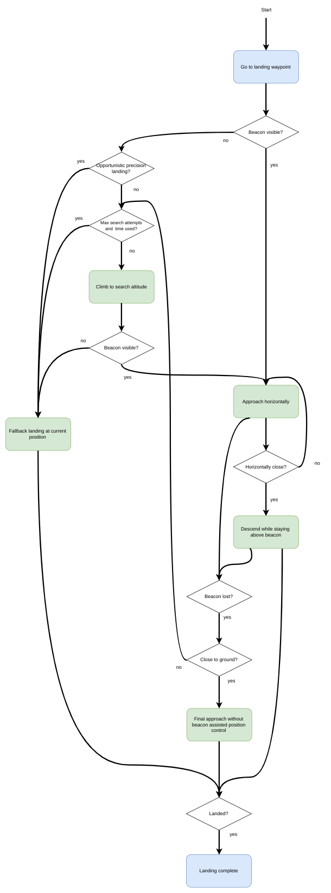

# 精准着陆

PX4 supports precision landing for _multicopters_ on either stationary or moving targets.
The target may be provided by an onboard IR sensor and a landing beacon, or by an offboard positioning system.

Precision landing can be [started/initiated](#initiating-a-precision-landing) as part of a [mission](#mission), in a [Return mode](#return-mode-precision-landing) landing, or by entering the [_Precision Land_ flight mode](#precision-landing-flight-mode).

:::info
Precision landing is only possible with a valid global position (due to a limitation in the current implementation of the position controller).
:::

## 综述

### Land Modes

A precision landing can be configured to either be "required" or "opportunistic".
The choice of mode affects how a precision landing is performed.

#### Required Mode

In _Required Mode_ the vehicle will search for a target if none is visible when landing is initiated.
The vehicle will perform a precision landing if a target is located.

The search procedure consists of climbing to the search altitude ([PLD_SRCH_ALT](../advanced_config/parameter_reference.md#PLD_SRCH_ALT)).
If the target is still not visible at the search altitude and after a search timeout ([PLD_SRCH_TOUT](../advanced_config/parameter_reference.md#PLD_SRCH_TOUT)), a normal landing is initiated at the current position.

:::info
If using an offboard positioning system PX4 assumes that the target is visible when it is receiving MAVLink [LANDING_TARGET](https://mavlink.io/en/messages/common.html#LANDING_TARGET) messages.
:::

#### Opportunistic Mode

In _Opportunistic Mode_ the vehicle will use precision landing _if_ (and only if) the target is visible when landing is initiated.
If it is not visible the vehicle immediately performs a _normal_ landing at the current position.

### Landing Phases

A precision landing has three phases:

1. **Horizontal approach:** The vehicle approaches the target horizontally while keeping its current altitude.
  Once the position of the target relative to the vehicle is below a threshold ([PLD_HACC_RAD](../advanced_config/parameter_reference.md#PLD_HACC_RAD)), the next phase is entered.
  If the target is lost during this phase (not visible for longer than [PLD_BTOUT](../advanced_config/parameter_reference.md#PLD_BTOUT)), a search procedure is initiated (during a required precision landing) or the vehicle does a normal landing (during an opportunistic precision landing).

2. **Descent over target:** The vehicle descends, while remaining centered over the target.
  If the target is lost during this phase (not visible for longer than `PLD_BTOUT`), a search procedure is initiated (during a required precision landing) or the vehicle does a normal landing (during an opportunistic precision landing).

3. **Final approach:** When the vehicle is close to the ground (closer than [PLD_FAPPR_ALT](../advanced_config/parameter_reference.md#PLD_FAPPR_ALT)), it descends while remaining centered over the target.
  If the target is lost during this phase, the descent is continued independent of the kind of precision landing.

Search procedures are initiated in the first and second steps, and will run at most [PLD_MAX_SRCH](../advanced_config/parameter_reference.md#PLD_MAX_SRCH) times.
Landing Phases Flow Diagram

A flow diagram showing the phases can be found in [landing phases flow Diagram](#landing-phases-flow-diagram) below.

## Initiating a Precision Landing

Precision landing can be used in missions, during the landing phase in _Return mode_, or by entering the _Precision Land_ mode.

<a id="mission"></a>

### Mission Precision Landing

Precision landing can be initiated as part of a [mission](../flying/missions.md) using [MAV_CMD_NAV_LAND](https://mavlink.io/en/messages/common.html#MAV_CMD_NAV_LAND) with `param2` set appropriately:

- `0`: Normal landing without using the target.
- `1`: [Opportunistic](#opportunistic-mode) precision landing.
- `2`: [Required](#required-mode) precision landing.

### Return Mode Precision Landing

Precision landing can be used in the [Return mode](../flight_modes_mc/return.md) landing phase.

This is enabled using the parameter [RTL_PLD_MD](../advanced_config/parameter_reference.md#RTL_PLD_MD), which takes the following values:

- `0`: Precision landing disabled (land as normal).
- `1`: [Opportunistic](#opportunistic-mode) precision landing.
- `2`: [Required](#required-mode) precision landing.

### Precision Landing Flight Mode

Precision landing can be enabled by switching to the _Precision Landing_ flight mode.

You can verify this using the [_QGroundControl_ MAVLink Console](../debug/mavlink_shell.md#qgroundcontrol-mavlink-console) to enter the following command:

```sh
commander mode auto:precland
```

:::info
When switching to the mode in this way, the precision landing is always "required"; there is no way to specify the type of landing.
:::

:::info
At time of writing is no _convenient_ way to directly invoke precision landing (other than commanding return mode):

- _QGroundControl_ does not provide it as a UI option.
- [MAV_CMD_NAV_LAND](https://mavlink.io/en/messages/common.html#MAV_CMD_NAV_LAND) only works in missions.
- [MAV_CMD_DO_SET_MODE](https://mavlink.io/en/messages/common.html#MAV_CMD_DO_SET_MODE) should work, but you will need to determine the appropriate base and custom modes used by PX4 to represent the precision landing mode.

:::

## 硬件安装

### IR Sensor/Beacon Setup

The IR sensor/landing beacon solution requires an [IR-LOCK Sensor](https://irlock.com/products/ir-lock-sensor-precision-landing-kit) and downward facing [distance sensor](../sensor/rangefinders.md) connected to the flight controller, and an IR beacon as a target (e.g. [IR-LOCK MarkOne](https://irlock.com/collections/markone)).
This enables landing with a precision of roughly 10 cm (GPS precision, by contrast, may be as large as several meters).

Install the IR-LOCK sensor by following the [official guide](https://irlock.readme.io/v2.0/docs).
Ensure that the sensor's x axis is aligned with the vehicle's y axis and the sensor's y axis aligned with the vehicle's -x direction (this is the case if the camera is pitched down 90 degrees from facing forward).

Install a [range/distance sensor](../sensor/rangefinders.md) (the _LidarLite v3_ has been found to work well).

:::info
Many infrared based range sensors do not perform well in the presence of the IR-LOCK beacon.
Refer to the IR-LOCK guide for other compatible sensors.
:::

## Offboard Positioning

The offboard solution requires a positioning system that implements the MAVLink [Landing Target Protocol](https://mavlink.io/en/services/landing_target.html).
This can use any positioning mechanism to determine the landing target, for example computer vision and a visual marker.

The system must publish the coordinates of the target in the [LANDING_TARGET](https://mavlink.io/en/messages/common.html#LANDING_TARGET) message.
Note that PX4 _requires_ `LANDING_TARGET.frame` to be [MAV_FRAME_LOCAL_NED](https://mavlink.io/en/messages/common.html#MAV_FRAME_LOCAL_NED) and only populates the fields `x`, `y`, and `z`.
The origin of the local NED frame [0,0] is the home position (you can map this home position to global coordinates using [GPS_GLOBAL_ORIGIN](https://mavlink.io/en/messages/common.html#GPS_GLOBAL_ORIGIN)).

PX4 does not explicitly require a [distance sensor](../sensor/rangefinders.md) or other sensors, but will perform better if it can more precisely determine its own position.

## Firmware Configuration

Precision landing requires the modules `irlock` and `landing_target_estimator`.
These are included in PX4 firmware by default, for most flight controllers.

They are not included by default on FMUv2-based controllers.
On these, and other boards where they are not included, you can add them by setting the following keys to 'y' in the relevant configuration file for your flight controller (e.g. as done here for FMUv5: [PX4-Autopilot/boards/px4/fmu-v5/default.px4board](https://github.com/PX4/PX4-Autopilot/blob/main/boards/px4/fmu-v5/default.px4board)):

```
CONFIG_DRIVERS_IRLOCK=y
CONFIG_MODULES_LANDING_TARGET_ESTIMATOR=y
```

## PX4 Configuration (Parameters)

The IR-Lock sensor is disabled by default.
Enable it by setting [SENS_EN_IRLOCK](../advanced_config/parameter_reference.md#SENS_EN_IRLOCK) to `1` (true).

[LTEST_MODE](../advanced_config/parameter_reference.md#LTEST_MODE) determines if the target is assumed to be stationary or moving.
If `LTEST_MODE` is set to moving (e.g. it is installed on a vehicle on which the multicopter is to land), target measurements are only used to generate position setpoints in the precision landing controller.
If `LTEST_MODE` is set to stationary, the target measurements are also used by the vehicle position estimator (EKF2 or LPE).

Other relevant parameters are listed in the parameter reference under [Landing_target estimator](../advanced_config/parameter_reference.md#landing-target-estimator) and [Precision land](../advanced_config/parameter_reference.md#precision-land) parameters.
Some of the most useful ones are listed below.

| 参数                                                                                                                                              | 描述                                                                                                                                                                                                  |
| ----------------------------------------------------------------------------------------------------------------------------------------------- | --------------------------------------------------------------------------------------------------------------------------------------------------------------------------------------------------- |
| <a id="SENS_EN_IRLOCK"></a>[SENS_EN_IRLOCK](../advanced_config/parameter_reference.md#SENS_EN_IRLOCK) | IR-LOCK Sensor (external I2C). Disable: `0` (default): Enable: `1`).          |
| <a id="LTEST_MODE"></a>[LTEST_MODE](../advanced_config/parameter_reference.md#LTEST_MODE)                                  | Landing target is moving (`0`) or stationary (`1`). Default is moving.                                                        |
| <a id="PLD_HACC_RAD"></a>[PLD_HACC_RAD](../advanced_config/parameter_reference.md#PLD_HACC_RAD)       | Horizontal acceptance radius, within which the vehicle will start descending. Default is 0.2m.                                                      |
| <a id="PLD_BTOUT"></a>[PLD_BTOUT](../advanced_config/parameter_reference.md#PLD_BTOUT)                                     | Landing Target Timeout, after which the target is assumed lost. Default is 5 seconds.                                                                               |
| <a id="PLD_FAPPR_ALT"></a>[PLD_FAPPR_ALT](../advanced_config/parameter_reference.md#PLD_FAPPR_ALT)    | Final approach altitude. Default is 0.1 metres.                                                                                                     |
| <a id="PLD_MAX_SRCH"></a>[PLD_MAX_SRCH](../advanced_config/parameter_reference.md#PLD_MAX_SRCH)       | Maximum number of search attempts in an required landing.                                                                                                                           |
| <a id="RTL_PLD_MD"></a>[RTL_PLD_MD](../advanced_config/parameter_reference.md#RTL_PLD_MD)             | RTL precision land mode. `0`: disabled, `1`: [Opportunistic](#opportunistic-mode), `2`: [Required](#required-mode). |

### IR Beacon Scaling

Measurement scaling may be necessary due to lens distortions of the IR-LOCK sensor.

[LTEST_SCALE_X](../advanced_config/parameter_reference.md#LTEST_SCALE_X) and [LTEST_SCALE_Y](../advanced_config/parameter_reference.md#LTEST_SCALE_Y) can be used to scale beacon measurements before they are used to estimate the beacon's position and velocity relative to the vehicle.
Note that `LTEST_SCALE_X` and `LTEST_SCALE_Y` are considered in the sensor frame, not the vehicle frame.

To calibrate these scale parameters, set `LTEST_MODE` to moving, fly your multicopter above the beacon and perform forward-backward and left-right motions with the vehicle, while [logging](../dev_log/logging.md#configuration) `landing_target_pose` and `vehicle_local_position`.
Then, compare `landing_target_pose.vx_rel` and `landing_target_pose.vy_rel` to `vehicle_local_position.vx` and `vehicle_local_position.vy`, respectively (both measurements are in NED frame).
If the estimated beacon velocities are consistently smaller or larger than the vehicle velocities, adjust the scale parameters to compensate.

If you observe slow sideways oscillations of the vehicle while doing a precision landing with `LTEST_MODE` set to stationary, the beacon measurements are likely scaled too high and you should reduce the scale parameter in the relevant direction.

## 仿真

Precision landing with the IR-LOCK sensor and beacon can be simulated in [Gazebo Classic](../sim_gazebo_classic/index.md).

To start the simulation with the world that contains a IR-LOCK beacon and a vehicle with a range sensor and IR-LOCK camera, run:

```sh
make px4_sitl gazebo-classic_iris_irlock
```

You can change the location of the beacon either by moving it in the Gazebo Classic GUI or by changing its location in the [Gazebo world](https://github.com/PX4/PX4-SITL_gazebo-classic/blob/main/worlds/iris_irlock.world#L42).

## Operating Principles

### Landing Target Estimator

The `landing_target_estimator` takes measurements from the `irlock` driver as well as the estimated terrain height to estimate the beacon's position relative to the vehicle.

The measurements in `irlock_report` contain the tangent of the angles from the image center to the beacon.
In other words, the measurements are the x and y components of the vector pointing towards the beacon, where the z component has length "1".
This means that scaling the measurement by the distance from the camera to the beacon results in the vector from the camera to the beacon.
This relative position is then rotated into the north-aligned, level body frame using the vehicle's attitude estimate.
Both x and y components of the relative position measurement are filtered in separate Kalman Filters, which act as simple low-pass filters that also produce a velocity estimate and allow for outlier rejection.

The `landing_target_estimator` publishes the estimated relative position and velocity whenever a new `irlock_report` is fused into the estimate.
Nothing is published if the beacon is not seen or beacon measurements are rejected.
The landing target estimate is published in the `landing_target_pose` uORB message.

### Enhanced Vehicle Position Estimation

If the target is specified to be stationary using the parameter `LTEST_MODE`, the vehicle's position/velocity estimate can be improved with the help of the target measurements.
This is done by fusing the target's velocity as a measurement of the negative velocity of the vehicle.

### Landing Phases Flow Diagram

This image shows the [landing phases](#landing-phases) as a flow diagram.


