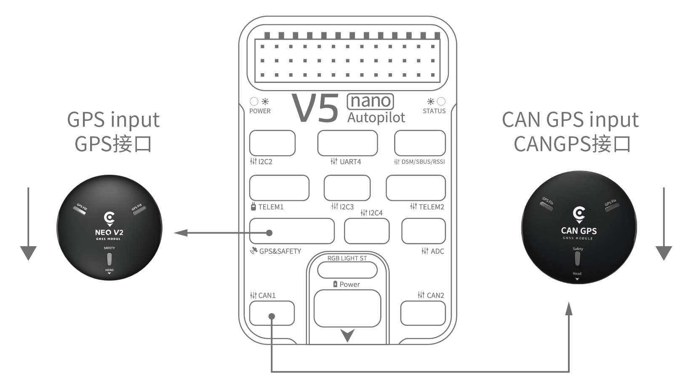
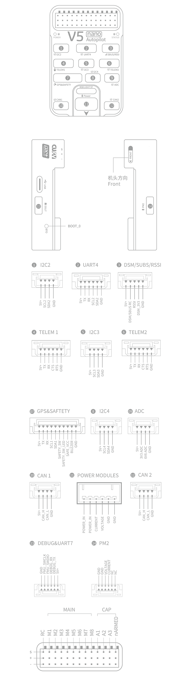

# 雷迅CUAV V5 nano飞控接线快速入门

:::warning
PX4 does not manufacture this (or any) autopilot.
Contact the [manufacturer](https://store.cuav.net/) for hardware support or compliance issues.
:::

This quick start guide shows how to power the [CUAV V5 nano](../flight_controller/cuav_v5_nano.md) flight controller and connect its most important peripherals.

## 接线图概述

下图展示了如何连接最重要的传感器和外围设备（电机和伺服舵机输出除外）。
我们将在下面各节中介绍它们的细节。

| 主要接口                           | 功能                                                                                  |
| :----------------------------- | :---------------------------------------------------------------------------------- |
| 电源                             | 连接电源模块；提供能量、模拟电压和电流测量。                                                              |
| PM2                            | [Do not use with PX4](../flight_controller/cuav_v5_nano.md#compatibility_pm2)       |
| TF CARD                        | 用于日志存储的SD卡（随卡提供）                                                                    |
| M1~M8          | PWM 输出接口。 可以使用它控制电机或舵机。                                                             |
| A1~A3          | Capture pins (not _currently_ supported on PX4). |
| nARMED                         | 表示 FMU 处于待命状态。 低电平时表示激活（待命时是低电平）。                                                   |
| DSU7                           | 用于 FMU 调试，读取调试信息。                                                                   |
| I2C2/I2C3/I2C4                 | 连接I2C总线设备；比如外部的罗盘。                                                                  |
| CAN1/CAN2                      | 用于连接 UAVCAN 设备，比如 CAN GPS。                                                          |
| TYPE-C(USB) | 连接到计算机，以便在飞控和计算机之间进行通信，例如加载固件。                                                      |
| GPS&SAFETY | 连接到 Neo GPS，其中包括GPS、安全开关、蜂鸣器接口。                                                     |
| TELEM1/TELEM2                  | 连接到数传电台                                                                             |
| DSM/SBUS/RSSI                  | 包含DSM、SBUS、RSSI信号输入接口；DSM接口可以连接DSM卫星接收机，SBUS接口可以连接SBUS总线的遥控器接收机，RSSI连接RSSI信号强度回传模块。 |

:::info
For more interface information, please read [V5 nano Manual](http://manual.cuav.net/V5-nano.pdf).
:::

:::info
If the controller cannot be mounted in the recommended/default orientation (e.g. due to space constraints) you will need to configure the autopilot software with the orientation that you actually used: [Flight Controller Orientation](../gps_compass/rtk_gps.md).
:::

## GPS + 罗盘 + 安全开关 + LED

The recommended GPS module is the _Neo v2 GPS_, which contains GPS, compass, safety switch, buzzer, LED status light.

:::info
Other GPS modules may not work (see [this compatibility issue](../flight_controller/cuav_v5_nano.md#compatibility_gps)).
:::

The GPS/Compass module should be [mounted on the frame](../assembly/mount_gps_compass.md) as far away from other electronics as possible, with the direction marker towards the front of the vehicle (Neo GPS arrow is in the same direction as the flight control arrow).
Connect to the flight control GPS interface using a cable.

:::info
If you use CAN GPS, please use the cable to connect to the flight control CAN interface.
:::

## 安全开关

The dedicated safety switch that comes with the V5+ is only required if you are not using the recommended _Neo v2 GPS_ (which has an inbuilt safety switch).

If you are flying without the GPS you must attach the switch directly to the `GPS1` port in order to be able to arm the vehicle and fly (If you use the old 6-pin GPS, please read the definition of the bottom interface to change the line).

## 蜂鸣器

If you do not use the recommended _Neo v2 GPS_ the buzzer may not work.

## 遥控器

A remote control (RC) radio system is required if you want to manually control your vehicle (PX4 does not require a radio system for autonomous flight modes).
将 <em>HW\\u PM</em> 模块的6针连接器连接到飞控的<code>电源</code>接口。

The figure below shows how you can access your remote receiver (please find the S.Bus cable in the kit)

## Spektrum 卫星接收器

通信频道是通过数传无线电实现的。
If using a Spektrum satellite receiver, this should be connected to the flight controller `DSM/SBUS/RSSI` interface.

## 电源

The _v5 nano_ kit includes the _HV_PM_ module, which supports 2~14S LiPo batteries.
Connect the 6pin connector of the _HW_PM_ module to the flight control `Power` interface.

:::warning
The supplied power module is unfused.
Power **must** be turned off while connecting peripherals.
:::

:::info
The power module is not a power source for peripherals connected to the PWM outputs.
If you're connecting servos/actuators you will need to separately power them using a BEC.
:::

## 数传系统（可选）

A telemetry system allows you to communicate with, monitor, and control a vehicle in flight from a ground station (for example, you can direct the UAV to a particular position, or upload a new mission).

The communication channel is via Telemetry Radios.
The vehicle-based radio should be connected to the **TELEM1** or **TELEM2** port (if connected to these ports, no further configuration is required).
The other radio is connected to your ground station computer or mobile device (usually via USB).

## SD 卡

An [SD card](../getting_started/px4_basic_concepts.md#sd-cards-removable-memory) is inserted in the factory (you do not need to do anything).

## 电机

Motors/servos are connected to the MAIN ports in the order specified for your vehicle in the [Airframes Reference](../airframes/airframe_reference.md).

## 针脚定义

## 更多信息

- [Airframe buildlog using CUAV v5 nano on a DJI FlameWheel450](../frames_multicopter/dji_f450_cuav_5nano.md)
- [CUAV V5 nano](../flight_controller/cuav_v5_nano.md)
- [V5 nano manual](http://manual.cuav.net/V5-nano.pdf) (CUAV)
- [FMUv5 reference design pinout](https://docs.google.com/spreadsheets/d/1-n0__BYDedQrc_2NHqBenG1DNepAgnHpSGglke-QQwY/edit#gid=912976165) (CUAV)
- [CUAV Github](https://github.com/cuav) (CUAV)
