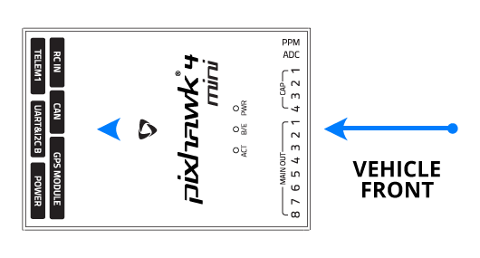

# _Pixhawk 4 Mini_ Wiring Quick Start

:::warning
PX4 does not manufacture this (or any) autopilot.
Contact the [manufacturer](https://holybro.com/) for hardware support or compliance issues.
:::

This quick start guide shows how to power the [_Pixhawk&reg; 4 Mini_](../flight_controller/pixhawk4_mini.md) flight controller and connect its most important peripherals.

## 接线图概述

The image below shows where to connect the most important sensors and peripherals (except for motors and servos).

:::tip
More information about available ports can be found here: [_Pixhawk 4 Mini_ > Interfaces](../flight_controller/pixhawk4_mini.md#interfaces).
:::

## 飞控的安装和方向

_Pixhawk 4 Mini_ should be mounted on your frame using vibration-damping foam pads (included in the kit).
It should be positioned as close to your vehicle’s center of gravity as possible, oriented top-side up with the arrow pointing towards the front of the vehicle.

:::info
If the controller cannot be mounted in the recommended/default orientation (e.g. due to space constraints) you will need to configure the autopilot software with the orientation that you actually used: [Flight Controller Orientation](../config/flight_controller_orientation.md).
:::

## GPS + 指南针 + 蜂鸣器 + 安全开关 + LED

Attach the provided GPS with integrated compass, safety switch, buzzer, and LED to the **GPS MODULE** port. The GPS/Compass should be [mounted on the frame](../assembly/mount_gps_compass.md) as far away from other electronics as possible, with the direction marker towards the front of the vehicle (separating the compass from other electronics will reduce interference).

:::info
The GPS module's integrated safety switch is enabled _by default_ (when enabled, PX4 will not let you arm the vehicle).
To disable the safety press and hold the safety switch for 1 second.
You can press the safety switch again to enable safety and disarm the vehicle (this can be useful if, for whatever reason, you are unable to disarm the vehicle from your remote control or ground station).
:::

## 电源

The Power Management Board (PMB) serves the purpose of a power module as well as a power distribution board.
In addition to providing regulated power to _Pixhawk 4 Mini_ and the ESCs, it sends information to the autopilot about the battery’s voltage and current draw.

Connect the output of the PMB that comes with the kit to the **POWER** port of the _Pixhawk 4 Mini_ using a 6-wire cable.
The connections of the PMB, including power supply and signal connections to the ESCs and servos, are explained in the image below.

:::info
The image above only shows the connection of a single ESC and a single servo.
Connect the remaining ESCs and servos similarly.
:::

| Pin(s) 或连接器 | 功能                                                                         |
| ------------------------------ | -------------------------------------------------------------------------- |
| B+                             | 连接到 ESC电调B+以为 ESC电调供电                                                      |
| GND                            | 连接到 ESC电调负极                                                                |
| PWR                            | JST-GH 6-pin Connector, 5V 3A output  connect to _Pixhawk 4 Mini_ POWER |
| BAT                            | 电源输入，连接到2~12S的LiPo电池                                       |

The pinout of the _Pixhawk 4 Mini_ **POWER** port is shown below.
The `CURRENT` signal should carry an analog voltage from 0-3.3V for 0-120A as default.
The `VOLTAGE` signal should carry an analog voltage from 0-3.3V for 0-60V as default.
The VCC lines have to offer at least 3A continuous and should default to 5.1V. A lower voltage of 5V is still acceptable, but discouraged.

| 针脚   | 信号  | 电压                    |
| ---- | --- | --------------------- |
| 1（红） | VCC | +5V                   |
| 2（黑） | VCC | +5V                   |
| 3（黑） | 电流  | +3.3V |
| 4（黑） | 电压  | +3.3V |
| 5（黑） | GND | GND                   |
| 6（黑） | GND | GND                   |

:::info
If using a plane or rover, the 8 pin power (+) rail of **MAIN OUT** will need to be separately powered in order to drive servos for rudders, elevons, etc.
To do this, the power rail needs to be connected to a BEC equipped ESC, a standalone 5V BEC, or a 2S LiPo battery.
Be careful with the voltage of servo you are going to use here.
:::

<!--In the future, when Pixhawk 4 kit is available, add wiring images/videos for different airframes.-->

:::info
Using the Power Module that comes with the kit you will need to configure the _Number of Cells_ in the [Power Settings](https://docs.qgroundcontrol.com/master/en/qgc-user-guide/setup_view/power.html) but you won't need to calibrate the _voltage divider_.
You will have to update the _voltage divider_ if you are using any other power module (e.g. the one from the Pixracer).
:::

## 遥控器

A remote control (RC) radio system is required if you want to _manually_ control your vehicle (PX4 does not require a radio system for autonomous flight modes).

You will need to [select a compatible transmitter/receiver](../getting_started/rc_transmitter_receiver.md) and then _bind_ them so that they communicate (read the instructions that come with your specific transmitter/receiver).

The instructions below show how to connect the different types of receivers to _Pixhawk 4 Mini_:

- Spektrum/DSM or S.BUS receivers connect to the **DSM/SBUS RC** input.

  

- PPM receivers connect to the **PPM RC** input port.

  

- PPM and PWM receivers that have an _individual wire for each channel_ must connect to the **PPM RC** port _via a PPM encoder_ [like this one](http://www.getfpv.com/radios/radio-accessories/holybro-ppm-encoder-module.html) (PPM-Sum receivers use a single signal wire for all channels).

For more information about selecting a radio system, receiver compatibility, and binding your transmitter/receiver pair, see: [Remote Control Transmitters & Receivers](../getting_started/rc_transmitter_receiver.md).

## Telemetry Radio (Optional)

Telemetry radios may be used to communicate and control a vehicle in flight from a ground station (for example, you can direct the UAV to a particular position, or upload a new mission).

The vehicle-based radio should be connected to the **TELEM1** port as shown below (if connected to this port, no further configuration is required).
The other radio is connected to your ground station computer or mobile device (usually by USB).

## SD卡（可选）

SD cards are highly recommended as they are needed to [log and analyse flight details](../getting_started/flight_reporting.md), to run missions, and to use UAVCAN-bus hardware.
Insert the card (included in the kit) into _Pixhawk 4 Mini_ as shown below.

:::tip
For more information see [Basic Concepts > SD Cards (Removable Memory)](../getting_started/px4_basic_concepts.md#sd-cards-removable-memory).
:::

## 电机

Motors/servos are connected to the **MAIN OUT** ports in the order specified for your vehicle in the [Airframe Reference](../airframes/airframe_reference.md). See [_Pixhawk 4 Mini_ > Supported Platforms](../flight_controller/pixhawk4_mini.md#supported-platforms) for more information.

:::info
This reference lists the output port to motor/servo mapping for all supported air and ground frames (if your frame is not listed in the reference then use a "generic" airframe of the correct type).
:::

:::warning
The mapping is not consistent across frames (e.g. you can't rely on the throttle being on the same output for all plane frames).
Make sure to use the correct mapping for your vehicle.
:::

## 其它外设

The wiring and configuration of optional/less common components is covered within the topics for individual [peripherals](../peripherals/index.md).

## 配置

General configuration information is covered in: [Autopilot Configuration](../config/index.md).

QuadPlane specific configuration is covered here: [QuadPlane VTOL Configuration](../config_vtol/vtol_quad_configuration.md)

<!-- Nice to have detailed wiring infographic and instructions for different vehicle types. -->

## 更多信息

- [_Pixhawk 4 Mini_](../flight_controller/pixhawk4_mini.md)
