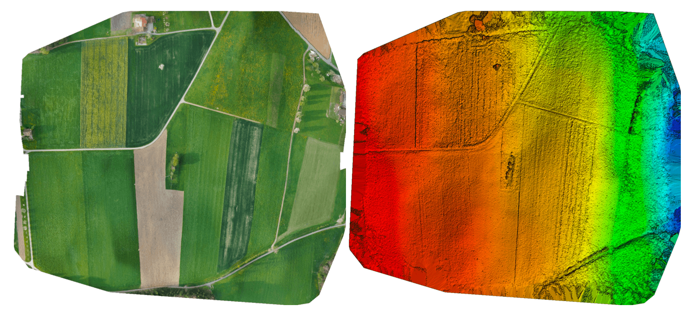

# Cameras Connected to Flight Controller Outputs

This topic explains how to use PX4 with a [camera](../camera/index.md) that is attached to flight controller outputs.

:::warning
[MAVLink cameras](../camera/mavlink_v2_camera.md) that use the [MAVLink Camera Protocol v2](https://mavlink.io/en/services/camera.html) are recommended.
:::

## 综述

PX4 can trigger a [camera](../camera/index.md) connected to flight controller outputs using [camera commands](#mavlink-command-interface) in missions or sent by a ground control stations.
The supported commands are a subset of those defined in the MAVLink [Camera Protocol v1](https://mavlink.io/en/services/camera.html).

Whenever a camera is triggered, the MAVLink [CAMERA_TRIGGER](https://mavlink.io/en/messages/common.html#CAMERA_TRIGGER) message is published containing the current session's image _sequence number_ and the corresponding timestamp.
This timestamp can be used for several purposes, including: timestamping photos for aerial surveying and reconstruction, synchronising a multi-camera system or visual-inertial navigation.

The camera can be connected to different outputs, including PWM outputs, GPIO outputs, and a Seagull MAP2 via PWM outputs.

Cameras can also (optionally) signal PX4 at the exact moment that a photo/frame is taken using a [camera capture pin](#camera-capture-configuration) that is attached to their hot shoe.
This allows more precise mapping of images to GPS position for geotagging, or the right IMU sample for VIO synchronization, etc.

<!-- Camera trigger driver: https://github.com/PX4/PX4-Autopilot/tree/main/src/drivers/camera_trigger -->

<!-- Camera capture driver: https://github.com/PX4/PX4-Autopilot/tree/main/src/drivers/camera_capture -->

## MAVLink Command Interface

PX4 supports the following MAVLink commands for FC-connected cameras, in both missions and if received from a GCS:

- [MAV_CMD_DO_SET_CAM_TRIGG_INTERVAL](#mav-cmd-do-set-cam-trigg-interval) — set time interval between captures.
- [MAV_CMD_DO_SET_CAM_TRIGG_DIST](#mav-cmd-do-set-cam-trigg-dist) — set distance between captures
- [MAV_CMD_DO_TRIGGER_CONTROL](#mav-cmd-do-trigger-control) — start/stop capturing (using distance or time, as defined using above messages).
- [MAV_CMD_OBLIQUE_SURVEY](#mav-cmd-oblique-survey) — start/stop oblique survey
- [MAV_CMD_DO_DIGICAM_CONTROL](#mav-cmd-do-digicam-control) — test-shoot the camera from the GCS.

The supported behaviour is listed below (these do not precisely match the MAVLink specification).

### MAV_CMD_DO_TRIGGER_CONTROL

[MAV_CMD_DO_TRIGGER_CONTROL](https://mavlink.io/en/messages/common.html#MAV_CMD_DO_TRIGGER_CONTROL) - Accepted in "command controlled" mode (`TRIG_MODE` 1).

| Command Parameter | 描述                                                                                                                                                                 |
| ----------------- | ------------------------------------------------------------------------------------------------------------------------------------------------------------------ |
| Param #1          | Trigger enable/disable. `1`: enable (start), `0`: disable.                      |
| Param #2          | Reset trigger sequence. `1`: reset, any other value does nothing.                                                  |
| Param #3          | Pause triggering, but without switching the camera off or retracting it. `1`: pause, `0`: restart. |

<!-- https://github.com/PX4/PX4-Autopilot/blob/main/src/drivers/camera_trigger/camera_trigger.cpp#L549 -->

### MAV_CMD_DO_DIGICAM_CONTROL

[MAV_CMD_DO_DIGICAM_CONTROL](https://mavlink.io/en/messages/common.html#MAV_CMD_DO_DIGICAM_CONTROL) - Accepted in all modes.

This is used by the GCS to test-shoot the camera from the user interface.
The trigger driver does not support all camera control parameters defined by the MAVLink spec.

| Command Parameter | 描述                                                                                                      |
| ----------------- | ------------------------------------------------------------------------------------------------------- |
| Param #5          | Trigger one-shot command (set to 1 to trigger a single image frame). |

### MAV_CMD_DO_SET_CAM_TRIGG_DIST

[MAV_CMD_DO_SET_CAM_TRIGG_DIST](https://mavlink.io/en/messages/common.html#MAV_CMD_DO_SET_CAM_TRIGG_DIST) - Accepted in "mission controlled" mode (`TRIG_MODE` 4)

This command is autogenerated during missions to trigger the camera based on survey missions from the GCS.

### MAV_CMD_DO_SET_CAM_TRIGG_INTERVAL

[MAV_CMD_DO_SET_CAM_TRIGG_INTERVAL](https://mavlink.io/en/messages/common.html#MAV_CMD_DO_SET_CAM_TRIGG_INTERVAL)

### MAV_CMD_OBLIQUE_SURVEY

[MAV_CMD_OBLIQUE_SURVEY](https://mavlink.io/en/messages/common.html#MAV_CMD_OBLIQUE_SURVEY) - Mission command to set a camera auto mount pivoting oblique survey.

This accepts `param1` to `param4` as defined in the MAVLink message definition.
The shutter integration setting (`param2`) is only obeyed with a GPIO backend.

<!-- https://github.com/PX4/PX4-Autopilot/blob/main/src/drivers/camera_trigger/camera_trigger.cpp#L632 -->

## Trigger Configuration

Cameras can be connected to the FC for triggering using different intefaces, such as PWM, and GPIO, by specifying the appropriate [trigger interface backend](#trigger-interface-backends).
You can also indicate the camera [trigger mode](#trigger-modes).

This configuration can most easily be done from the _QGroundControl_ [Vehicle Setup > Camera](https://docs.qgroundcontrol.com/master/en/qgc-user-guide/setup_view/camera.html#px4-camera-setup) section.


The different [trigger modes](#trigger-modes), [backend interfaces](#trigger-interface-backends) and [trigger output configuration](#trigger-output-pin-configuration) are described below (these can also be set directly from [parameters](../advanced_config/parameters.md)).

:::info
The camera settings section is not available by default for FMUv2-based flight controllers (e.g. 3DR Pixhawk) because the camera module is not automatically included in firmware.
For more information see [Finding/Updating Parameters > Parameters Not In Firmware](../advanced_config/parameters.md#parameter-not-in-firmware).
:::

### Trigger Modes

Four different modes are supported, controlled by the [TRIG_MODE](../advanced_config/parameter_reference.md#TRIG_MODE) parameter:

| Mode | 描述                                                                                                                                                                                                                                             |
| ---- | ---------------------------------------------------------------------------------------------------------------------------------------------------------------------------------------------------------------------------------------------- |
| 0    | Camera triggering is disabled.                                                                                                                                                                                                 |
| 1    | Works like a basic intervalometer that can be enabled and disabled by using the MAVLink command `MAV_CMD_DO_TRIGGER_CONTROL`. See [command interface](#mavlink-command-interface) for more details.            |
| 2    | Switches the intervalometer constantly on.                                                                                                                                                                                     |
| 3    | Triggers based on distance. A shot is taken every time the set horizontal distance is exceeded. The minimum time interval between two shots is however limited by the set triggering interval. |
| 4    | Triggers automatically when flying a survey in Mission mode.                                                                                                                                                                   |

:::info
If it is your first time enabling the camera trigger app, remember to reboot after changing the `TRIG_MODE` parameter.
:::

### Trigger Interface Backends

The camera trigger driver supports several backends - each for a specific application, controlled by the [TRIG_INTERFACE](../advanced_config/parameter_reference.md#TRIG_INTERFACE) parameter:

| Number | 描述                                                                                                                                                                                                                                                                                                                                                                                                                                                                                                                                                                                                                     |
| ------ | ---------------------------------------------------------------------------------------------------------------------------------------------------------------------------------------------------------------------------------------------------------------------------------------------------------------------------------------------------------------------------------------------------------------------------------------------------------------------------------------------------------------------------------------------------------------------------------------------------------------------- |
| 1      | Enables the GPIO interface. The AUX outputs are pulsed high or low (depending on the `TRIG_POLARITY` parameter) every [TRIG_INTERVAL](../advanced_config/parameter_reference.md#TRIG_INTERVAL) duration. This can be used to trigger most standard machine vision cameras directly. Note that on PX4FMU series hardware (Pixhawk, Pixracer, etc.), the signal level on the AUX pins is 3.3v.                                                                |
| 2      | Enables the Seagull MAP2 interface. This allows the use of the [Seagull MAP2](http://www.seagulluav.com/product/seagull-map2/) to interface to a multitude of supported cameras. Pin/Channel 1 (camera trigger) and Pin/Channel 2 (mode selector) of the MAP2 should be connected to the lower and higher mapped [camera trigger pins](#trigger-output-pin-configuration). Using Seagull MAP2, PX4 also supports automatic power control and keep-alive functionalities of Sony Multiport cameras like the QX-1. |
| 3      | This mode enables MAVLink cameras that used the legacy [MAVLink interface listed above](#mavlink-command-interface). The messages are automatically emitted on the MAVLink `onboard` channel when found in missions. PX4 emits the `CAMERA_TRIGGER` MAVLink message when a camera is triggered, by default to the `onboard` channel (if this is not used, custom stream will need to be enabled). [Simple MAVLink cameras](../camera/mavlink_v1_camera.md) explains this use case in more detail.                                   |
| 4      | Enables the generic PWM interface. This allows the use of [infrared triggers](https://hobbyking.com/en_us/universal-remote-control-infrared-shutter-ir-rc-1g.html) or servos to trigger your camera.                                                                                                                                                                                                                                                                                                                                                                                   |

### Trigger Output Pin Configuration

Camera trigger pins are set in the _QGroundControl_ [Actuators](../config/actuators.md) configuration screen.

The trigger pins can be set by assigning the `Camera_Trigger` function on any FMU output.
If using trigger setup that requires two pins (e.g. Seagull MAP2) you can assign to any two outputs.

Note however that if a _PWM_ output has been used for camera triggering (such as Seagull MAP2), the whole PWM group cannot be used for anything else (you can't use another output in the group for an actuator, motor, or camera capture, because the timer has already been used).

:::info
At time of writing triggering only works on FMU pins:

- On a Pixhawk flight controller that has both FMU and I/O boards FMU pins map to `AUX` outputs (e.g. Pixhawk 4, CUAV v5+) .
- A controller that only has an FMU, the pins map to `MAIN` outputs (e.g. Pixhawk 4 mini, CUAV v5 nano).

:::

### 其他参数

| 参数                                                                                                                 | 描述                                                                                                                                                                                                                                                                      |
| ------------------------------------------------------------------------------------------------------------------ | ----------------------------------------------------------------------------------------------------------------------------------------------------------------------------------------------------------------------------------------------------------------------- |
| [TRIG_POLARITY](../advanced_config/parameter_reference.md#TRIG_POLARITY)                      | Relevant only while using the GPIO interface. Sets the polarity of the trigger pin. Active high means that the pin is pulled low normally and pulled high on a trigger event. Active low is vice-versa. |
| [TRIG_INTERVAL](../advanced_config/parameter_reference.md#TRIG_INTERVAL)                      | Defines the time between two consecutive trigger events in milliseconds.                                                                                                                                                                                |
| [TRIG_ACT_TIME](../advanced_config/parameter_reference.md#TRIG_ACT_TIME) | Defines the time in milliseconds the trigger pin is held in the "active" state before returning to neutral. In PWM modes, the minimum is limited to 40 ms to make sure we always fit an activate pulse into the 50Hz PWM signal.        |

The full list of parameters pertaining to the camera trigger module can be found on the [parameter reference](../advanced_config/parameter_reference.md#camera-trigger) page.

## Camera Capture Configuration

Cameras can also (optionally) use a camera capture pin to signal the exact moment when a photo/frame is taken.
This allows more precise mapping of images to GPS position for geotagging, or the right IMU sample for VIO synchronization, etc.

Camera capture/feedback is enabled in PX4 by setting [CAM_CAP_FBACK = 1](../advanced_config/parameter_reference.md#CAM_CAP_FBACK).
The pin used for camera capture is then set in the _QGroundControl_ [Actuators](../config/actuators.md) configuration screen by assigning the `Camera_Capture` function on any FMU output.

Note that if a _PWM output_ is used as a camera capture input, the whole PWM group cannot be used for anything else (you can't use another output in the group for an actuator, motor, or camera trigger, because the timer has already been used).

:::info
At time of writing camera capture only works on FMU pins:

- On a Pixhawk flight controller that has both FMU and I/O boards FMU pins map to `AUX` outputs (e.g. Pixhawk 4, CUAV v5+).
- A controller that only has an FMU, the pins map to `MAIN` outputs (e.g. Pixhawk 4 mini, CUAV v5 nano).

:::

PX4 detects a rising edge with the appropriate voltage level on the camera capture pin (for Pixhawk flight controllers this is normally 3.3V).
If the camera isn't outputting an appropriate voltage, then additional circuitry will be required to make the signal compatible.

Cameras that have a hotshoe connector (for connecting a flash) can usually be connected via a hotshoe-adaptor.
For example, the [Seagull #SYNC2 Universal Camera Hot Shoe Adapter](https://www.seagulluav.com/product/seagull-sync2/) is an optocoupler that decouples and shifts the flash voltage to the Pixhawk voltage.
This slides into the flash slot on the top of the camera.
The red and black ouptputs are connected to the servo rail/ground and the white wire is connected to the input capture pin.


:::info
PX4 emits the MAVLink [CAMERA_TRIGGER](https://mavlink.io/en/messages/common.html#CAMERA_TRIGGER) message on both camera trigger and camera capture.
If camera capture is configured, the timestamp from the camera capture driver is used, otherwise the triggering timestamp.
:::

## Testing Trigger Functionality

:::warning
The following sections are out of date and need retesting.
:::

1. On the PX4 console:

  ```shell
  camera_trigger test
  ```

2. From _QGroundControl_:

  Click on **Trigger Camera** in the main instrument panel.
  These shots are not logged or counted for geotagging.

  

## Sony QX-1 example (Photogrammetry)



In this example, we will use a Seagull MAP2 trigger cable to interface to a Sony QX-1 and use the setup to create orthomosaics after flying a fully autonomous survey mission.

### Trigger Settings

The recommended camera settings are:

- `TRIG_INTERFACE=2` (Seagull MAP2).
- `TRIG_MODE=4` (Mission controlled).
- Leave the remaining parameters at their defaults.

You will need to connect the Seagull MAP2 to FMU pins on your autopilot.
The other end of the MAP2 cable will go into the QX-1's "MULTI" port.

### Camera Configuration

We use a Sony QX-1 with a 16-50mm f3.5-5.6 lens for this example.

To avoid autofocus and metering lag when the camera is triggered, the following guidelines should be followed:

- Manual focus to infinity
- Set camera to continuous shooting mode
- Manually set exposure and aperture
- ISO should be set as low as possible
- Manual white balance suitable for scene

### Mission Planning


### Geotagging

Download/copy the logfile and images from the flight and point QGroundControl to them.
Then click on **Start Tagging**.


You can verify the geotagging using a free online service like [Pic2Map](https://www.pic2map.com/).
Note that Pic2Map is limited to only 40 images.

### Reconstruction

We use [Pix4D](https://pix4d.com/) for 3D reconstruction.


## Camera-IMU sync example (VIO)

In this example, we will go over the basics of synchronising IMU measurements with visual data to build a stereo Visual-Inertial Navigation System (VINS).
To be clear, the idea here isn't to take an IMU measurement exactly at the same time as we take a picture but rather to correctly time stamp our images so as to provide accurate data to our VIO algorithm.

The autopilot and companion have different clock bases (boot-time for the autopilot and UNIX epoch for companion), so instead of skewing either clock, we directly observe the time offset between the clocks.
This offset is added or subtracted from the timestamps in the MAVLink messages (e.g. `HIGHRES_IMU`) in the cross-middleware translator component (e.g. MAVROS on the companion and `mavlink_receiver` in PX4).
The actual synchronisation algorithm is a modified version of the Network Time Protocol (NTP) algorithm and uses an exponential moving average to smooth the tracked time offset.
This synchronisation is done automatically if MAVROS is used with a high-bandwidth onboard link (MAVLink mode `onboard`).

For acquiring synchronised image frames and inertial measurements, we connect the trigger inputs of the two cameras to a GPIO pin on the autopilot.
The timestamp of the inertial measurement from start of exposure and a image sequence number is recorded and sent to the companion computer (`CAMERA_TRIGGER` message), which buffers these packets and the image frames acquired from the camera.
They are matched based on the sequence number (first image frame is sequence 0), the images timestamped (with the timestamp from the `CAMERA_TRIGGER` message) and then published.

The following diagram illustrates the sequence of events which must happen in order to correctly timestamp our images.

[](https://mermaid.live/edit#pako:eNqNUs9rwjAU_lceOW-3nXIQpIoIVkftZIdCeTbPNqxJXJI6ivi_L1Er6Dzs9kK-H3lfviOrjCDGmaPvjnRFE4m1RVVogKXxBFbWjQezg_fPN-CQS0Xgel3Bj_QNKDxY40A6EEYTYOeNQi8rbNs-SkTS62g04DgkqMgi5EG2JguWUPR_vaoLSlh5CKAb63reGuMdoBbR96Zwz7kzvQylcrXjPDFKBe71BYnR3po2ClzhkXnZNR1vFlJ_cR6GMkkn5WRV5tl8NptmZbJa5tlqEXmtMXuYBtMe4m05X-bTbDNegJJtKx1VRgv3NIybQTJOp9l4EH94zGMY99ugmqcfa49q_zyER3aKvmpg-G3QndqS_R_17AJSYU3n9PfdNuzXFJq0YC8sgBVKEbp0jHoF8w0pKhgPo6Addq0vWKFPARp7sg4lYtzbjl5Ytxfoh-oxvsPW0ekXb8TjxQ)

<!-- Original

{/% mermaid %/}
sequenceDiagram
  Note right of PX4 : Time sync with mavros is done automatically
  PX4 ->> mavros : Camera Trigger ready
  Note right of camera driver : Camera driver boots and is ready
  camera driver ->> mavros : mavros_msgs::CommandTriggerControl
  mavros ->> PX4 : MAVLink::MAV_CMD_DO_TRIGGER_CONTROL
  loop Every TRIG_INTERVAL milliseconds
  PX4 ->> mavros : MAVLink::CAMERA_TRIGGER
  mavros ->> camera driver : mavros_msgs::CamIMUStamp
  camera driver ->> camera driver : Match sequence number
  camera driver ->> camera driver : Stamp image and publish
end
{/% endmermaid %/}
-->

### Step 1

First, set the TRIG_MODE to 1 to make the driver wait for the start command and reboot your FCU to obtain the remaining parameters.

### Step 2

For the purposes of this example we will be configuring the trigger to operate in conjunction with a Point Grey Firefly MV camera running at 30 FPS.

- `TRIG_INTERVAL`: 33.33 ms
- `TRIG_POLARITY`: 0 (active low)
- `TRIG_ACT_TIME`: 0.5 ms.
  The manual specifies it only has to be a minimum of 1 microsecond.
- `TRIG_MODE`: 1, because we want our camera driver to be ready to receive images before starting to trigger.
  This is essential to properly process sequence numbers.

### Step 3

Wire up your cameras to your AUX port by connecting the ground and signal pins to the appropriate place.

### Step 4

You will have to modify your driver to follow the sequence diagram above.
Public reference implementations for [IDS Imaging UEye](https://github.com/ProjectArtemis/ueye_cam) cameras and for [IEEE1394 compliant](https://github.com/andre-nguyen/camera1394) cameras are available.

## See Also

- Camera trigger driver: [source code](https://github.com/PX4/PX4-Autopilot/tree/main/src/drivers/camera_trigger) <!-- no module doc -->
- Camera capture driver: [source code](https://github.com/PX4/PX4-Autopilot/tree/main/src/drivers/camera_capture) <!-- no module doc -->
