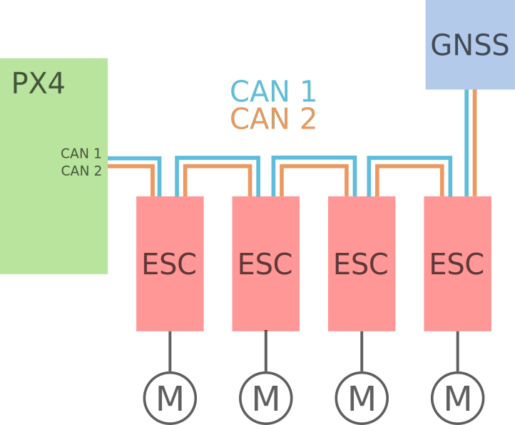

# CAN

[Controller Area Network (CAN)](https://en.wikipedia.org/wiki/CAN_bus) is a robust wired network that allows drone components such as flight controller, ESCs, sensors, and other peripherals, to communicate with each other.
因为它的设计有仲裁，使用差分信号，即使在较长的电缆 (大型车辆上) 上也非常强大，避免单点故障。
CAN 还允许来自外设的状态反馈，并通过总线方便的进行固件升级。

PX4 支持与 CAN 设备通信的两个软件协议：

- [DroneCAN](../dronecan/index.md): PX4 recommends this for most common setups.
  它得到了 PX4 的很好支持，是一个成熟的产品，具有广泛的外围支持，并经过多年的测试。
- [Cyphal](https://opencyphal.org): PX4 support is a "work in progress".
  Cyphal 是一种更新的协议，允许更多的灵活性和配置，尤其是对于较大和较复杂的载具。
  它还没有被广泛应用。

:::info
Both DroneCAN and Cyphal originate from an earlier project named UAVCAN.
在2022年，该项目分为两个部分：原始版本的 UAVCAN (UAVCAN v0) 更名为 DroneCAN，较新的 UAVCAN v1 更名为 Cyphal。
The differences between the two protocols are outlined in [Cyphal vs. DroneCAN](https://forum.opencyphal.org/t/cyphal-vs-dronecan/1814).
:::

:::warning
PX4 does not support other CAN software protocols for drones such as KDECAN (at time of writing).
:::

## 布线

CAN 网络的接线对于 DroneCAN 和 Cyphal/CAN 是一样 (实际上对所有的 CAN 网络都一样)。

设备以任意顺序连接成链。
在链的任一端，应该在两个数据线之间连接一个 120Ω 的终端电阻。
飞控和一些 GNSS 模块为了方便使用内置了终端电阻， 因此应该放在链的终端。
Otherwise, you can use a termination resistor such as [this one from Zubax Robotics](https://shop.zubax.com/products/uavcan-micro-termination-plug?variant=6007985111069), or solder one yourself if you have access to a JST-GH crimper.

下图显示了一个 CAN 总线连接飞控到 4 个 CAN 电调和一个 GNSS 的示例。

图中未显示任何电源接线。
参考制造商的说明，确认组件是否需要单独供电，还是可以通过 CAN 总线供电。

For more information, see [Cyphal/CAN device interconnection](https://kb.zubax.com/pages/viewpage.action?pageId=2195476) (kb.zubax.com).
虽然本文是以 Cyphal 协议为基础编写的，但同样适用于 DroneCAN 硬件和任何其他 CAN 设置。
For more advanced scenarios, consult with [On CAN bus topology and termination](https://forum.opencyphal.org/t/on-can-bus-topology-and-termination/1685).

### 连接器

Pixhawk standard compatible CAN devices use 4 pin JST-GH connectors for CAN.
Two connectors are used for input and output when wiring in a chain (except for flight controllers and some GNSS devices with builtin termination, which only have a single JST-GH connector).

Other (non-Pixhawk compatible) devices may use different connectors.
However, as long as the device firmware supports DroneCAN or Cyphal, it can be used.

### Redundancy

DroneCAN and Cyphal/CAN support using a second (redundant) CAN interface.
This is completely optional but increases the robustness of the connection.
All Pixhawk flight controllers come with 2 CAN interfaces; if your peripherals support 2 CAN interfaces as well, it is recommended to wire both up for increased safety.

## 固件

CAN peripherals may run proprietary or open source firmware (check manufacturer guides to confirm the required setup).

PX4 can be built to run as open-source DroneCAN firmware on supported CAN hardware.
See [PX4 DroneCAN Firmware](../dronecan/px4_cannode_fw.md) for more information.

## 支持和配置

[DroneCAN Setup and Configuration](../dronecan/index.md)

[PX4 DroneCAN Firmware](../dronecan/px4_cannode_fw.md)

## 视频

### DroneCAN

关于 DroneCAN (UAVCANv0) 的介绍和在 QGroundControl 中设置的实用示例：

<lite-youtube videoid="IZMTq9fTiOM" title="Intro to DroneCAN (UAVCANv0) and practical example with setup in QGroundControl"/>

### Cyphal

UAVCAN v1 for drones (Cyphal) — PX4 Developer Summit Virtual 2020

<lite-youtube videoid="6Bvtn_g8liU" title="UAVCAN v1 for drones — PX4 Developer Summit Virtual 2020"/>

---

Getting started using UAVCAN v1 with PX4 on the NXP UAVCAN Board — PX4 Developer Summit Virtual 2020

<lite-youtube videoid="MwdHwjaXYKs" title="Getting started using UAVCAN v1 with PX4 on the NXP UAVCAN Board"/>

---

UAVCAN：一个高度可靠的发布-订阅协议，用于硬实时车辆内网络 — PX4 开发者虚拟峰会 2019

<lite-youtube videoid="MBtROivYPik" title="UAVCAN: a highly dependable publish-subscribe protocol for hard ..."/>
