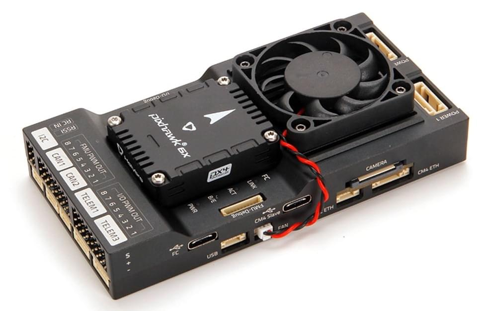
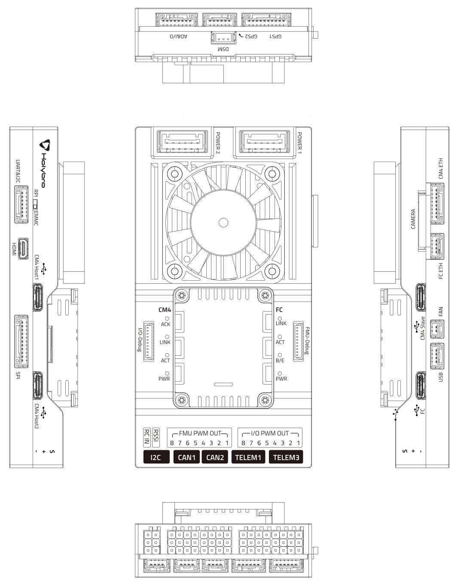
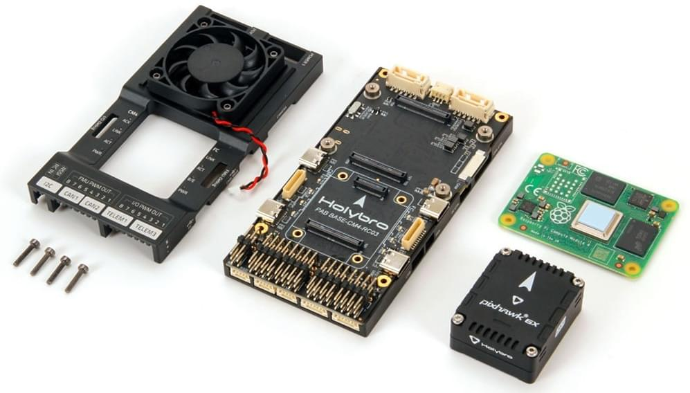
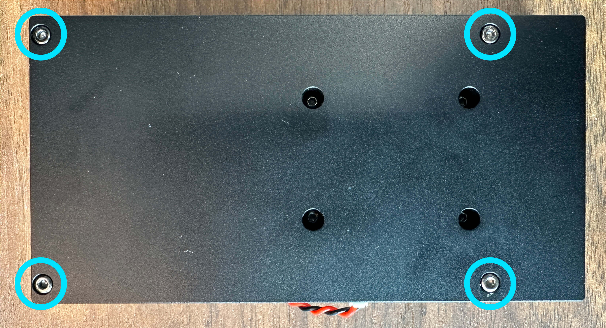
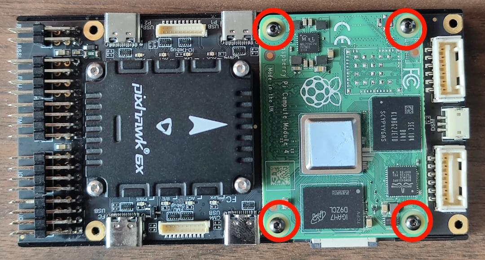
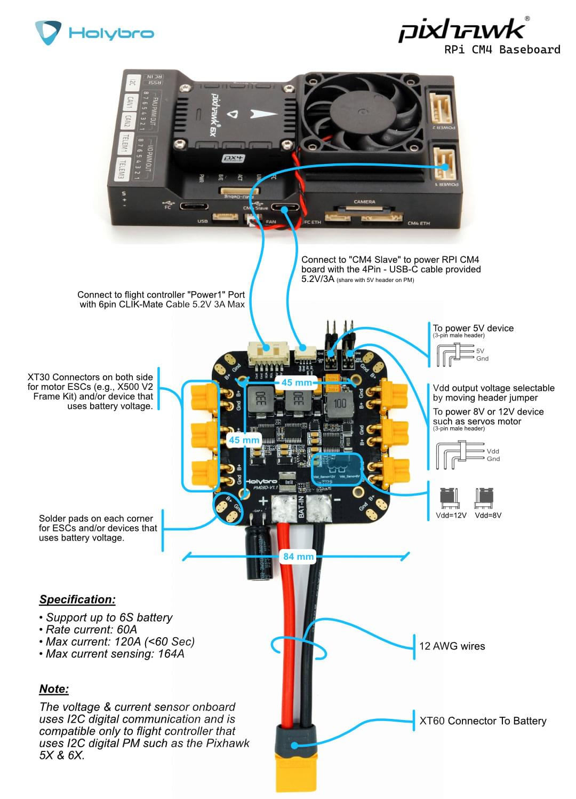
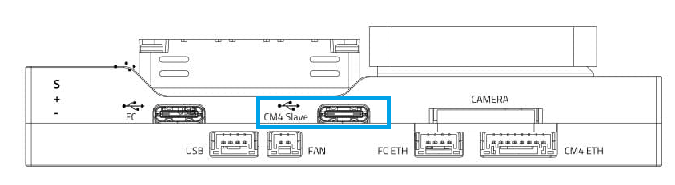
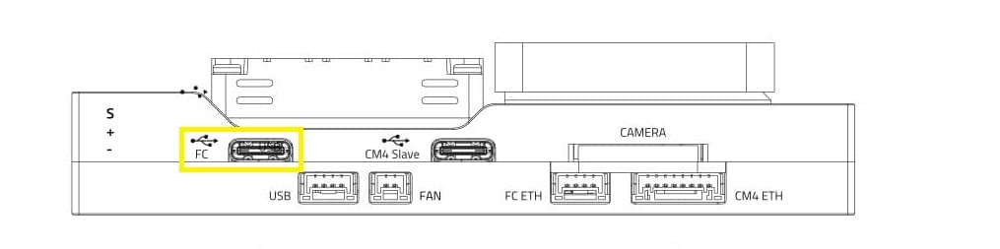
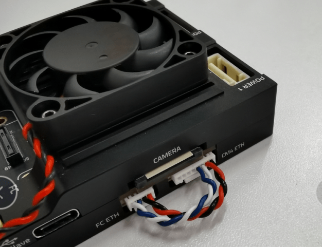

# Holybro Pixhawk RPi CM4 Baseboard

The [Holybro Pixhawk RPi CM4 Baseboard](https://holybro.com/products/pixhawk-rpi-cm4-baseboard) is a single-board solution that pre-integrates a (swappable) Pixhawk flight controller with the Raspberry Pi CM4 companion computer ("RPi").
The baseboard has a compact form factor with all the connections needed for development.



The flight controller module is internally connected to RPi CM4 through `TELEM2`, but may alternatively be connected using Ethernet with the provided external cable.

This baseboard is plug-in compatible with [Holybro Pixhawk 5X](../flight_controller/pixhawk5x.md), [Holybro Pixhawk 6X](../flight_controller/pixhawk6x.md), and any other Pixhawk controller that follows the [Pixhawk Autopilot Bus Standard](https://github.com/pixhawk/Pixhawk-Standards/blob/master/DS-010%20Pixhawk%20Autopilot%20Bus%20Standard.pdf) guidelines for mechanical compatibility across vendors.

:::info
The board follows the [Pixhawk Connector Standard](https://github.com/pixhawk/Pixhawk-Standards/blob/master/DS-009%20Pixhawk%20Connector%20Standard.pdf) and [Pixhawk Autopilot Bus Standard](https://github.com/pixhawk/Pixhawk-Standards/blob/master/DS-010%20Pixhawk%20Autopilot%20Bus%20Standard.pdf) (including the guidelines for "mechanical compatibility across vendors").
:::

## Purchase

- [Holybro Pixhawk RPi CM4 Baseboard](https://holybro.com/products/pixhawk-rpi-cm4-baseboard) (www.holybro.com)

  The baseboard can be purchased with or without an RPi CM4 and/or flight controller:

  - The Raspberry Pi CM4 (CM4008032) supplied by Holybro has the following specification:
    - RAM: 8GB
    - eMMC: 32GB
    - Wireless: No
  - The recommended minimum specification for the RPi CM4 is:
    - RAM: 4GB (or 8GB)
    - eMMC: 16GB
    - Wireless: Yes

## Connections & Ports

:::info
The [Holybro Documentation](https://docs.holybro.com/autopilot/pixhawk-baseboards/pixhawk-rpi-cm4-baseboard/connections-and-ports) has more detailed (and possibly more "up to date") port and connection information.
:::

The diagram below shows all the connectors and ports on the baseboard.



### RPi CM4 & FC Serial Connection

The flight controller `TELEM2` port is internally connected to RPi CM4 as shown:

| RPi CM4 | FC TELEM2 (FMU) |
| ------- | ---------------------------------- |
| GPIO14  | TXD                                |
| GPIO15  | RXD                                |
| GPIO16  | CTS                                |
| GPIO17  | RTS:               |

:::info
The connection must be also be [configured in both RPi and PX4](#configure-px4-to-cm4-mavlink-serial-connection) (unless [Ethernet](#ethernet-connection-optional) is used instead).
:::

## Installing the Flight Controller

A plug-compatible flight controller such as [Holybro Pixhawk 5X](../flight_controller/pixhawk5x.md) and [Holybro Pixhawk 6X](../flight_controller/pixhawk6x.md) can simply be pushed into the module slot.

Flight controllers that have a different form factor will need additional wiring.

## Installing the RPi CM4 Companion

This section shows how to install/attach an RPi CM4 to the baseboard.



To install the RPi CM4 companion computer:

1. Disconnect the `FAN` wiring.

  

2. Remove these 4 screws on the back side of the baseboard.

  

3. Remove the baseboard case, install the CM4, and use the 4 screws to attach it (as shown):

  

4. Reattach the cover.

## Power Module Wiring

The PM03D power module is supplied with the board.

The RPi CM4 and flight controller must be powered separately:

- The flight controller is powered via the CLIK-Mate cable to `POWER1` or `POWER2` port
- The RPi CM4 is powered by the `USB C` (CM4 Slave) connection.
  You can also use your own power supply to power the RPi CM4 baseboard.

The image below shows the wiring in greater detail.



## Flashing the RPi CM4

This section explains how you install your preferred Linux distro, such as "Raspberry Pi OS 64bit" onto the RPi EMCC.

备注：

- If you are using PX4, you will need to use PX4 version 1.13.1 or newer for PX4 to recognize this baseboard.
- The fan does not indicate if the RPi CM4 is powered/running or not.
- The power module plugged into Power1/2 does not power the RPi part.
  You can use the additional USB-C Cable from the PM03D power module to the CM4 Slave USB-C port.
- The Micro-HDMI port is an output port.
- RPi CM4 boards that do not have WiFi device will not connect automatically.
  In this case you will need to plug it into a router or plug a compatible WiFi dongle into the CM4 Host ports.

### Flash EMMC

To flash a RPi image onto EMMC.

1. Switch Dip-Switch to `RPI`.

  

2. Connect computer to USB-C _CM4 Slave_ port used to power & flash the RPi.

  

3. Get `usbboot`, build it and run it.

  ```sh
  sudo apt install libusb-1.0-0-dev
  git clone --depth=1 https://github.com/raspberrypi/usbboot
  cd usbboot
  make
  sudo ./rpiboot
  ```

4. You can now install your preferred Linux distro using The `rpi-imager`.
  Make sure you add WiFi and SSH settings (hidden behind the gear/advanced symbol).

  ```sh
  sudo apt install rpi-imager
  rpi-imager
  ```

5. Once done, unplugging USB-C CM4 Slave (this will unmount the volumes, and power off the CM4).

6. Switch Dip-Switch back to `EMMC`.

7. Power on CM4 by providing power to USB-C CM4 Slave port.

8. To check if it's booting/working you can either:
  - Check there is HDMI output
  - Connect via SSH (if set up in rpi-imager, and WiFi is available).

## Configure PX4 to CM4 MAVLink Serial Connection

:::info
If you are using [Ethernet](#ethernet-connection-optional) to connect the FC and RPi, this setup is not needed.
:::

The Pixhawk FC module is [internally connected to the RPi CM4](#rpi-cm4-fc-serial-connection) using `TELEM2` (`/dev/ttyS4`).
The FC and RPi CM4 must both be configured to communicate over this port.

### FC Serial Port Setup

The FC should be set up to connect to the `TELEM2` port correctly by default.
If not, you can configure the port using the parameters as shown.

To enable this MAVLink instance on the FC:

1. Connect a computer running QGroundControl via USB Type C port on the baseboard labeled `FC`

  

2. [Set the parameters](../advanced_config/parameters.md):

  - `MAV_1_CONFIG` = `102`
  - `MAV_1_MODE = 2`
  - `SER_TEL2_BAUD` = `921600`

3. Reboot the FC.

### RPi Serial Port Setup

On the RPi side:

1. Connect to the RPi (using WiFi, a router, or a WiFi Dongle).

2. Enable the RPi serial port by running `RPi-config`

  - Go to `3 Interface Options`, then `I6 Serial Port`.
    Then choose:
    - `login shell accessible over serial → No`
    - `serial port hardware enabled` → `Yes`

3. Finish, and reboot.
  This will add `enable_uart=1` to `/boot/config.txt`, and remove `console=serial0,115200` from `/boot/cmdline.txt`.

4. Now MAVLink traffic should be available on `/dev/serial0` at a baudrate of 921600.

## Try out MAVSDK-Python

1. Make sure the CM4 is connected to the internet, e.g. using a WiFi, or Ethernet.

2. Install MAVSDK Python:

  ```sh
  python3 -m pip install mavsdk
  ```

3. Copy an example from the [MAVSDK-Python examples](https://github.com/mavlink/MAVSDK-Python/tree/main/examples).

4. Change the `system_address="udp://:14540"` to `system_address="serial:///dev/serial0:921600"`

5. Try out the example. Permission for the serial port should already be available through the `dialout` group.

## Ethernet Connection (Optional)

The flight controller module is [internally connected to RPi CM4](#rpi-cm4-fc-serial-connection) from `TELEM2` (serial).

You can also set up a local Ethernet connection between them using the supplied cable.
以太网连接提供了一种快速、可靠和灵活的通信选择，可替代使用USB或其他串行连接。

:::info
For general Ethernet setup information see: [PX4 Ethernet Setup](../advanced_config/ethernet_setup.md).

The setup here is much the same, except that we have used the following `netplan` config on PX4:

```sh
network:
  version: 2
  renderer: NetworkManager
  ethernets:
    eth0:
      addresses:
        - 10.41.10.1/24
      nameservers:
        addresses: [10.41.10.1]
      routes:
        - to: 10.41.10.0/24  # Local route to access devices on this subnet
          scope: link        # Scope link to restrict it to local subnet
```

This sets `eth0` as our channel for the local Ethernet link from the RPi (instead of `enp2s0`, which is assumed in [Ethernet Setup](../advanced_config/ethernet_setup.md#ubuntu-ethernet-network-setup)).

Note that we could have used WiFi for the link, but by setting up a dedicated route we leave our WiFi free for Internet comms.
:::

### Connect the Cable

To set up a local ethernet connection between CM4 and the flight computer, the two Ethernet ports need to be connected using the provided 8 pin to 4 pin connector.



The pinout of the cable is:

| CM4 Eth 8 Pin | FC ETH 4 Pin |
| ------------- | ------------ |
| A             | B            |
| B             | A            |
| C             | D            |
| D             | C            |
| -             | N/A          |
| -             | N/A          |
| -             | N/A          |
| -             | N/A          |

### IP Setup on CM4

Since there is no DHCP server active in this configuration, the IP addresses have to be set manually:

First, connect to the CM4 via SSH by connecting to the CM4's WiFi (or use a WiFi dongle).
Once the Ethernet cables are plugged in, the `eth0` network interface seems to switch from DOWN to UP.

You can check the status using:

```sh
ip address show eth0
```

You can also try to enable it manually:

```sh
sudo ip link set dev eth0 up
```

This sets a link-local address.
For this example it looks like this:

```sh
$: ip address show eth0
2: eth0: <BROADCAST,MULTICAST,UP,LOWER_UP> mtu 1500 qdisc mq state UP group default qlen 1000
    link/ether e4:5f:01:bf:e0:17 brd ff:ff:ff:ff:ff:ff
    inet 10.41.10.1/24 brd 10.41.10.255 scope global noprefixroute eth0
       valid_lft forever preferred_lft forever
    inet6 fe80::e65f:1ff:febf:e017/64 scope link
       valid_lft forever preferred_lft forever
```

This means the CM4's Ethernet IP is `10.41.10.1` .

#### Ping Test

First ping PX4 from the CM4 (using the PX4's default address):

```sh
$ ping 10.41.10.2
```

Should give something like:

```sh
PING 10.41.10.2 (10.41.10.2) 56(84) bytes of data.
64 bytes from 10.41.10.2: icmp_seq=1 ttl=64 time=0.187 ms
64 bytes from 10.41.10.2: icmp_seq=2 ttl=64 time=0.109 ms
64 bytes from 10.41.10.2: icmp_seq=3 ttl=64 time=0.091 ms
^C
--- 10.41.10.2 ping statistics ---
3 packets transmitted, 3 received, 0% packet loss, time 2049ms
rtt min/avg/max/mdev = 0.091/0.129/0.187/0.041 ms
```

:::info
If this step fails, check if a [firewall](https://wiki.ubuntu.com/UncomplicatedFirewall) is active.
:::

Then ping the CM4 from the flight controlle.
Enter the following command in the Nuttx Shell:

```sh
nsh> ping 10.41.10.1
```

This should result in output like:

```sh
PING 10.41.10.1 56 bytes of data
56 bytes from 10.41.10.1: icmp_seq=0 time=0.0 ms
56 bytes from 10.41.10.1: icmp_seq=1 time=0.0 ms
56 bytes from 10.41.10.1: icmp_seq=2 time=0.0 ms
56 bytes from 10.41.10.1: icmp_seq=3 time=0.0 ms
56 bytes from 10.41.10.1: icmp_seq=4 time=0.0 ms
56 bytes from 10.41.10.1: icmp_seq=5 time=0.0 ms
56 bytes from 10.41.10.1: icmp_seq=6 time=0.0 ms
56 bytes from 10.41.10.1: icmp_seq=7 time=0.0 ms
56 bytes from 10.41.10.1: icmp_seq=8 time=0.0 ms
56 bytes from 10.41.10.1: icmp_seq=9 time=0.0 ms
10 packets transmitted, 10 received, 0% packet loss, time 10010 ms
rtt min/avg/max/mdev = 0.000/0.000/0.000/0.000 ms
```

#### MAVLink/MAVSDK Test

For this, we need to set the MAVLink instance to send traffic to the CM4's IP address:

For an initial test we can do:

```sh
mavlink start -o 14540 -t 10.41.10.1
```

This will send MAVLink traffic on UDP to port 14540 (the MAVSDK/MAVROS port) to that IP which means MAVSDK can just listen to any UDP arriving at that default port.

To run a MAVSDK example, install mavsdk via pip, and try out an example from [MAVSDK-Python/examples](https://github.com/mavlink/MAVSDK-Python/tree/main/examples).

#### XRCE-Client Ethernet Setup

Next we enable `XRCE-DDS` on the new Ethernet Link.

You can [modify the required parameters](../advanced_config/parameters.md) in QGroundControl parameter editor, or using `param set` in the [MAVLINK shell](../debug/mavlink_shell.md).
Below we show the settings assuming you're setting the parameters using the shell.

First ensure `MAV_2_CONFIG` is not set to use the Ethernet port (`1000`) as this would clash with XRCE-DDS (see [enable MAVLINK on Ethernet](../advanced_config/ethernet_setup.md#px4-mavlink-serial-port-configuration)):

```sh
nsh>
param set MAV_2_CONFIG     0           # Change to 0 IFF value is 1000
```

Then enable uXRCE-DDS on the Ethernet port (see [starting uXRCE-DDS client](../middleware/uxrce_dds.md#starting-the-client)):

```sh
param set UXRCE_DDS_AG_IP  170461697   # The int32 version of 10.41.10.1
param set UXRCE_DDS_CFG    1000        # Set Serial Configuration for uXRCE-DDS Client to Ethernet
param set UXRCE_DDS_DOM_ID 0           # Set uXRCE-DDS domain ID
param set UXRCE_DDS_KEY    1           # Set uXRCE-DDS session key
param set UXRCE_DDS_PRT    8888        # Set uXRCE-DDS UDP port
param set UXRCE_DDS_PTCFG  0           # Set uXRCE-DDS participant configuration
param set UXRCE_DDS_SYNCC  0           # Disable uXRCE-DDS system clock synchronization
param set UXRCE_DDS_SYNCT  1           # Enable uXRCE-DDS timestamp synchronization
```

Then run the Agent:

```sh
MicroXRCEAgent udp4 -p 8888
```

And such output is expected if everything is set up correctly:

```sh
[1731210063.537033] info     | UDPv4AgentLinux.cpp | init                     | running...             | port: 8888
[1731210063.538279] info     | Root.cpp           | set_verbose_level        | logger setup           | verbose_level: 4
[1731210066.577413] info     | Root.cpp           | create_client            | create                 | client_key: 0x00000001, session_id: 0x81
[1731210066.577515] info     | SessionManager.hpp | establish_session        | session established    | client_key: 0x00000001, address: 10.41.10.2:58900
[1731210066.583965] info     | ProxyClient.cpp    | create_participant       | participant created    | client_key: 0x00000001, participant_id: 0x001(1)
[1731210066.584754] info     | ProxyClient.cpp    | create_topic             | topic created          | client_key: 0x00000001, topic_id: 0x800(2), participant_id: 0x001(1)
[1731210066.584988] info     | ProxyClient.cpp    | create_subscriber        | subscriber created     | client_key: 0x00000001, subscriber_id: 0x800(4), participant_id: 0x001(1)
[1731210066.589864] info     | ProxyClient.cpp    | create_datareader        | datareader created     | client_key: 0x00000001, datareader_id: 0x800(6), subscriber_id: 0x800(4)
[1731210066.591007] info     | ProxyClient.cpp    | create_topic             | topic created          | client_key: 0x00000001, topic_id: 0x801(2), participant_id: 0x001(1)
[1731210066.591164] info     | ProxyClient.cpp    | create_subscriber        | subscriber created     | client_key: 0x00000001, subscriber_id: 0x801(4), participant_id: 0x001(1)
[1731210066.591912] info     | ProxyClient.cpp    | create_datareader        | datareader created     | client_key: 0x00000001, datareader_id: 0x801(6), subscriber_id: 0x801(4)
[1731210066.592701] info     | ProxyClient.cpp    | create_topic             | topic created          | client_key: 0x00000001, topic_id: 0x802(2), participant_id: 0x001(1)
[1731210066.592846] info     | ProxyClient.cpp    | create_subscriber        | subscriber created     | client_key: 0x00000001, subscriber_id: 0x802(4), participant_id: 0x001(1)
[1731210066.593640] info     | ProxyClient.cpp    | create_datareader        | datareader created     | client_key: 0x00000001, datareader_id: 0x802(6), subscriber_id: 0x802(4)
[1731210066.594749] info     | ProxyClient.cpp    | create_topic             | topic created          | client_key: 0x00000001, topic_id: 0x803(2), participant_id: 0x001(1)
[1731210066.594883] info     | ProxyClient.cpp    | create_subscriber        | subscriber created     | client_key: 0x00000001, subscriber_id: 0x803(4), participant_id: 0x001(1)
[1731210066.595592] info     | ProxyClient.cpp    | create_datareader        | datareader created     | client_key: 0x00000001, datareader_id: 0x803(6), subscriber_id: 0x803(4)
[1731210066.596188] info     | ProxyClient.cpp    | create_topic             | topic created          | client_key: 0x00000001, topic_id: 0x804(2), participant_id: 0x001(1)
[1731210066.596334] info     | ProxyClient.cpp    | create_subscriber        | subscriber created     | client_key: 0x00000001, subscriber_id: 0x804(4), participant_id: 0x001(1)
[1731210066.597046] info     | ProxyClient.cpp    | create_datareader        | datareader created     | client_key: 0x00000001, datareader_id: 0x804(6), subscriber_id: 0x804(4)
```

## See Also

- [Get The Pixhawk Raspberry Pi CM4 Baseboard By Holybro Talking With PX4](https://px4.io/get-the-pixhawk-raspberry-pi-cm4-baseboard-by-holybro-talking-with-px4/) (px4.io blog):
  - 展示如何通过有线以太网连接 Pixhawk 6X + Raspberry Pi 到 CM4 主板。
