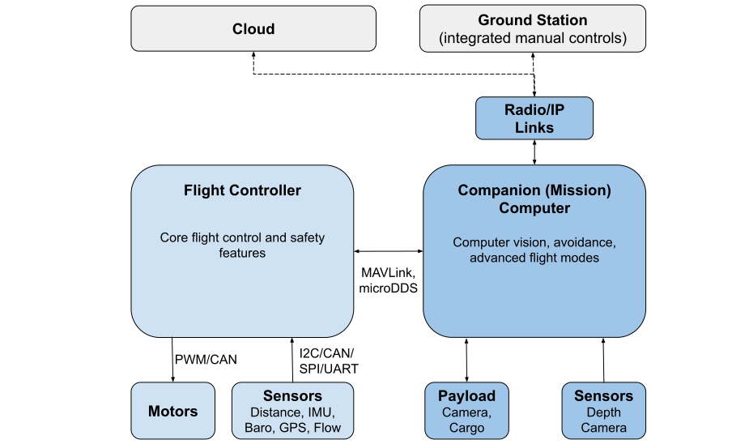

# 机载电脑

Companion computers ("mission computers"), are separate on-vehicle computers that are connected to the flight controller, and which enable computationally expensive features like [collision prevention](../computer_vision/collision_prevention.md).

下图显示了一个可能的无人驾驶架构，其中包括飞控和机载计算机。

<!-- source for drawing: https://docs.google.com/drawings/d/1ZDSyj5djKCEbabgx8K4ESdTeEUizgEt8spUWrMGbHUE/edit?usp=sharing -->

飞控在 NuttX 上运行 PX4, 提供核心飞控和安全代码。
机载计算机通常运行 Linux, 因为这是一个“通用”软件开发的更好平台。
They are connected using a fast serial or Ethernet link, and typically communicate using the [MAVLink protocol](https://mavlink.io/en/) or uXRCE-DDS.

Communications with the ground stations and the cloud are usually routed via the companion computer (e.g. using the [MAVLink Router](https://github.com/mavlink-router/mavlink-router)).

## Pixhawk 自动驾驶仪总线载板与机载计算机

The following carrier boards make it easy to integrate Pixhawk flight controllers with a companion computer, significantly easing both hardware and software setup.
The boards support the [Pixhawk Autopilot Bus (PAB)](../flight_controller/pixhawk_autopilot_bus.md) open standard so you can plug in any compliant controller:

- [ARK Jetson PAB Carrier](../companion_computer/ark_jetson_pab_carrier.md)
- [Holybro Pixhawk Jetson Baseboard](../companion_computer/holybro_pixhawk_jetson_baseboard.md)
- [Holybro Pixhawk RPi CM4 Baseboard](../companion_computer/holybro_pixhawk_rpi_cm4_baseboard.md)

## 管理集成系统

以下集成的机载计算机/飞控系统默认使用受控/自定义版本的飞控和机载计算机软件。
它们在这里列出，因为它们可以使用 "vanilla" PX4 固件进行更新，以进行测试/快速开发。

- [Auterion Skynode](../companion_computer/auterion_skynode.md)
- [ModalAI VOXL 2](https://docs.modalai.com/voxl-2/)

## 机载计算机选项

PX4 可以与计算机一起使用，可以配置为通过基于串口(或以太网端口) 的 MAVLink 或 microROS/uXRCE-DDS 进行通信。
以下列出了一小部分可能的替代方案。

高性能计算机：

- [ModalAI VOXL 2](https://docs.modalai.com/voxl2-external-flight-controller/)
- [NXP NavQPlus](https://nxp.gitbook.io/navqplus/user-contributed-content/ros2/microdds)
- [Nvidia Jetson TX2](https://developer.nvidia.com/embedded/jetson-tx2)

* [Intel NUC](https://www.intel.com/content/www/us/en/products/details/nuc.html)
* [Gigabyte Brix](https://www.gigabyte.com/Mini-PcBarebone/BRIX)

小型/低功耗设备如：

- [Raspberry Pi](../companion_computer/pixhawk_rpi.md)

:::info
The choice of computer will depend on the usual tradeoffs: cost, weight, power consumption, ease of setup, and computational resources required.
:::

## 机载计算机软件

机载计算机需要运行能与飞控通信的软件，并将消息路由到地面站和云端。

#### 无人机应用程序

Drone API 和 SDK 允许您编写能够控制 PX4 的软件。
Popular alternatives include:

- [MAVSDK](https://mavsdk.mavlink.io/main/en/index.html) - libraries in various programming languages to interface with MAVLink systems such as drones, cameras or ground systems.
- [ROS 2](../ros2/index.md) to communicate to ROS 2 nodes (may also be used).
- [ROS 1 and MAVROS](../ros/mavros_installation.md)

MAVSDK 通常更容易学习和使用，而 ROS 提供更多预先编写的软件，用于像计算机视觉这样的高级案例。
[Drone APIs and SDKs > What API Should I Use?](../robotics/index.md#what-api-should-i-use) explains the different options in detail.

您还可以从头开始编写您的自定义 MAVLink 库：

- [C/C++ example code](https://github.com/mavlink/c_uart_interface_example) shows how to connect custom code
- MAVLink also can also be used with [many other programming languages](https://mavlink.io/en/#mavlink-project-generatorslanguages)

#### 路由

如果您需要将 MAVLink 从载具桥接到地面站或 IP 网络，您将需要一个路由器。 或者如果您需要多个连接：

- [MAVLink Router](https://github.com/intel/mavlink-router) (recommended)
- [MAVProxy](https://ardupilot.org/mavproxy/)

## 以太网设置

以太网是推荐的连接方式，如果飞行控制器支持的话。
See [Ethernet Setup](../advanced_config/ethernet_setup.md) for instructions.

## 飞控特定设置

以下章节介绍了如何为特定的飞控设置机载计算机，特别是当您不是使用以太网连接时。

- [Using a Companion Computer with Pixhawk Controllers](../companion_computer/pixhawk_companion.md)

## 附加信息

- [Companion Computer Peripherals](../companion_computer/companion_computer_peripherals.md)
- [PX4 System Architecture > FC and Companion Computer](../concept/px4_systems_architecture.md#fc-and-companion-computer)
