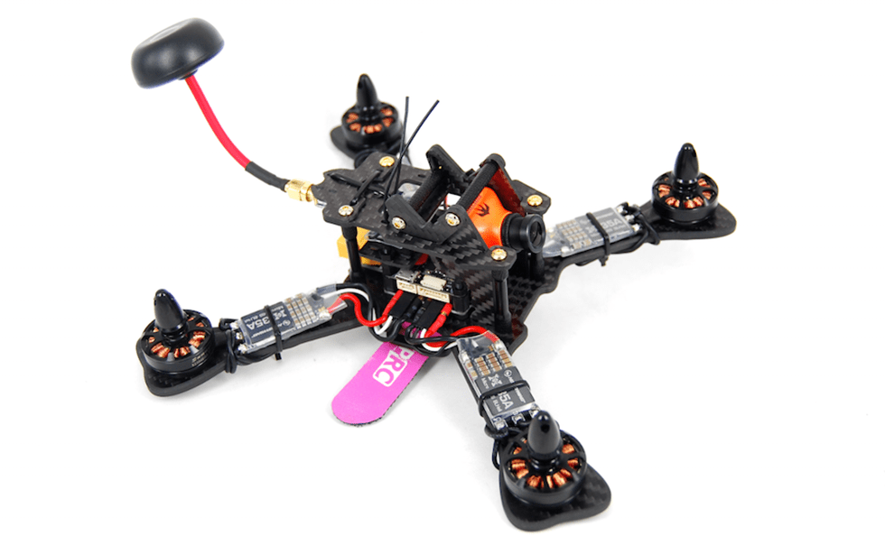

## MindRacer 210

### 概要

A ready-to-fly racing beast running full PX4/MindPX stack. Can reach maximum 10:1 thrust-to-weight ratio!

MR210 uses MindRacer as flight controller. MR210 is a fully modularized, stackable RTF racing drone. The soldering-free SEP/WEP sockets allow pilots to quickly replace broken parts without the needs for soldering iron. Pilots can further easily customize the build by adding-to or replacing stacking parts to make a more powerful drone.

### Highlights

1. True 'X', 4mm thick, 210mm diagonal carbon fiber frame.
2. Stackable SEP/WEP sockets for soldering-free ESC connection and parts replacement.
3. 30A/4S/OneShot enabled BLHeli ESC.
4. 5V universal voltage supply for all avionics including camera and VTX.
5. DroneCode&reg; standard compliant JST GH connectors.
6. Have options for PPM/S.Bus/Specktrum DSM receiver

### User Guide

:::info
The user guide is [here](http://mindpx.net/assets/accessories/MR210usermanual_pdf.pdf).
:::

### Where to buy

MindRacer 210 is available at [AirMind Store](https://airmind.mindpx.net/node/78). You can also find MindRacer at Amazon&reg; or eBay&reg;.

### 技术支持

Please visit http://www.mindpx.org for more information. Or you can send email to [support@mindpx.net](mailto:support@mindpx.net) for any inquiries or help.
