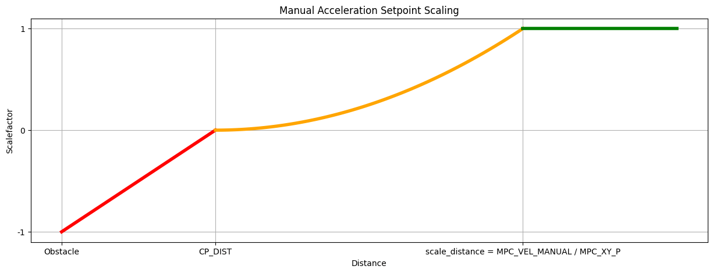
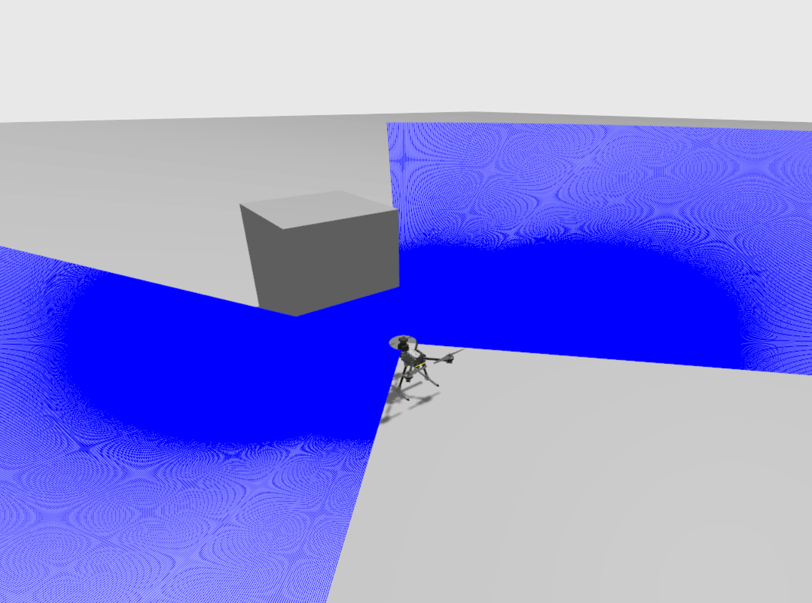
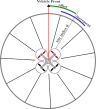

# 防撞功能

_Collision Prevention_ may be used to automatically slow and stop a vehicle before it can crash into an obstacle.
It can be enabled for multicopter vehicles when using acceleration-based [Position mode](../flight_modes_mc/position.md) (or VTOL vehicles in MC mode).

It can be enabled for multicopter vehicles in [Position mode](../flight_modes_mc/position.md), and can use sensor data from an offboard companion computer, offboard rangefinders over MAVLink, a rangefinder attached to the flight controller, or any combination of the above.

Collision prevention may restrict vehicle maximum speed if the sensor range isn't large enough!
It also prevents motion in directions where no sensor data is available (i.e. if you have no rear-sensor data, you will not be able to fly backwards).

:::tip
If high flight speeds are critical, consider disabling collision prevention when not needed.
:::

:::tip
Ensure that you have sensors/sensor data in all directions that you want to fly (when collision prevention is enabled).
:::

## 综述

The vehicle restricts the current velocity in order to slow down as it gets closer to obstacles and adapts the acceleration setpoint in order to disallow collision trajectories.
为了远离（或与之平行的）障碍物，用户必须使无人机/无人车朝向不靠近障碍物的设定点移动。
The algorithm will make minor adjustments to the setpoint direction if it is determined that a “better” setpoint exists within a fixed margin on either side of the requested setpoint.

Users are notified through _QGroundControl_ while _Collision Prevention_ is actively controlling velocity setpoints.

PX4 software setup is covered in the next section.
If you are using a distance sensor attached to your flight controller for collision prevention, it will need to be attached and configured as described in [PX4 Distance Sensor](#rangefinder).
If you are using a companion computer to provide obstacle information see [companion setup](#companion

## Supported Rangefinders  {#rangefinder}

### Lanbao PSK-CM8JL65-CC5 [Discontinued]

At time of writing PX4 allows you to use the [Lanbao PSK-CM8JL65-CC5](../sensor/cm8jl65_ir_distance_sensor.md) IR distance sensor for collision prevention “out of the box”, with minimal additional configuration:

- First [attach and configure the sensor](../sensor/cm8jl65_ir_distance_sensor.md), and enable collision prevention (as described above, using [CP_DIST](#CP_DIST)).
- Set the sensor orientation using [SENS_CM8JL65_R_0](../advanced_config/parameter_reference.md#SENS_CM8JL65_R_0).

### LightWare LiDAR SF45 Rotating Lidar

PX4 v1.14 (and later) supports the [LightWare LiDAR SF45](../sensor/sf45_rotating_lidar.md) rotating lidar which provides 320 degree sensing.

### Other Rangefinders

其他传感器的使能需要修改驱动代码来设置传感器方向和视觉范围。

- Attach and configure the distance sensor on a particular port (see [sensor-specific docs](../sensor/rangefinders.md)) and enable collision prevention using [CP_DIST](#CP_DIST).
- 修改驱动程序以设置方向。
 This should be done by mimicking the `SENS_CM8JL65_R_0` parameter (though you might also hard-code the orientation in the sensor _module.yaml_ file to something like `sf0x start -d ${SERIAL_DEV} -R 25` - where 25 is equivalent to `ROTATION_DOWNWARD_FACING`).
- Modify the driver to set the _field of view_ in the distance sensor UORB topic (`distance_sensor_s.h_fov`).

## PX4 (Software) Setup

Configure collision prevention by [setting the following parameters](../advanced_config/parameters.md) in _QGroundControl_:

| 参数                                                                                                                                                                | 描述                                                                                                                                                                                                                                                                                                                                                                 |
| ----------------------------------------------------------------------------------------------------------------------------------------------------------------- | ------------------------------------------------------------------------------------------------------------------------------------------------------------------------------------------------------------------------------------------------------------------------------------------------------------------------------------------------------------------ |
| <a id="CP_DIST"></a>[CP_DIST](../advanced_config/parameter_reference.md#CP_DIST)                                                             | Set the minimum allowed distance (the closest distance that the vehicle can approach the obstacle). Set negative to disable _collision prevention_. <br>> **Warning** This value is the distance to the sensors, not the outside of your vehicle or propellers. Be sure to leave a safe margin! |
| <a id="CP_DELAY"></a>[CP_DELAY](../advanced_config/parameter_reference.md#CP_DELAY)                                                          | Set the sensor and velocity setpoint tracking delay. See [Delay Tuning](#delay_tuning) below.                                                                                                                                                                                                                                      |
| <a id="CP_GUIDE_ANG"></a>[CP_GUIDE_ANG](../advanced_config/parameter_reference.md#CP_GUIDE_ANG)                         | Set the angle (to both sides of the commanded direction) within which the vehicle may deviate if it finds fewer obstacles in that direction. See [Guidance Tuning](#angle_change_tuning) below.                                                                                                                 |
| <a id="CP_GO_NO_DATA"></a>[CP_GO_NO_DATA](../advanced_config/parameter_reference.md#CP_GO_NO_DATA) | Set to 1 to allow the vehicle to move in directions where there is no sensor coverage (default is 0/`False`).                                                                                                                                                                                                                   |
| <a id="MPC_POS_MODE"></a>[MPC_POS_MODE](../advanced_config/parameter_reference.md#MPC_POS_MODE)                         | Set to `Direct velocity` or `Smoothed velocity` to enable Collision Prevention in Position Mode (default is `Acceleration based`).                                                                                                                                                                                              |

## 算法描述

The data from all sensors are fused into an internal representation of 36 sectors around the vehicle, each containing either the sensor data and information about when it was last observed, or an indication that no data for the sector was available.
When the vehicle is commanded to move in a particular direction, all sectors in the hemisphere of that direction are checked to see if the movement will bring the vehicle closer to any obstacles.
如果是这样，无人机的速度就会受到限制。

This velocity restriction takes into account both the inner velocity loop tuned by [MPC_XY_P](../advanced_config/parameter_reference.md#MPC_XY_P), as well as the [jerk-optimal velocity controller](../config_mc/mc_jerk_limited_type_trajectory.md) via [MPC_JERK_MAX](../advanced_config/parameter_reference.md#MPC_JERK_MAX) and [MPC_ACC_HOR](../advanced_config/parameter_reference.md#MPC_ACC_HOR).
The velocity is restricted such that the vehicle will stop in time to maintain the distance specified in [CP_DIST](#CP_DIST).
The range of the sensors for each sector is also taken into account, limiting the velocity via the same mechanism.

:::info
If there is no sensor data in a particular direction, velocity in that direction is restricted to 0 (preventing the vehicle from crashing into unseen objects).
If you wish to move freely into directions without sensor coverage, this can be enabled by setting [CP_GO_NO_DATA](#CP_GO_NO_DATA) to 1.
:::

Delay, both in the vehicle tracking velocity setpoints and in receiving sensor data from external sources, is conservatively estimated via the [CP_DELAY](#CP_DELAY) parameter.
This should be [tuned](#delay_tuning) to the specific vehicle.

If the sectors adjacent to the commanded sectors are 'better' by a significant margin, the direction of the requested input can be modified by up to the angle specified in [CP_GUIDE_ANG](#CP_GUIDE_ANG).
This helps to fine-tune user input to 'guide' the vehicle around obstacles rather than getting stuck against them.

### Range Data Loss

If the autopilot does not receive range data from any sensor for longer than 0.5s, it will output a warning _No range data received, no movement allowed_.
This will force the velocity setpoints in xy to zero.
After 5 seconds of not receiving any data, the vehicle will switch into [HOLD mode](../flight_modes_mc/hold.md).
If you want the vehicle to be able to move again, you will need to disable Collision Prevention by either setting the parameter [CP_DIST](#CP_DIST) to a negative value, or switching to a mode other than [Position mode](../flight_modes_mc/position.md) (e.g. to _Altitude mode_ or _Stabilized mode_).

If you have multiple sensors connected and you lose connection to one of them, you will still be able to fly inside the field of view (FOV) of the reporting sensors.
The data of the faulty sensor will expire and the region covered by this sensor will be treated as uncovered, meaning you will not be able to move there.

:::warning
Be careful when enabling [CP_GO_NO_DATA=1](#CP_GO_NO_DATA), which allows the vehicle to fly outside the area with sensor coverage.
If you lose connection to one of multiple sensors, the area covered by the faulty sensor is also treated as uncovered and you will be able to move there without constraint.
:::

### CP_DELAY Delay Tuning {#delay_tuning}

There are two main sources of delay which should be accounted for: _sensor delay_, and vehicle _velocity setpoint tracking delay_.
Both sources of delay are tuned using the [CP_DELAY](#CP_DELAY) parameter.

The _sensor delay_ for distance sensors connected directly to the flight controller can be assumed to be 0.
对于外部视觉系统，传感器延迟可能高达 0.2秒。

Vehicle _velocity setpoint tracking delay_ can be measured by flying at full speed in [Position mode](../flight_modes_mc/position.md), then commanding a stop.
然后可以从日志中测量实际速度和速度设置值之间的延迟。
跟踪延迟通常在 0.1 至 0.5秒之间，取决于机身尺寸和调试情况。

:::tip
If vehicle speed oscillates as it approaches the obstacle (i.e. it slows down, speeds up, slows down) the delay is set too high.
:::

### CP_GUIDE_ANG Guidance Tuning {#angle_change_tuning}

取决于机身，环境类型和飞行员技能，可能需要不同数量的制导。
Setting the [CP_GUIDE_ANG](#CP_GUIDE_ANG) parameter to 0 will disable the guidance, resulting in the vehicle only moving exactly in the directions commanded.
增大此参数将使无人机选择最佳方向来避开障碍物，从而更容易飞过狭窄的间隙，并与物体周围保持最小间距。

If this parameter is too small the vehicle may feel "stuck" when close to obstacles, because only movement away from obstacles at minimum distance are allowed.
If the parameter is too large the vehicle may feel like it slides away from obstacles in directions not commanded by the operator.
从测试来看，尽管不同的车辆可能有不同的要求，但是 30度是一个很好的平衡点。

:::info
The guidance feature will never direct the vehicle in a direction without sensor data.
If the vehicle feels stuck with only a single distance sensor pointing forwards, this is probably because the guidance cannot safely adapt the direction due to lack of information.
:::

## 算法描述

The data from all sensors are fused into an internal representation of 72 sectors around the vehicle, each containing either the sensor data and information about when it was last observed, or an indication that no data for the sector was available.
When the vehicle is commanded to move in a particular direction, all sectors in the hemisphere of that direction are checked to see if the movement will bring the vehicle closer than allowed to any obstacles. 如果是这样，无人机的速度就会受到限制。

The Algorithm then can be split into two parts, the constraining of the acceleration setpoint coming from the operator, and the compensation of the current velocity of the vehicle.

:::info
If there is no sensor data in a particular direction, movement in that direction is restricted to 0 (preventing the vehicle from crashing into unseen objects).
If you wish to move freely into directions without sensor coverage, this can be enabled by setting [CP_GO_NO_DATA](#CP_GO_NO_DATA) to 1.
:::

### Acceleration Constraining

For this we split out the acceleration setpoint into two components, one parallel to the closest distance to the obstacle and one normal to it. Then we scale each of these components according the the figure below.



 <!-- the code for this figure is at the end of this file -->

### Velocity compensation

This velocity restriction takes into account the [jerk-optimal velocity controller](../config_mc/mc_jerk_limited_type_trajectory.md) via [MPC_JERK_MAX](../advanced_config/parameter_reference.md#MPC_JERK_MAX) and [MPC_ACC_HOR](../advanced_config/parameter_reference.md#MPC_ACC_HOR). Whereby <!--this is only partially valid anymore... check -->
The current velocity is compared with the maximum allowed velocity so that we are still able to break based on the maximal allowed jerk, acceleration and delay. from this we are able to use the proportional gain of the acceleration controller([MPC_XY_VEL_P_ACC](../advanced_config/parameter_reference.md#MPC_XY_VEL_P_ACC)) to transform it into an acceleration.

### Delay

The delay associated with collision prevention, both in the vehicle tracking velocity setpoints and in receiving sensor data from external sources, is conservatively estimated via the [CP_DELAY](#CP_DELAY) parameter.
This should be [tuned](#delay_tuning) to the specific vehicle.

## Companion Setup {#companion}

:::warning
The companion implementation/setup is currently untested (the original companion project was unmaintained and has been archived).
:::

If using a companion computer or external sensor, it needs to supply a stream of [OBSTACLE_DISTANCE](https://mavlink.io/en/messages/common.html#OBSTACLE_DISTANCE) messages, which should reflect when and where obstacle were detected.

The minimum rate at which messages _must_ be sent depends on vehicle speed - at higher rates the vehicle will have a longer time to respond to detected obstacles.
Initial testing of the system used a vehicle moving at 4 m/s with `OBSTACLE_DISTANCE` messages being emitted at 10Hz (the maximum rate supported by the vision system).
The system may work well at significantly higher speeds and lower frequency distance updates.

## Gazebo Simulation

_Collision Prevention_ can be tested using [Gazebo](../sim_gazebo_gz/index.md) with the [x500_lidar_2d](../sim_gazebo_gz/vehicles.md#x500-quadrotor-with-2d-lidar) model.
To do this, start a simulation with the x500 lidar model by running the following command:

```sh
make px4_sitl gz_x500_lidar_2d
```

Next, adjust the relevant parameters to the appropriate values and add arbitrary obstacles to your simulation world to test the collision prevention functionality.

The diagram below shows a simulation of collision prevention as viewed in Gazebo.



## Development Information/Tools

### Plotting Obstacle Distance and Minimum Distance in Real-Time with PlotJuggler

[PlotJuggler](../log/plotjuggler_log_analysis.md) can be used to monitor and visualize obstacle distances in a real-time plot, including the minimum distance to the closest obstacle.

<lite-youtube videoid="amLheoHgwc4" title="Plotting Obstacle Distance and Minimum Distance in Real-Time with PlotJuggler"/>

To use this feature you need to add a reactive Lua script to PlotJuggler, and also configure PX4 to export [`obstacle_distance_fused`](../msg_docs/ObstacleDistance.md) UORB topic data.
The Lua script works by extracting the `obstacle_distance_fused` data at each time step, converting the distance values into Cartesian coordinates, and pushing them to PlotJuggler.

步骤如下：

1. Follow the instructions in [Plotting uORB Topic Data in Real Time using PlotJuggler](../debug/plotting_realtime_uorb_data.md)

2. Configure PX4 to publish obstacle distance data (so that it is available to PlotJuggler):

 Add the [`obstacle_distance_fused`](../msg_docs/ObstacleDistance.md) UORB topic to your [`dds_topics.yaml`](https://github.com/PX4/PX4-Autopilot/blob/main/src/modules/uxrce_dds_client/dds_topics.yaml) so that it is published by PX4:

 ```sh
 - topic: /fmu/out/obstacle_distance_fused
   type: px4_msgs::msg::ObstacleDistance
 ```

 For more information see [DDS Topics YAML](../middleware/uxrce_dds.md#dds-topics-yaml) in _uXRCE-DDS (PX4-ROS 2/DDS Bridge)_.

3. Open PlotJuggler and navigate to the **Tools > Reactive Script Editor** section.
 In the **Script Editor** tab, add following scripts in the appropriate sections:

 - **Global code, executed once:**

  ```lua
  obs_dist_fused_xy = ScatterXY.new("obstacle_distance_fused_xy")
  obs_dist_min = Timeseries.new("obstacle_distance_minimum")
  ```

 - **function(tracker_time)**

  ```lua
  obs_dist_fused_xy:clear()

  i = 0
  angle_offset = TimeseriesView.find("/fmu/out/obstacle_distance_fused/angle_offset")
  increment = TimeseriesView.find("/fmu/out/obstacle_distance_fused/increment")
  min_dist = 65535

  -- Cache increment and angle_offset values at tracker_time to avoid repeated calls
  local angle_offset_value = angle_offset:atTime(tracker_time)
  local increment_value = increment:atTime(tracker_time)

  if increment_value == nil or increment_value <= 0 then
      print("Invalid increment value: " .. tostring(increment_value))
      return
  end

  local max_steps = math.floor(360 / increment_value)

  while i < max_steps do
      local str = string.format("/fmu/out/obstacle_distance_fused/distances[%d]", i)
      local distance = TimeseriesView.find(str)
      if distance == nil then
          print("No distance data for: " .. str)
          break
      end

      local dist = distance:atTime(tracker_time)
      if dist ~= nil and dist < 65535 then
          -- Calculate angle and Cartesian coordinates
          local angle = angle_offset_value + i * increment_value
          local y = dist * math.cos(math.rad(angle))
          local x = dist * math.sin(math.rad(angle))

          obs_dist_fused_xy:push_back(x, y)

          -- Update minimum distance
          if dist < min_dist then
              min_dist = dist
          end
      end

      i = i + 1
  end

  -- Push minimum distance once after the loop
  if min_dist < 65535 then
      obs_dist_min:push_back(tracker_time, min_dist)
  else
      print("No valid minimum distance found")
  end
  ```

4. Enter a name for the script on the top right, and press **Save**.
 Once saved, the script should appear in the _Active Scripts_ section.

5. Start streaming the data using the approach described in [Plotting uORB Topic Data in Real Time using PlotJuggler](../debug/plotting_realtime_uorb_data.md).
 You should see the `obstacle_distance_fused_xy` and `obstacle_distance_minimum` timeseries on the left.

Note that you have to press **Save** again to re-enable the scripts after loading a new log file or otherwise clearing data.

### Sensor Data Overview

Collision Prevention has an internal obstacle distance map that divides the plane around the drone into 72 Sectors.
Internally this information is stored in the [`obstacle_distance`](../msg_docs/ObstacleDistance.md) UORB topic.
New sensor data is compared to the existing map, and used to update any sections that has changed.

The angles in the `obstacle_distance` topic are defined as follows:



The data from rangefinders, rotary lidars, or companion computers, is processed differently, as described below.

#### Rotary Lidars

Rotary Lidars add their data directly to the [`obstacle_distance`](../msg_docs/ObstacleDistance.md) uORB topic.

#### Rangefinders

Rangefinders publish their data to the [`distance_sensor`](../msg_docs/DistanceSensor.md) uORB topic.

This data is then mapped onto the `obstacle_distance` topic.
All sectors which have any overlap with the orientation (`orientation` and `q`) of the rangefinder, and the horizontal field of view (`h_fov`) are assigned that measurement value.
For example, a distance sensor measuring from 9.99° to 10.01° the measurements will get added to the bin's corresponding to 5° and 10° covering the arc from 2.5° and 12.5°

:::info
the quaternion `q` is only used if the `orientation` is set to `ROTATION_CUSTOM`.
:::

#### 机载电脑

Companion computers update the `obstacle_distance` topic using ROS2 or the [OBSTACLE_DISTANCE](https://mavlink.io/en/messages/common.html#OBSTACLE_DISTANCE) MAVLink message.

<!-- to edit the image, open it in inkscape -->

<!-- Code to generate the scalefactor plot
import numpy as np
import matplotlib.pyplot as plt
obstacle_dist = -5
cp_dist = 0
scale_dist = 10
x_values_1 = np.linspace(obstacle_dist, cp_dist, 100)  # Segment 1: obstacle to cp_dist
x_values_2 = np.linspace(cp_dist, scale_dist, 100)  # Segment 2: cp_dist to scale_dist
x_values_3 = np.linspace(scale_dist, 15, 100)  # Segment 3: scale_dist onwards
def acceleration_setpoint_1(x):
  return -1 + (x - obstacle_dist) / (cp_dist - obstacle_dist)
def acceleration_setpoint_2(x):
  return ((x - cp_dist) / (scale_dist - cp_dist))**2
def acceleration_setpoint_3(x):
  return 1
y_values_1 = [acceleration_setpoint_1(x) for x in x_values_1]
y_values_2 = [acceleration_setpoint_2(x) for x in x_values_2]
y_values_3 = [acceleration_setpoint_3(x) for x in x_values_3]
plt.figure(figsize=(15, 5))
plt.plot(x_values_1, y_values_1, color='red', label="Below Zero", linewidth=4)
plt.plot(x_values_2, y_values_2, color='orange', label="Above Zero", linewidth=4)
plt.plot(x_values_3, y_values_3, color='green', label="Above Scale Distance", linewidth=4)
plt.xlabel("Distance")
plt.yticks([-1, 0, 1], ['-1', '0', '1'])  # Set ticks at -1, 0, and 1
plt.ylabel("Scalefactor")  # Change y-axis label to "Scale"
plt.title("Manual Acceleration Setpoint Scaling")
plt.xticks([obstacle_dist, cp_dist, scale_dist], ['Obstacle', 'CP_DIST', 'scale_distance = MPC_VEL_MANUAL / MPC_XY_P'])
plt.grid(True)
plt.show() -->
