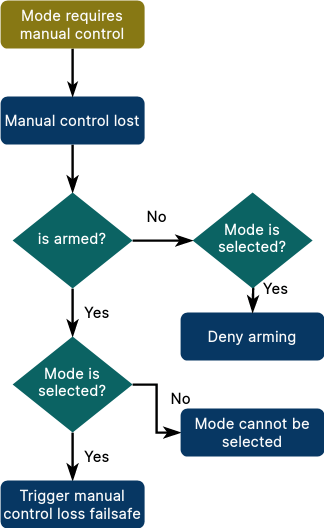

# 飞行模式

Modes ("flight modes", "drive modes", and so on) are special operational states that control how the autopilot responds to user input and controls vehicle movement.
They are loosely grouped into _manual_, _assisted_ and _auto_ modes, based on the level/type of control provided by the autopilot.
飞手使用遥控器上的开关或者 ground control station 在飞行模式之间进行切换。

Modes can be implemented as [PX4 internal modes](#px4-internal-modes) running on the flight controller, or as [PX4 external (ROS2) modes](#px4-external-modes) running on a companion computer.
From the perspective of a ground station (MAVLink), the origin of a mode is indistinguishable.

This topic links to documentation for the supported modes, compares PX4 internal and external modes, provides implementation hints, and provides links to how PX4 modes can be used with MAVLink.

## Supported Modes

Not all modes are available (or makes sense), on all vehicle types, and some modes behave differently on different vehicle types.

Mode documentation for the PX4 internal modes are listed below:

- [Flight Modes (Multicopter)](../flight_modes_mc/index.md)
- [Flight Modes (Fixed-Wing)](../flight_modes_fw/index.md)
- [Flight Modes (VTOL)](../flight_modes_vtol/index.md)
- [Drive Modes (Differential Rover)](../flight_modes_rover/differential.md)
- [Drive Modes (Ackermann Rover)](../flight_modes_rover/ackermann.md)
- [Basic Configuration > Flight Modes](../config/flight_mode.md)

## Internal vs External Modes

With some exceptions a mode can be implemented in either the FC or companion computer.
The main considerations are listed below.

PX4 external modes cannot be used in the following cases:

- Modes that need to run on vehicles that don't have a companion computer.
- Modes that require low-level access, strict timing, and/or high update rate requirements.
  For example, a multicopter mode that implements direct motor control.
- Safety critical modes, such as [Return mode](../flight_modes_mc/return.md).
- When you can't use ROS (for any reason).

External modes should be considered for all other cases.
They have the following benefits:

- Easier to implement as there is no need to deal with low-level embedded constraints and requirements (such as restricted stack sizes).
- Easier to maintain as the integration API is small, well defined, and stable.
- Porting custom PX4 modes on the flight controller between PX4 versions can be much harder, as often flight modes use interfaces that are considered internal, and allowed to change.
- Process termination of a ROS 2 mode results in a fallback to an internal flight mode (while termination of an internal mode may well crash the vehicle).
- They can override existing modes to provide more advanced features.
  You can even override a safety-critical mode with a better versions: if the ROS 2 mode crashes the original mode will be engaged.
- High-level functionality is available, including a better-feature programming environment, and many useful Linux and ROS libraries.
- More available compute to do more advanced processing (e.g. computer vision).

Note that the [PX4 ROS 2 Control Interface](../ros2/px4_ros2_control_interface.md) used to create external modes first appeared in PX4 v1.15 and is still considered experimental.
There are still some limitations, but expect changes and ongoing enhancement.

## PX4 External Modes

PX4 external modes, are written in ROS 2 using the [PX4 ROS 2 Control Interface](../ros2/px4_ros2_control_interface.md) (see link for instructions).

## PX4 Internal Modes

<!--
The specific control behaviour of a mode at any time is determined by a [Flight Task](../concept/flight_tasks.md).
A mode might define one or more tasks that define variations of the mode behavior, for example whether inputs are treated as acceleration or velocity setpoints.

The task that is used is normally defined in a parameter, and selected in [src/modules/flight_mode_manager/FlightModeManager.cpp](https://github.com/PX4/PX4-Autopilot/blob/main/src/modules/flight_mode_manager/FlightModeManager.cpp#L266-L285)


Name the relevant modules in which code directly related to flight modes is defined.
Name any base classes that modes must/should derive from
Explain the core things you need to do to make a mode work
Very high level architecture
-->

### Mode Restrictions

Some modes only make sense only under specific pre-flight and in-flight conditions.
For example, a manual control mode should not be used unless the system has a manual controller.

PX4 modes can specify these conditions as _restrictions_.
For internal modes the types of restrictions are listed in the [FailsafeFlags](../msg_docs/FailsafeFlags.md) uORB topic under "Per mode requirements" (duplicated below)

```text
# Per-mode requirements
mode_req_angular_velocity
mode_req_attitude
mode_req_local_alt
mode_req_local_position
mode_req_local_position_relaxed
mode_req_global_position
mode_req_mission
mode_req_offboard_signal
mode_req_home_position
mode_req_wind_and_flight_time_compliance # if set, mode cannot be entered if wind or flight time limit exceeded
mode_req_prevent_arming    # if set, cannot arm while in this mode
mode_req_manual_control
mode_req_other             # other requirements, not covered above (for external modes)
```

If the condition of restriction is not met:

- arming is not allowed, while the mode is selected
- when already armed, the mode cannot be selected
- when armed and the mode is selected, the relevant failsafe is triggered (e.g. RC loss for the manual control requirement).
  Check [Safety (Failsafe) Configuration](../config/safety.md) for how to configure failsafe behaviour.

This is the corresponding flow diagram for the manual control flag (`mode_req_manual_control`):



The requirements for all modes are set in `getModeRequirements()` in [src/modules/commander/ModeUtil/mode_requirements.cpp](https://github.com/PX4/PX4-Autopilot/blob/main/src/modules/commander/ModeUtil/mode_requirements.cpp#L46).
When adding a new mode you will need to add appropriate requirements in that method.

:::tip
Readers may note that this image is from [PX4 ROS2 Control Interface > Failsafes and mode requirements](../ros2/px4_ros2_control_interface.md#failsafes-and-mode-requirements).
The requirements and concepts are the same (though defined in different places).
The main difference is that ROS 2 modes _infer_ the correct requirements to use, while modes in PX4 source code must explicitly specify them.
:::

## MAVLink Integration

PX4 implements the MAVLink [Standard Modes Protocol](../mavlink/standard_modes.md) from PX4 v1.15.
This can be used to discover all modes and the current mode, and to set the current mode.
