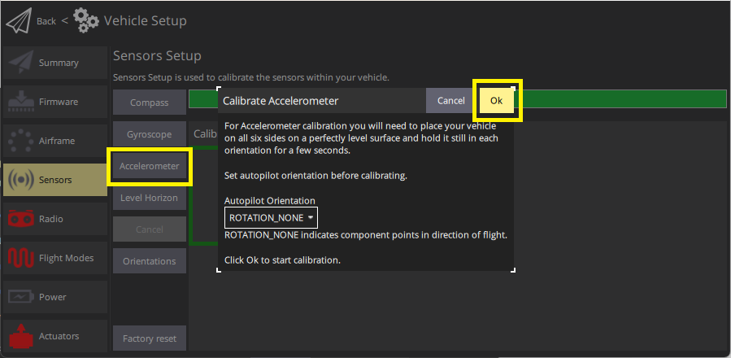
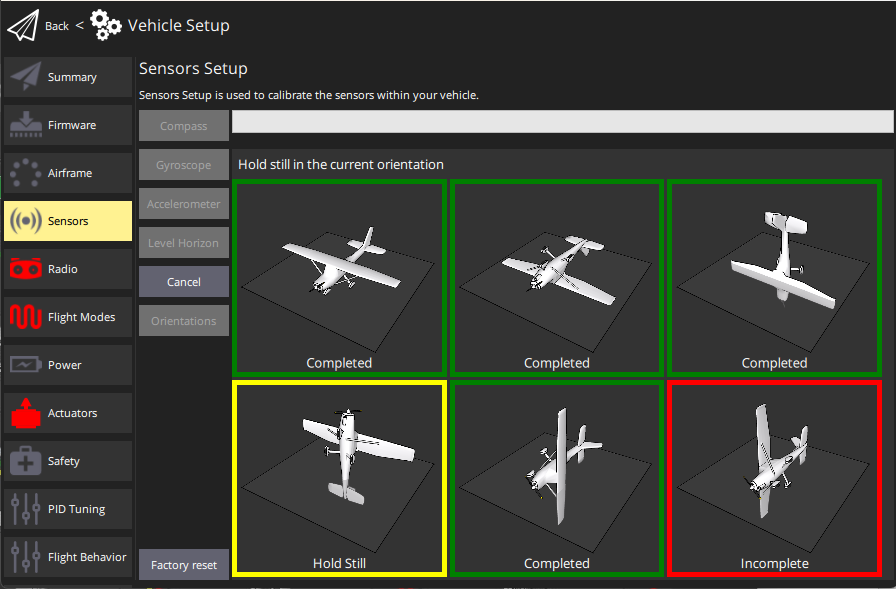

# 加速度计校准

加速度计必须在首次使用或飞行控制器方向发生改变时进行校准。
否则通常无需重新校准（除非在冬季使用时， 飞行控制器出厂时未进行温度校准[thermally calibrated](../advanced_config/sensor_thermal_calibration.md)）。

:::info
加速度计校准不良通常会被飞行前检查和拒绝解锁提示所捕获（GQC 的警告信息通常显示为“加速度计零偏过高” 和 “一致性检查失败”）。
:::

:::tip
这与[罗盘校准](../config/compass.md) 类似，区别在于每个姿态下需要将机体保持静止（而非旋转）。
:::

## 执行校准

_QGroundControl_ will guide you to place and hold your vehicle in a number of orientations (you will be prompted when to move between positions).

The calibration steps are:

1. Start _QGroundControl_ and connect the vehicle.

2. Select **"Q" icon > Vehicle Setup > Sensors** (sidebar) to open _Sensor Setup_.

3. Click the **Accelerometer** sensor button.

   

   ::: info
   You should already have set the [Autopilot Orientation](../config/flight_controller_orientation.md).
   If not, you can also set it here.

:::

4. Click **OK** to start the calibration.

5. Position the vehicle as guided by the _images_ on the screen.
   Once prompted (the orientation-image turns yellow) hold the vehicle still.
   该位置标定完成后，屏幕上的相应图示将变成绿色。

   ::: info
   The calibration uses a least squares 'fit' algorithm that doesn't require you to have "perfect" 90 degree orientations.
   Provided each axis is pointed mostly up and down at some time in the calibration sequence, and the vehicle is held stationary, the precise orientation doesn't matter.

:::

   

6. 在机体的所有方向上重复校准步骤。

Once you've calibrated the vehicle in all the positions _QGroundControl_ will display _Calibration complete_ (all orientation images will be displayed in green and the progress bar will fill completely).
You can then proceed to the next sensor.

## 更多信息

- [QGroundControl User Guide > Sensors](https://docs.qgroundcontrol.com/master/en/qgc-user-guide/setup_view/sensors_px4.html#accelerometer)
- [PX4 Setup Video - @1m46s](https://youtu.be/91VGmdSlbo4?t=1m46s) (Youtube)
