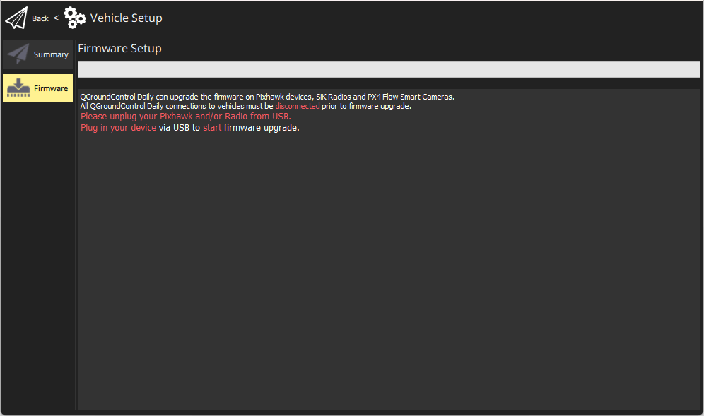
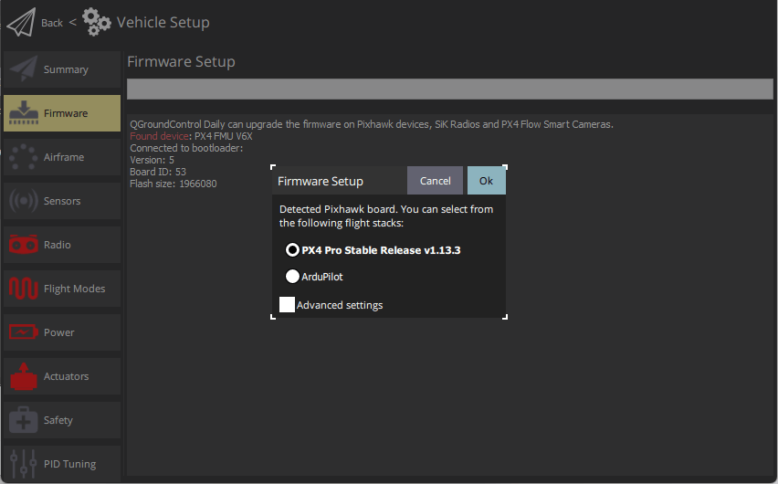
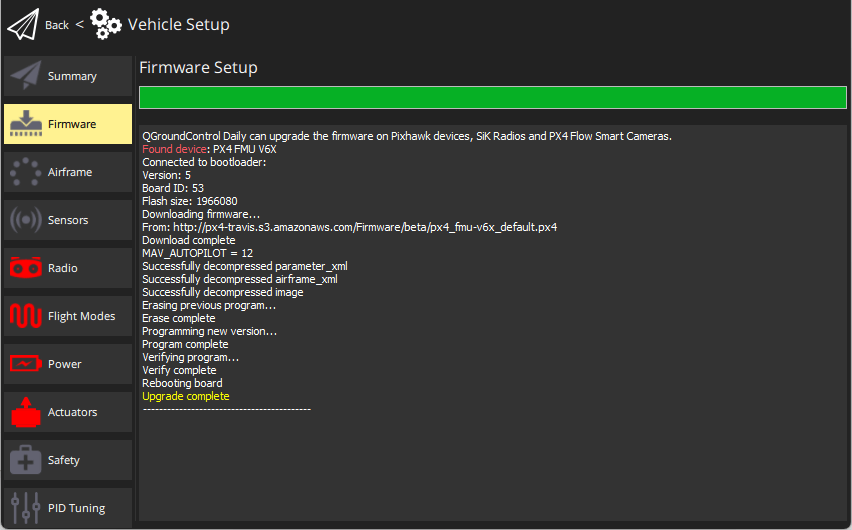
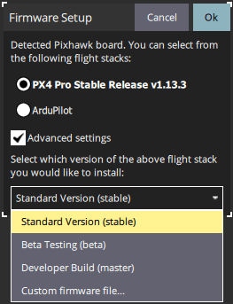
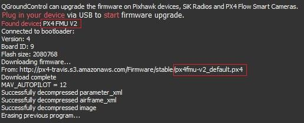

# 加载固件

_QGroundControl_ **desktop** versions can be used to install PX4 firmware onto [Pixhawk-series](../getting_started/flight_controller_selection.md) flight-controller boards.

:::warning
**Before you start installing Firmware** all USB connections to the vehicle must be _disconnected_ (both direct or through a telemetry radio).
The vehicle must _not be_ powered by a battery.
:::

## 安装稳定的PX4版本

Generally you should use the most recent _released_ version of PX4, in order to benefit from bug fixes and get the latest and greatest features.

:::tip
This is the version that is installed by default.
:::

To install PX4:

1. Start _QGroundControl_ and connect the vehicle.

2. Select **"Q" icon > Vehicle Setup > Firmware** (sidebar) to open _Firmware Setup_.

   

3. Connect the flight controller directly to your computer via USB.

   ::: info
   Connect directly to a powered USB port on your machine (do not connect through a USB hub).

:::

4. Select the **PX4 Pro Stable Release vX.x.x** option to install the latest stable version of PX4 _for your flight controller_ (autodetected).

   

5. Click the **OK** button to start the update.

   The firmware will then proceed through a number of upgrade steps (downloading new firmware, erasing old firmware etc.).
   Each step is printed to the screen and overall progress is displayed on a progress bar.

   

   Once the firmware has completed loading, the device/vehicle will reboot and reconnect.

   :::tip
   If _QGroundControl_ installs the FMUv2 target (see console during installation) and you have a newer board, you may need to [update the bootloader](#bootloader) in order to access all the memory on your flight controller.

:::

Next you will need to specify the [vehicle airframe](../config/airframe.md) (and then sensors, radio, etc.)

## 安装PX4 Main, Beta或自定义固件

To install a different version of PX4:

1. Connect the vehicle as above, and select **PX4 Pro Stable Release vX.x.x**.
   
2. Check **Advanced settings** and select the version from the dropdown list:
   - **Standard Version (stable):** The default version (i.e. no need to use advanced settings to install this!)
   - **Beta Testing (beta):** A beta/candidate release.
      只有当新版本准备完毕时才可用。
   - **Developer Build (master):** The latest build of PX4/PX4-Autopilot _main_ branch.
   - **Custom Firmware file...:** A custom firmware file (e.g. [that you have built locally](../dev_setup/building_px4.md)).
      如果选择 Custom firmware file ，您需要在下一步中从文件系统中选择自定义固件。

Firmware update then continues as before.

## Bootloader 更新

硬件通常预先安装匹配版本的引导程序。

您可能需要更新的是安装较新的 Pixhawk 板FMUv2 固件 。
If _QGroundControl_ installs the FMUv2 target (see console during installation), and you have a newer board, you may need to update the bootloader in order to access all the memory on your flight controller.

You can update it by following the instructions in [Bootloader update > FMUv2 Bootloader Update](../advanced_config/bootloader_update.md#fmuv2-bootloader-update).

## 更多信息

- [QGroundControl User Guide > Firmware](https://docs.qgroundcontrol.com/master/en/qgc-user-guide/setup_view/firmware.html).
- [PX4 Setup Video](https://youtu.be/91VGmdSlbo4) (Youtube)
