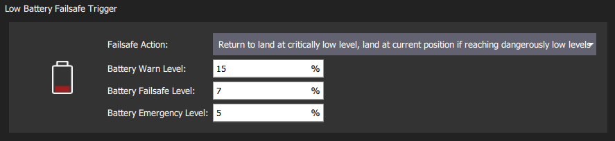

# Safety (Failsafe) Configuration

PX4有许多安全功能，可以在发生故障时保护并恢复您的机体：

- _Failsafes_ allow you to specify areas and conditions under which you can safely fly, and the [action](#failsafe-actions) that will be performed if a failsafe is triggered (for example, landing, holding position, or returning to a specified point).
  The most important failsafe settings are configured in the _QGroundControl_ [Safety Setup](#qgroundcontrol-safety-setup) page.
  Others must be configured via [parameters](../advanced_config/parameters.md).
- [Safety switches](#emergency-switches) on the remote control can be used to immediately stop motors or return the vehicle in the event of a problem.

## QGroundControl 安全设置

The _QGroundControl_ Safety Setup page is accessed by clicking the _QGroundControl_ icon, **Vehicle Setup**, and then **Safety** in the sidebar.
This includes many of the most important failsafe settings (battery, RC loss etc.) and the settings for the triggered actions _Return_ and _Land_.

## 故障保护动作

When a failsafe is triggered, the default behavior (for most failsafes) is to enter Hold for [COM_FAIL_ACT_T](../advanced_config/parameter_reference.md#COM_FAIL_ACT_T) seconds before performing an associated failsafe action.
这使用户有时间注意到正在发生的情况，并在需要时取消故障保护。
在大多数情况下，可以通过使用 RC或 GCS 切换模式来做到这一点(注意在故障保护保持期间， 移动 RC操纵杆不会触发取消操作)。

下面的列表显示了所有故障保护动作的集合，按其严重程度升序排列。
请注意，不同类型的故障保护可能无法支持所有这些操作。

| 动作                                                     | 描述                                                                                                                                                                                                                                   |
| ------------------------------------------------------ | ------------------------------------------------------------------------------------------------------------------------------------------------------------------------------------------------------------------------------------ |
| None/Disabled                     | 无操作. 故障保护将被忽略。                                                                                                                                                                                                       |
| Warning                           | A warning message will be sent (i.e. to _QGroundControl_).                                                                                                        |
| Hold mode                         | The vehicle will enter [Hold mode (MC)](../flight_modes_mc/hold.md) or [Hold mode (FW)](../flight_modes_fw/hold.md) and hover or circle, respectively. VTOL车辆将保持其目前的模式（MC/FW）。 |
| [Return mode][return]           | The vehicle will enter _Return mode_. Return behaviour can be set in the [Return Home Settings](#return-mode-settings) (below).                                                   |
| Land mode                         | The vehicle will enter [Land mode (MC)](../flight_modes_mc/land.md) or [Land mode (FW)](../flight_modes_fw/land.md), and land. VTAL 将首先过渡到 MC 模式。                              |
| Disarm                          | 马达立即停止。                                                                                                                                                                                                                              |
| [Flight termination][flight_term] | Turns off all controllers and sets all PWM outputs to their failsafe values (e.g. [PWM\_MAIN\_FAILn][pwm_main_failn], [PWM\_AUX\_FAILn][pwm_main_failn]). 故障保护输出可用于启动降落伞、起落架或执行其他操作。 对于固定翼飞行器，这可能允许您将机体滑翔至安全位置。                      |

[flight_term]: ../advanced_config/flight_termination.md
[return]: ../flight_modes/return.md
[pwm_main_failn]: ../advanced_config/parameter_reference.md#PWM_MAIN_FAIL1
[pwm_aux_failn]: ../advanced_config/parameter_reference.md#PWM_AUX_FAIL1

如果多个故障保险被触发，将采取高级别的操作。
For example if both RC and GPS are lost, and manual control loss is set to [Return mode](#act_return) and GCS link loss to [Land](#act_land), Land is executed.

:::tip
The exact behavior when different failsafes are triggered can be tested with the [Failsafe State Machine Simulation](safety_simulation.md).
:::

### 返航设置

<!-- Propose replace section by a summary and links - return mode is complicated -->

_Return_ is a common [failsafe action](#failsafe-actions) that engages [Return mode](../flight_modes/return.md) to return the vehicle to the home position.
The default settings for each vehicle are usually suitable, though for fixed wing vehicles you will usually need to define a mission landing.

:::tip
If you want to change the configuration you should carefully read the [Return mode](../flight_modes/return.md) documentation _for your vehicle type_ to understand the options.
:::

QGC allows users to set some aspects of the return mode and landing behaviour, such as the altitude to fly back, and the loiter time if you need to deploy landing gear.

### 降落模式设置

_Land at the current position_ is a common [failsafe action](#failsafe-actions) (in particular for multicopters), that engages [Land Mode](../flight_modes_mc/land.md).
The default settings for each vehicle are usually suitable.

:::tip
If you want to change the configuration you should carefully read the [Land mode](../flight_modes_fw/land.md) documentation _for your vehicle type_ to understand the options.
:::

QGC allows users to set some aspects of the landing behaviour, such as the time to disarm after landing and the descent rate (for multicopters only).

## Battery Failsafes

### Battery level failsafe

The low battery failsafe is triggered when the battery capacity drops below battery failafe level values.
You can configure both the levels and the failsafe actions at each level in QGroundControl.

The most common configuration is to set the values and action as above (with `Warn > Failsafe > Emergency`), and to set the [Failsafe Action](#COM_LOW_BAT_ACT) to warn at "warn level", trigger Return mode at "Failsafe level", and land immediately at "Emergency level".

The settings and underlying parameters are shown below.

| 设置                                                  | 参数                                                                                                                                          | 描述                                                                                        |
| --------------------------------------------------- | ------------------------------------------------------------------------------------------------------------------------------------------- | ----------------------------------------------------------------------------------------- |
| Failsafe Action         | [COM_LOW_BAT_ACT](../advanced_config/parameter_reference.md#COM_LOW_BAT_ACT) | Warn, Return, or Land based when capacity drops below the trigger levels. |
| Battery Warn Level          | [BAT_LOW_THR](../advanced_config/parameter_reference.md#BAT_LOW_THR)                              | 需做出警告（或其他动作）的电量百分比。                                                                       |
| Battery Failsafe Level     | [BAT_CRIT_THR](../advanced_config/parameter_reference.md#BAT_CRIT_THR)                            | 电量低于该百分比则返航（或者执行其他事前选择动作）。                                                                |
| Battery Emergency Level | [BAT_EMERGEN_THR](../advanced_config/parameter_reference.md#BAT_EMERGEN_THR)                      | 电量低于该百分比则（立即）触发降落动作。                                                                      |

### Flight Time Failsafes

There are several other "battery related" failsafe mechanisms that may be configured using parameters:

- The "remaining flight time for safe return" failsafe ([COM_FLTT_LOW_ACT](#COM_FLTT_LOW_ACT)) is engaged when PX4 estimates that the vehicle has just enough battery remaining for a return mode landing.
  You can configure this to ignore the failsafe, warn, or engage Return mode.
- The "maximum flight time failsafe" ([COM_FLT_TIME_MAX](#COM_FLT_TIME_MAX)) allows you to set a maximum flight time after takeoff, at which the vehicle will automatically enter return mode (it will also "warn" at 90% of this time). This is like a "hard coded" estimate of the total flight time in a battery. The feature is disabled by default.
- The "minimum battery" for arming parameter ([COM_ARM_BAT_MIN](#COM_ARM_BAT_MIN)) prevents arming in the first place if the battery level is below the specified value.

The settings and underlying parameters are shown below.

| 设置                                                                   | 参数                                                                                                                                            | 描述                                                                                                                                                                                                                                 |
| -------------------------------------------------------------------- | --------------------------------------------------------------------------------------------------------------------------------------------- | ---------------------------------------------------------------------------------------------------------------------------------------------------------------------------------------------------------------------------------- |
|  Low flight time for safe return action | [COM_FLTT_LOW_ACT](../advanced_config/parameter_reference.md#COM_FLTT_LOW_ACT) | Action when return mode can only just reach safety with remaining battery. `0`: None, `1`: Warning, `3`: Return mode (default). |
|  Maximum flight time failsafe level     | [COM_FLT_TIME_MAX](../advanced_config/parameter_reference.md#COM_FLT_TIME_MAX) | Maximum allowed flight time before Return mode will be engaged, in seconds. `-1`: Disabled (default).                                                           |

## Manual Control Loss Failsafe

The manual control loss failsafe may be triggered if the connection to the [RC transmitter](../getting_started/rc_transmitter_receiver.md) or [joystick](../config/joystick.md) is lost, and there is no fallback.
If using an [RC transmitter](../getting_started/rc_transmitter_receiver.md) this is triggered if the RC [transmitter link is lost](../getting_started/rc_transmitter_receiver.md#set-signal-loss-behaviour).
If using [joysticks](../config/joystick.md) connected over a MAVLink data link, this is triggered if the joysticks are disconnected or the data link is lost.

:::info
PX4 and the receiver may also need to be configured in order to _detect RC loss_: [Radio Setup > RC Loss Detection](../config/radio.md#rc-loss-detection).
:::

The QGCroundControl Safety UI allows you to set the [failsafe action](#failsafe-actions) and [RC Loss timeout](#COM_RC_LOSS_T).
Users that want to disable the RC loss failsafe in specific automatic modes (mission, hold, offboard) can do so using the parameter [COM_RCL_EXCEPT](#COM_RCL_EXCEPT).

Additional (and underlying) parameter settings are shown below.

| 参数                                                                                                                                                                   | 设置                          | 描述                                                                                                                                                                                                                                                                                                                                                                                                                                                                                                             |
| -------------------------------------------------------------------------------------------------------------------------------------------------------------------- | --------------------------- | -------------------------------------------------------------------------------------------------------------------------------------------------------------------------------------------------------------------------------------------------------------------------------------------------------------------------------------------------------------------------------------------------------------------------------------------------------------------------------------------------------------- |
| [COM_RC_LOSS_T](../advanced_config/parameter_reference.md#COM_RC_LOSS_T)    | Manual Control Loss Timeout | Time after last setpoint received from the selected manual control source after which manual control is considered lost. This must be kept short because the vehicle will continue to fly using the old manual control setpoint until the timeout triggers.                                                                                                                                                                                                                    |
| [COM_FAIL_ACT_T](../advanced_config/parameter_reference.md#COM_FAIL_ACT_T) | Failsafe Reaction Delay     | Delay in seconds between failsafe condition being triggered (`COM_RC_LOSS_T`) and failsafe action (RTL, Land, Hold). In this state the vehicle waits in hold mode for the manual control source to reconnect. This might be set longer for long-range flights so that intermittent connection loss doesn't immediately invoke the failsafe. It can be to zero so that the failsafe triggers immediately. |
| [NAV_RCL_ACT](../advanced_config/parameter_reference.md#NAV_RCL_ACT)                               | 故障保护动作                      | Disabled, Loiter, Return, Land, Disarm, Terminate.                                                                                                                                                                                                                                                                                                                                                                                                                                             |
| [COM_RCL_EXCEPT](../advanced_config/parameter_reference.md#COM_RCL_EXCEPT)                      | RC Loss Exceptions          | Set the modes in which manual control loss is ignored: Mission, Hold, Offboard.                                                                                                                                                                                                                                                                                                                                                                                                |

## 数据链路丢失故障保护

The Data Link Loss failsafe is triggered if a telemetry link (connection to ground station) is lost.

The settings and underlying parameters are shown below.

| 设置       | 参数                                                                                                                                      | 描述                                                                              |
| -------- | --------------------------------------------------------------------------------------------------------------------------------------- | ------------------------------------------------------------------------------- |
| 数据链路丢失超时 | [COM_DL_LOSS_T](../advanced_config/parameter_reference.md#COM_DL_LOSS_T) | 数据连接断开后到故障保护触发之前的时间。                                                            |
| 故障保护动作   | [NAV_DLL_ACT](../advanced_config/parameter_reference.md#NAV_DLL_ACT)                          | Disabled, Hold mode, Return mode, Land mode, Disarm, Terminate. |

The following settings also apply, but are not displayed in the QGC UI.

| 设置                                                          | 参数                                                                                                                   | 描述                                                                   |
| ----------------------------------------------------------- | -------------------------------------------------------------------------------------------------------------------- | -------------------------------------------------------------------- |
| Mode exceptions for DLL failsafe | [COM_DLL_EXCEPT](../advanced_config/parameter_reference.md#COM_DLL_EXCEPT) | Set modes where DL loss will not trigger a failsafe. |

## 地理围栏故障保护

The _Geofence Failsafe_ is triggered when the drone breaches a "virtual" perimeter.
In its simplest form, the perimeter is set up as a cylinder centered around the home position.
If the vehicle moves outside the radius or above the altitude the specified _Failsafe Action_ will trigger.

:::tip
PX4 separately supports more complicated Geofence geometries with multiple arbitrary polygonal and circular inclusion and exclusion areas: [Flying > Geofence](../flying/geofence.md).
:::

The settings and underlying [geofence parameters](../advanced_config/parameter_reference.md#geofence) are shown below.

| 设置         | 参数                                                                                                                                          | 描述                                                                      |
| ---------- | ------------------------------------------------------------------------------------------------------------------------------------------- | ----------------------------------------------------------------------- |
| 冲出围栏时的响应动作 | [GF_ACTION](../advanced_config/parameter_reference.md#GF_ACTION)                                                       | None, Warning, Hold mode, Return mode, Terminate, Land. |
| 最大半径       | [GF_MAX_HOR_DIST](../advanced_config/parameter_reference.md#GF_MAX_HOR_DIST) | 地理围栏圆柱体的水平半径。 如果为 0，则禁用地理围栏。                                            |
| 最大高度       | [GF_MAX_VER_DIST](../advanced_config/parameter_reference.md#GF_MAX_VER_DIST) | 地理围栏圆柱体的高度。 如果为 0，则禁用地理围栏。                                              |

:::info
Setting `GF_ACTION` to terminate will kill the vehicle on violation of the fence.
Due to the inherent danger of this, this function is disabled using [CBRK_FLIGHTTERM](#CBRK_FLIGHTTERM), which needs to be reset to 0 to really shut down the system.
:::

The following settings also apply, but are not displayed in the QGC UI.

| 设置                                                                 | 参数                                                                                                | 描述                                                                                                                                                                                                        |
| ------------------------------------------------------------------ | ------------------------------------------------------------------------------------------------- | --------------------------------------------------------------------------------------------------------------------------------------------------------------------------------------------------------- |
| Geofence source                              | [GF_SOURCE](../advanced_config/parameter_reference.md#GF_SOURCE)             | 设置定位是来自全局位置估计还是直接来自 GPS 设备。                                                                                                                                                                               |
| Preemptive geofence triggering              | [GF_PREDICT](../advanced_config/parameter_reference.md#GF_PREDICT)           | (Experimental) Trigger geofence if current motion of the vehicle is predicted to trigger the breach (rather than late triggering after the breach). |
| Circuit breaker for flight termination | [CBRK_FLIGHTTERM](../advanced_config/parameter_reference.md#CBRK_FLIGHTTERM) | 启用/禁用飞行终止操作（默认禁用）。                                                                                                                                                                                        |

## Position (GNSS) Loss Failsafe

The _Position Loss Failsafe_ is triggered if the quality of the PX4 global position estimate falls below acceptable levels (this might be caused by GPS loss) while in a mode that requires an acceptable position estimate.

The failure action is controlled by [COM_POSCTL_NAVL](../advanced_config/parameter_reference.md#COM_POSCTL_NAVL), based on whether RC control is assumed to be available (and altitude information):

- `0`: Remote control available.
  Switch to _Altitude mode_ if a height estimate is available, otherwise _Stabilized mode_.
- `1`: Remote control _not_ available.
  Switch to _Descend mode_ if a height estimate is available, otherwise enter flight termination.
  _Descend mode_ is a landing mode that does not require a position estimate.

Fixed-wing planes, and VTOLs not configured to land in hover ([NAV_FORCE_VT](../advanced_config/parameter_reference.md#NAV_FORCE_VT)), have a parameter ([FW_GPSF_LT](../advanced_config/parameter_reference.md#FW_GPSF_LT)) that defines how long they will loiter (circle with a constant roll angle ([FW_GPSF_R](../advanced_config/parameter_reference.md#FW_GPSF_R)) at the current altitude) after losing position before attempting to land.
If VTOLs have are configured to switch to hover for landing ([NAV_FORCE_VT](../advanced_config/parameter_reference.md#NAV_FORCE_VT)) then they will first transition and then descend.

The relevant parameters for all vehicles shown below.

| 参数                                                                                                                                                 | 描述                                                                                                                                                            |
| -------------------------------------------------------------------------------------------------------------------------------------------------- | ------------------------------------------------------------------------------------------------------------------------------------------------------------- |
| [COM_POSCTL_NAVL](../advanced_config/parameter_reference.md#COM_POSCTL_NAVL) | Position control navigation loss response during mission. Values: `0` - assume use of RC, `1` - Assume no RC. |

Parameters that only affect Fixed-wing vehicles:

| 参数                                                                                                                                  | 描述                                                                                                                                   |
| ----------------------------------------------------------------------------------------------------------------------------------- | ------------------------------------------------------------------------------------------------------------------------------------ |
| [FW_GPSF_LT](../advanced_config/parameter_reference.md#FW_GPSF_LT) | Loiter time (waiting for GPS recovery before it goes into land or flight termination). 设置为 0 以禁用。 |
| [FW_GPSF_R](../advanced_config/parameter_reference.md#FW_GPSF_R)    | 以一定的横滚/侧倾角盘旋。                                                                                                                        |

## Offboard 中断故障保护

The _Offboard Loss Failsafe_ is triggered if the offboard link is lost while under [Offboard control](../flight_modes/offboard.md).
Different failsafe behaviour can be specified based on whether or not there is also an RC connection available.

The relevant parameters are shown below:

| 参数                                                                                                                                        | 描述                                            |
| ----------------------------------------------------------------------------------------------------------------------------------------- | --------------------------------------------- |
| [COM_OF_LOSS_T](../advanced_config/parameter_reference.md#COM_OF_LOSS_T)   | Offboard 连接中断后到触发故障保护前的延迟。                    |
| [COM_OBL_RC_ACT](../advanced_config/parameter_reference.md#COM_OBL_RC_ACT) | 如果遥控可用，则故障保护动作：定点模式、定高模式、手动模式、返航模式、降落模式、保持模式。 |

## 交通规避故障保护

The Traffic Avoidance Failsafe allows PX4 to respond to transponder data (e.g. from [ADSB transponders](../advanced_features/traffic_avoidance_adsb.md)) during missions.

The relevant parameters are shown below:

| 参数                                                                                                                     | 描述                        |
| ---------------------------------------------------------------------------------------------------------------------- | ------------------------- |
| [NAV_TRAFF_AVOID](../advanced_config/parameter_reference.md#NAV_TRAFF_AVOID) | 设置故障保护动作：禁用、警告、返航模式、降落模式。 |

## Quad-chute Failsafe

Failsafe for when a VTOL vehicle can no longer fly in fixed-wing mode, perhaps due to the failure of a pusher motor, airspeed sensor, or control surface.
If the failsafe is triggered, the vehicle will immediately switch to multicopter mode and execute the action defined in parameter [COM_QC_ACT](#COM_QC_ACT).

:::info
The quad-chute can also be triggered by sending a MAVLINK [MAV_CMD_DO_VTOL_TRANSITION](https://mavlink.io/en/messages/common.html#MAV_CMD_DO_VTOL_TRANSITION) message with `param2` set to `1`.
:::

The parameters that control when the quad-chute will trigger are listed in the table below.

| 参数                                                                                                                                                                                              | 描述                                                                                                                                                                                                                                                                                                                                                                                                                                                                                                                                                                                                                                                                                                                                                                                                                          |
| ----------------------------------------------------------------------------------------------------------------------------------------------------------------------------------------------- | --------------------------------------------------------------------------------------------------------------------------------------------------------------------------------------------------------------------------------------------------------------------------------------------------------------------------------------------------------------------------------------------------------------------------------------------------------------------------------------------------------------------------------------------------------------------------------------------------------------------------------------------------------------------------------------------------------------------------------------------------------------------------------------------------------------------------- |
| [COM_QC_ACT](../advanced_config/parameter_reference.md#COM_QC_ACT)                                                             | Quad-chute action after switching to multicopter flight. Can be set to: [Warning](#act_warn), [Return](#act_return), [Land](#act_land), [Hold](#act_hold).                                                                                                                                                                                                                                                                                                                                                                                                                                                                                                                                                                                                                  |
| [VT_FW_QC_HMAX](../advanced_config/parameter_reference.md#VT_FW_QC_HMAX)                               | Maximum quad-chute height, below which the quad-chute failsafe cannot trigger. This prevents high altitude quad-chute descent, which can drain the battery (and itself cause a crash). The height is relative to ground, home, or the local origin (in preference order, depending on what is available).                                                                                                                                                                                                                                                                                                                                                                                                                             |
| [VT_QC_ALT_LOSS](../advanced_config/parameter_reference.md#VT_QC_ALT_LOSS)                            | Uncommanded descent quad-chute altitude threshold.  In altitude controlled modes, such as [Hold mode](../flight_modes_fw/hold.md), [Position mode](../flight_modes_fw/position.md), [Altitude mode](../flight_modes_fw/altitude.md), or [Mission mode](../flight_modes_fw/mission.md), a vehicle should track its current "commanded" altitude setpoint. The quad chute failsafe is triggered if the vehicle falls too far below the commanded setpoint (by the amount defined in this parameter).  Note that the quad-chute is only triggered if the vehicle continuously loses altitude below the commanded setpoint; it is not triggered if the commanded altitude setpoint increases faster than the vehicle can follow. |
| [VT_QC_T_ALT_LOSS](../advanced_config/parameter_reference.md#VT_QC_T_ALT_LOSS) | Altitude loss threshold for quad-chute triggering during VTOL transition to fixed-wing flight. The quad-chute is triggered if the vehicle falls this far below its initial altitude before completing the transition.                                                                                                                                                                                                                                                                                                                                                                                                                                                                                                                                                                       |
| [VT_FW_MIN_ALT](../advanced_config/parameter_reference.md#VT_FW_MIN_ALT)                               | Minimum altitude above Home for fixed-wing flight. When the altitude drops below this value in fixed-wing flight the vehicle a quad-chute is triggered.                                                                                                                                                                                                                                                                                                                                                                                                                                                                                                                                                                                                                                     |
| [VT_FW_QC_R](../advanced_config/parameter_reference.md#VT_FW_QC_R)                                        | Absolute roll threshold for quad-chute triggering in FW mode.                                                                                                                                                                                                                                                                                                                                                                                                                                                                                                                                                                                                                                                                                                                                               |
| [VT_FW_QC_P](../advanced_config/parameter_reference.md#VT_FW_QC_P)                                        | Absolute pitch threshold for quad-chute triggering in FW mode.                                                                                                                                                                                                                                                                                                                                                                                                                                                                                                                                                                                                                                                                                                                                              |

## High Wind Failsafe

The high wind failsafe can trigger a warning and/or other mode change when the wind speed exceeds the warning and maximum wind-speed threshhold values.
The relevant parameters are listed in the table below.

| 参数                                                                                                                                                                         | 描述                                                                                                                                                                                                                                                                                                                                                                                                                                                                                   |
| -------------------------------------------------------------------------------------------------------------------------------------------------------------------------- | ------------------------------------------------------------------------------------------------------------------------------------------------------------------------------------------------------------------------------------------------------------------------------------------------------------------------------------------------------------------------------------------------------------------------------------------------------------------------------------ |
| [COM_WIND_MAX](../advanced_config/parameter_reference.md#COM_WIND_MAX)                                  | Wind speed threshold that triggers failsafe action, in m/s ([COM_WIND_MAX_ACT](#COM_WIND_MAX_ACT)).                                                                                                                                                                                                                                                                                |
| [COM_WIND_MAX_ACT](../advanced_config/parameter_reference.md#COM_WIND_MAX_ACT) | High wind failsafe action (following [COM_WIND_MAX](#COM_WIND_MAX) trigger). Can be set to: `0`: None (Default), `1`: [Warning](#act_warn), `2`: [Hold](#act_hold), `3`: [Return](#act_return), `4`: [Terminate](#act_term), `5`: [Land](#act_land). |
| [COM_WIND_WARN](../advanced_config/parameter_reference.md#COM_WIND_WARN)                               | Wind speed threshold that triggers periodic failsafe warning.                                                                                                                                                                                                                                                                                                                                                                                                        |

## 故障检测器

The failure detector allows a vehicle to take protective action(s) if it unexpectedly flips, or if it is notified by an external failure detection system.

During **flight**, the failure detector can be used to trigger [flight termination](../advanced_config/flight_termination.md) if failure conditions are met, which may then launch a [parachute](../peripherals/parachute.md) or perform some other action.

:::info
Failure detection during flight is deactivated by default (enable by setting the parameter: [CBRK_FLIGHTTERM=0](#CBRK_FLIGHTTERM)).
:::

During **takeoff** the failure detector [attitude trigger](#attitude-trigger) invokes the [disarm action](#act_disarm) if the vehicle flips (disarm kills the motors but, unlike flight termination, will not launch a parachute or perform other failure actions).
Note that this check is _always enabled on takeoff_, irrespective of the `CBRK_FLIGHTTERM` parameter.

The failure detector is active in all vehicle types and modes, except for those where the vehicle is _expected_ to do flips (i.e. [Acro mode (MC)](../flight_modes_mc/altitude.md), [Acro mode (FW)](../flight_modes_fw/altitude.md), and [Manual (FW)](../flight_modes_fw/manual.md)).

### 姿态触发器

The failure detector can be configured to trigger if the vehicle attitude exceeds predefined pitch and roll values for longer than a specified time.

The relevant parameters are shown below:

| 参数                                                                                                                                                                   | 描述                                                                                                                                                                        |
| -------------------------------------------------------------------------------------------------------------------------------------------------------------------- | ------------------------------------------------------------------------------------------------------------------------------------------------------------------------- |
| [CBRK_FLIGHTTERM](../advanced_config/parameter_reference.md#CBRK_FLIGHTTERM)                                        | 飞行终止断路器。 从 121212（默认）取消设置，以启用由于故障检测器或 FMU 丢失而导致的飞行终止。                                                                                                                     |
| [FD_FAIL_P](../advanced_config/parameter_reference.md#FD_FAIL_P)                                     | 最大允许俯仰角（角度制）。                                                                                                                                                             |
| [FD_FAIL_R](../advanced_config/parameter_reference.md#FD_FAIL_R)                                     | 最大允许横滚角（角度制）。                                                                                                                                                             |
| [FD_FAIL_P_TTRI](../advanced_config/parameter_reference.md#FD_FAIL_P_TTRI) | Time to exceed [FD_FAIL_P](#FD_FAIL_P) for failure detection (default 0.3s). |
| [FD_FAIL_R_TTRI](../advanced_config/parameter_reference.md#FD_FAIL_R_TTRI) | Time to exceed [FD_FAIL_R](#FD_FAIL_R) for failure detection (default 0.3s). |

### 外部自动触发系统（ATS）

The [failure detector](#failure-detector), if [enabled](#CBRK_FLIGHTTERM), can also be triggered by an external ATS system.
The external trigger system must be connected to flight controller port AUX5 (or MAIN5 on boards that do not have AUX ports), and is configured using the parameters below.

:::info
External ATS is required by [ASTM F3322-18](https://webstore.ansi.org/Standards/ASTM/ASTMF332218).
One example of an ATS device is the [FruityChutes Sentinel Automatic Trigger System](https://fruitychutes.com/uav_rpv_drone_recovery_parachutes/sentinel-automatic-trigger-system.htm).
:::

| 参数                                                                                                                                                                      | 描述                                                               |
| ----------------------------------------------------------------------------------------------------------------------------------------------------------------------- | ---------------------------------------------------------------- |
| [FD_EXT_ATS_EN](../advanced_config/parameter_reference.md#FD_EXT_ATS_EN)       | 启用 AUX5 或 MAIN5（取决于飞控板）上的 PWM 输入，以便从外部自动触发系统（ATS）启用故障保护。 默认值：禁用。 |
| [FD_EXT_ATS_TRIG](../advanced_config/parameter_reference.md#FD_EXT_ATS_TRIG) | 来自外部自动触发系统的用于接通故障保护的 PWM 阈值。 默认值：1900m/s。                        |

## 任务可行性检查

A number of checks are run to ensure that a mission can only be started if it is _feasible_.
For example, the checks ensures that the first waypoint isn't too far away, and that the mission flight path doesn't conflict with any geofences.

As these are not strictly speaking "failsafes" they are documented in [Mission Mode (FW) > Mission Feasibility Checks](../flight_modes_fw/mission.md#mission-feasibility-checks) and [Mission Mode (MC) > Mission Feasibility Checks](../flight_modes_mc/mission.md#mission-feasibility-checks).

## 应急开关

Remote control switches can be configured (as part of _QGroundControl_ [Flight Mode Setup](../config/flight_mode.md)) to allow you to take rapid corrective action in the event of a problem or emergency; for example, to stop all motors, or activate [Return mode](#return-switch).

This section lists the available emergency switches.

### 急停开关

A kill switch immediately stops all motor outputs — if flying, the vehicle will start to fall!

[By default](#COM_KILL_DISARM) the motors will restart if the switch is reverted within 5 seconds, after which the vehicle will automatically disarm, and you will need to arm it again in order to start the motors.

| 参数                                                                                                                                                 | 描述                                                                                                                              |
| -------------------------------------------------------------------------------------------------------------------------------------------------- | ------------------------------------------------------------------------------------------------------------------------------- |
| [COM_KILL_DISARM](../advanced_config/parameter_reference.md#COM_KILL_DISARM) | Timeout value for disarming after kill switch is engaged. Default: `5` seconds. |

:::info
There is also a [Kill Gesture](#kill-gesture), which cannot be reverted.
:::

### 解锁/上锁开关

The arm/disarm switch is a _direct replacement_ for the default stick-based arming/disarming mechanism (and serves the same purpose: making sure there is an intentional step involved before the motors start/stop).
它可能优先于默认机制使用，原因如下：

- 这种机制偏向于切换动作而不是持续运动。
- 这种机制可以避免因为某种意外误触而引发的飞行期间解锁/上锁。
- 这种机制没有延迟（立即作出反应）。

The arm/disarm switch immediately disarms (stop) motors for those [flight modes](../flight_modes/index.md#flight-modes) that _support disarming in flight_.
其中包括：

- _Manual mode_
- _Acro mode_
- _Stabilized_

对于不支持在飞行期间上锁的模式，在飞行期间会忽略该开关信号，但在检测到着陆后可以使用该开关。
This includes _Position mode_ and autonomous modes (e.g. _Mission_, _Land_ etc.).

:::info
[Auto disarm timeouts](#auto-disarming-timeouts) (e.g. via [COM_DISARM_LAND](#COM_DISARM_LAND)) are independent of the arm/disarm switch - ie even if the switch is armed the timeouts will still work.
:::

<!--
**Note** This can also be done by [manually setting](../advanced_config/parameters.md) the [RC_MAP_ARM_SW](../advanced_config/parameter_reference.md#RC_MAP_ARM_SW) parameter to the corresponding switch RC channel.
  If the switch positions are reversed, change the sign of the parameter [RC_ARMSWITCH_TH](../advanced_config/parameter_reference.md#RC_ARMSWITCH_TH) (or also change its value to alter the threshold value).
-->

### 返航开关

A return switch can be used to immediately engage [Return mode](../flight_modes/return.md).

## Kill Gesture

A kill gesture immediately stops all motor outputs — if flying, the vehicle will start to fall!

The action cannot be reverted without a reboot (this differs from a [Kill Switch](#kill-switch), where the operation can be reverted within the time period defined by [COM_KILL_DISARM](#COM_KILL_DISARM)).

| 参数                                                                                                                                                                      | 描述                                                                                                                                                                      |
| ----------------------------------------------------------------------------------------------------------------------------------------------------------------------- | ----------------------------------------------------------------------------------------------------------------------------------------------------------------------- |
| [MAN_KILL_GEST_T](../advanced_config/parameter_reference.md#MAN_KILL_GEST_T) | Time to hold sticks in gesture position before killing the motors. Default: `-1` seconds (Disabled). |

## Arming/Disarming Settings

The [commander module](../advanced_config/parameter_reference.md#commander) has a number of parameters prefixed with `COM_ARM` that configure whether the vehicle can arm at all, and under what conditions (note that some parameters named with the prefix `COM_ARM` are used to arm other systems).
Parameters prefixed with `COM_DISARM_` affect disarming behaviour.

### Auto-Disarming Timeouts

You can set timeouts to automatically disarm a vehicle if it is too slow to takeoff, and/or after landing (disarming the vehicle removes power to the motors, so the propellers won't spin).

The [relevant parameters](../advanced_config/parameters.md) are shown below:

| 参数                                                                                                                                                    | 描述                |
| ----------------------------------------------------------------------------------------------------------------------------------------------------- | ----------------- |
| [COM_DISARM_LAND](../advanced_config/parameter_reference.md#COM_DISARM_LAND)    | 降落后自动上锁的超时时间。     |
| [COM_DISARM_PRFLT](../advanced_config/parameter_reference.md#COM_DISARM_PRFLT) | 如果起飞速度太慢，将启动自动上锁。 |

### Arming Pre-Conditions

These parameters can be used to set conditions that prevent arming.

| 参数                                                                                                                                                                         | 描述                                                                                                                                                                                                                                                                                                                                                                  |
| -------------------------------------------------------------------------------------------------------------------------------------------------------------------------- | ------------------------------------------------------------------------------------------------------------------------------------------------------------------------------------------------------------------------------------------------------------------------------------------------------------------------------------------------------------------- |
| [COM_ARMABLE](../advanced_config/parameter_reference.md#COM_ARMABLE)                                                          | Enable arming (at all). `0`: Disabled, `1`: Enabled (default).                                                                                                                                                                                                |
| [COM_ARM_BAT_MIN](../advanced_config/parameter_reference.md#COM_ARM_BAT_MIN)    | Minimum battery level for arming. `0`: Disabled (default). Values: `0`-`0.9`,                                                                                                                                                                                                    |
| [COM_ARM_WO_GPS](../advanced_config/parameter_reference.md#COM_ARM_WO_GPS)       | Enable arming without GPS. `0`: Disabled, `1`: Enabled (default).                                                                                                                                                                                                                |
| [COM_ARM_MIS_REQ](../advanced_config/parameter_reference.md#COM_ARM_MIS_REQ)    | Require valid mission to arm. `0`: Disabled (default), `1`: Enabled .                                                                                                                                                                                                            |
| [COM_ARM_SDCARD](../advanced_config/parameter_reference.md#COM_ARM_SDCARD)                            | Require SD card to arm. `0`: Disabled (default), `1`: Warning, `2`: Enabled.                                                                                                                                                                                     |
| [COM_ARM_AUTH_REQ](../advanced_config/parameter_reference.md#COM_ARM_AUTH_REQ) | Requires arm authorisation from an external (MAVLink) system. Flag to allow arming (at all). `1`: Enabled, `0`: Disabled (default). Associated configuration parameters are prefixed with `COM_ARM_AUTH_`. |
| [COM_ARM_ODID](../advanced_config/parameter_reference.md#COM_ARM_ODID)                                  | Require healthy Remote ID system to arm. `0`: Disabled (default), `1`: Warning, `2`: Enabled.                                                                                                                                                                    |

In addition there are a number of parameters that configure system and sensor limits that make prevent arming if exceeded: [COM_CPU_MAX](../advanced_config/parameter_reference.md#COM_CPU_MAX), [COM_ARM_IMU_ACC](../advanced_config/parameter_reference.md#COM_ARM_IMU_ACC), [COM_ARM_IMU_GYR](../advanced_config/parameter_reference.md#COM_ARM_IMU_GYR), [COM_ARM_MAG_ANG](../advanced_config/parameter_reference.md#COM_ARM_MAG_ANG), [COM_ARM_MAG_STR](../advanced_config/parameter_reference.md#COM_ARM_MAG_STR).

## 更多信息

- [QGroundControl User Guide > Safety Setup](https://docs.qgroundcontrol.com/master/en/qgc-user-guide/setup_view/safety.html)
