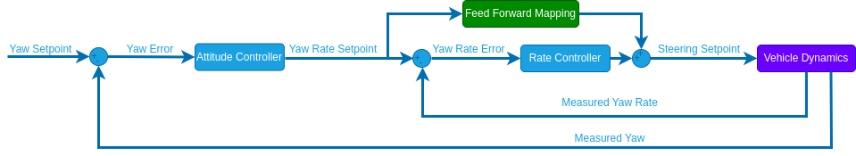

# Attitude Tuning

Attitude tuning is required to use [Stabilized mode](../flight_modes_rover/manual.md#stabilized-mode) and all later modes.

:::warning
The [rate tuning](rate_tuning.md) must've already been completed before this step!
:::

Configure the following [parameters](../advanced_config/parameters.md) in QGroundControl:

1. [RO_YAW_P](#RO_YAW_P) [-]: Proportional gain for the closed loop yaw controller.

   ::: tip
   In stabilized mode the closed loop yaw control is only active when driving a straight line (no yaw rate input).
   To tune it start with a value of 1 for [RO_YAW_P](#RO_YAW_P).
   Put the rover into stabilized mode and move the left stick of your controller up to drive forwards.
   Disarm the rover and from the flight log plot the `measured_yaw` and the `adjusted_yaw_setpoint` from the [RoverAttitudeStatus](../msg_docs/RoverAttitudeStatus.md) message over each other.
   Increase/Decrease the parameter until you are satisfied with the setpoint tracking.
   If you observe a steady state error in the yaw setpoint increase the the integrator of the rate controller: [RO_YAW_RATE_I](../advanced_config/parameter_reference.md#RO_YAW_RATE_I) .

:::

The rover is now ready to drive in [Stabilized mode](../flight_modes_rover/manual.md#stabilized-mode) and the configuration can be continued with [velocity tuning](velocity_tuning.md).

## Attitude Controller Structure (Info Only)

This section provides additional information for developers and people with experience in control system design.

The attitude controller uses the following structure:

The rate and attitude controllers are cascaded, therefor we only require one integrator in the structure to eliminate steady state errors.
We placed the integrator in the rate controller since it can run without the attitude controller but not the other way around.

## Parameter Overview

| 参数                                                                                                                            | 描述                                   | Unit |
| ----------------------------------------------------------------------------------------------------------------------------- | ------------------------------------ | ---- |
| [RO_YAW_P](../advanced_config/parameter_reference.md#RO_YAW_P) | Proportional gain for yaw controller | -    |
