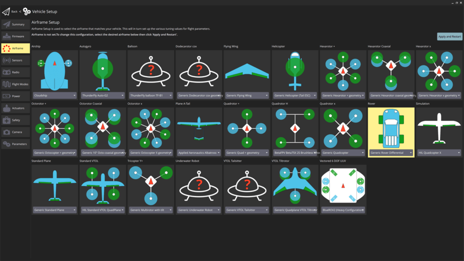
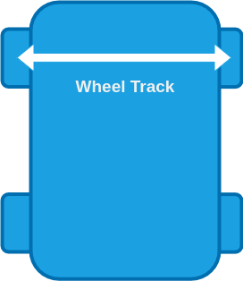
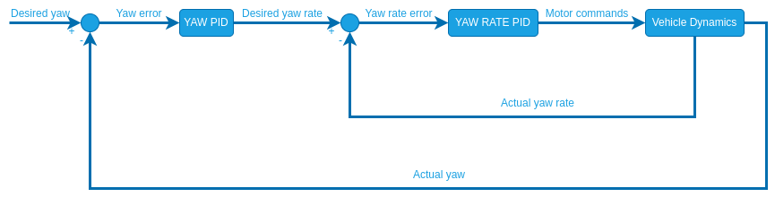
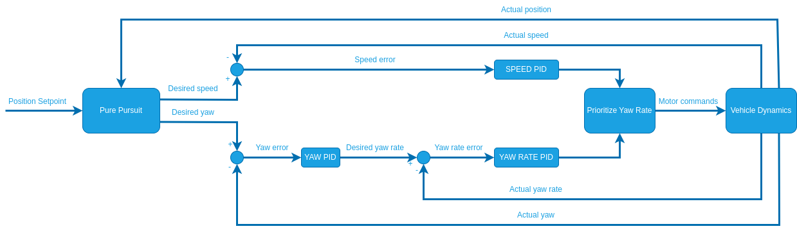
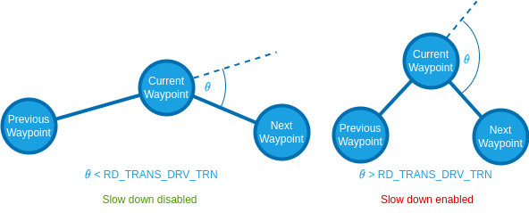
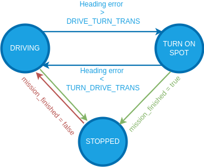
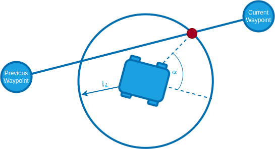

# Configuration/Tuning (Differential Rover)

This topic provides a step-by-step guide for setting up your [Differential rover](../frames_rover/differential.md).
Successive steps enable [drive modes](../flight_modes_rover/differential.md) with more autopilot support and features.

:::warning
Each step is dependent on the previous steps having been completed.
Modes will only work properly if the preceding modes have been configured.
:::

## Basic Setup

To configure the differential rover frame and outputs:

1. Enable Rover support by flashing the [PX4 rover build](../frames_rover/index.md#flashing-the-rover-build) onto your flight controller.
   Note that this is a special build that contains rover-specific modules.

2. In the [Airframe](../config/airframe.md) configuration select _Generic Rover Differential_ frame:

   

   Select the **Apply and Restart** button.

   ::: info
   If this airframe is not displayed and you have checked that you are using rover firmware (not the default), you can alternatively enable this frame by setting the [SYS_AUTOSTART](../advanced_config/parameter_reference.md#SYS_AUTOSTART) parameter to `50000`.

:::

3. Use [Actuators Configuration & Testing](../config/actuators.md) to map the motor functions to flight controller outputs.

## 手动模式

:::warning
For this mode to work properly the [Basic Setup](#basic-setup) must've already been completed!
:::

The basic setup already covers the minimum setup required to use the rover in [Manual mode](../flight_modes_rover/differential.md#manual-mode).

This mode is also affected by (optional) acceleration/deceleration limits.
As configuration of these limits becomes mandatory for subsequent modes, we do this setup here.

Navigate to [Parameters](../advanced_config/parameters.md) in QGroundControl and set the following parameters:

1. [RD_WHEEL_TRACK](#RD_WHEEL_TRACK) [m]: Measure the distance from the centre of the right wheel to the centre of the left wheel.

   

2. [RO_MAX_THR_SPEED](#RO_MAX_THR_SPEED) [m/s]: Drive the rover at full throttle and set this parameter to the observed value of the ground speed.

   :::info
   This parameter is also used for the feed-forward term of the speed control.
   It will be further tuned in the configuration of [Position mode](#position-mode).

:::

3. (Optional) [RO_ACCEL_LIM](#RO_ACCEL_LIM) [m/s^2]: Maximum acceleration you want to allow for your rover.

   

   :::tip
   Your rover has a maximum possible acceleration which is determined by the maximum torque the motor can supply.
   This may or may not be appropriate for your vehicle and use case.

   One approach to determine an appropriate value is:

   1. From a standstill, give the rover full throttle until it reaches the maximum speed.
   2. Disarm the rover and plot the `measured_speed_body_x` from [RoverVelocityStatus](../msg_docs/RoverVelocityStatus.md).
   3. Divide the maximum speed by the time it took to reach it and set this as the value for [RO_ACCEL_LIM](#RO_ACCEL_LIM).

   Some RC rovers have enough torque to lift up if the maximum acceleration is not limited.
   If that is the case:

   4. Set [RO_ACCEL_LIM](#RO_ACCEL_LIM) to a low value, give the rover full throttle from a standstill and observe its behaviour.
   5. Increase [RO_ACCEL_LIM](#RO_ACCEL_LIM) until the rover starts to lift up during the acceleration.
   6. Set [RO_ACCEL_LIM](#RO_ACCEL_LIM) to the highest value that does not cause the rover to lift up.

:::

4. (Optional) [RO_DECEL_LIM](#RO_DECEL_LIM) [m/s^2]: Maximum deceleration you want to allow for your rover.

   :::tip
   The same [considerations](#RO_ACCEL_LIM_CONSIDERATIONS) as in the configuration of [RO_ACCEL_LIM](#RO_ACCEL_LIM) apply.

:::

   :::info
   This parameter is also used for the calculation of the speed setpoint during [Auto modes](#auto-modes).

:::

## Acro Mode

:::warning
For this mode to work properly [Manual mode](#manual-mode) must've already been configured!
:::

To set up [Acro mode](../flight_modes_rover/differential.md#acro-mode), navigate to [Parameters](../advanced_config/parameters.md) in QGroundControl and set the following parameters:

1. [RO_YAW_RATE_LIM](#RO_YAW_RATE_LIM) [deg/s]: This is the maximum yaw rate you want to allow for your rover.
   This will define the stick-to-yaw-rate mapping for all manual modes using closed loop yaw control and set an upper limit for the yaw rate setpoint for all [auto modes](#auto-modes).

2. [RD_MAX_THR_YAW_R](#RD_MAX_THR_YAW_R) [m/s]: This parameter is used to calculate the feed-forward term of the closed loop yaw rate control.
   The controller calculates the required speed difference between the left and right motor to achieve the desired yaw rate.
   This desired speed difference is then linearly mapped to normalized motor commands.
   To get a good starting value for this parameter drive the rover in manual mode forwards at full throttle and note the ground speed of the vehicle.
   Then enter _half_ this value for the parameter. 

   ::: tip
   To further tune this parameter, first make sure you set [RO_YAW_RATE_P](#RO_YAW_RATE_P) and [RO_YAW_RATE_I](#RO_YAW_RATE_I) to zero.
   This way the yaw rate is only controlled by the feed-forward term, which makes it easier to tune.
   Now put the rover in [Acro mode](../flight_modes_rover/differential.md#acro-mode) and then move the right-stick of your controller to the right and/or left and hold it at a few different levels for a couple of seconds each.
   Disarm the rover and from the flight log plot the `adjusted_yaw_rate_setpoint` from [RoverRateStatus](../msg_docs/RoverRateStatus.md) and the `measured_yaw_rate` from [RoverRateStatus](../msg_docs/RoverRateStatus.md) over each other.
   If the actual yaw rate of the rover is higher than the yaw rate setpoint, increase [RD_MAX_THR_YAW_R](#RD_MAX_THR_YAW_R).
   If it is the other way around decrease the parameter and repeat until you are satisfied with the setpoint tracking.

:::

3. [RO_YAW_RATE_P](#RO_YAW_RATE_P) [-]: Proportional gain of the closed loop yaw rate controller.
   Unlike the feed-forward part of the controller, the closed loop yaw rate control will compare the yaw rate setpoint with the measured yaw rate and adapt to motor commands based on the error between them.
   The proportional gain is multiplied with this error and that value is added to the motor command.
   This compensates for disturbances such as uneven ground and external forces.

   ::: tip
   This parameter can be tuned the same way as [RD_MAX_THR_YAW_R](#RD_YAW_RATE_P_TUNING).
   If you tuned [RD_MAX_THR_YAW_R](#RD_MAX_THR_YAW_R) well, you might only need a very small value.

:::

4. [RO_YAW_RATE_I](#RO_YAW_RATE_I) [-]: Integral gain of the closed loop yaw controller.
   The integral gain accumulates the error between the desired and actual yaw rate scaled by the integral gain over time and that value is added to the motor command.

   ::: tip
   An integrator might not be neccessary at this stage, but it will become important for subsequent modes.

:::

5. (Optional) [RO_YAW_ACCEL_LIM](#RO_YAW_ACCEL_LIM) and [RO_YAW_DECEL_LIM](#RO_YAW_DECEL_LIM) [deg/s^2]:
   This is the maximum yaw acceleration and deceleration you want to allow for your rover.
   This can be used to smooth the `yaw_rate` setpoints and make their trajectory feasible based on the physical limitations of the rover.
   It also improves tracking and avoid integrator build up.

   ::: tip
   Your rover has a maximum possible yaw acceleration/deceleration which is determined by the maximum torque the motor can supply.
   This may or may not be appropriate for your vehicle and use case.

   One approach to determine an appropriate value is:

   1. Put the rover into [Manual mode](../flight_modes_rover/differential.md#manual-mode).
   2. From a standstill, move the right stick all the way to the right or left until the rover reaches the maximum yaw rate then return the right stick to the middle.
   3. Disarm the rover and plot the `measured_yaw_rate` from [RoverRateStatus](../msg_docs/RoverRateStatus.md).
   4. Divide the maximum yaw rate by the time it took to reach it and set this as the value for [RO_YAW_ACCEL_LIM](#RO_YAW_ACCEL_LIM).
   5. Divide the maximum yaw rate by the time it took to return to a standstill and set this as the value for [RO_YAW_ACCEL_LIM](#RO_YAW_ACCEL_LIM).

:::

The rover is now ready to drive in [Acro mode](../flight_modes_rover/differential.md#acro-mode).

## Stabilized Mode

:::warning
For this mode to work properly [Acro mode](#acro-mode) must've already been configured!
:::

For [Stabilized mode](../flight_modes_rover/differential.md#stabilized-mode) the controller utilizes a closed loop yaw controller, which creates a yaw rate setpoint to control the yaw when it is active:

Unlike the closed loop yaw rate, this controller has no feed-forward term.
Therefore you only need to tune the closed loop gains:

1. [RO_YAW_P](#RO_YAW_P) [-]: Proportional gain for the closed loop yaw controller.

   ::: tip
   In stabilized mode the closed loop yaw control is only active when driving a straight line (no yaw rate input).

   1. Start with a value of 1 for [RO_YAW_P](#RO_YAW_P).
   2. Put the rover into stabilized mode and move the left stick of your controller up and/or down to drive forwards/backwards.
   3. Disarm the rover and from the flight log plot the `measured_yaw` and the `adjusted_yaw_setpoint` from the [RoverAttitudeStatus](../msg_docs/RoverAttitudeStatus.md) message over each other.
   4. Increase/Decrease the parameter until you are satisfied with the setpoint tracking.

:::

:::info
For the closed loop yaw control an integrator gain is useful because this setpoint is often constant for a while and an integrator eliminates steady state errors that can cause the rover to never reach the setpoint.
Since the yaw and yaw rate controllers are cascaded, there only needs to be one integrator which is in the yaw rate controller.
If you observe a steady state error in the yaw setpoint increase the [RO_YAW_RATE_I](#RO_YAW_RATE_I) parameter.
:::

The rover is now ready to drive in [Stabilized mode](../flight_modes_rover/differential.md#stabilized-mode).

## Position Mode

:::warning
For this mode to work properly [Stabilized mode](#stabilized-mode) must already be configured!
:::

[Position mode](../flight_modes_rover/differential.md#position-mode) is the most advanced manual mode, utilizing closed loop yaw rate, yaw and speed control and leveraging position estimates.

To configure set the following parameters:

1. [RO_SPEED_LIM](#RO_SPEED_LIM) [m/s]: This is the maximum speed you want to allow for your rover.
   This will define the stick-to-speed mapping for position mode and set an upper limit for the speed setpoint for all [auto modes](#auto-modes).

2. [RO_MAX_THR_SPEED](#RO_MAX_THR_SPEED) [m/s]: This parameter is used to calculate the feed-forward term of the closed loop speed control which linearly maps desired speeds to normalized motor commands.
   A good starting point is the observed ground speed when the rover drives at maximum throttle in [Manual mode](../flight_modes_rover/differential.md#manual-mode).

   

   ::: tip
   To further tune this parameter:

   1. Set [RO_SPEED_P](#RO_SPEED_P) and [RO_SPEED_I](#RO_SPEED_I) to zero.
      This way the speed is only controlled by the feed-forward term, which makes it easier to tune.
   2. Put the rover in [Position mode](../flight_modes_rover/differential.md#position-mode) and then move the left stick of your controller up and/or down and hold it at a few different levels for a couple of seconds each.
   3. Disarm the rover and from the flight log plot the `adjusted_speed_body_x_setpoint` and the `measured_speed_body_x` from the [RoverVelocityStatus](../msg_docs/RoverVelocityStatus.md) message over each other.
   4. If the actual speed of the rover is higher than the speed setpoint, increase [RO_MAX_THR_SPEED](#RO_MAX_THR_SPEED).
      If it is the other way around decrease the parameter and repeat until you are satisfied with the setpoint tracking.

:::

   ::: info
   If your rover oscillates when driving a straight line in [Position mode](../flight_modes_rover/differential.md#position-mode) just set this parameter to the observed ground speed at maximum throttle in [Manual mode](../flight_modes_rover/differential.md#manual-mode) and complete steps 5-7 first before continuing the tuning of the closed loop speed control (Steps 2-4).

:::

3. [RO_SPEED_P](#RO_SPEED_P) [-]: Proportional gain of the closed loop speed controller.

   ::: tip
   This parameter can be tuned the same way as [RO_MAX_THR_SPEED](#RD_SPEED_P_TUNING).
   If you tuned [RO_MAX_THR_SPEED](#RO_MAX_THR_SPEED) well, you might only need a very small value.

:::

4. [RO_SPEED_I](#RO_SPEED_I) [-]: Integral gain for the closed loop speed controller.

   ::: tip
   For the closed loop speed control an integrator gain is useful because this setpoint is often constant for a while and an integrator eliminates steady state errors that can cause the rover to never reach the setpoint.

:::

5. [PP_LOOKAHD_GAIN](#PP_LOOKAHD_GAIN): When driving in a straight line (no yaw rate input) position mode leverages the same path following algorithm used in [auto modes](#auto-modes) called [pure pursuit](#pure-pursuit-guidance-logic) to achieve the best possible straight line driving behaviour ([Illustration of control architecture](#pure_pursuit_controller)).
   This parameter determines how aggressive the controller will steer towards the path.

   ::: tip
   Decreasing the parameter makes it more aggressive but can lead to oscillations.

   To tune this:

   1. Start with a value of 1 for [PP_LOOKAHD_GAIN](#PP_LOOKAHD_GAIN)
   2. Put the rover in [Position mode](../flight_modes_rover/differential.md#position-mode) and while driving a straight line at approximately half the maximum speed observe its behaviour.
   3. If the rover does not drive in a straight line, reduce the value of the parameter, if it oscillates around the path increase the value.
   4. Repeat until you are satisfied with the behaviour.

:::

6. [PP_LOOKAHD_MIN](#PP_LOOKAHD_MIN): Minimum threshold for the lookahead distance used by the [pure pursuit algorithm](#pure-pursuit-guidance-logic).

   ::: tip
   Put the rover in [Position mode](../flight_modes_rover/differential.md#position-mode) and drive at very low speeds, if the rover starts to oscillate even though the tuning of [PP_LOOKAHD_GAIN](#PP_LOOKAHD_GAIN) was good for medium speeds, then increase the value of [PP_LOOKAHD_MIN](#PP_LOOKAHD_MIN).

:::

7. [PP_LOOKAHD_MAX](#PP_LOOKAHD_MAX): Maximum threshold for the lookahead distance used by [pure pursuit](#pure-pursuit-guidance-logic).

   ::: tip
   Put the rover in [Position mode](../flight_modes_rover/differential.md#position-mode) and drive at very high speeds, if the rover does not drive in a straight line even though the tuning of [PP_LOOKAHD_GAIN](#PP_LOOKAHD_GAIN) was good for medium speeds, then decrease the value of [PP_LOOKAHD_MAX](#PP_LOOKAHD_MAX).

:::

The rover is now ready to drive in [Position mode](../flight_modes_rover/differential.md#position-mode).

## Auto Modes

:::warning
For this mode to work properly [Position mode](#position-mode) must already be configured!
:::

In [auto modes](../flight_modes_rover/differential.md#auto-modes) the autopilot takes over navigation tasks using the following control architecture:

The required parameters are separated into the following sections:

### Speed

These parameters are used to calculate the speed setpoint in auto modes:

1. [RO_DECEL_LIM](#RO_DECEL_LIM) ($m/s^2$) and [RO_JERK_LIM](#RO_JERK_LIM) ($m/s^3$) are used to calculate a velocity trajectory such that the rover comes to a smooth stop as it reaches a waypoint.

   ::: tip
   Plan a mission for the rover to drive a square and observe how it slows down when approaching a waypoint:

   - If the rover decelerates too quickly decrease the [RO_DECEL_LIM](#RO_DECEL_LIM) parameter, if it starts slowing down too early increase the parameter.
   - If you observe a jerking motion as the rover slows down, decrease the [RO_JERK_LIM](#RO_JERK_LIM) parameter otherwise increase it as much as possible as it can interfere with the tuning of [RO_DECEL_LIM](#RO_DECEL_LIM).

   These two parameters have to be tuned as a pair, repeat until you are satisfied with the behaviour.

:::

2. Plot the `adjusted_speed_body_x_setpoint` and `measured_speed_body_x` from the [RoverVelocityStatus](../msg_docs/RoverVelocityStatus.md) message over each other.
   If the tracking of these setpoints is not satisfactory adjust the values for [RO_SPEED_P](#RO_SPEED_P) and [RO_SPEED_I](#RO_SPEED_I).

The rover only slows down when approaching the waypoint if the angle between the line segment between the previous/current waypoint and current/next waypoint is smaller than 180° - [RD_TRANS_DRV_TRN](#RD_TRANS_DRV_TRN).
In other words: The rover slows down only if the expected heading error towards the next waypoint when arriving at the current waypoint is below [RD_TRANS_DRV_TRN](#RD_TRANS_DRV_TRN).

For more information on the [RD_TRANS_DRV_TRN](#RD_TRANS_DRV_TRN) parameter see [State Machine](#state-machine).

### State Machine

The module employs the following state machine to make full use of a differential rovers ability to turn on the spot:

These transition thresholds can be set with [RD_TRANS_DRV_TRN](#RD_TRANS_DRV_TRN) and [RD_TRANS_TRN_DRV](#RD_TRANS_TRN_DRV).

### Path Following

The [pure pursuit](#pure-pursuit-guidance-logic) algorithm is used to calculate a desired yaw for the vehicle that is then close loop controlled.
The close loop yaw rate was tuned in the configuration of the [Stabilized mode](#stabilized-mode) and the pure pursuit was tuned when setting up the [Position mode](#position-mode).
During any auto navigation task observe the behaviour of the rover.
If you are unsatisfied with the path following, there are 3 steps to take:

1. Plot the `adjusted_yaw_rate_setpoint` and the `measured_yaw_rate` from the [RoverRateStatus](../msg_docs/RoverRateStatus.md) over each other.
   If the tracking of these setpoints is not satisfactory adjust the values for [RO_YAW_RATE_P](#RO_YAW_RATE_P) and [RO_YAW_RATE_I](#RO_YAW_RATE_I).
2. Plot the `adjusted_yaw_setpoint` and the `measured_yaw` from the [RoverAttitudeStatus](../msg_docs/RoverAttitudeStatus.md) over each other.
   If the tracking of these setpoints is not satisfactory adjust the value for [RO_YAW_P](#RO_YAW_RATE_P) and potentially further tune [RO_YAW_RATE_I](#RO_YAW_RATE_I).
3. Steps 1 and 2 ensures accurate setpoint tracking, if the path following is still unsatisfactory you need to further tune the [pure pursuit](#pure-pursuit-guidance-logic) parameters.

## Pure Pursuit Guidance Logic

The desired yaw setpoints are generated using a pure pursuit algorithm:
The controller takes the intersection point between a circle around the vehicle and a line segment.
In mission mode this line is usually constructed by connecting the previous and current waypoint:

The radius of the circle around the vehicle is used to tune the controller and is often referred to as look-ahead distance.

The look ahead distance sets how aggressive the controller behaves and is defined as $l_d = v \cdot k$.
It depends on the velocity $v$ of the rover and a tuning parameter $k$ that can be set with the parameter [PP_LOOKAHD_GAIN](#PP_LOOKAHD_GAIN).

:::info
A lower value of [PP_LOOKAHD_GAIN](#PP_LOOKAHD_GAIN) makes the controller more aggressive but can lead to oscillations!
:::

The lookahead is constrained between [PP_LOOKAHD_MAX](#PP_LOOKAHD_MAX) and [PP_LOOKAHD_MIN](#PP_LOOKAHD_MIN).

If the distance from the path to the rover is bigger than the lookahead distance, the rover will target the point on the path that is closest to the rover.

To summarize, the following parameters can be used to tune the controller:

| 参数                                                                                                                                                 | 描述                                      | Unit |
| -------------------------------------------------------------------------------------------------------------------------------------------------- | --------------------------------------- | ---- |
| [PP_LOOKAHD_GAIN](../advanced_config/parameter_reference.md#PP_LOOKAHD_GAIN) | Main tuning parameter                   | -    |
| [PP_LOOKAHD_MAX](../advanced_config/parameter_reference.md#PP_LOOKAHD_MAX)    | Maximum value for the look ahead radius | m    |
| [PP_LOOKAHD_MIN](../advanced_config/parameter_reference.md#PP_LOOKAHD_MIN)    | Minimum value for the look ahead radius | m    |

## Parameter Overview

List of all parameters of the differential rover module:

| 参数                                                                                                                                                                                              | 描述                                                                                                  | Unit    |
| ----------------------------------------------------------------------------------------------------------------------------------------------------------------------------------------------- | --------------------------------------------------------------------------------------------------- | ------- |
| [RD_WHEEL_TRACK](../advanced_config/parameter_reference.md#RD_WHEEL_TRACK)                                                 | Wheel track                                                                                         | m       |
| [RD_MAX_THR_YAW_R](../advanced_config/parameter_reference.md#RD_MAX_THR_YAW_R) | Yaw rate turning left/right wheels at max speed in opposite directions                              | m/s     |
| [RD_TRANS_DRV_TRN](../advanced_config/parameter_reference.md#RD_TRANS_DRV_TRN)                      | Heading error threshold to switch from driving to spot turning                                      | deg     |
| [RD_TRANS_TRN_DRV](../advanced_config/parameter_reference.md#RD_TRANS_TRN_DRV)                      | Heading error threshold to switch from spot turning to driving                                      | deg     |
| [RD_MISS_SPD_GAIN](../advanced_config/parameter_reference.md#RD_MISS_SPD_GAIN)                      | Tuning parameter for the speed reduction during waypoint transition                                 | m/s     |
| [RO_YAW_RATE_LIM](../advanced_config/parameter_reference.md#RO_YAW_RATE_LIM)                         | Maximum allowed yaw rate for the rover                                                              | deg/s   |
| [RO_YAW_RATE_P](../advanced_config/parameter_reference.md#RO_YAW_RATE_P)                               | Proportional gain for yaw rate controller                                                           | -       |
| [RO_YAW_RATE_I](../advanced_config/parameter_reference.md#RO_YAW_RATE_I)                               | Integral gain for yaw rate controller                                                               | -       |
| [RO_YAW_P](../advanced_config/parameter_reference.md#RO_YAW_P)                                                                   | Proportional gain for yaw controller                                                                | -       |
| [RO_MAX_THR_SPEED](../advanced_config/parameter_reference.md#RO_MAX_THR_SPEED)                      | Speed the rover drives at maximum throttle                                                          | m/s     |
| [RO_SPEED_P](../advanced_config/parameter_reference.md#RO_SPEED_P)                                                             | Proportional gain for speed controller                                                              | -       |
| [RO_SPEED_I](../advanced_config/parameter_reference.md#RO_SPEED_I)                                                             | Integral gain for speed controller                                                                  | -       |
| [RO_SPEED_LIM](../advanced_config/parameter_reference.md#RO_SPEED_LIM)                                                       | Maximum allowed speed for the rover (and default mission speed). | m/s     |
| [PP_LOOKAHD_GAIN](../advanced_config/parameter_reference.md#PP_LOOKAHD_GAIN)                                              | Main tuning parameter for pure pursuit                                                              | -       |
| [PP_LOOKAHD_MAX](../advanced_config/parameter_reference.md#PP_LOOKAHD_MAX)                                                 | Maximum value for the look ahead radius of the pure pursuit algorithm                               | m       |
| [PP_LOOKAHD_MIN](../advanced_config/parameter_reference.md#PP_LOOKAHD_MIN)                                                 | Minimum value for the look ahead radius of the pure pursuit algorithm                               | m       |
| [RO_ACCEL_LIM](../advanced_config/parameter_reference.md#RO_ACCEL_LIM)                                                       | (Optional) Maximum allowed acceleration                                          | m/s^2   |
| [RO_DECEL_LIM](../advanced_config/parameter_reference.md#RO_DECEL_LIM)                                                       | (Optional) Maximum allowed deceleration                                          | m/s^2   |
| [RO_JERK_LIM](../advanced_config/parameter_reference.md#RO_JERK_LIM)                                                          | (Optional) Maximum allowed jerk                                                  | $m/s^3$ |
| [RO_YAW_ACCEL_LIM](../advanced_config/parameter_reference.md#RO_YAW_ACCEL_LIM)                      | (Optional) Maximum allowed yaw acceleration                                      | m/s^2   |
| [RO_YAW_DECEL_LIM](../advanced_config/parameter_reference.md#RO_YAW_DECEL_LIM)                      | (Optional) Maximum allowed yaw deceleration                                      | m/s^2   |

## See Also

- [Drive Modes (Differential Rover)](../flight_modes_rover/differential.md).
