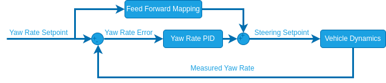

# Rate Tuning

Rate tuning is required to use [Acro mode](../flight_modes_rover/manual.md#acro-mode) and all later modes.

:::warning
The [Basic Setup](basic_setup.md) must've already been completed before this step!
:::

Configure the following [parameters](../advanced_config/parameters.md) in QGroundControl:

1. [RO_YAW_RATE_LIM](#RO_YAW_RATE_LIM): Maximum yaw rate you want to allow for your rover.

   :::tip
   Limiting the yaw rate is necessary if the rover is prone rolling over, loosing traction at high speeds or if passenger comfort is important.
   Small rovers especially can be prone to rolling over when steering aggressively at high speeds.

   If this is the case:

   1. In [Acro mode](../flight_modes_rover/manual.md#acro-mode), set [RO_YAW_RATE_LIM](#RO_YAW_RATE_LIM) to a small value, drive the rover at full throttle and steer all the way to the left or right.
   2. Increase [RO_YAW_RATE_LIM](#RO_YAW_RATE_LIM) until the wheels of the rover start to lift up.
   3. Set [RO_YAW_RATE_LIM](#RO_YAW_RATE_LIM) to the highest value that does not cause the rover to lift up.

   If you see no need to limit the yaw rate, set this parameter to the maximum yaw rate the rover can achieve:

   1. In [Manual mode](../flight_modes_rover/manual.md#manual-mode) drive the rover at full throttle and with the maximum steering angle.
   2. Plot the `measured_yaw_rate` from [RoverRateStatus](../msg_docs/RoverRateStatus.md) and enter the highest observed value for [RO_YAW_RATE_LIM](#RO_YAW_RATE_LIM).

:::

2. (Optional) [RO_YAW_RATE_CORR](#RO_YAW_RATE_CORR) [-]: Yaw rate correction factor.

   This can be used to scale the mapping from the yaw rate setpoint to the steering effort if it is offset from the [idealized mapping](#kinematic-models) (This could be due to wheel misalignments, excessive friction etc.).

   ::: info
   Skid/tank-steered and mecanum rovers will most likely require this adjustment.

:::

   :::tip
   To tune this parameter, first make sure you set [RO_YAW_RATE_P](#RO_YAW_RATE_P) and [RO_YAW_RATE_I](#RO_YAW_RATE_I) to zero.
   This way the yaw rate is only controlled by the feed-forward term, which makes it easier to tune.
   Now put the rover in [Acro mode](../flight_modes_rover/manual.md#acro-mode) and then move the right-stick of your controller to the right and/or left and hold it at a few different levels for a couple of seconds each while driving with a constant throttle (for differential/mecanum rovers this can also be done while standing still).
   Disarm the rover and from the flight log plot the `adjusted_yaw_rate_setpoint` from [RoverRateStatus](../msg_docs/RoverRateStatus.md) and the `measured_yaw_rate` from [RoverRateStatus](../msg_docs/RoverRateStatus.md) over each other.
   If the actual yaw rate of the rover is higher than the yaw rate setpoint, decrease [RO_YAW_RATE_CORR](#RO_YAW_RATE_CORR) (between [0, 1]).
   If it is the other way around increase the parameter [1, inf] and repeat until you are satisfied with the setpoint tracking.

:::

3. [RO_YAW_RATE_P](#RO_YAW_RATE_P) [-]: Proportional gain of the closed loop yaw rate controller.
   The closed loop acceleration control will compare the yaw rate setpoint with the measured yaw rate and adapt the motor commands based on the error between them.
   The proportional gain is multiplied with this error and that value is added to the motor command.
   This compensates for disturbances such as uneven ground and external forces.

   :::tip
   To tune this parameter:

   1. Put the rover in [Acro mode](../flight_modes_rover/manual.md#acro-mode) and hold the throttle stick and the right stick at a few different levels for a couple of seconds each.
   2. Disarm the rover and from the flight log plot the `adjusted_yaw_rate_setpoint` and the `measured_yaw_rate` from [RoverRateStatus](../msg_docs/RoverRateStatus.md) over each other.
   3. Increase [RO_YAW_RATE_P](#RO_YAW_RATE_P) if the measured value does not track the setpoint fast enough or decrease it if the measurement overshoots the setpoint by too much.
   4. Repeat until you are satisfied with the behaviour.

:::

4. [RO_YAW_RATE_I](#RO_YAW_RATE_I) [-]: Integral gain of the closed loop yaw rate controller.
   The integral gain accumulates the error between the desired and actual yaw rate scaled by the integral gain over time and that value is added to the motor command.

   ::: tip
   An integrator might not be necessary at this stage, but it will become important for subsequent modes.

:::

5. (Optional) [RO_YAW_ACCEL_LIM](#RO_YAW_ACCEL_LIM)/[RO_YAW_DECEL_LIM](#RO_YAW_DECEL_LIM) [deg/s^2]: Used to limit the yaw acceleration/deceleration.
   This can be used to smoothen the yaw rate setpoint trajectory.

6. (Optional) [RO_YAW_STICK_DZ](#RO_YAW_STICK_DZ) [-]: Percentage of yaw stick input range that will be interpreted as zero around the stick centered value.

7. (Advanced) [RO_YAW_RATE_TH](#RO_YAW_RATE_TH) [deg/s]: The minimum threshold for the yaw rate measurement not to be interpreted as zero.
   This can be used to cut off measurement noise when the rover is standing still.

The rover is now ready to drive in [Acro mode](../flight_modes_rover/manual.md#acro-mode) and the configuration can be continued with [attitude tuning](attitude_tuning.md).

## Rate Controller Structure (Info Only)

This section provides additional information for developers and people with experience in control system design.

The rate controller uses the following structure:

:::info
For ackermann rovers the yaw rate is only close loop controlled when driving forwards.
When driving backwards the yaw rate setpoint is directly mapped to a steering angle using the equation above.
This is due to the fact that rear wheel steering (driving a car with front-wheel steering backwards) is non-minimum-phase w.r.t to the yaw rate which leads to instabilities when doing closed loop control.
:::

The feed forward mapping is done using the kinematic model of the rover to translate the yaw rate setpoint to a normalized steering setpoint.

### Kinematic Models

#### Ackermann

<!-- prettier-ignore -->

$$\delta = \arctan(\frac{w_b \cdot \dot{\psi}}{v})$$

with

- $w_b:$ Wheel base,
- $\delta:$ Steering angle,
- $\dot{\psi}:$ Yaw rate
- $v:$ Forward speed.

The steering setpoint is equal to $\delta$ interpolated from [-[RA_MAX_STR_ANG](../advanced_config/parameter_reference.md#RA_MAX_STR_ANG), [RA_MAX_STR_ANG](../advanced_config/parameter_reference.md#RA_MAX_STR_ANG)] to [-1, 1].

For driving this means that the same right hand stick input will cause a different steering angle based on how fast you are driving.
By limiting the maximum yaw rate, we can restrict the steering angle based on the speed, which can prevent the rover from rolling over.
This mode will feel more like "driving a car" than [Manual mode](../flight_modes_rover/manual.md#manual-mode).

#### Differential/Mecanum

<!-- prettier-ignore -->

$$v_{diff} = \frac{w_t \cdot \dot{\psi}}{2}$$

with

- $v_{diff}:$ Speed difference between the right/left wheels,
- $w_t:$ Wheel track ([RD_WHEEL_TRACK](../advanced_config/parameter_reference.md#RD_WHEEL_TRACK)),
- $\dot{\psi}:$ Yaw rate setpoint

The steering setpoint is equal to $v_{diff}$ interpolated from [-[RO_MAX_THR_SPEED](../advanced_config/parameter_reference.md#RO_MAX_THR_SPEED), [RO_MAX_THR_SPEED](../advanced_config/parameter_reference.md#RO_MAX_THR_SPEED)] to [-1, 1].

These mappings based on the idealized kinematic models can be adjusted with the multiplicative factor [RO_YAW_RATE_CORR](../advanced_config/parameter_reference.md#RO_YAW_RATE_CORR) to tune the feed forward part of the yaw rate controller to account for wheel misalignments, high friction etc.

## Parameter Overview

| 参数                                                                                                                                                                         | 描述                                                           | Unit      |
| -------------------------------------------------------------------------------------------------------------------------------------------------------------------------- | ------------------------------------------------------------ | --------- |
| [RO_YAW_RATE_LIM](../advanced_config/parameter_reference.md#RO_YAW_RATE_LIM)    | Maximum allowed yaw rate                                     | $m/s^2$   |
| [RO_YAW_RATE_P](../advanced_config/parameter_reference.md#RO_YAW_RATE_P)          | Proportional gain for yaw rate controller                    | -         |
| [RO_YAW_RATE_I](../advanced_config/parameter_reference.md#RO_YAW_RATE_I)          | Integral gain for yaw rate controller                        | -         |
| [RO_YAW_STICK_DZ](../advanced_config/parameter_reference.md#RO_YAW_STICK_DZ)    | Yaw stick deadzone                                           | -         |
| [RO_YAW_ACCEL_LIM](../advanced_config/parameter_reference.md#RO_YAW_ACCEL_LIM) | (Optional) Yaw acceleration limit         | $deg/s^2$ |
| [RO_YAW_DECEL_LIM](../advanced_config/parameter_reference.md#RO_YAW_DECEL_LIM) | (Optional) Yaw deceleration limit         | $deg/s^2$ |
| [RO_YAW_RATE_CORR](../advanced_config/parameter_reference.md#RO_YAW_RATE_CORR) | (Optional) Yaw rate correction factor     | -         |
| [RO_YAW_RATE_TH](../advanced_config/parameter_reference.md#RO_YAW_RATE_TH)       | (Advanced) Yaw rate measurement threshold | $deg/s$   |
