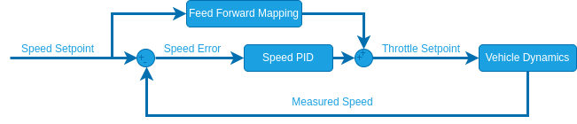

# Velocity Tuning

:::warning
The [attitude tuning](attitude_tuning.md) must've already been completed before this step!
:::

:::info
To tune we will be using the manual [Position mode](../flight_modes_rover/manual.md#position-mode).
This mode requires a global position estimate (GPS) and tuning of some parameters that go beyond the velocity controller.
If you use a custom external flight mode that controls velocity but does not require a global position estimate you can ignore the [manual position mode parameters](#manual-position-mode-parameters).
:::

## Speed Parameters

To tune the velocity controller configure the following [parameters](../advanced_config/parameters.md) in QGroundControl:

1. [RO_SPEED_LIM](#RO_SPEED_LIM) [m/s]: This is the maximum speed you want to allow for your rover.
   This will define the stick-to-speed mapping for [Position mode](../flight_modes_rover/manual.md#position-mode) and set an upper limit for the speed setpoint.

2. [RO_MAX_THR_SPEED](#RO_MAX_THR_SPEED) [m/s]: This parameter is used to calculate the feed-forward term of the closed loop speed control which linearly maps desired speeds to normalized motor commands.
   As mentioned in the [Manual mode](../flight_modes_rover/manual.md#manual-mode) configuration , a good starting point is the observed ground speed when the rover drives at maximum throttle in [Manual mode](../flight_modes_rover/manual.md#manual-mode).

   

   ::: tip
   To further tune this parameter:

   1. Set [RO_SPEED_P](#RO_SPEED_P) and [RO_SPEED_I](#RO_SPEED_I) to zero.
      This way the speed is only controlled by the feed-forward term, which makes it easier to tune.
   2. Put the rover in [Position mode](../flight_modes_rover/manual.md#position-mode) and then move the left stick of your controller up and/or down and hold it at a few different levels for a couple of seconds each.
   3. Disarm the rover and from the flight log plot the `adjusted_speed_body_x_setpoint` and the `measured_speed_body_x` from the [RoverVelocityStatus](../msg_docs/RoverVelocityStatus.md) message over each other.
   4. If the actual speed of the rover is higher than the speed setpoint, increase [RO_MAX_THR_SPEED](#RO_MAX_THR_SPEED).
      If it is the other way around decrease the parameter and repeat until you are satisfied with the setpoint tracking.

:::

   ::: info
   If your rover oscillates when driving a straight line in [Position mode](../flight_modes_rover/manual.md#position-mode), set this parameter to the observed ground speed at maximum throttle in [Manual mode](../flight_modes_rover/manual.md#manual-mode) and complete the tuning of the [manual position mode parameters](#manual-position-mode-parameters) first before continuing the tuning of the closed loop speed control.

:::

3. [RO_SPEED_P](#RO_SPEED_P) [-]: Proportional gain of the closed loop speed controller.

   ::: tip
   This parameter can be tuned the same way as [RO_MAX_THR_SPEED](#RA_SPEED_TUNING).
   If you tuned [RO_MAX_THR_SPEED](#RO_MAX_THR_SPEED) well, you might only need a very small value.

:::

4. [RO_SPEED_I](#RO_SPEED_I) [-]: Integral gain for the closed loop speed controller.

   ::: tip
   For the closed loop speed control an integrator gain is useful because this setpoint is often constant for a while and an integrator eliminates steady state errors that can cause the rover to never reach the setpoint.

:::

5. (Advanced) [RO_SPEED_TH](#RO_SPEED_TH) [m/s]: The minimum threshold for the speed measurement not to be interpreted as zero.
   This can be used to cut off measurement noise when the rover is standing still.

## Manual Position Mode Parameters

These steps are only necessary if you are tuning/want to unlock the manual [Position mode](../flight_modes_rover/manual.md#position-mode). Othwerwise, you can continue with [position tuning](position_tuning.md) where these same parameters will also be configured.

1. [PP_LOOKAHD_GAIN](#PP_LOOKAHD_GAIN): When driving in a straight line (right stick centered) position mode leverages the same path following algorithm used in [auto modes](../flight_modes_rover/auto.md) called [pure pursuit](position_tuning.md#pure-pursuit-guidance-logic-info-only) to achieve the best possible straight line driving behaviour.
   This parameter determines how aggressive the controller will steer towards the path.

   ::: tip
   Decreasing the parameter makes it more aggressive but can lead to oscillations.

   To tune this:

   1. Start with a value of 1 for [PP_LOOKAHD_GAIN](#PP_LOOKAHD_GAIN)
   2. Put the rover in [Position mode](../flight_modes_rover/manual.md#position-mode) and while driving a straight line at approximately half the maximum speed observe its behaviour.
   3. If the rover does not drive in a straight line, reduce the value of the parameter, if it oscillates around the path increase the value.
   4. Repeat until you are satisfied with the behaviour.

:::

2. [PP_LOOKAHD_MIN](#PP_LOOKAHD_MIN): Minimum threshold for the lookahead distance used by the [pure pursuit algorithm](position_tuning.md#pure-pursuit-guidance-logic-info-only).

   ::: tip
   Put the rover in [Position mode](../flight_modes_rover/manual.md#position-mode) and drive at very low speeds, if the rover starts to oscillate even though the tuning of [PP_LOOKAHD_GAIN](#PP_LOOKAHD_GAIN) was good for medium speeds, then increase the value of [PP_LOOKAHD_MIN](#PP_LOOKAHD_MIN).

:::

3. [PP_LOOKAHD_MAX](#PP_LOOKAHD_MAX): Maximum threshold for the lookahead distance used by [pure pursuit](position_tuning.md#pure-pursuit-guidance-logic-info-only).

   ::: tip
   Put the rover in [Position mode](../flight_modes_rover/manual.md#position-mode) and drive at very high speeds, if the rover does not drive in a straight line even though the tuning of [PP_LOOKAHD_GAIN](#PP_LOOKAHD_GAIN) was good for medium speeds, then decrease the value of [PP_LOOKAHD_MAX](#PP_LOOKAHD_MAX).

:::

The rover is now ready to drive in [Position mode](../flight_modes_rover/manual.md#position-mode) and the configuration can be continued with [position tuning](position_tuning.md).

## Velocity Controller Structure (Info Only)

This section provides additional information for developers and people with experience in control system design.

The velocity vector is defined by the following two values:

1. The absolute speed [$m/s$]
2. The direction (bearing) [$rad$]

The speed controller uses the following structure:

The feed forward mapping is done by interpolating the speed setpoint from [-[RO_MAX_THR_SPEED](../advanced_config/parameter_reference.md#RO_MAX_THR_SPEED), [RO_MAX_THR_SPEED](../advanced_config/parameter_reference.md#RO_MAX_THR_SPEED)] to [-1, 1].

For ackermann and differential rovers the bearing is aligned with the vehicle yaw. Therefor the bearing is simply sent as a yaw setpoint to the [yaw controller](attitude_tuning.md#attitude-controller-structure-info-only) and the speed setpoint is always defined in body x direction.

For mecanum vehicles, the bearing and yaw are decoupled. The direction is controlled by splitting the velocity vector into one speed component in body x direction and one in body y direction.
Both these setpoint are then sent to their own closed loop speed controllers.

## Parameter Overview

| 参数                                                                                                                                                                         | 描述                                                        | Unit  |
| -------------------------------------------------------------------------------------------------------------------------------------------------------------------------- | --------------------------------------------------------- | ----- |
| [RO_MAX_THR_SPEED](../advanced_config/parameter_reference.md#RO_MAX_THR_SPEED) | Speed the rover drives at maximum throttle                | $m/s$ |
| [RO_SPEED_LIM](../advanced_config/parameter_reference.md#RO_SPEED_LIM)                                  | Maximum allowed speed                                     | $m/s$ |
| [RO_SPEED_P](../advanced_config/parameter_reference.md#RO_SPEED_P)                                        | Proportional gain for speed controller                    | -     |
| [RO_SPEED_I](../advanced_config/parameter_reference.md#RO_SPEED_I)                                        | Integral gain for speed controller                        | -     |
| [RO_SPEED_TH](../advanced_config/parameter_reference.md#RO_SPEED_TH)                                     | (Advanced) Speed measurement threshold | $m/s$ |

### Pure Pursuit

| 参数                                                                                                                                                 | 描述                                                                    | Unit |
| -------------------------------------------------------------------------------------------------------------------------------------------------- | --------------------------------------------------------------------- | ---- |
| [PP_LOOKAHD_GAIN](../advanced_config/parameter_reference.md#PP_LOOKAHD_GAIN) | Pure pursuit: Main tuning parameter                   | -    |
| [PP_LOOKAHD_MAX](../advanced_config/parameter_reference.md#PP_LOOKAHD_MAX)    | Pure pursuit: Maximum value for the look ahead radius | m    |
| [PP_LOOKAHD_MIN](../advanced_config/parameter_reference.md#PP_LOOKAHD_MIN)    | Pure pursuit: Minimum value for the look ahead radius | m    |
