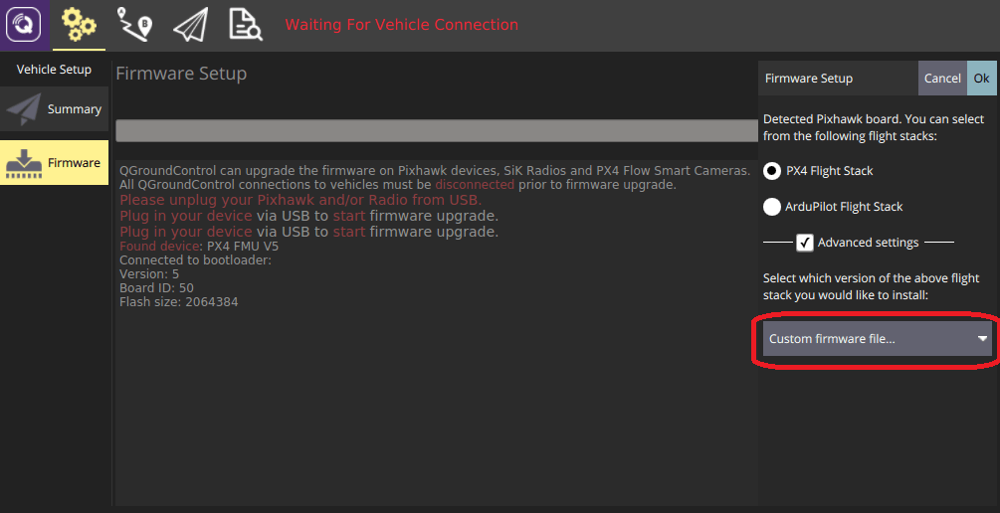

# Adding a Frame Configuration

PX4 [frame configuration files](#configuration-file-overview) are shell scripts that set up some (or all) of the parameters, controllers and apps needed for a particular vehicle frame, such as a quadcopter, ground vehicle, or boat.
These scripts are executed when the corresponding [airframe is selected and applied](../config/airframe.md) in _QGroundControl_.

The configuration files that are compiled into firmware for NuttX targets are located in the [ROMFS/px4fmu_common/init.d](https://github.com/PX4/PX4-Autopilot/tree/main/ROMFS/px4fmu_common/init.d) folder (configuration files for POSIX simulators are stored in [ROMFS/px4fmu_common/init.d-posix](https://github.com/PX4/PX4-Autopilot/tree/main/ROMFS/px4fmu_common/init.d-posix/airframes)).
The folder contains both complete and full configurations for specific vehicles, and partial "generic configurations" for different vehicle types.
The generic configurations are often used as the starting point for creating new configuration files.

In addition, a frame configuration file can also be loaded from an SD card.

:::info
You can also "tweak" the current frame configuration using text files on the SD card.
This is covered in [System Startup > Customizing the System Startup](../concept/system_startup.md#customizing-the-system-startup) page.
:::

:::info
To determine which parameters/values need to be set in the configuration file, you can first assign a generic airframe and tune the vehicle, and then use [`param show-for-airframe`](../modules/modules_command.md#param) to list the parameters that changed.
:::

## Developing a Frame Configuration

The recommended process for developing a new frame configuration is:

1. Start by selecting an appropriate "generic configuration" for the target vehicle type in QGC, such as _Generic Quadcopter_.
2. Configure the [geometry and actuator outputs](../config/actuators.md).
3. Perform other [basic configuration](../config/index.md).
4. Tune the vehicle.
5. Run the [`param show-for-airframe`](../modules/modules_command.md#param) console command to list the parameter difference compared to the original generic airfame.

Once you have the parameters you can create a new frame configuration file by copying the configuration file for the generic configuration, and appending the new parameters.

Alternatively you can just append the modified parameters to the startup configuration files described in [System Startup > Customizing the System Startup](../concept/system_startup.md#customizing-the-system-startup) ("tweaking the generic configuration").

## How to add a Configuration to Firmware

To add a frame configuration to firmware:

1. Create a new config file in the [init.d/airframes](https://github.com/PX4/PX4-Autopilot/tree/main/ROMFS/px4fmu_common/init.d/airframes) folder.
  - Give it a short descriptive filename and prepend the filename with an unused autostart ID (for example, `1033092_superfast_vtol`).
  - Update the file with configuration parameters and apps (see section above).
2. Add the name of the new frame config file to the [CMakeLists.txt](https://github.com/PX4/PX4-Autopilot/blob/main/ROMFS/px4fmu_common/init.d/airframes/CMakeLists.txt) in the relevant section for the type of vehicle
3. [Build and upload](../dev_setup/building_px4.md) the software.

## How to add a Configuration to an SD Card

A frame configuration file to be launched from SD card is the same as one stored in firmware.

To make PX4 launch with a frame configuration, renamed it to `rc.autostart` and copy it to the SD card at `/ext_autostart/rc.autostart`.
PX4 will find any linked files in firmware.

## 配置文件概述

The configuration file consists of several main blocks:

- Documentation (used in the [Airframes Reference](../airframes/airframe_reference.md) and _QGroundControl_).
  Airframe-specific parameter settings
  - The configuration and geometry using [control allocation](../concept/control_allocation.md) parameters
  - [Tuning gains](#tuning-gains)
- The controllers and apps it should start, such as multicopter or fixed-wing controllers, land detectors etc.

一个典型的配置文件如下所示 (<a href="https://github.com/PX4/Firmware/blob/master/ROMFS/px4fmu_common/init.d/airframes/3033_wingwing">original file here</a>) .

:::info
New frame configuration files are only automatically added to the build system after a clean build (run `make clean`).
:::

### Example - Generic Quadcopter Frame Config

The configuration file for a generic Quad X copter is shown below ([original file here](https://github.com/PX4/PX4-Autopilot/blob/main/ROMFS/px4fmu_common/init.d/airframes/4001_quad_x)).
This is very simple, because it defines only the minimal setup common to all quadcopters.

The first line is a shebang, which tells the NuttX operating system (on which PX4 runs) that the configuration file is an executable shell script.

```c
#!/bin/sh
```

This is followed by the frame documentation.
The `@name`, `@type` and `@class` are used to identify and group the frame in the [API Reference](../airframes/airframe_reference.md#copter_quadrotor_x_generic_quadcopter) and QGroundControl Airframe Selection.

```plain
# @name Generic Quadcopter
#
# @type Quadrotor x
# @class Copter
#
# @maintainer Lorenz Meier <lorenz@px4.io>
#
```

The next line imports generic parameters that are appropriate for all vehicles of the specified type (see [init.d/rc.mc_defaults](https://github.com/PX4/PX4-Autopilot/blob/main/ROMFS/px4fmu_common/init.d/rc.mc_defaults)).

```plain
. ${R}etc/init.d/rc.mc_defaults
```

Finally the file lists the control allocation parameters (starting with `CA_` that define the default geometry for the frame.
These may be modified for your frame geometry in the [Actuators Configuration](../config/actuators.md), and output mappings may be added.

```sh
param set-default CA_ROTOR_COUNT 4
param set-default CA_ROTOR0_PX 0.15
param set-default CA_ROTOR0_PY 0.15
param set-default CA_ROTOR1_PX -0.15
param set-default CA_ROTOR1_PY -0.15
param set-default CA_ROTOR2_PX 0.15
param set-default CA_ROTOR2_PY -0.15
param set-default CA_ROTOR2_KM -0.05
param set-default CA_ROTOR3_PX -0.15
param set-default CA_ROTOR3_PY 0.15
param set-default CA_ROTOR3_KM -0.05
```

### Example - Babyshark VTOL Complete Vehicle

A more complicated configuration file for a complete vehicle is provided below.
This is the configuration for the Baby Shark [Standard VTOL](../frames_vtol/standardvtol.md) ([original file here](https://github.com/PX4/PX4-Autopilot/blob/main/ROMFS/px4fmu_common/init.d/airframes/13014_vtol_babyshark)).

The shebang and documentation sections are similar to those for the generic frame, but here we also document what `outputs` are mapped to each motor and actuator.
Note that these outputs are documentation only; the actual mapping is done using parameters.

```sh
#!/bin/sh
#
# @name BabyShark VTOL
#
# @type Standard VTOL
# @class VTOL
#
# @maintainer Silvan Fuhrer <silvan@auterion.com>
#
# @output Motor1 motor 1
# @output Motor2 motor 2
# @output Motor3 motor 3
# @output Motor4 motor 4
# @output Motor5 Pusher motor
# @output Servo1 Ailerons
# @output Servo2 A-tail left
# @output Servo3 A-tail right
#
# @board px4_fmu-v2 exclude
# @board bitcraze_crazyflie exclude
# @board holybro_kakutef7 exclude
#
```

As for the generic frame, we then include the generic VTOL defaults.

```sh
. ${R}etc/init.d/rc.vtol_defaults
```

Then we define configuration parameters and [tuning gains](#tuning-gains):

```sh
param set-default MAV_TYPE 22

param set-default BAT1_N_CELLS 6

param set-default FW_AIRSPD_MAX 30
param set-default FW_AIRSPD_MIN 19
param set-default FW_AIRSPD_TRIM 23
param set-default FW_PN_R_SLEW_MAX 40
param set-default FW_PSP_OFF 3
param set-default FW_P_LIM_MAX 18
param set-default FW_P_LIM_MIN -25
param set-default FW_RLL_TO_YAW_FF 0.1
param set-default FW_RR_P 0.08
param set-default FW_R_LIM 45
param set-default FW_R_RMAX 50
param set-default FW_THR_TRIM 0.65
param set-default FW_THR_MIN 0.3
param set-default FW_THR_SLEW_MAX 0.6
param set-default FW_T_HRATE_FF 0
param set-default FW_T_SINK_MAX 15
param set-default FW_T_SINK_MIN 3
param set-default FW_YR_P 0.15

param set-default IMU_DGYRO_CUTOFF 15
param set-default MC_PITCHRATE_MAX 60
param set-default MC_ROLLRATE_MAX 60
param set-default MC_YAWRATE_I 0.15
param set-default MC_YAWRATE_MAX 40
param set-default MC_YAWRATE_P 0.3

param set-default MPC_ACC_DOWN_MAX 2
param set-default MPC_ACC_HOR_MAX 2
param set-default MPC_ACC_UP_MAX 3
param set-default MC_AIRMODE 1
param set-default MPC_JERK_AUTO 4
param set-default MPC_LAND_SPEED 1
param set-default MPC_MAN_TILT_MAX 25
param set-default MPC_MAN_Y_MAX 40
param set-default COM_SPOOLUP_TIME 1.5
param set-default MPC_THR_HOVER 0.45
param set-default MPC_TILTMAX_AIR 25
param set-default MPC_TKO_RAMP_T 1.8
param set-default MPC_TKO_SPEED 1
param set-default MPC_VEL_MANUAL 3
param set-default MPC_XY_CRUISE 3
param set-default MPC_XY_VEL_MAX 3.5
param set-default MPC_YAWRAUTO_MAX 40
param set-default MPC_Z_VEL_MAX_UP 2

param set-default NAV_ACC_RAD 3

param set-default SENS_BOARD_ROT 4

param set-default VT_ARSP_BLEND 10
param set-default VT_ARSP_TRANS 21
param set-default VT_B_DEC_MSS 1.5
param set-default VT_B_TRANS_DUR 12
param set-default VT_ELEV_MC_LOCK 0
param set-default VT_FWD_THRUST_SC 1.2
param set-default VT_F_TR_OL_TM 8
param set-default VT_PSHER_SLEW 0.5
param set-default VT_TRANS_MIN_TM 4
param set-default VT_TYPE 2
```

Last of all, the file defines the control allocation parameters for the geometry and the parameters that set which outputs map to different motors and servos.

```sh
param set-default CA_AIRFRAME 2
param set-default CA_ROTOR_COUNT 5
param set-default CA_ROTOR0_PX 1
param set-default CA_ROTOR0_PY 1
param set-default CA_ROTOR1_PX -1
param set-default CA_ROTOR1_PY -1
param set-default CA_ROTOR2_PX 1
param set-default CA_ROTOR2_PY -1
param set-default CA_ROTOR2_KM -0.05
param set-default CA_ROTOR3_PX -1
param set-default CA_ROTOR3_PY 1
param set-default CA_ROTOR3_KM -0.05
param set-default CA_ROTOR4_AX 1.0
param set-default CA_ROTOR4_AZ 0.0

param set-default CA_SV_CS_COUNT 3
param set-default CA_SV_CS0_TYPE 15
param set-default CA_SV_CS0_TRQ_R 1.0
param set-default CA_SV_CS1_TRQ_P 0.5000
param set-default CA_SV_CS1_TRQ_R 0.0000
param set-default CA_SV_CS1_TRQ_Y -0.5000
param set-default CA_SV_CS1_TYPE 13
param set-default CA_SV_CS2_TRQ_P 0.5000
param set-default CA_SV_CS2_TRQ_Y 0.5000
param set-default CA_SV_CS2_TYPE 14

param set-default PWM_MAIN_FUNC1 201
param set-default PWM_MAIN_FUNC2 202
param set-default PWM_MAIN_FUNC3 105
param set-default PWM_MAIN_FUNC4 203
param set-default PWM_MAIN_FUNC5 101
param set-default PWM_MAIN_FUNC6 102
param set-default PWM_MAIN_FUNC7 103
param set-default PWM_MAIN_FUNC8 104

param set-default PWM_MAIN_TIM0 50
param set-default PWM_MAIN_DIS1 1500
param set-default PWM_MAIN_DIS2 1500
param set-default PWM_MAIN_DIS3 1000
param set-default PWM_MAIN_DIS4 1500
```

## 增加一个新的机型组（Airframe Group）

Airframe "groups" are used to group similar airframes for selection in [QGroundControl](https://docs.qgroundcontrol.com/master/en/qgc-user-guide/setup_view/airframe.html) and in the [Airframe Reference](../airframes/airframe_reference.md).
Every group has a name, and an associated svg image which shows the common geometry, number of motors, and direction of motor rotation for the grouped airframes.

The airframe metadata files used by _QGroundControl_ and the documentation source code are generated from the airframe description, via a script, using the build command: `make airframe_metadata`

For a new frame belonging to an existing group, you don't need to do anything more than provide documentation in the airframe description located at
[ROMFS/px4fmu_common/init.d](https://github.com/PX4/PX4-Autopilot/tree/main/ROMFS/px4fmu_common/init.d).

If the airframe is for a **new group** you additionally need to:

1. Add the svg image for the group into user guide documentation (if no image is provided a placeholder image is displayed): [assets/airframes/types](https://github.com/PX4/PX4-user_guide/tree/master/assets/airframes/types)

2. Add a mapping between the new group name and image filename in the [srcparser.py](https://github.com/PX4/PX4-Autopilot/blob/main/Tools/px4airframes/srcparser.py) method `GetImageName()` (follow the pattern below):

  ```python
  def GetImageName(self):
      """
      Get parameter group image base name (w/o extension)
      """
      if (self.name == "Standard Plane"):
          return "Plane"
      elif (self.name == "Flying Wing"):
          return "FlyingWing"
       ...
   ...
      return "AirframeUnknown"
  ```

3. Update _QGroundControl_:

  - Add the svg image for the group into: [src/AutopilotPlugins/Common/images](https://github.com/mavlink/qgroundcontrol/tree/master/src/AutoPilotPlugins/Common/Images)
  - Add reference to the svg image into [qgcimages.qrc](https://github.com/mavlink/qgroundcontrol/blob/master/qgcimages.qrc), following the pattern below:

    ```xml
    <qresource prefix="/qmlimages">
       ...
       <file alias="Airframe/AirframeSimulation">src/AutoPilotPlugins/Common/Images/AirframeSimulation.svg</file>
       <file alias="Airframe/AirframeUnknown">src/AutoPilotPlugins/Common/Images/AirframeUnknown.svg</file>
       <file alias="Airframe/Boat">src/AutoPilotPlugins/Common/Images/Boat.svg</file>
       <file alias="Airframe/FlyingWing">src/AutoPilotPlugins/Common/Images/FlyingWing.svg</file>
       ...
    ```

    ::: info
    The remaining airframe metadata should be automatically included in the firmware (once **srcparser.py** is updated).

:::

## 调参

The following topics explain how to tune the parameters that will be specified in the config file:

- [Autotuning (Multicopter)](../config/autotune_mc.md) (or [Multicopter PID Tuning Guide](../config_mc/pid_tuning_guide_multicopter.md))
- [Autotuning (Fixed-wing)](../config/autotune_fw.md) (or [Fixed-wing PID Tuning Guide](../config_fw/pid_tuning_guide_fixedwing.md))
- [Autotuning (VTOL)](../config/autotune_vtol.md) ([VTOL Configuration](../config_vtol/index.md))

## Add Frame to QGroundControl

To make a new airframe available for section in the _QGroundControl_ [frame configuration](../config/airframe.md):

1. Make a clean build (e.g. by running `make clean` and then `make px4_fmu-v5_default`)
2. Open QGC and select **Custom firmware file...** as shown below:



You will be asked to choose the **.px4** firmware file to flash (this file is a zipped JSON file and contains the airframe metadata).

1. Navigate to the build folder and select the firmware file (e.g. **PX4-Autopilot/build/px4_fmu-v5_default/px4_fmu-v5_default.px4**).
2. Press **OK** to start flashing the firmware.
3. Restart _QGroundControl_.

The new frame will then be available for selection in _QGroundControl_.
