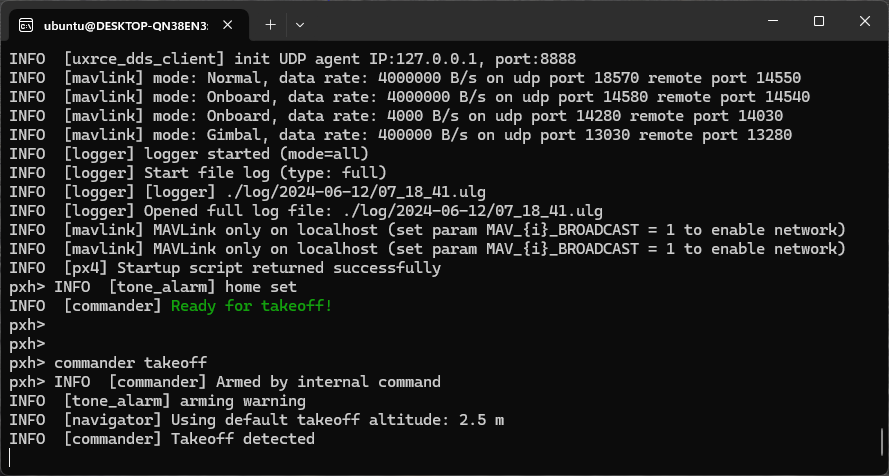

# 构建 PX4 软件

无论对于模拟器还是硬件目标设备，PX4固件可以在控制台或者IDE中从源码构建

You need to build PX4 in order to use [simulators](../simulation/index.md), or if you want to modify PX4 and create a custom build.
如果您只想在实际硬件上试试 PX4，那么可以使用 QGroundControl[烧录预构建的二进制文件](../config/firmware.md)(无需跟着下面的指导)。

:::info
在跟着这些指导之前，你必须先为主机操作系统和目标硬件安装 [开发者工具链](../dev_setup/dev_env.md)。
如果您在跟着这些步骤操作后有任何问题，请参阅下面的 [Troubleshooting](#troubleshooting)。
:::

## 下载 PX4 源代码

PX4 源代码存储在 Github 上的 [PX4/PX4-Autopilot](https://github.com/PX4/PX4-Autopilot) 仓库中。

如果要在您的计算机上获得 _最新的_（main分支）版本，请在终端中输入以下命令：

```sh
git clone https://github.com/PX4/PX4-Autopilot.git --recursive
```

Note that you may already have done this when installing the [Developer Toolchain](../dev_setup/dev_env.md)

:::info
This is all you need to do in order to get the latest code.
If needed you can also [get the source code specific to a particular release](../contribute/git_examples.md#get-a-specific-release).
[GIT Examples](../contribute/git_examples.md) provides a lot more information working with releases and contributing to PX4.
:::

## 初次构建（使用模拟器）

首先我们要用控制台环境来构建一个模拟器目标
这使我们能够在转移到真正的硬件和 IDE 之前验证系统设置。

Navigate into the **PX4-Autopilot** directory and start [Gazebo SITL](../sim_gazebo_gz/index.md) using the following command:

```sh
make px4_sitl gz_x500
```

:::details
If you installed Gazebo Classic
Start  [Gazebo Classic SITL](../sim_gazebo_classic/index.md) using the following command:

```sh
make px4_sitl gazebo-classic
```

:::

这将显示 PX4 控制台：



:::info
You may need to start _QGroundControl_ before proceeding, as the default PX4 configuration requires a ground control connection before takeoff.
This can be [downloaded from here](https://docs.qgroundcontrol.com/master/en/qgc-user-guide/getting_started/download_and_install.html).
:::

可以通过键入以下命令（如上方控制台中所示）来控制飞行器。

```sh
pxh> commander takeoff
```

The vehicle will take off and you'll see this in the Gazebo simulator UI:


The drone can be landed by typing `commander land` and the whole simulation can be stopped by doing **CTRL+C** (or by entering `shutdown`).

与地面站一起飞模拟器更接近飞机的实际运行。
在飞机飞行时（Takeoff飞行模式），单击地图上的某个位置并启用滑块。
这将重新定位飞机。


## 基于NuttX / Pixhawk 的飞控板

### 为NuttX构建

To build for NuttX- or Pixhawk- based boards, navigate into the **PX4-Autopilot** directory and then call `make` with the build target for your board.

For example, to build for [Pixhawk 4](../flight_controller/pixhawk4.md) hardware you could use the following command:

```sh
cd PX4-Autopilot
make px4_fmu-v5_default
```

运行成功后将输出类似结果：

```sh
-- Build files have been written to: /home/youruser/src/PX4-Autopilot/build/px4_fmu-v4_default
[954/954] Creating /home/youruser/src/PX4-Autopilot/build/px4_fmu-v4_default/px4_fmu-v4_default.px4
```

The first part of the build target `px4_fmu-v4` indicates the target flight controller hardware for the firmware.
The suffix, in this case `_default`, indicates a firmware _configuration_, such as supporting or omitting particular features.

:::info
The `_default` suffix is optional.
For example, `make px4_fmu-v5` and `px4_fmu-v5_default` result in the same firmware.
:::

The following list shows the build commands for the [Pixhawk standard](../flight_controller/autopilot_pixhawk_standard.md) boards:

- [Holybro Pixhawk 6X-RT (FMUv6X)](../flight_controller/pixhawk6x-rt.md): `make px4_fmu-v6xrt_default`

- [Holybro Pixhawk 6X (FMUv6X)](../flight_controller/pixhawk6x.md): `make px4_fmu-v6x_default`

- [Holybro Pixhawk 6C (FMUv6C)](../flight_controller/pixhawk6c.md): `make px4_fmu-v6c_default`

- [Holybro Pixhawk 6C Mini (FMUv6C)](../flight_controller/pixhawk6c_mini.md): `make px4_fmu-v6c_default`

- [Holybro Pix32 v6 (FMUv6C)](../flight_controller/holybro_pix32_v6.md): `make px4_fmu-v6c_default`

- [Holybro Pixhawk 5X (FMUv5X)](../flight_controller/pixhawk5x.md): `make px4_fmu-v5x_default`

- [Pixhawk 4 (FMUv5)](../flight_controller/pixhawk4.md): `make px4_fmu-v5_default`

- [Pixhawk 4 Mini (FMUv5)](../flight_controller/pixhawk4_mini.md): `make px4_fmu-v5_default`

- [CUAV V5+ (FMUv5)](../flight_controller/cuav_v5_plus.md): `make px4_fmu-v5_default`

- [CUAV V5 nano (FMUv5)](../flight_controller/cuav_v5_nano.md): `make px4_fmu-v5_default`

- [Pixracer (FMUv4)](../flight_controller/pixracer.md): `make px4_fmu-v4_default`

- [Pixhawk 3 Pro](../flight_controller/pixhawk3_pro.md): `make px4_fmu-v4pro_default`

- [Pixhawk Mini](../flight_controller/pixhawk_mini.md): `make px4_fmu-v3_default`

- [Pixhawk 2 (Cube Black) (FMUv3)](../flight_controller/pixhawk-2.md): `make px4_fmu-v3_default`

- [mRo Pixhawk (FMUv3)](../flight_controller/mro_pixhawk.md): `make px4_fmu-v3_default` (supports 2MB Flash)

- [Holybro pix32 (FMUv2)](../flight_controller/holybro_pix32.md): `make px4_fmu-v2_default`

- [Pixfalcon (FMUv2)](../flight_controller/pixfalcon.md): `make px4_fmu-v2_default`

- [Dropix (FMUv2)](../flight_controller/dropix.md): `make px4_fmu-v2_default`

- [Pixhawk 1 (FMUv2)](../flight_controller/pixhawk.md): `make px4_fmu-v2_default`

  :::warning
  You **must** use a supported version of GCC to build this board (e.g. the same as used by [CI/docker](../test_and_ci/docker.md)) or remove modules from the build. Building with an unsupported GCC may fail, as PX4 is close to the board's 1MB flash limit.

:::

- Pixhawk 1 with 2 MB flash: `make px4_fmu-v3_default`

Build commands for non-Pixhawk NuttX fight controllers (and for all other-boards) are provided in the documentation for the individual [flight controller boards](../flight_controller/index.md).

### 将固件烧录到飞控板

Append `upload` to the make commands to upload the compiled binary to the autopilot hardware via USB.
例如

```sh
make px4_fmu-v4_default upload
```

运行成功后将有以下输出：

```sh
Erase  : [====================] 100.0%
Program: [====================] 100.0%
Verify : [====================] 100.0%
Rebooting.

[100%] Built target upload
```

:::tip
This is not supported when developing on WSL2.
See [ Windows Development Environment (WSL2-Based) > Flash a Control Board](../dev_setup/dev_env_windows_wsl.md#flash-a-flight-control-board).
:::

## 其他飞控板

Build commands for other boards are given the [board-specific flight controller pages](../flight_controller/index.md) (usually under a heading _Building Firmware_).

您还可以使用以下命令列出所有配置目标：

```sh
make list_config_targets
```

## 用图形界面 IDE 编译

[VSCode](../dev_setup/vscode.md) is the officially supported (and recommended) IDE for PX4 development.
It is easy to set up and can be used to compile PX4 for both simulation and hardware environments.

## 故障处理

### 常规构建错误

许多构建问题是由不匹配的子模块或未完全清理的构建环境引起的。
Updating the submodules and doing a `distclean` can fix these kinds of errors:

```sh
git submodule update --recursive
make distclean
```

### 闪存溢出了 XXX 字节

The `region 'flash' overflowed by XXXX bytes` error indicates that the firmware is too large for the target hardware platform.
This is common for `make px4_fmu-v2_default` builds, where the flash size is limited to 1MB.

If you're building the _vanilla_ master branch, the most likely cause is using an unsupported version of GCC.
In this case, install the version specified in the [Developer Toolchain](../dev_setup/dev_env.md) instructions.

如果在构建自己的分支，您可能已将固件大小增加到超过1MB的限制。
在这种情况下，您需要从构建中删除您不需要的任何驱动程序/模块。

### macOS：打开文件过多错误

MacOS 默认允许在所有正在运行的进程中最多打开256个文件。
PX4构建系统打开大量文件，因此您可能会超出此数量。

The build toolchain will then report `Too many open files` for many files, as shown below:

```sh
/usr/local/Cellar/gcc-arm-none-eabi/20171218/bin/../lib/gcc/arm-none-eabi/7.2.1/../../../../arm-none-eabi/bin/ld: cannot find NuttX/nuttx/fs/libfs.a: Too many open files
```

解决方案是增加允许打开文件的最大数量（例如增加到300）。
You can do this in the macOS _Terminal_ for each session:

- Run this script [Tools/mac_set_ulimit.sh](https://github.com/PX4/PX4-Autopilot/blob/main/Tools/mac_set_ulimit.sh), or
- 运行这个命令:

  ```sh
  ulimit -S -n 300
  ```

### macOS Catalina：运行cmake时出现问题

As of macOS Catalina 10.15.1 there may be problems when trying to build the simulator with _cmake_.
如果您在这个平台上遇到构建问题，请尝试在终端中运行以下命令：

```sh
xcode-select --install
sudo ln -s /Library/Developer/CommandLineTools/SDKs/MacOSX.sdk/usr/include/* /usr/local/include/
```

### Ubuntu 18.04：涉及arm_none_eabi_gcc的编译错误

Build issues related to `arm_none_eabi_gcc`may be due to a broken g++ toolchain installation.
您可以通过检查缺少的依赖项来验证这一点：

```sh
arm-none-eabi-gcc --version
arm-none-eabi-g++ --version
arm-none-eabi-gdb --version
arm-none-eabi-size --version
```

缺少依赖项的 bash 输出示例：

```sh
arm-none-eabi-gdb --version
arm-none-eabi-gdb: command not found
```

This can be resolved by removing and [reinstalling the compiler](https://askubuntu.com/questions/1243252/how-to-install-arm-none-eabi-gdb-on-ubuntu-20-04-lts-focal-fossa).

### Ubuntu 18.04：Visual Studio Code 无法监视此大型工作区中的文件更改

See [Visual Studio Code IDE (VSCode) > Troubleshooting](../dev_setup/vscode.md#troubleshooting).

### 导入Python软件包失败

"Failed to import" errors when running the `make px4_sitl jmavsim` command indicates that some Python packages are not installed (where expected).

```sh
Failed to import jinja2: No module named 'jinja2'
您可能需要使用以下方式进行安装:
    pip3 install --user jinja2
```

如果您已经安装了这些依赖关系，这可能是因为计算机上存在多个 Python 版本（例如 Python 2.7.16 和 Python 3.8.3），并且该模块不存在于构建工具链使用的版本中。

您应该能够按照所示明确安装依赖项来解决此问题。

```sh
pip3 install --user pyserial empty toml numpy pandas jinja2 pyyaml pyros-genmsg packaging
```

## PX4 创建生成目标

The previous sections showed how you can call _make_ to build a number of different targets, start simulators, use IDEs etc.
This section shows how _make_ options are constructed and how to find the available choices.

The full syntax to call _make_ with a particular configuration and initialization file is:

```sh
make [VENDOR_][MODEL][_VARIANT] [VIEWER_MODEL_DEBUGGER_WORLD]
```

**VENDOR_MODEL_VARIANT**: (also known as `CONFIGURATION_TARGET`)

- **VENDOR:** The manufacturer of the board: `px4`, `aerotenna`, `airmind`, `atlflight`, `auav`, `beaglebone`, `intel`, `nxp`, etc.
  The vendor name for Pixhawk series boards is `px4`.
- **MODEL:** The _board model_ "model": `sitl`, `fmu-v2`, `fmu-v3`, `fmu-v4`, `fmu-v5`, `navio2`, etc.
- **VARIANT:** Indicates particular configurations: e.g. `bootloader`, `cyphal`, which contain components that are not present in the `default` configuration.
  Most commonly this is `default`, and may be omitted.

:::tip
You can get a list of _all_ available `CONFIGURATION_TARGET` options using the command below:

```sh
make list_config_targets
```

:::

**VIEWER_MODEL_DEBUGGER_WORLD:**

- **VIEWER:** This is the simulator ("viewer") to launch and connect: `gz`, `gazebo`, `jmavsim`, `none` <!-- , ?airsim -->

  :::tip
  `none` can be used if you want to launch PX4 and wait for a simulator (jmavsim, Gazebo, Gazebo Classic, or some other simulator).
  For example, `make px4_sitl none_iris` launches PX4 without a simulator (but with the iris airframe).

:::

- **MODEL:** The _vehicle_ model to use (e.g. `iris` (_default_), `rover`, `tailsitter`, etc), which will be loaded by the simulator.
  The environment variable `PX4_SIM_MODEL` will be set to the selected model, which is then used in the [startup script](../simulation/index.md#startup-scripts) to select appropriate parameters.

- **DEBUGGER:** Debugger to use: `none` (_default_), `ide`, `gdb`, `lldb`, `ddd`, `valgrind`, `callgrind`.
  For more information see [Simulation Debugging](../debug/simulation_debugging.md).

- **WORLD:** (Gazebo Classic only).
  Set the world ([PX4-Autopilot/Tools/simulation/gazebo-classic/sitl_gazebo-classic/worlds](https://github.com/PX4/PX4-SITL_gazebo-classic/tree/main/worlds)) that is loaded.
  Default is [empty.world](https://github.com/PX4/PX4-SITL_gazebo-classic/blob/main/worlds/empty.world).
  For more information see [Gazebo Classic > Loading a Specific World](../sim_gazebo_classic/index.md#loading-a-specific-world).

:::tip
You can get a list of _all_ available `VIEWER_MODEL_DEBUGGER_WORLD` options using the command below:

```sh
make px4_sitl list_vmd_make_targets
```

:::

::: info

- Most of the values in the `CONFIGURATION_TARGET` and `VIEWER_MODEL_DEBUGGER` have defaults, and are hence optional.
  For example, `gazebo-classic` is equivalent to `gazebo-classic_iris` or `gazebo-classic_iris_none`.
- 如果要在其他两个设置之间指定默认值，可以使用三个下划线。
  For example, `gazebo-classic___gdb` is equivalent to `gazebo-classic_iris_gdb`.
- You can use a `none` value for `VIEWER_MODEL_DEBUGGER` to start PX4 and wait for a simulator.
  For example start PX4 using `make px4_sitl_default none` and jMAVSim using `./Tools/simulation/jmavsim/jmavsim_run.sh -l`.

:::

The `VENDOR_MODEL_VARIANT` options map to particular _px4board_ configuration files in the PX4 source tree under the [/boards](https://github.com/PX4/PX4-Autopilot/tree/main/boards) directory.
Specifically `VENDOR_MODEL_VARIANT` maps to a configuration file **boards/VENDOR/MODEL/VARIANT.px4board**
(e.g. `px4_fmu-v5_default` corresponds to [boards/px4/fmu-v5/default.px4board](https://github.com/PX4/PX4-Autopilot/blob/main/boards/px4/fmu-v5/default.px4board)).

其他 make 目标在相关章节中讨论：

- `bloaty_compare_master`: [Binary Size Profiling](../debug/binary_size_profiling.md)
- ...

## Firmware Version & Git Tags

The _PX4 Firmware Version_ and _Custom Firmware Version_ are published using the MAVLink [AUTOPILOT_VERSION](https://mavlink.io/en/messages/common.html#AUTOPILOT_VERSION) message, and displayed in the _QGroundControl_ **Setup > Summary** airframe panel:


These are extracted at build time from the active _git tag_ for your repo tree.
The git tag should be formatted as `<PX4-version>-<vendor-version>` (e.g. the tag in the image above was set to `v1.8.1-2.22.1`).

:::warning
If you use a different git tag format, versions information may not be displayed properly.
:::
