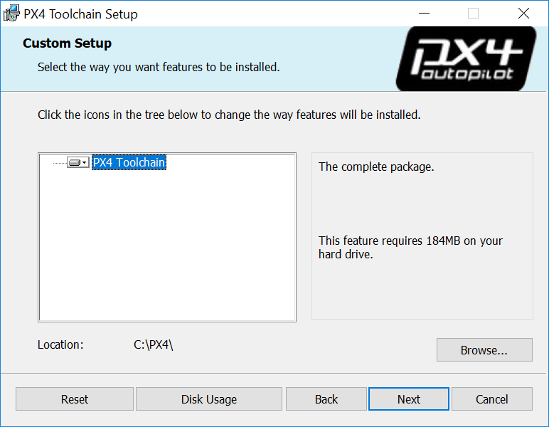
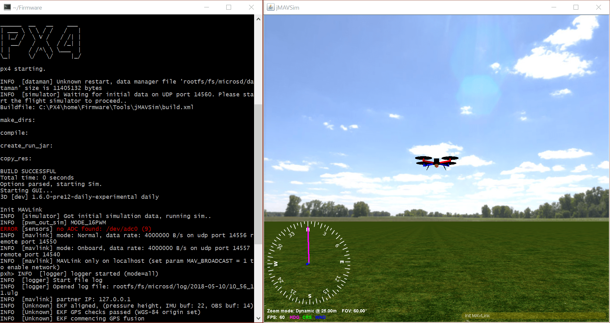

# Windows Development Environment (Cygwin-based)

:::warning
This development environment is [community supported and maintained](../advanced/community_supported_dev_env.md).
It may or may not work with current versions of PX4.

The toolchain was previously recommended, but does not work with PX4 v1.12 and later due to packaging issues.
The [Windows WSL2-Based Development Environment](../dev_setup/dev_env_windows_wsl.md) should be used by preference.

See [Toolchain Installation](../dev_setup/dev_env.md) for information about the environments and tools supported by the core development team.
:::

该工具链非常轻便，而且容易安装和使用。
根据本文的指示构建的开发环境可以用编译：

- 基于 NuttX 的硬件 (Pixhawk等)
- [jMAVSim Simulation](../sim_jmavsim/index.md)

<a id="installation"></a>

## 安装说明

1. Download the latest version of the ready-to-use MSI installer from: [Github releases](https://github.com/PX4/windows-toolchain/releases) or [Amazon S3](https://s3-us-west-2.amazonaws.com/px4-tools/PX4+Windows+Cygwin+Toolchain/PX4+Windows+Cygwin+Toolchain+0.9.msi) (fast download).

2. Run it, choose your desired installation location, let it install:

   

3. Tick the box at the end of the installation to _clone the PX4 repository, build and run simulation with jMAVSim_ (this simplifies the process to get you started).

   ::: info
   If you missed this step you will need to [clone the PX4-Autopilot repository manually](#getting-started).

:::

:::warning
At time of writing the installer is missing some dependencies (and cannot yet be rebuilt to add them - see [PX4-windows-toolchain#31](https://github.com/PX4/PX4-windows-toolchain/issues/31)).

To add these yourself:

1. 进入到工具链的安装目录(默认<strong x-id="1">C:\PX4</strong>)
2. Run **run-console.bat** (double click) to start the linux-like Cygwin bash console
3. Enter the following command in the console:

   ```sh
   pip3 install --user kconfiglib jsonschema future
   ```

:::

## 入门指南

The toolchain uses a specially configured console window (started by running the **run-console.bat** script) from which you can call the normal PX4 build commands:

1. 进入到工具链的安装目录(默认<strong x-id="1">C:\PX4</strong>)

2. Run **run-console.bat** (double click) to start the linux-like Cygwin bash console (you must use this console to build PX4).

3. Clone the PX4 PX4-Autopilot repository from within the console:

   ::: info
   Skip this step if you ticked the installer option to _clone the PX4 repository, build and run simulation with jMAVSim_.
   Cloning only needs to be done once!

:::

   ```sh
   # Clone the PX4-Autopilot repository into the home folder & loads submodules in parallel
   git clone --recursive -j8 https://github.com/PX4/PX4-Autopilot.git
   ```

   You can now use the console/PX4-Autopilot repository to build PX4.

4. For example, to run JMAVSim:

   ```sh
   # Navigate to PX4-Autopilot repo
   cd Firmware
   # Build and runs SITL simulation with jMAVSim to test the setup
   make px4_sitl jmavsim
   ```

   The console will then display:

   

## Gazebo dependencies

Once you have finished setting up the command-line toolchain:

- Install the [QGroundControl Daily Build](../dev_setup/qgc_daily_build.md)
- Continue to the [build instructions](../dev_setup/building_px4.md).

## 故障处理

### Windows &amp; Git 特殊情况

Antivirus and other background file monitoring tools can significantly slow down both installation of the toolchain and PX4 build times.

You may wish to halt them temporarily during builds (at your own risk).

### Windows & Git Special Cases

#### Windows CR+LF 对比 Unix LF 行结尾

We recommend that you force Unix style LF endings for every repository you're working with using this toolchain (and use an editor which preserves them when saving your changes - e.g. Eclipse or VS Code).
Compilation of source files also works with CR+LF endings checked out locally, but there are cases in Cygwin (e.g. execution of shell scripts) that require Unix line endings (otherwise you get errors like `$'\r': Command not found.`).
Luckily git can do this for you when you execute the two commands in the root directory of your repo:

```sh
git config core.autocrlf false
git config core.eol lf
```

If you work with this toolchain on multiple repositories you can also set these two configurations globally for your machine:

```sh
git config --global ...
```

This is not recommended because it may affect any other (unrelated) git use on your Windows machine.

#### Unix 执行权限

Under Unix there's a flag in the permissions of each file that tells the OS whether or not the file is allowed to be executed.
_git_ under Cygwin supports and cares about that bit (even though the Windows NTFS file system does not use it).
This often results in _git_ finding "false-positive" differences in permissions.
The resulting diff might look like this:

```sh
diff --git ...
old mode 100644
new mode 100755
```

We recommend globally disabling the permission check on Windows to avoid the problem:

```sh
git config --global core.fileMode false # disable execution bit check globally for the machine
```

For existing repositories that have this problem caused by a local configuration, additionally:

```sh
# remove the local option for this repository to apply the global one
git config --unset core.filemode

# remove the local option for all submodules
git submodule foreach --recursive git config --unset core.filemode
```

<!--
Instructions for building/updating this toolchain are covered in [Windows Cygwin Development Environment (Maintenance Instructions)](../dev_setup/dev_env_windows_cygwin_packager_setup.md)
-->
