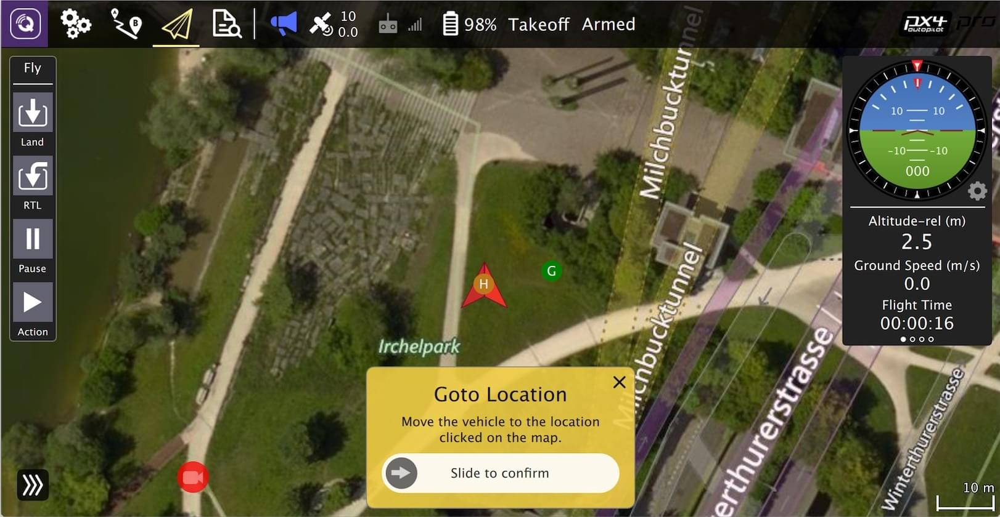

# QGroundControl Daily Build

The QGroundControl _Daily Build_ includes development tools that are hidden in release builds, and provides access to new PX4 features that are not yet supported in release builds.

It should be used instead of the stable release when working with new code forked from the PX4 `main` branch.

- [Download daily builds](https://docs.qgroundcontrol.com/master/en/qgc-user-guide/releases/daily_builds.html)