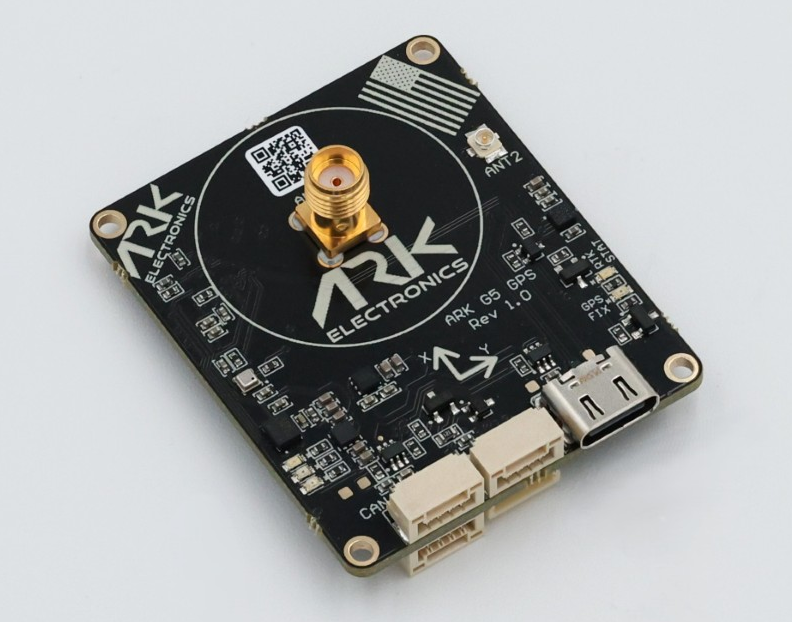

# ARK G5 RTK HEADING GPS

:::info
This GPS module is made in the USA and NDAA compliant.
:::

[ARK G5 RTK HEADING GPS](https://arkelectron.com/product/ark-g5-rtk-gps/) is a [DroneCAN](index.md) quad-band dual antenna [RTK GPS](../gps_compass/rtk_gps.md) that additionally provides vehicle yaw information from GPS.

The module incorporates the [Septentrio mosaic-G5 P3H Ultra-compact high-precision GPS/GNSS receiver module with heading capability](https://www.septentrio.com/en/products/gnss-receivers/gnss-receiver-modules/mosaic-G5-P3H), magnetometer, barometer, IMU, and buzzer module.

## 购买渠道

Order this module from:

- [ARK Electronics](https://arkelectron.com/product/ark-g5-rtk-heading-gps/) (US)

## Hardware Specifications

- [DroneCAN](index.md) RTK GNSS, Magnetometer, Barometer, IMU, and Buzzer Module
- [Dronecan Firmware Updating](../dronecan/index.md#firmware-update)
- 传感器
  - [Septentrio mosaic-G5 P3H Ultra-compact high-precision GPS/GNSS receiver module with heading capability](https://www.septentrio.com/en/products/gnss-receivers/gnss-receiver-modules/mosaic-G5-P3H)
    - All-band all constellation GNSS receiver
    - All-in-view satellite tracking: multi-constellation, quad-band GNSS module receiver
    - Full raw data with positioning measurements and Galileo HAS positioning service compatibility
    - Best-in-class RTK cm-level positioning accuracy
    - Advanced GNSS+ algorithms
    - 20Hz update rate
  - [ST IIS2MDC Magnetometer](https://www.st.com/en/mems-and-sensors/iis2mdc.html)
  - [Bosch BMP390 Barometer](https://www.bosch-sensortec.com/products/environmental-sensors/pressure-sensors/bmp390/)
  - [Invensense ICM-42688-P 6-Axis IMU](https://invensense.tdk.com/products/motion-tracking/6-axis/icm-42688-p/)
- STM32F412VGH6 MCU
- Safety Button
- 蜂鸣器
- Two CAN Connectors (Pixhawk Connector Standard 4-pin JST GH)
- G5 "UART 2" Connector
  - 4-pin JST GH
  - TX, RX, PPS, GND
- G5 USB C
- Debug Connector (Pixhawk Connector Standard 6-pin JST SH)
- LED Indicators
  - GPS Fix
  - RTK Status
  - RGB system status
- USA Built
- NDAA Compliant
- Power Requirements
  - 5V
    - 270mA
- 尺寸
  - Without Antenna
    - 48.0mm x 40.0mm x 15.4mm
    - 13.0g
  - With Antenna
    - 48.0mm x 40.0mm x 51.0mm
    - 43.5g
- Includes
  - CAN Cable (Pixhawk Connector Standard 4-pin)
  - Full-Frequency Helical GPS Antenna

## 硬件安装

### 布线

The ARK G5 RTK HEADING GPS is connected to the CAN bus using a [Pixhawk connector standard](https://github.com/pixhawk/Pixhawk-Standards/blob/master/DS-009%20Pixhawk%20Connector%20Standard.pdf) 4-pin JST GH cable.
For more information, refer to the [CAN Wiring](../can/index.md#wiring) instructions.

### Mounting

The recommended mounting orientation is with the connectors on the board pointing towards the **back of vehicle**.

The sensor can be mounted anywhere on the frame, but you will need to specify its position, relative to vehicle centre of gravity, during [PX4 configuration](#px4-configuration).

## Firmware Setup

The Septentrio G5 module firmware can be updated using the Septentrio [RxTools](https://www.septentrio.com/en/products/gps-gnss-receiver-software/rxtools) application.

## Flight Controller Setup

### Enabling DroneCAN

In order to use the ARK G5 RTK HEADING GPS, connect it to the Pixhawk CAN bus and enable the DroneCAN driver by setting parameter [UAVCAN_ENABLE](../advanced_config/parameter_reference.md#UAVCAN_ENABLE) to `2` for dynamic node allocation (or `3` if using [DroneCAN ESCs](../dronecan/escs.md)).

步骤如下：

- In _QGroundControl_ set the parameter [UAVCAN_ENABLE](../advanced_config/parameter_reference.md#UAVCAN_ENABLE) to `2` or `3` and reboot (see [Finding/Updating Parameters](../advanced_config/parameters.md)).
- Connect ARK G5 RTK HEADING GPS CAN to the Pixhawk CAN.

Once enabled, the module will be detected on boot.

There is also CAN built-in bus termination via [CANNODE_TERM](../advanced_config/parameter_reference.md#CANNODE_TERM)

### PX4 配置

You need to set necessary [DroneCAN](index.md) parameters and define offsets if the sensor is not centred within the vehicle:

- Enable GPS yaw fusion by setting bit 3 of [EKF2_GPS_CTRL](../advanced_config/parameter_reference.md#EKF2_GPS_CTRL) to true.
- Enable GPS blending to ensure the heading is always published by setting [SENS_GPS_MASK](../advanced_config/parameter_reference.md#SENS_GPS_MASK) to 7 (all three bits checked).
- Enable [UAVCAN_SUB_GPS](../advanced_config/parameter_reference.md#UAVCAN_SUB_GPS), [UAVCAN_SUB_MAG](../advanced_config/parameter_reference.md#UAVCAN_SUB_MAG), and [UAVCAN_SUB_BARO](../advanced_config/parameter_reference.md#UAVCAN_SUB_BARO).
- The parameters [EKF2_GPS_POS_X](../advanced_config/parameter_reference.md#EKF2_GPS_POS_X), [EKF2_GPS_POS_Y](../advanced_config/parameter_reference.md#EKF2_GPS_POS_Y) and [EKF2_GPS_POS_Z](../advanced_config/parameter_reference.md#EKF2_GPS_POS_Z) can be set to account for the offset of the ARK G5 RTK HEADING GPS from the vehicle's centre of gravity.

### Parameter references

This GPS is using ARK's private driver, the prameters below only exist on the firmware we ship the GPS with. You can set these params either in QGC or using the DroneCAN GUI Tool.

#### SEP_OFFS_YAW (float)

Heading offset angle for dual antenna GPS setups that support heading estimation.
Set this to 0 if the antennas are parallel to the forward-facing direction of the vehicle and the Rover/ANT2 antenna is in front.
The offset angle increases clockwise.
Set this to 90 if the ANT2 antenna is placed on the right side of the vehicle and the Moving Base/MAIN antenna is on the left side.

- Default: 0
- Min: -360
- Max: 360
- Unit: degree

#### SEP_OFFS_PITCH (float)

Vertical offsets can be compensated for by adjusting the Pitch offset.
Note that this can be interpreted as the "roll" angle in case the antennas are aligned along the perpendicular axis. This occurs in situations where the two antenna ARPs may not be exactly at the same height in the vehicle reference frame. Since pitch is defined as the right-handed rotation about the vehicle Y axis, a situation where the main antenna is mounted lower than the aux antenna (assuming the default antenna setup) will result in a positive pitch.

- Default: 0
- Min: -90
- Max: 90
- Unit: degree

#### SEP_OUT_RATE (enum)

Configures the output rate for GNSS data messages.

- -1: OnChange (Default)
- 50: 50 ms
- 100: 100 ms
- 200: 200 ms
- 500: 500 ms

## LED含义

The GPS status lights are located to the right of the connectors:

- Blinking green is GPS fix
- Blinking blue is received corrections and RTK Float
- Solid blue is RTK Fixed

## 另见

- [ARK G5 RTK HEADING GPS Documentation](https://docs.arkelectron.com/gps/ark-g5-rtk-gps) (ARK Docs)
