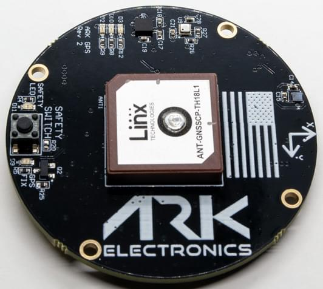

# ARK GPS (DroneCAN)

ARK GPS is an open source [DroneCAN](index.md) [GNSS/GPS](../gps_compass/index.md), magnetometer, IMU, barometer, buzzer, and safety switch module.

## 购买渠道

Order this module from:

- [ARK Electronics](https://arkelectron.com/product/ark-gps/) (US)

## Hardware Specifications

- [Open Source Schematic and BOM](https://github.com/ARK-Electronics/ARK_GPS)
- 传感器
  - Ublox M9N GPS
    - Ultra-robust meter-level GNSS positioning
    - Maximum position availability with concurrent reception of 4 GNSS
    - Advanced spoofing and jamming detection
    - Excellent RF interference mitigation
  - Bosch BMM150 Magnetometer
  - Bosch BMP388 Barometer
  - Invensense ICM-42688-P 6-Axis IMU
- STM32F412CEU6 MCU
- Safety Button
- 蜂鸣器
- Two Pixhawk Standard CAN Connectors (4 Pin JST GH)
- Pixhawk Standard Debug Connector (6 Pin JST SH)
- Small Form Factor
  - 5cm x 5cm x 1cm
- LED Indicators
  - Safety LED
  - GPS Fix
  - RGB System Status
- USA Built
- Power Requirements
  - 5V
  - 110mA Average
  - 117mA Max

## 硬件安装

### 布线

The ARK GPS is connected to the CAN bus using a Pixhawk standard 4 pin JST GH cable.
For more information, refer to the [CAN Wiring](../can/index.md#wiring) instructions.

### Mounting

The recommended mounting orientation is with the connectors on the board pointing towards the **back of vehicle**.

The sensor can be mounted anywhere on the frame, but you will need to specify its position, relative to vehicle centre of gravity, during [PX4 configuration](#px4-configuration).

## Firmware Setup

ARK GPS runs the [PX4 DroneCAN Firmware](px4_cannode_fw.md).
As such, it supports firmware update over the CAN bus and [dynamic node allocation](../dronecan/index.md#node-id-allocation).

ARK GPS boards ship with recent firmware pre-installed, but if you want to build and flash the latest firmware yourself see [PX4 DroneCAN Firmware > Building the Firmware](px4_cannode_fw.md#building-the-firmware).

- Firmware target: `ark_can-gps_default`
- Bootloader target: `ark_can-gps_canbootloader`

## PX4 配置

You need to set necessary [DroneCAN](index.md) parameters and define offsets if the sensor is not centred within the vehicle.
The required settings are outlined below.

:::info
The ARK GPS will not boot if there is no SD card in the flight controller when powered on.
:::

### Enable DroneCAN

In order to use the ARK GPS board, connect it to the Pixhawk CAN bus and enable the DroneCAN driver by setting parameter [UAVCAN_ENABLE](../advanced_config/parameter_reference.md#UAVCAN_ENABLE) to `2` for dynamic node allocation (or `3` if using [DroneCAN ESCs](../dronecan/escs.md)).

步骤如下：

- In _QGroundControl_ set the parameter [UAVCAN_ENABLE](../advanced_config/parameter_reference.md#UAVCAN_ENABLE) to `2` or `3` and reboot (see [Finding/Updating Parameters](../advanced_config/parameters.md)).
- Connect ARK GPS CAN to the Pixhawk CAN.

Once enabled, the module will be detected on boot.
GPS data should arrive at 10Hz.

DroneCAN configuration in PX4 is explained in more detail in [DroneCAN > Enabling DroneCAN](../dronecan/index.md#enabling-dronecan).

### Sensor Position Configuration

If the sensor is not centred within the vehicle you will also need to define sensor offsets:

- Enable GPS yaw fusion by setting bit 3 of [EKF2_GPS_CTRL](../advanced_config/parameter_reference.md#EKF2_GPS_CTRL) to true.
- Enable [UAVCAN_SUB_GPS](../advanced_config/parameter_reference.md#UAVCAN_SUB_GPS), [UAVCAN_SUB_MAG](../advanced_config/parameter_reference.md#UAVCAN_SUB_MAG), and [UAVCAN_SUB_BARO](../advanced_config/parameter_reference.md#UAVCAN_SUB_BARO).
- Set [CANNODE_TERM](../advanced_config/parameter_reference.md#CANNODE_TERM) to `1` if this is that last node on the CAN bus.
- The parameters [EKF2_GPS_POS_X](../advanced_config/parameter_reference.md#EKF2_GPS_POS_X), [EKF2_GPS_POS_Y](../advanced_config/parameter_reference.md#EKF2_GPS_POS_Y) and [EKF2_GPS_POS_Z](../advanced_config/parameter_reference.md#EKF2_GPS_POS_Z) can be set to account for the offset of the ARK GPS from the vehicles centre of gravity.

## LED含义

You will see green, blue and red LEDs on the ARK GPS when it is being flashed, and a blinking green LED if it is running properly.

If you see a red LED there is an error and you should check the following:

- Make sure the flight controller has an SD card installed.
- Make sure the ARK GPS has `ark_can-gps_canbootloader` installed prior to flashing `ark_can-gps_default`.
- Remove binaries from the root and ufw directories of the SD card and try to build and flash again.

## See Also

- [ARK GPS](https://arkelectron.gitbook.io/ark-documentation/sensors/ark-gps) (ARK Docs)
